# ZPGC Services — backlog

Living log. Diary dates start **27 June 2026**. Official “Completed” on Stages 1–5 is the **product line**. This folder does not yet contain all of that.

**Active folder (19 Sep 2026):** `C:\xampp\htdocs\CP2_V1.5` (Stage 7 scaffold, from `CP2_V1.4`). Frozen Stage 6 stays in `C:\xampp\htdocs\CP2_V1.4`. Session cookie path here is `/CP2_V1.5/`.

| Category | IDs |
|----------|-----|
| **Activity** | A-001 … A-047 (continuous; no skipped IDs) |
| **Issue** | B-001 … B-048 (continuous; no skipped IDs) |
| **Queued** | Q-001 … Q-012 (later stages; not claimed in this folder) |

### How snippets are recorded (standard)

Existing diary text, screenshots, tables, and mermaid stay as they are. Every Activity and Issue also records code (or a phpMyAdmin action) plus a short explanation for readers who do not write PHP every day.

| Log | Required snippet | Required explanation |
|-----|------------------|----------------------|
| **Activity** | **Fix snippet** — the code (or table-designer action) that made the work succeed or closed a B-issue | **In plain language:** what this does for a person using the site, in everyday words |
| **Issue** | **Causing snippet** — the code (or designer input) that produced the failure | **In plain language:** what you would see, then why that snippet caused it |

Older entries may still say **Executed snippet**. Treat that as the **Fix snippet**. Do not delete it. Add **Fix snippet** / **Causing snippet** and **In plain language** when they are missing.

From now on, new Activity rows always include **Fix snippet** + **In plain language**. New Issue rows always include **Causing snippet** + **In plain language**.

Browser captures from this rebuild live in `docs/screenshots/`. Each image is named for the activity/issue it belongs to and is also embedded under that entry. **phpMyAdmin** captures: crop out the left navigation tree only (database list sidebar) — leave the main pane and results untouched; do not resize.

| File | Belongs to |
|------|------------|
| `screenshots/a001-b001-landing-apache-404.png` | A-001 / B-001 |
| `screenshots/a002-b003-signup-stacked-under-login.jpg` | A-002 / B-003 |
| `screenshots/timeline-official-development.png` | Official timeline |
| `screenshots/timeline-official-development-2.png` | Official timeline |
| `screenshots/a008-b009-signup-submit-404.png` | A-008 / B-009 |
| `screenshots/a010-b011-user-php-404-lowercase-folder.png` | A-010 / B-011 |
| `screenshots/a010-b011-user-php-404-after-url-casing.png` | A-010 / B-011 |
| `screenshots/a010-b012-user-php-unstyled-main-wrap.png` | A-010 / B-012 |
| `screenshots/a010-user-php-chrome-after-main-wrap.png` | A-010 |
| `screenshots/a012-user-php-search-and-profile-circle.png` | A-012 |
| `screenshots/a011-b013-settings-label-outside-nav-link.png` | A-011 / B-013 (first reload) |
| `screenshots/b013-id-settings-span-still-outside-nav-link.png` | B-013 (`id` added; span still outside `.nav-link`) |
| `screenshots/b013-settings-label-inside-nav-link.png` | B-013 (fixed) |
| `screenshots/a014-b014-admin-php-404-wrong-folder.png` | A-014 / B-014 |
| `screenshots/b014-admin-url-after-move.png` | B-014 (URL they used after the move) |
| `screenshots/a016-b016-mailbox-unstyled-inner-head.png` | A-016 / B-016 |
| `screenshots/a016-b016-settings-unstyled-inner-head.png` | A-016 / B-016 |
| `screenshots/a017-b017-new-ticket-on-dashboard.png` | A-017 / B-017 |
| `screenshots/a018-b018-empty-ticket-mngmnt-white-page.png` | A-018 / B-018 |
| `screenshots/b019-tickets-enum-1064.png` | B-019 |
| `screenshots/a022-b020-submit-ticket-form.png` | A-022 / B-020 |
| `screenshots/a022-b020-after-submit-login-form.jpg` | A-022 / B-020 |
| `screenshots/a023-b021-user1-not-activated.jpg` | A-023 / B-021 / B-023 |
| `screenshots/a024-b022-admin-utilities-h1-still-dashboard.png` | A-024 / B-022 |
| `screenshots/a024-b022-admin-analytics-h1-still-dashboard.png` | A-024 / B-022 |
| `screenshots/a024-b022-admin-mailbox-h1-still-dashboard.png` | A-024 / B-022 |
| `screenshots/a024-b022-admin-settings-h1-still-dashboard.png` | A-024 / B-022 |
| `screenshots/a025-admin-utilities-user-list.png` | A-025 / B-024 |
| `screenshots/a029-user-tickets-list-tickets-tab.png` | A-029 / B-027 |
| `screenshots/a029-b027-dashboard-stray-table-headers.png` | A-029 / B-027 (before) |
| `screenshots/a029-b027-stray-table-mailbox-tab.png` | B-027 (before) |
| `screenshots/a029-b027-stray-table-settings-tab.png` | B-027 (before) |
| `screenshots/a030-fk-relation-view-saved.png` | A-030 (Relation view — FK saved) |
| `screenshots/a030-fk-good-insert-form.png` | A-030 (good row — Insert tab, before Go) |
| `screenshots/a030-fk-good-insert-success.png` | A-030 (good row — after Go) |
| `screenshots/a030-fk-good-tickets-tab.png` | A-030 (website Tickets tab) |
| `screenshots/a030-fk-bad-insert-sql.png` | A-030 (bad row — SQL tab, before Go) |
| `screenshots/a030-fk-bad-insert-1452-error.png` | A-030 (bad row — #1452 blocked) |
| `screenshots/a031-admin-tickets-list.png` | A-031 (after B-028 fix — optional) |
| `screenshots/b028-admin-tickets-compressed-columns.png` | B-028 (before — wrong column classes) |
| `screenshots/a032-assigned-to-column-added.png` | A-032 (Structure — `assigned_to` added) |
| `screenshots/a032-status-enum-expanded.png` | A-032 (Structure — status ENUM expanded) |
| `screenshots/a032-fk-tickets-assigned-saved.png` | A-032 (Relation view — `fk_tickets_assigned`) |
| `screenshots/a032-tickets-browse-assigned-null.png` | A-032 (Browse — existing rows NULL) |
| `screenshots/b029-status-assigned-compressed.png` | B-029 (before — Status + Assigned To squeezed) |
| `screenshots/b029-grid-collapsed-vertical-stack.png` | B-029 (after grid CSS — headers stack vertically) |
| `screenshots/b029-admin-tickets-five-columns-fixed.png` | B-029 (fixed — 5-column grid + dropdown) |
| `screenshots/a033-part2-assign-dropdown-retest.png` | A-033 Part 2 retest (`$tid` + dropdown shows tech name) |
| `screenshots/b031-techn-tickets-compressed-columns.png` | B-031 (before — `ticket-col-*`) |
| `screenshots/b031-techn-tickets-four-columns-fixed.png` | B-031 (after — four spaced columns) |
| `screenshots/b032-mailbox-no-live-update.png` | B-032 (Mailbox empty / no live poll) |
| `screenshots/b033-messages-table-missing-fatal.png` | B-033 (`messages` table missing — first send) |
| `screenshots/b033-messages-table-missing-fatal-retest.png` | B-033 (retest send — same fatal) |
| `screenshots/a035-create-messages-sql.png` | A-035 / B-033 (SQL — CREATE TABLE `messages`) |
| `screenshots/a035-create-messages-go-result.png` | A-035 / B-033 (Go — empty result = table created) |
| `screenshots/a035-messages-browse-empty.png` | A-035 / B-033 (Browse `messages` — zero rows) |
| `screenshots/b033-mailbox-hello-after-table.png` | B-033 (send **Hello** after table exists) |
| `screenshots/a035-mailbox-two-role-thread.png` | A-035 (two accounts — **Hello** + **Ho**) |
| `screenshots/a038-priority-column-add-form.png` | A-038 (Structure — add `priority` ENUM) |
| `screenshots/a038-priority-column-saved.png` | A-038 (Structure after Save; **B-035** Null = No) |
| `screenshots/b035-priority-change-null-ticked.png` | B-035 (Change — **Null** checked, Default **None**) |
| `screenshots/b035-priority-null-yes-saved.png` | B-035 (Structure after Save — Null **Yes**, Default **NULL**) |
| `screenshots/b034-queue-nine-slots-fixed.png` | B-034 (after — **0 / 9**, **used / 3**, no subtitle) |
| `screenshots/b038-dashboard-charts-blank.png` | B-038 (Dashboard charts blank — `dashbord` typo) |
| `screenshots/b039-settings-empty.png` | B-039 (Settings tab empty) |
| `screenshots/a041-performance-placeholder-tables.png` | A-041 (Performance — placeholder tables) |
| `screenshots/a041-tickets-queue-and-priority.png` | A-041 (Tickets — queue **2 / 9**, Priority dropdown) |
| `screenshots/b041-utilities-actions-empty.png` | B-041 (Utilities — empty Actions / no role filters) |
| `screenshots/b042-settings-theme-disabled.png` | B-042 (Settings theme disabled) |
| `screenshots/b043-dashboard-charts-blank-again.png` | B-043 (Dashboard charts blank again — CDN Chart.js) |
| `screenshots/b044-queue-zero-with-critical-pending.png` | B-044 (Queue **0 / 9** while Critical Pending tickets exist) |
| `screenshots/a045-queue-critical-moderate-working.png` | A-045 / A-046 (Queue **2 / 9** — Critical **1/3** + Moderate **1/3**) |
| `screenshots/a047-utilities-filters-and-actions.png` | A-047 (Utilities — role filters + Edit / Deactivate / Delete) |
| `screenshots/a047-utilities-edit-user-form.png` | A-047 (Utilities — Edit User form / role change) |

---

## Official Development Timeline

| Stage | Milestone | Main activities | Official status | This folder | Backlog IDs |
|-------|-----------|-----------------|-----------------|-------------|-------------|
| **1 – CP2** | Initial prototype | Login, registration, dashboards, role separation | Completed | Landing, login/signup, `user.php` / `techn.php` / `admin.php` shells | A-001–A-005, A-010–A-016, B-001–B-004, B-006–B-007, B-011–B-016, Q-004 |
| **2 – v1.1** | Security improvement | Prepared statements, role validation, safer authentication | Completed | **Done** in `CP2_V1.1`. We moved here for v1.1.2. | A-006–A-009, B-005, B-008–B-010, Q-001–Q-003 |
| **3 – v1.1.2** | Administration and ticket interface | Admin user management, account approval, ticket form UI | Completed | **This folder.** `tickets` INSERT (A-022). Admin panels (A-024). User list + polish (A-025–A-027). Activate (A-028). **Stage 3 v1.1.2 complete here.** | A-017–A-028, B-017–B-025, Q-011 |
| **4 – v1.2** | Minimum Viable Product | Ticket persistence, workflow, technician functions, live chat | Completed | **In progress (~40%).** User/admin lists (A-029, A-031). FKs (A-030, A-032). **Next:** assign UI (A-033), techn, mailbox (Q-006), sessions (Q-003). | A-029–A-032, B-026–B-028, Q-005 done, Q-006 partial |
| **5 – v1.3** | Current working build | Priority queue (**manual**), analytics, live status; cards **static** | Completed | **queued** | Q-007 |
| **6 – v1.4** | Confirmation workflow | User confirmation; Solved / Not Solved Yet | **In Progress** | **queued** | Q-012 |
| **7** | AI Integration | AI category and priority classification | **In Progress** | **This folder** `CP2_V1.5` | Q-008, A-052–A-054, B-049–B-051 |
| **8** | Testing and Evaluation | Functional, load, AI accuracy, user testing | **Planned** | not started | Q-009 |
| **9** | Finalization | Documentation, deployment preparation, defense | **Planned** | living docs only | Q-010 |

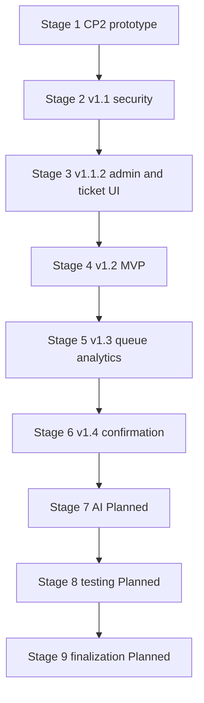
```mermaid
flowchart TD
  S1[Stage 1 CP2 prototype]
  S2[Stage 2 v1.1 security]
  S3[Stage 3 v1.1.2 admin and ticket UI]
  S4[Stage 4 v1.2 MVP]
  S5[Stage 5 v1.3 queue analytics]
  S6[Stage 6 v1.4 confirmation]
  S7[Stage 7 AI Planned]
  S8[Stage 8 testing Planned]
  S9[Stage 9 finalization Planned]
  S1 --> S2 --> S3 --> S4 --> S5 --> S6
  S6 --> S7 --> S8 --> S9
```

Team source (screenshots):

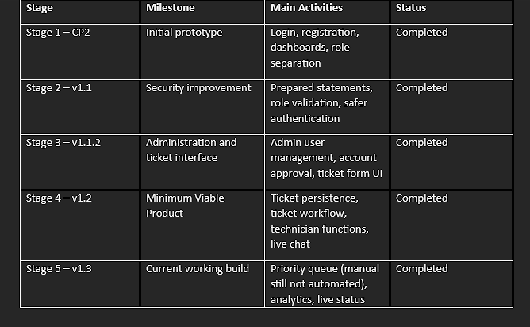

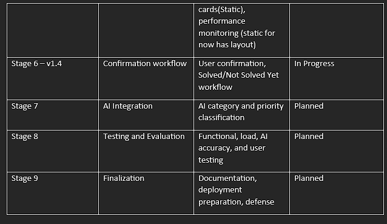

### Diary dates (aligned to official stages)

| Dates | Official stage | Notes |
|-------|----------------|--------|
| 27 Jun – 13 Jul 2026 | Stage 1 | Landing, login/signup HTML/JS, Apache names |
| 14 – 22 Jul 2026 | Stage 2 (start) | `users_db`, `config.php` |
| 23 Jul – 5 Aug 2026 | Stage 2 (rest) | Prepared statements, sessions (Q-001–Q-003) |
| 6 – 12 Aug 2026 | Stage 1 leftover + Stage 3 start | Dashboards / role pages (Q-004, A-010) |
| 13 – 19 Aug 2026 | Stage 3 | Admin utilities, account approval, ticket form UI (Q-011) |
| 20 – 26 Aug 2026 | Stage 4 | Tickets, workflow, techn, mailbox (Q-005, Q-006) |
| 25 Aug – 10 Sep 2026 | Stage 4 (this folder) | A-029 user list; A-030 FK; A-031 admin list; A-032 `assigned_to`; B-026–B-028 |
| 27 Aug – 1 Sep 2026 | Stage 5 | Manual 9-slot queue, static cards (Q-007) |
| **2 Sep 2026 →** | Stage 6 **In Progress** | Confirmation workflow (Q-012) |
| After Stage 6 | Stage 7 **Planned** | AI category/priority (Q-008) |
| Later | Stages 8–9 **Planned** | Testing; docs/defense |

---

## Activity log

Work completed and confirmed in the browser or phpMyAdmin. **Fix snippet** = the code that made it work. **In plain language** = the same idea without assuming PHP knowledge.

### A-001 — Landing page HTML

- **When:** 27–28 June 2026 (2 days: markup + CSS path)
- **Official stage:** 1 – CP2
- **Status:** done
- **What we did:** Public welcome page: navbar, logo, Login, hero, Signup now!. Linked `css/landing_page.css` and `images/ZPGC.com.png`.
- **File:** `pages/landing_page.php` (first saved as `.html`; see B-001)
- **Test:** Go Live showed the maroon landing layout. Apache on `landing_page.php` was 404 until B-001.

- **Fix snippet:**

```
Rename: pages/landing_page.html  →  pages/landing_page.php
```

- **In plain language:** The welcome page was saved with the wrong file ending. The live site asks for `.php`. After the rename, the same design opens at the Apache URL.

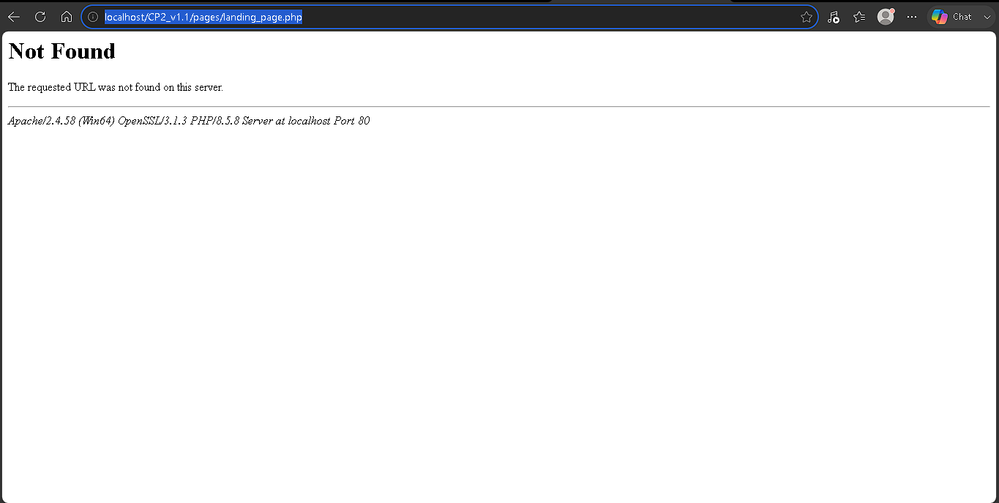

### A-002 — Login / signup HTML form

- **When:** 30 June – 4 July 2026 (5 days: split panel, two forms, Role list)
- **Official stage:** 1 – CP2 (registration UI)
- **Status:** done
- **What we did:** Login/signup HTML skeleton (no PHP). Role: User, Admin, Technician. `action="#"`. Linked `css/login_signup.css`.
- **File:** `pages/login_signup.php`
- **Test:** Go Live showed LOGIN. Signup stacked under LOGIN until B-003 (screenshot on that issue).
- **Executed snippet (form we created):**

```html
<select name="role" required>
    <option value="" disabled selected>Role</option>
    <option value="user">User</option>
    <option value="admin">Admin</option>
    <option value="techn">Technician</option>
</select>
```

- **Fix snippet:** same `<select name="role">` block above.
- **In plain language:** Signup asks the person to pick User, Admin, or Technician. That choice is stored later as `role`. There is no PHP on this page yet — only the list on the form.

### A-003 — Form toggle script

- **When:** 30 June 2026 (same stretch as A-002; selector fix 5–6 July)
- **Official stage:** 1 – CP2
- **Status:** done (B-003)
- **File:** `js/script.js`
- **Fix snippet:**

```javascript
document.querySelectorAll(".form-box").forEach(function (form) {
    form.classList.remove("active");
});
```

- **In plain language:** The page has two boxes (LOGIN and SIGNUP). This script hides one and shows the other. The class name must match the HTML (`.form-box`). If it does not, both boxes stay visible (B-003).

### A-004 — Landing buttons open login/signup

- **When:** 7–11 July 2026 (2 days links + 3 days query-string, B-004)
- **Official stage:** 1 – CP2
- **Status:** done
- **What we did:** Login → `login_signup` ; Signup now! → `?form=signup`. Later names became `.php` for Apache.
- **Executed snippet:**

```html
<button class="btnW"><a href="../pages/login_signup.php">Login</a></button>
...
<button class="btnR"><a href="../pages/login_signup.php?form=signup">Signup now!</a></button>
```

- **Fix snippet:** the two landing `<a href="...">` buttons above.
- **In plain language:** Login opens the login page. Signup now! opens the same page but asks it to show the signup box (`?form=signup`). B-004 happened until the script read that extra bit in the URL.

### A-005 — Pages renamed to `.php`; forms use POST (`action="#"` until handler)

- **When:** 12–13 July 2026 (2 days: renames + landing links + `method="post"`)
- **Official stage:** 1 – CP2 (Apache owns the pages before database work)
- **Status:** done (B-007: logo link `.html` → `.php`)
- **What we did:** Renamed `landing_page.html` → `landing_page.php` and `login_signup.html` → `login_signup.php`. Updated landing Login / Signup now! `href`s to `.php`. Set both login and signup forms to `method="post"`. Left `action="#"` because `logic/user_mngmnt.php` did not exist yet — submit stayed on the page until A-008 wired the handler (B-009).
- **Files:** `pages/landing_page.php`, `pages/login_signup.php`
- **Test:** `http://localhost/CP2_V1.1/pages/landing_page.php` and `login_signup.php` load on Apache. Form toggle and `?form=signup` still work. Submit does not reach PHP yet.

- **Fix snippet:**

```
Rename: pages/landing_page.html   →  pages/landing_page.php
Rename: pages/login_signup.html   →  pages/login_signup.php
```

```html
<form action="#" method="post">
```

(Landing buttons — same as A-004 but with `.php`:)

```html
<button class="btnW"><a href="../pages/login_signup.php">Login</a></button>
<button class="btnR"><a href="../pages/login_signup.php?form=signup">Signup now!</a></button>
```

- **In plain language:** Apache looks for `.php` files. POST is how login and signup will send data later. `#` means “nowhere yet” until `user_mngmnt.php` exists. B-001 fixed the landing rename; this step also renamed login/signup and set POST on both forms.

### A-006 — Created `users_db` and table `users`

- **When:** 14–19 July 2026 (6 days: drop old DB, designer, 7 columns, ENUM, Browse check)
- **Official stage:** 2 – v1.1 (safer auth needs a users table)
- **Status:** done
- **What we did:** New database `users_db`. phpMyAdmin table wizard (not SQL tab): name `users`, **7** columns, Save. Structure correct. Browse empty with headers id, first_name, last_name, email, password, role, status.

| Column | Type | Length / values | Extra |
|--------|------|-----------------|--------|
| `id` | INT | — | PRIMARY, A_I |
| `first_name` | VARCHAR | 100 | |
| `last_name` | VARCHAR | 100 | |
| `email` | VARCHAR | 255 | UNIQUE |
| `password` | VARCHAR | 255 | hash later |
| `role` | ENUM | `'user','admin','techn'` | |
| `status` | ENUM | `'inactive','active'` | default `inactive` |

- **Fix snippet:** phpMyAdmin table designer (not the SQL tab). Table name `users`, 7 columns as in the table above. Save.
- **In plain language:** This is a list of accounts. Each row is one person. `status` starts as inactive so they cannot log in until someone approves them.

### A-007 — `logic/config.php` connection

- **When:** 20–22 July 2026 (3 days: file location, mysqli, browser test)
- **Official stage:** 2 – v1.1
- **Status:** done (test echo still in file; remove before `user_mngmnt.php`)
- **What we did:** Created `logic/config.php`. Opened `http://localhost/CP2_v1.1/logic/config.php`. Page showed `Connected to users_db`.
- **Executed snippet:**

```php
<?php
$host = "localhost";
$user = "root";
$password = "";
$database = "users_db";

$conn = new mysqli($host, $user, $password, $database);

if ($conn->connect_error) {
    die("Connection failed: " . $conn->connection_error);
}

echo "Connected to users_db";
```

- **Fix snippet:** the `config.php` block above (`mysqli` to `users_db`).
- **In plain language:** This file is the phone line to MySQL. Other PHP files include it instead of repeating the host name. The echo was only a test message. B-005: the error property name is misspelled but you would only notice if MySQL were down.

### A-008 — Signup INSERT works (prepared statement)

- **When:** 24 July 2026
- **Official stage:** 2 – v1.1
- **Status:** done
- **What we did:** After B-009, submitted sample User signup. Browser went to the **login** form (that redirect is the success `header` in `user_mngmnt.php`). phpMyAdmin → `users_db` → `users` → Browse showed the new row.
- **Files:** `pages/login_signup.php` (`method="post"`), `logic/user_mngmnt.php`
- **Confirmed:** Row stored in MySQL. Hashed `password`, `status` `inactive`.

- **Fix snippet:**

```php
    $stmt = $conn->prepare(
        'INSERT INTO users (first_name, last_name, email, password, role, status)
        VALUES (?, ?, ?, ?, ?, ?)'
    );
    $stmt->bind_param('ssssss', $first_name, $last_name, $email, $hash, $role, $status);
```

- **In plain language:** When someone clicks Signup, this writes a new row. The `?` marks are placeholders so the typed name and email are not mixed into the SQL text (safer). The password is stored as a hash, not the plain password. The account is inactive until approval.

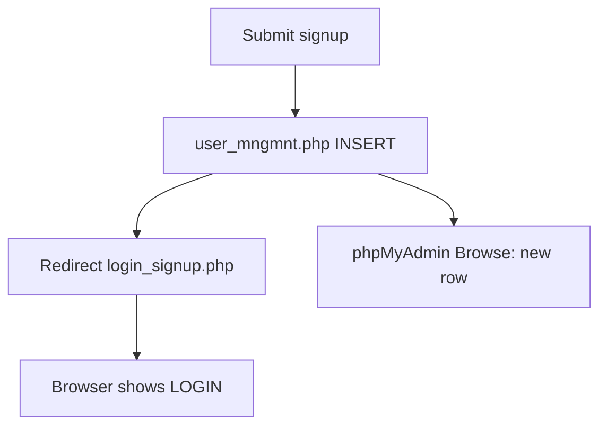
```mermaid
flowchart TD
  A[Submit signup] --> B[user_mngmnt.php INSERT]
  B --> C[Redirect login_signup.php]
  C --> D[Browser shows LOGIN]
  B --> E[phpMyAdmin Browse: new row]
```

### A-009 — Login: inactive vs unknown account

- **When:** 26 July 2026
- **Official stage:** 2 – v1.1
- **Status:** done
- **What we did:** Tested the login form after B-010 (`;` on `session_start()`).
  - Email/password that **exist** in `users_db` (signup row, still `inactive`): account **not yet activated**. Stayed on LOGIN.
  - Email/password **not** signed up: **incorrect credentials**. Stayed on LOGIN.
- **Files:** `logic/user_mngmnt.php` (`password_verify` + `status`), `pages/login_signup.php` (shows `$login_error`)

- **Fix snippet:**

```php
        if ($user['status'] !== 'active') {
            $_SESSION['login_error'] = 'Account is not activated yet.';
            header('Location: ../pages/login_signup.php');
            exit();
        }
```

- **In plain language:** Login checks the password, then checks whether the account is allowed in. If status is still inactive, the person stays on LOGIN and sees that message. That is intended (A-009). To test tickets we later set one row to active in phpMyAdmin (B-021), not by deleting this check.

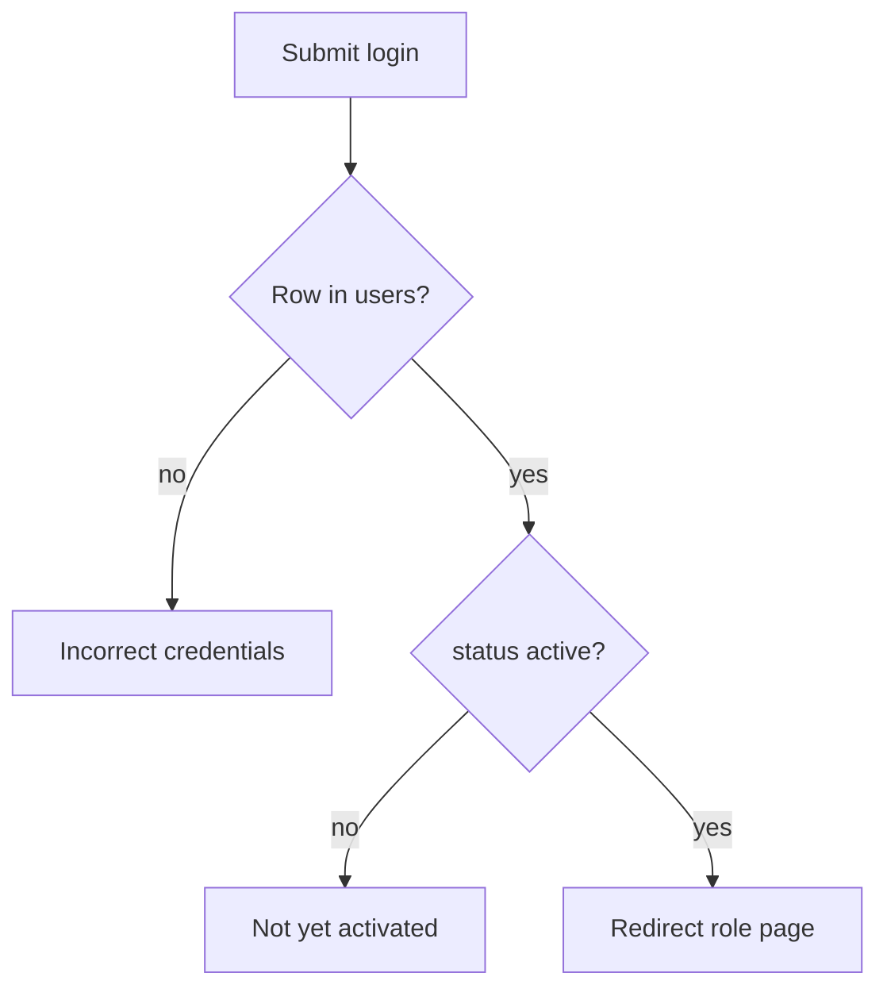
```mermaid
flowchart TD
  A[Submit login] --> B{Row in users?}
  B -->|no| C[Incorrect credentials]
  B -->|yes| D{status active?}
  D -->|no| E[Not yet activated]
  D -->|yes| F[Redirect role page]
```

### A-010 — `user.php` dashboard chrome

- **When:** 7 August 2026
- **Official stage:** 1 – CP2
- **Status:** done
- **What we did:** Created `pages/user.php` (`data-page="dashboard"`, `.main-wrap`, logo `ZPGC.com2.png`, toggler, Dashboard `.selected`, `main_interface.css`). Rename B-011; class hyphen B-012.
- **Test:** `http://localhost/CP2_V1.1/pages/user.php` — grey sidebar, logo, highlighted Dashboard at the **bottom** (`:last-child`) until A-011 added Logout. Search and profile circle came later as **A-012**. `behavior.js` not in this file yet.

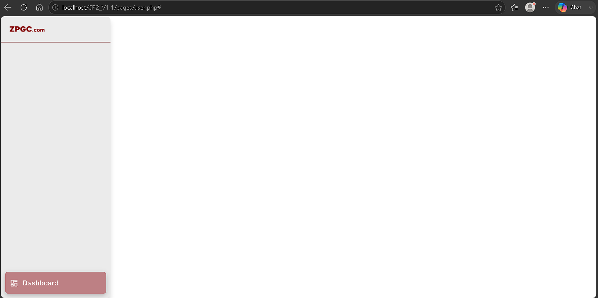

- **Fix snippet:**

```html
    <main class="main-wrap">
```

- **In plain language:** The dashboard layout CSS looks for the class name `main-wrap` (with a hyphen). Underscore `main_wrap` meant the grey sidebar never applied (B-012).

### A-011 — Remaining sidebar items on `user.php`

- **When:** 8 August 2026
- **Official stage:** 1 – CP2
- **Status:** done (B-013 later: Settings span inside `.nav-link`)
- **What we did:** After Dashboard, typed Tickets (`data-nav="tickets"`), Mailbox (`data-nav="messages"`), Settings (`data-nav="settings"`), Logout last (`href="../pages/login_signup.php"`). SVG `d` paths were typed in full. No `behavior.js`, search, or session guard yet.
- **File:** `pages/user.php`
- **Test:** Reload `http://localhost/CP2_V1.1/pages/user.php` — five labels; Dashboard still `.selected`; Logout at the bottom of the grey column. Settings **label sits under the gear** (B-013). Screenshot on B-013.

- **Fix snippet (Settings, after B-013):**

```html
                                    </svg>
                                    <span class="link-text" id="settings">Settings</span>
                                </a>
```

- **In plain language:** Icon and word must sit inside the same clickable row. If the word is outside that row, it drops under the gear.

### A-012 — Showcase search bar and profile circle

- **When:** 9 August 2026
- **Official stage:** 1 – CP2
- **Status:** done
- **What we did:** After `<h1>Dashboard</h1>` in `.showcase .head header`, typed `.search-bar-wrapper` (icon + `input type="search"`) and empty `.profile-circle`. No form, no search JS, no avatar. `behavior.js` still not linked.
- **File:** `pages/user.php`
- **Test:** Reload `http://localhost/CP2_V1.1/pages/user.php` — pill search with placeholder Search; empty grey circle on the right; sidebar unchanged.

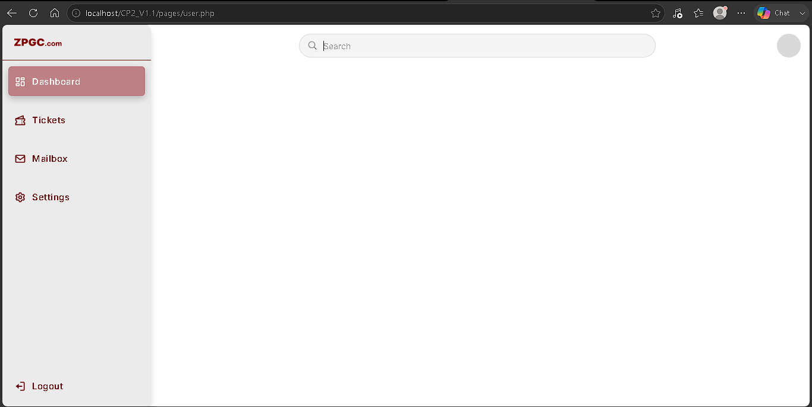

- **Executed snippet:**

```html
                    <div class="search-bar-wrapper">
                        <svg class="search-icon" xmlns="http://www.w3.org/2000/svg" width="24" height="24"
                            fill="currentColor" viewBox="0 0 24 24">
                            <path
                                d="M18 10c0-4.41-3.59-8-8-8s-8 3.59-8 8 3.59 8 8 8c1.85 0 3.54-.63 4.9-1.69l5.1 5.1L21.41 20l-5.1-5.1A8 8 0 0 0 18 10M4 10c0-3.31 2.69-6 6-6s6 2.69 6 6-2.69 6-6 6-6-2.69-6-6">
                            </path>
                        </svg>
                        <input type="search" class="search-bar" placeholder="Search" aria-label = "Search">
                    </div>
                    <div class="profile-circle"></div>
```

- **Fix snippet:** the search wrapper + empty profile circle above.
- **In plain language:** This draws the pill Search box and a blank circle for a profile picture later. Search does not filter anything yet.

### A-013 — `behavior.js` sidebar collapse and nav highlight

- **When:** 10 August 2026
- **Official stage:** 1 – CP2
- **Status:** done
- **What we did:** Created `js/behavior.js`. Linked it at the bottom of `user.php`. Collapse uses class `active` on `.main-head`. Clicks on `href="#"` move `.selected` and `body data-page`. Logout still follows `login_signup.php`.
- **Files:** `js/behavior.js`, `pages/user.php`
- **Test:** Collapse/expand on hover and toggler works. Tickets / Mailbox / Settings take the rose highlight. Logout still opens login/signup.
- **URL with no `#`:** **Normal.** Those four links are `href="#"`. The click handler calls `event.preventDefault()` so the browser never applies the fragment. The address bar stays `http://localhost/CP2_V1.1/pages/user.php`. If `preventDefault` were omitted, the URL would typically become `user.php#`. Not a bug; not a new issue ID.

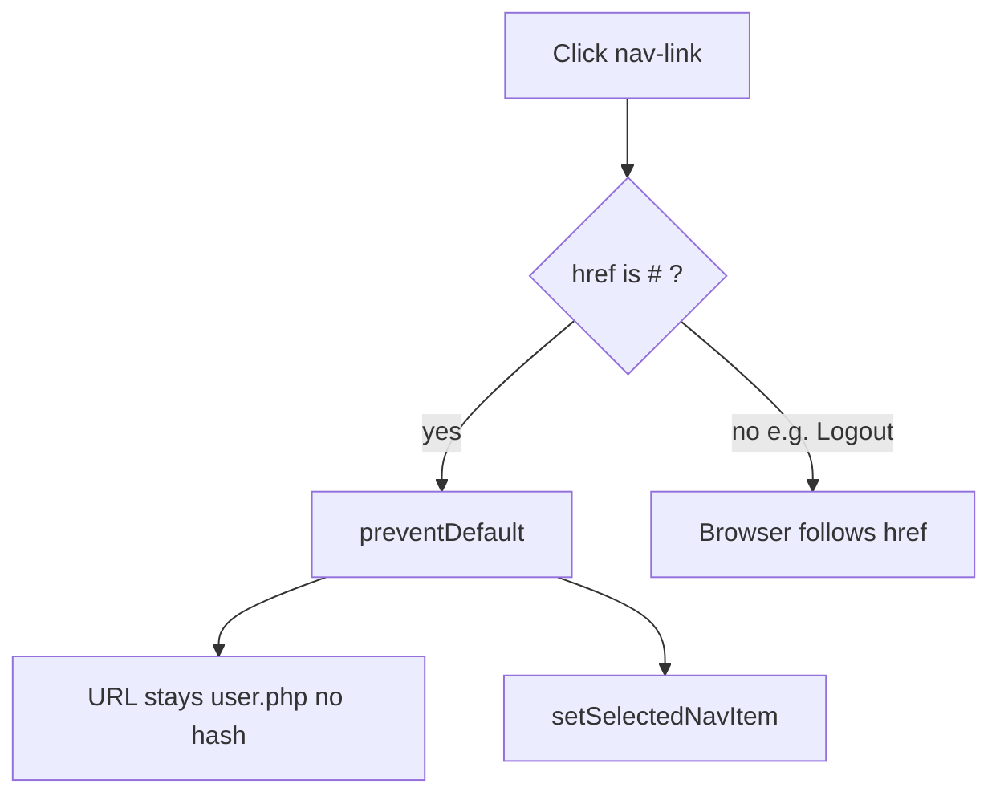
```mermaid
flowchart TD
  A[Click nav-link] --> B{href is # ?}
  B -->|yes| C[preventDefault]
  C --> D[URL stays user.php no hash]
  C --> E[setSelectedNavItem]
  B -->|no e.g. Logout| F[Browser follows href]
```

- **Executed snippet** (`initNavClickSelection`, as typed):

```javascript
        link.addEventListener("click", function(event) {
            const href = link.getAttribute("href") || "";
            if (href && href !== "#") {
                return;
            }
            event.preventDefault();
            setSelectedNavItem(item);
        });
```

- **Executed snippet** (`user.php`):

```html
    <script src="../js/behavior.js"></script>
```

- **Fix snippet:** the click handler and the `<script src="../js/behavior.js">` include above.
- **In plain language:** Clicking Tickets (and the other `#` links) changes which panel you see without adding `#` to the URL. Logout is a real link, so it leaves the dashboard.

### A-014 — `techn.php` shell (same nav as user)

- **When:** 11 August 2026
- **Official stage:** 1 – CP2
- **Status:** done (`admin.php` 404: **B-014**)
- **What we did:** Copied `user.php` to `pages/techn.php`. Title `ZPGC Services | Technician`. Same Tickets / Mailbox / Settings / Logout. Linked `../js/behavior.js`.
- **File:** `pages/techn.php`
- **Test:** `http://localhost/CP2_V1.1/pages/techn.php` — same chrome as user. `pages/admin.php` Apache 404 (B-014).

- **Fix snippet:** `pages/techn.php` is a copy of `user.php` with title Technician. Same `behavior.js` link as A-013.
- **In plain language:** Technicians get the same left menu and top bar. The file must live in `pages/`, same as `user.php`.

### A-015 — `admin.php` in `pages/` (Utilities + Analytics)

- **When:** 11 August 2026 (after B-014 move)
- **Official stage:** 1 – CP2
- **Status:** done (Analytics label wrap: **B-015**)
- **What we did:** Moved `admin.php` from `logic/` to `pages/`. Nav: Dashboard, Utilities, Analytics, Mailbox, Settings, Logout. Same `behavior.js`.
- **File:** `pages/admin.php`
- **Test:** Page loads (B-014 fixed). Analytics text sits under the chart icon (B-015). Utilities label is on one row.

- **Fix snippet:** file lives at `pages/admin.php` (moved off `logic/`). Analytics span inside `.nav-link` (B-015).
- **In plain language:** Admin is a dashboard page, not a handler. If the file sits in `logic/`, the URL `pages/admin.php` is Not Found (B-014).

### A-016 — In-page sections on `user.php` (`data-page` / `.page-content`)

- **When:** 12 August 2026
- **Official stage:** 1 leftover / Stage 3 UI start
- **Status:** done (Mailbox/Settings bar unstyled: **B-016**, then fixed)
- **What we did:** Wrapped showcase in `#page-dashboard`, `#page-tickets`, `#page-messages`, `#page-settings`. `behavior.js` already sets `body data-page`. CSS shows the matching `#page-…`.
- **Test:** Clicking Dashboard / Tickets / Mailbox / Settings changes the `h1`. Search and profile sit in each panel. Mailbox and Settings were unstyled until B-016.

- **Fix snippet:**

```html
                <div class="head">
                    <header>
                        <h1>Mailbox</h1>
```

- **In plain language:** Each sidebar item shows a different panel on the same page. The top bar must use the `<header>` tag so the search pill styles apply. `<head>` is the wrong tag (B-016).

### A-017 — New Ticket control + `ticket.php` form (look only)

- **When:** 13 August 2026
- **Official stage:** 3 – v1.1.2 (ticket form UI)
- **Status:** done (B-017: toolbar moved inside `#page-tickets`)
- **What we did:** Added `.tickets-toolbar` / `.btn-new-ticket` linking to `pages/ticket.php`. Created `ticket.php` with `ticket.css`. Form `action="#"`, `method="post"`. No INSERT.
- **Files:** `pages/user.php`, `pages/ticket.php`
- **Executed snippet** (`ticket.php` form, as typed):

```html
        <form action="#" class="ticket-form" method="post">
```

Submit button `name="submit-ticket"` (hyphen). Handler later will look for `submit_ticket` if we match original v1.2.

- **Fix snippet:** form `action="#"` at first; toolbar inside `#page-tickets` (B-017).
- **In plain language:** New Ticket is a button on the Tickets panel that opens a separate form page. It does not save a ticket by itself. If the button sits outside that panel, it also shows on Dashboard (B-017).

### A-018 — Ticket form POSTs to `ticket_mngmnt.php`

- **When:** 14 August 2026
- **Official stage:** 3 – v1.1.2 (POST before INSERT)
- **Status:** done (blank page: **B-018**; later filled in A-019)
- **What we did:** Changed `ticket.php` `action` from `#` to `../logic/ticket_mngmnt.php`.
- **File:** `pages/ticket.php`
- **Executed snippet:**

```html
        <form action="../logic/ticket_mngmnt.php" class="ticket-form" method="post">
```

- **Test:** Submit → URL `http://localhost/CP2_V1.1/logic/ticket_mngmnt.php`. White page (B-018), not Apache 404.

- **Fix snippet:** `action="../logic/ticket_mngmnt.php"` on the form (block above).
- **In plain language:** Submit sends the form to a PHP file in `logic/`. An empty file is not “page missing” (that would be 404). Empty PHP shows a white screen (B-018).

### A-019 — `ticket_mngmnt.php` receives POST, no INSERT

- **When:** 15 August 2026
- **Official stage:** 3 – v1.1.2
- **Status:** done
- **What we did:** Typed PHP in `logic/ticket_mngmnt.php`: cookie params + `session_start()`, `config.php`, `isset($_POST['submit-ticket'])`, `trim` on category/subject/description, `header` to `user.php`. No SQL.
- **File:** `logic/ticket_mngmnt.php`
- **Test:** Submit Ticket → `user.php`. phpMyAdmin: no tickets row.
- **Executed snippet:**

```php
if (isset($_POST['submit-ticket'])) {
    $category = trim($_POST['category']);
    $subject = trim($_POST['subject']);
    $description = trim($_POST['description']);

    header('Location: ../pages/user.php');
    exit();
}
header('Location: ../pages/ticket.php');
exit();
```

- **Fix snippet:** the `isset($_POST['submit-ticket'])` + `header` block above.
- **In plain language:** After Submit, the browser is sent back to the user dashboard instead of staying on a blank PHP file. At this step nothing is written to MySQL yet.

### A-020 — Migrated here from `CP2_V1.1`

- **When:** 16 August 2026
- **Official stage:** 3 – v1.1.2
- **Status:** done
- **What we did:** **v1.1 is done** (`CP2_V1.1`). **We are moving to v1.1.2 here.** This folder is a full copy of `CP2_V1.1` as of the split. Ticket files stay here. `user_mngmnt.php` / `ticket_mngmnt.php` cookie path is `CP2_V1.1.2/logic/`. Continue tickets table, INSERT, Utilities **in this folder**. v1.1 tree no longer has `ticket.php`.
- **Demo:** http://localhost/CP2_V1.1.2/pages/landing_page.php
- **Test:** Landing and `user.php` → 200. Tickets tab shows New Ticket. `pages/ticket.php` → 200. POST `ticket_mngmnt.php` → 302 `../pages/user.php` (no INSERT). v1.1 `ticket.php` stays 404.

- **Fix snippet:**

```php
session_set_cookie_params(0, 'CP2_V1.1.2/logic/');
```

- **In plain language:** v1.1 work stays in its own folder. This folder is v1.1.2. The cookie path string was updated so login/session belong to `/CP2_V1.1.2/`, not the old folder name. Ticket files live only here.

### A-021 — phpMyAdmin: created table `tickets`

- **When:** 17 August 2026
- **Official stage:** 3 – v1.1.2
- **Status:** done (B-019 fixed on second Save)
- **What we did:** First Save failed (#1064, B-019). Corrected the designer (`id` PRIMARY A_I, six named columns, ENUM quotes, VARCHAR 255, no blank row). Second Save succeeded. `users_db` left list: `tickets` and `users`.
- **Confirmed (Structure, no screenshot in this log):**

| Column | Type | Extra |
|--------|------|--------|
| `id` | INT | PRIMARY, A_I |
| `user_id` | INT | not UNSIGNED; no FK |
| `subject` | VARCHAR(255) | |
| `description` | TEXT | |
| `category` | ENUM hardware / software / account / network / other | |
| `status` | ENUM `'pending'` | default `pending` |

Indexes: PRIMARY on `id` only. Browse still empty until INSERT.

- **Fix snippet:** phpMyAdmin designer for table `tickets`. Six named columns as in the table above. `category` Length/Values: `'hardware','software','account','network','other'`.
- **In plain language:** This is a list of help requests. Each row is one ticket. `user_id` says which account opened it. `status` starts as pending. We did not add a foreign key yet (that comes later).

### A-022 — `ticket_mngmnt.php` INSERT (lookup `user_id` by email)

- **When:** 18 August 2026
- **Official stage:** 3 – v1.1.2
- **Status:** done (B-020 and B-021 cleared)
- **What we did:** After A-021, added `SELECT id FROM users WHERE email = ?` then `INSERT INTO tickets (user_id, subject, description, category)`. `status` left to table default `pending`. Guard is `isset($_SESSION['email'])`.
- **File:** `logic/ticket_mngmnt.php`
- **Test (first):** Filled `ticket.php` → LOGIN. Browse empty (B-020).
- **Test (after B-020/B-021):** Submit Ticket → `user.php` (dashboard). phpMyAdmin `tickets` Browse: row stored as expected.

- **Fix snippet:**

```php
    if (!isset($_SESSION['email'])) {
        header('Location: ../pages/login_signup.php');
        exit();
    }
    $email = $_SESSION['email'];
    $find = $conn->prepare('SELECT id FROM users WHERE email = ?');
    $find->bind_param('s', $email);
    $find->execute();
    $found = $find->get_result()->fetch_assoc();
    // ...
    $stmt = $conn->prepare(
        'INSERT INTO tickets (user_id, subject, description, category)
        VALUES (?, ?, ?, ?)'
    );
    $stmt->bind_param('isss', $user_id, $subject, $description, $category);
    $stmt->execute();
```

- **In plain language:** The ticket form does not send an email field. After login, the email is already stored in the session. This code finds that person's `id`, then writes a new tickets row. `status` is left as pending by the table default. Using `$_POST['email']` instead always sent people to LOGIN (B-020).

### A-023 — Login to test ticket INSERT (`user1@gmail.com`)

- **When:** 18 August 2026
- **Official stage:** 3 – v1.1.2 (needs an active session for A-022)
- **Status:** done (B-021: phpMyAdmin `status` → `active`)
- **What we did:** Opened `login_signup.php`, entered `user1@gmail.com` and password, Login.
- **Test (first):** Stayed on LOGIN. **Account is not activated yet.**
- **Test (after Browse `status` active):** Login reached dashboard. Ticket submit then stored a `tickets` row (A-022).

- **Fix snippet (test only, not the Admin Utilities page):** phpMyAdmin → `users` → Browse → `user1@gmail.com` → set `status` to `active`.
- **In plain language:** Signup always creates inactive accounts. Login is supposed to block them. For this test we flipped one row to active in phpMyAdmin. **A-028** later added **Activate** on Utilities so admins can approve without phpMyAdmin.

### A-024 — Admin in-page sections (`data-nav` / `.page-content`)

- **When:** 20 August 2026
- **Official stage:** 3 – v1.1.2
- **Status:** done (B-022 fixed)
- **What we did:** `data-nav="utilities"` on Utilities. Five sibling `.page-content` blocks in `.showcase` (`#page-dashboard`, `#page-utilities`, `#page-analytics`, `#page-messages`, `#page-settings`). Empty `.sidebar-spacer` is a sibling of `.showcase`, not a wrapper.
- **File:** `pages/admin.php`
- **Test (first):** `h1` stayed Dashboard (B-022).
- **Test (after B-022):** Click Utilities / Analytics / Mailbox / Settings → `h1` matches the sidebar item.

- **Fix snippet:**

```html
        <div class="sidebar-spacer"></div>
        <section class="showcase">
            <div class="page-content" id="page-dashboard">
                <div class="head">
                    <header>
                        <h1>Dashboard</h1>
```

(Other `#page-*` blocks are **siblings** of `#page-dashboard`, not nested inside it.)

- **In plain language:** Each menu item has its own titled strip. CSS hides the ones that do not match. Nested panels or putting Dashboard on the outer `<section>` kept the word Dashboard on screen.

### A-025 — Utilities user list from `users_db`

- **When:** 21 August 2026
- **Official stage:** 3 – v1.1.2 (Q-011 user list)
- **Status:** done
- **What we did:** Top of `admin.php`: `require_once config.php` + `SELECT` all users. Inside `#page-utilities`, after `.head`, a `<table>` with `while ($row = $users->fetch_assoc())` prints id, name, email, role, status.
- **File:** `pages/admin.php`
- **Test:** `http://localhost/CP2_V1.1.2/pages/admin.php` → Utilities. Table shows signup rows (e.g. `user1@gmail.com`, `active`). Plain HTML table (no Activate button yet).

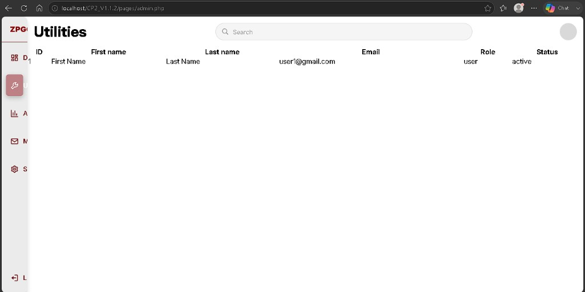

- **Fix snippet:**

```php
<?php
require_once '../logic/config.php';

$users = $conn->query(
    'SELECT id, first_name, last_name, email, role, status FROM users'
);
?>
```

```html
                <table>
                    <tr>
                        <th>ID</th>
                        ...
                    </tr>
                    <?php while ($row = $users->fetch_assoc()) { ?>
                    <tr>
                        <td><?php echo htmlspecialchars($row['id']); ?></td>
                        ...
                    </tr>
                    <?php } ?>
                </table>
```

(Table sits inside `#page-utilities`, after the Utilities `.head`.)

- **In plain language:** When an admin opens Utilities, the page asks MySQL for every account and prints one table row per person. `htmlspecialchars` keeps names safe on screen. At this step the list was a plain table; **A-027** styled it and **A-028** added **Activate**.

### A-026 — Login error banner (styled)

- **When:** 22 August 2026
- **Official stage:** 3 – v1.1.2 (Q-011)
- **Status:** done (B-023)
- **What we did:** On failed login, replaced the bare `<p>` under **LOGIN** with a pink alert box. Added `.form-error` in `login_signup.css` and `showError()` in `login_signup.php`. `user_mngmnt.php` still sets `$_SESSION['login_error']` the same way (A-009); only the display changed.
- **Files:** `css/login_signup.css`, `pages/login_signup.php`
- **Test:** `http://localhost/CP2_V1.1.2/pages/login_signup.php` — wrong password → pink banner under **LOGIN**, not gray text like “Don’t have an account?”. Same for an `inactive` account with correct password (B-021 / A-009 message).

- **Fix snippet:**

```css
.form-error {
    padding: 12px;
    background-color: #bd8084;
    border-radius: 6px;
    text-align: center;
    margin-bottom: 20px;
    color: #7e030b;
    font-weight: 600;
    font-size: 14px;
    width: 100%;
}
```

```php
function showError($error) {
    if ($error !== '') {
        return '<div class="form-error">' . htmlspecialchars($error, ENT_QUOTES, 'UTF-8') . '</div>';
    }
    return '';
}

$login_error = $_SESSION['login_error'] ?? '';
unset($_SESSION['login_error']);
```

```php
                <h1>LOGIN</h1>
                <?php echo showError($login_error); ?>
                <h5>Enter your credentials to access, create, or track your tickets</h5>
```

(Replaces `echo '<p>' . htmlspecialchars($login_error) . '<p>';` — the old closing tag was also wrong.)

- **In plain language:** When login fails, the page shows a clear pink warning box under **LOGIN**, matching the reference system. The server still blocks wrong passwords and inactive accounts the same way as A-009; only the alert styling changed.

### A-027 — Utilities card table (reference layout)

- **When:** 23 August 2026
- **Official stage:** 3 – v1.1.2 (Q-011)
- **Status:** done (B-024)
- **What we did:** Replaced the plain `<table>` from A-025 with the reference card list: `.tickets-list`, `.tickets-list-header`, `.ticket-row`, and `.ucol-*` columns (styles already in `main_interface.css`). PHP loads rows into `$all_users[]`, then `foreach` prints each user. Name is one column; role and status use colored badges. **Actions** header stays; cells stay empty until Activate (next Q-011 step). No filter tabs or Add User yet.
- **File:** `pages/admin.php`
- **Test:** `http://localhost/CP2_V1.1.2/pages/admin.php` → **Utilities** → white card, aligned columns, `#1` IDs, role pill, green **Active** / gray **Pending**. Same `users_db` rows as A-025.

- **Fix snippet:**

```php
$all_users = [];
$result = $conn->query('SELECT id, first_name, last_name, email, role, status FROM users');
if ($result) {
    while ($row = $result->fetch_assoc()) {
        $all_users[] = $row;
    }
}

$role_labels = [
    'user' => 'User',
    'techn' => 'Technician',
    'admin' => 'Administrator',
];
```

```html
                <div class="tickets-list">
                    <div class="tickets-list-header">
                        <span class="ucol-id">ID</span>
                        <span class="ucol-name">Name</span>
                        <span class="ucol-email">Email</span>
                        <span class="ucol-role">Role</span>
                        <span class="ucol-status">Status</span>
                        <span class="ucol-action">Actions</span>
                    </div>
                    <div class="tickets-list-body" id="utilities-users-body">
                        <?php foreach ($all_users as $u) {
                            $isActive = ($u['status'] === 'active');
                            $roleLabel = $role_labels[$u['role']] ?? ucfirst($u['role']);
                        ?>
                        <div class="ticket-row">
                            <span class="ucol-id">#<?php echo (int) $u['id']; ?></span>
                            <span class="ucol-name"><?php echo htmlspecialchars($u['first_name'] . ' ' . $u['last_name']); ?></span>
                            <span class="ucol-email"><?php echo htmlspecialchars($u['email']); ?></span>
                            <span class="ucol-role">
                                <span class="profile-role-badge role-<?php echo htmlspecialchars($u['role']); ?>">
                                    <?php echo htmlspecialchars($roleLabel); ?>
                                </span>
                            </span>
                            <span class="ucol-status">
                                <?php if ($isActive) { ?>
                                <span class="status-badge active-account">Active</span>
                                <?php } else { ?>
                                <span class="status-badge inactive-account">Pending</span>
                                <?php } ?>
                            </span>
                            <span class="ucol-action"></span>
                        </div>
                        <?php } ?>
                    </div>
                </div>
```

(Inside `#page-utilities`, after the Utilities `.head`. Replaces the A-025 `<table>`.)

- **In plain language:** Utilities still lists every account from the database, but it now uses the same white card layout and colored labels as the full admin screen. The Actions column was still empty until A-028 added **Activate**.

### A-028 — Admin Activate pending account (Utilities)

- **When:** 24 August 2026
- **Official stage:** 3 – v1.1.2 (Q-011)
- **Status:** done (B-025)
- **What we did:** Created `logic/user_admin_mngmnt.php` with a prepared `UPDATE users SET status = ? WHERE id = ?`. On `#page-utilities`, each **Pending** row gets an **Activate** form in `.ucol-action` that POSTs `id` and `status=active`. Active rows show no button. Login still blocks `inactive` accounts in `user_mngmnt.php` (A-009); admin approval unblocks them without phpMyAdmin.
- **Files:** `logic/user_admin_mngmnt.php`, `pages/admin.php`
- **Test:** `http://localhost/CP2_V1.1.2/pages/admin.php` → **Utilities** → two accounts: one **Active**, one **Pending** with **Activate** under Actions. Click **Activate** → row becomes **Active**; button gone. Log in as that user → reaches dashboard; no **Account is not activated yet.** message (B-021 / A-009 behavior after approval).

No screenshot stored for this entry.

- **Fix snippet:**

```php
if (isset($_POST['set_status'])) {
    $id = (int) $_POST['id'];
    $status = $_POST['status'];

    if ($id <= 0 || $status !== 'active') {
        header('Location: ../pages/admin.php');
        exit();
    }

    $stmt = $conn->prepare('UPDATE users SET status = ? WHERE id = ?');
    $stmt->bind_param('si', $status, $id);
    $stmt->execute();
    $stmt->close();

    header('Location: ../pages/admin.php');
    exit();
}
```

(`logic/user_admin_mngmnt.php` — after `session_start()` and `require_once 'config.php'`.)

```php
                            <span class="ucol-action">
                                <?php if (!$isActive) { ?>
                                <form action="../logic/user_admin_mngmnt.php" method="post">
                                    <input type="hidden" name="id" value="<?php echo (int) $u['id']; ?>">
                                    <input type="hidden" name="status" value="active">
                                    <button type="submit" name="set_status" class="btn-update-status">Activate</button>
                                </form>
                                <?php } ?>
                            </span>
```

(Inside the Utilities `foreach ($all_users as $u)` loop, replacing the empty `.ucol-action` from A-027.)

- **In plain language:** An admin can approve a new signup from Utilities with one click. MySQL flips that person to active; they can log in normally afterward. You no longer need phpMyAdmin for every new account (B-021 test workaround).

### A-029 — User ticket list on `user.php` (Tickets tab)

- **When:** 25 August 2026
- **Official stage:** 4 – v1.2 (Q-006)
- **Status:** done (B-026, B-027)
- **What we did:** Top of `user.php`: `session_start()`, session guard, lookup `user_id` by `$_SESSION['email']`, then `SELECT` from `tickets` into `$user_tickets[]`. `.tickets-list` card inside `#page-tickets` (after `.tickets-toolbar`) prints ID, subject, description, and **Pending** badge per row. B-027: moved list inside the panel so it hides on other tabs and sits under **New Ticket** on Tickets.
- **File:** `pages/user.php`
- **Test (first):** Tickets tab showed data but table on every tab + huge gap (B-027).
- **Test (after B-027):** **Dashboard**, **Mailbox**, and **Settings** show only their own content. **Tickets** → card directly under **New Ticket**; one row (monitor ticket, **Pending**).

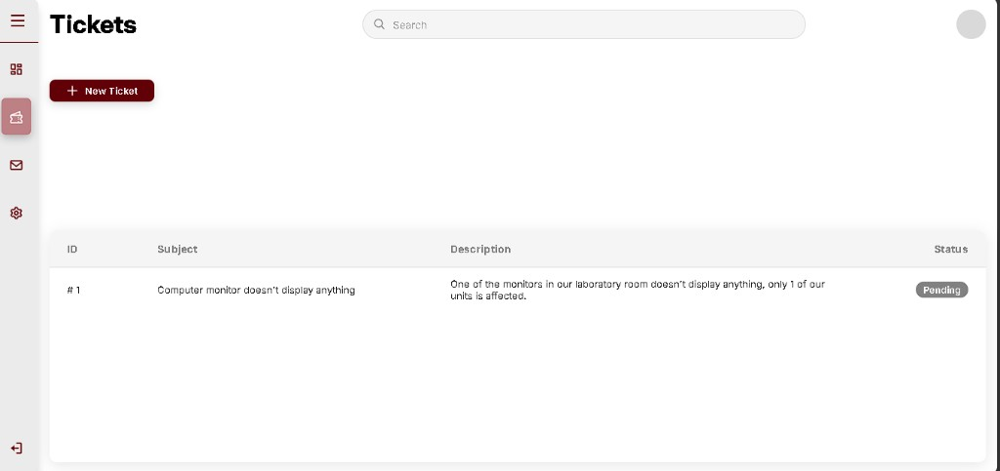

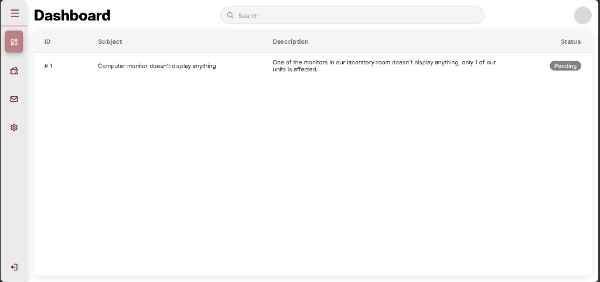

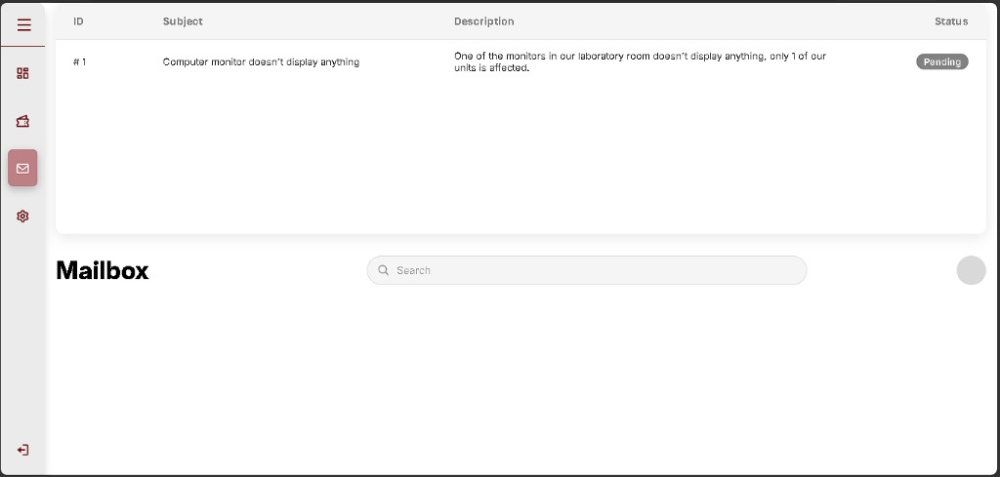

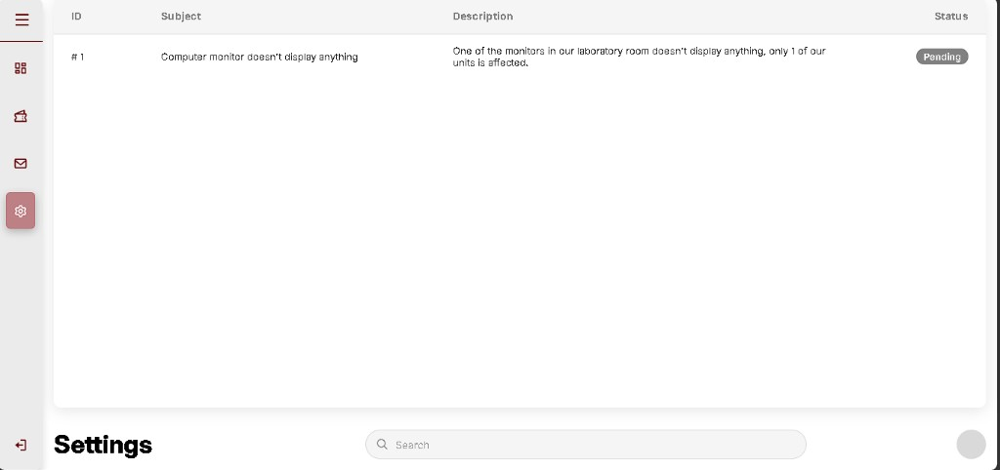

- **Fix snippet:**

```php
$user_tickets = [];
$email = $_SESSION['email'];

$find = $conn->prepare('SELECT id FROM users WHERE email = ?');
$find->bind_param('s', $email);
$find->execute();
$found = $find->get_result()->fetch_assoc();
$find->close();

if ($found) {
    $user_id = (int) $found['id'];
    $stmt = $conn->prepare(
        'SELECT id, subject, description, status FROM tickets WHERE user_id = ? ORDER BY id DESC'
    );
    $stmt->bind_param('i', $user_id);
    $stmt->execute();
    $result = $stmt->get_result();
    while ($row = $result->fetch_assoc()) {
        $user_tickets[] = $row;
    }
    $stmt->close();
}
```

```html
                <div class="tickets-toolbar">...</div>
                <div class="tickets-list">
                    <div class="tickets-list-header">...</div>
                    <div class="tickets-list-body" id="user-tickets-body">
                        <?php foreach ($user_tickets as $ticket) { ... ?>
                    </div>
                </div>
            </div>
```

(`.tickets-list` is a **child** of `#page-tickets`, after `.tickets-toolbar`, before that panel's closing `</div>`.)

- **In plain language:** Logged-in users see their own tickets on the Tickets tab. The list only appears there — not on Dashboard, Mailbox, or Settings — and sits right under **New Ticket** like the reference system (B-027).

### A-030 — Foreign key `tickets.user_id` → `users.id` (phpMyAdmin)

- **When:** 9 September 2026
- **Official stage:** 4 – v1.2 (Q-005)
- **Status:** done (FK saved + both tests passed)
- **What we did:** Pre-check: `users.id` and `tickets.user_id` both `int(11)`; Browse showed one row (`user_id = 1`, pending monitor ticket). **Structure** → **Relation view** on `tickets`: constraint `fk_tickets_user`, column `user_id` → `users_db`.`users`.`id`, ON DELETE **RESTRICT**, ON UPDATE **RESTRICT**. Save succeeded (green success + ALTER below).
- **Where:** phpMyAdmin → `users_db` → `tickets` → Structure → Relation view (not SQL tab)

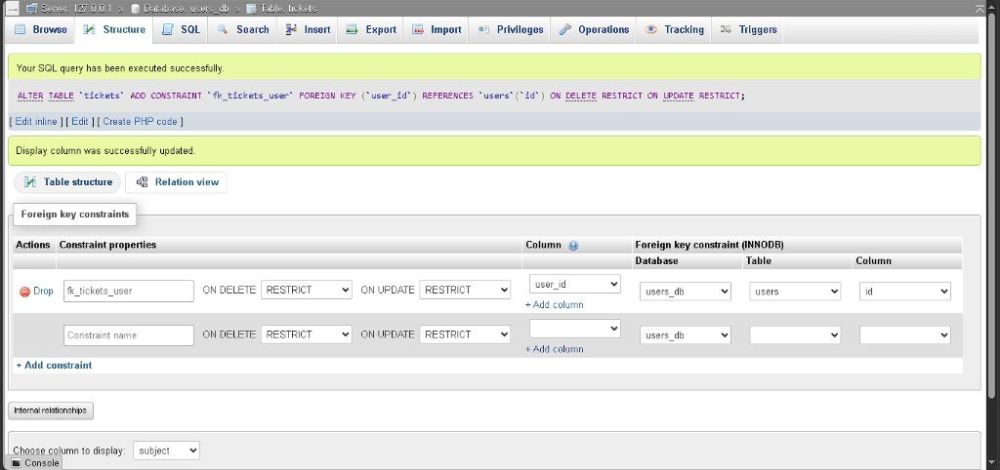

- **Test (good row):** **Insert** tab — `id` blank; `user_id` = **First Name - 1** (dropdown); `subject` = `FK Test Ticket`; `description` = `Testing FK with valid user`; `category` = `hardware`; `status` = `pending`. **Go** → **1 row inserted**, id **4**. Website **Tickets** tab shows the new row above the original monitor ticket.
- **Test (bad row):** **SQL** tab (not Insert) — Relation view makes `user_id` a dropdown of real users only, so `999` cannot be chosen on Insert. SQL tab with **Enable foreign key checks** on:

```sql
INSERT INTO tickets (user_id, subject, description, category)
VALUES (999, 'Test FK', 'user_id 999 does not exist', 'other');
```

**Go** → **#1452** — `Cannot add or update a child row: a foreign key constraint fails` (`fk_tickets_user`). No extra row added.

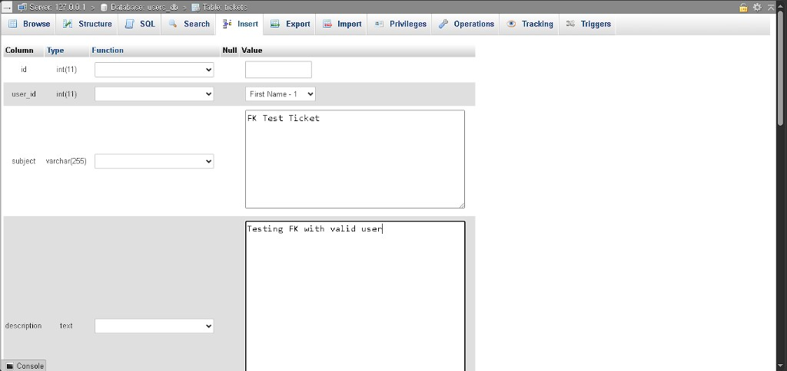

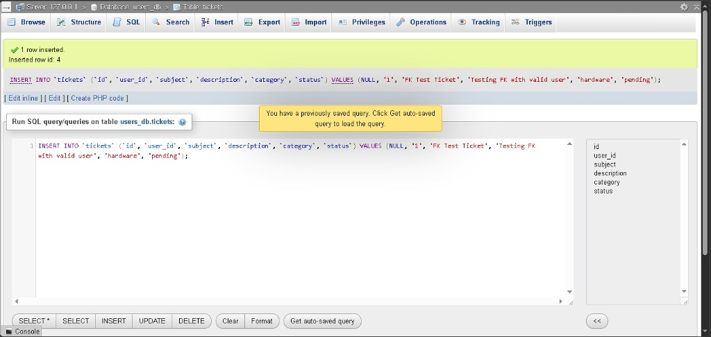

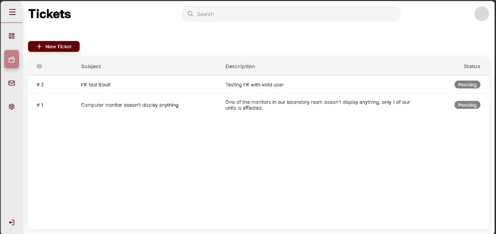

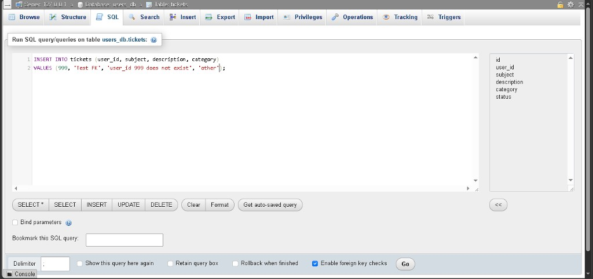

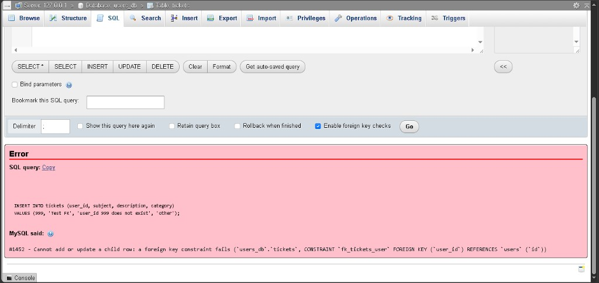

- **Fix snippet** (phpMyAdmin Relation view → Save; SQL phpMyAdmin ran):

```sql
ALTER TABLE `tickets`
  ADD CONSTRAINT `fk_tickets_user`
  FOREIGN KEY (`user_id`) REFERENCES `users` (`id`)
  ON DELETE RESTRICT ON UPDATE RESTRICT;
```

(Relation view fields: Constraint name `fk_tickets_user`; Column `user_id`; Database `users_db`; Table `users`; Column `id`.)

- **In plain language:** Every ticket must belong to a real account. MySQL checks `user_id` against `users.id` before it saves a ticket row. RESTRICT means you cannot delete a user who still has tickets without fixing those tickets first. Valid `user_id = 1` saved ticket #4 through the Insert tab. The bad test used SQL because the Insert dropdown only lists existing users — you cannot pick a fake id there. MySQL still rejected `user_id = 999` with error #1452, so the FK is working.

### A-031 — Admin ticket list on `admin.php` (Tickets tab)

- **When:** 10 September 2026
- **Official stage:** 4 – v1.2 (Q-006)
- **Status:** done (B-028 fixed)
- **What we did:** Top of `admin.php`: `$all_tickets[]` from `SELECT` on `tickets` **INNER JOIN** `users` (all rows, newest first). Sidebar **Tickets** nav (`data-nav="tickets"`). New `#page-tickets` panel with `.tickets-list` inside it (same pattern as A-029 on `user.php`). While typing: fixed `ehco` → `echo`, `quert` → `query`, `conn` → `$conn` (fatal **Undefined constant "conn"** without `$`). B-028: renamed `ticket-col-*` → `tickets-col-*`.
- **File:** `pages/admin.php`
- **Test:** **Tickets** tab lists rows #4 and #1 — ID, Subject, Description, **Pending** in spaced columns (matches `user.php` layout). **Dashboard** / **Utilities** do not show the ticket table.

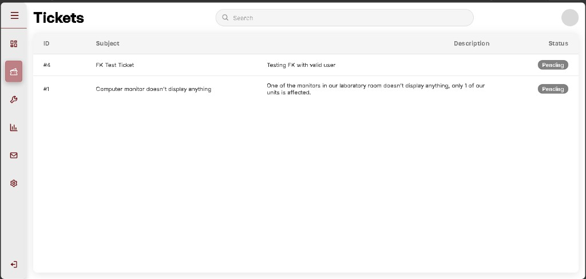

- **Fix snippet** (PHP — after `$role_labels`):

```php
$all_tickets = [];
$ticket_result = $conn->query(
    'SELECT t.id, t.subject, t.description, t.status,
            u.first_name, u.last_name
     FROM tickets t
     INNER JOIN users u ON t.user_id = u.id
     ORDER BY t.id DESC'
);
if ($ticket_result) {
    while ($row = $ticket_result->fetch_assoc()) {
        $all_tickets[] = $row;
    }
}
```

```html
<li class="nav-list-item" data-nav="tickets">...</li>
```

(`#page-tickets` sits after `#page-dashboard`, before `#page-utilities`. `.tickets-list` is **inside** `#page-tickets`.)

- **In plain language:** Admin sees every ticket in the database, not just one user’s. The JOIN adds submitter names for later columns. The list only shows on the Tickets tab because it lives inside `#page-tickets`, like B-027 on the user side.

### A-032 — `tickets.assigned_to` + expanded `status` ENUM (phpMyAdmin)

- **When:** 10 September 2026
- **Official stage:** 4 – v1.2 (assign workflow prep)
- **Status:** done
- **What we did:** **Structure** on `tickets`: added **`assigned_to`** `INT(11)` **NULL** default **NULL** after `user_id`. Changed **`status`** ENUM from `'pending'` only to `'pending','ongoing','processing','resolved'` (default **pending**). **Relation view:** constraint **`fk_tickets_assigned`** — `assigned_to` → `users`.`id`, ON DELETE **SET NULL**, ON UPDATE **RESTRICT**. **`fk_tickets_user`** unchanged. Browse: rows #1 and #4 still **pending**; **`assigned_to`** **NULL** on both.
- **Where:** phpMyAdmin → `users_db` → `tickets` → Structure / Relation view

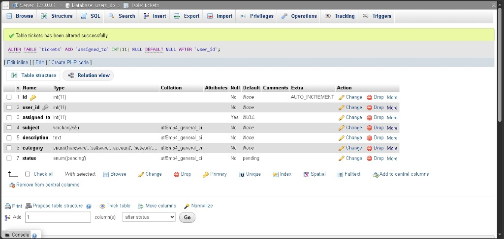

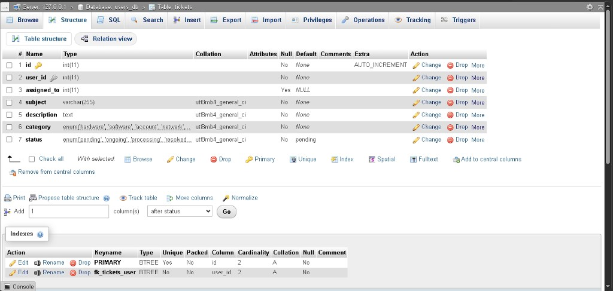

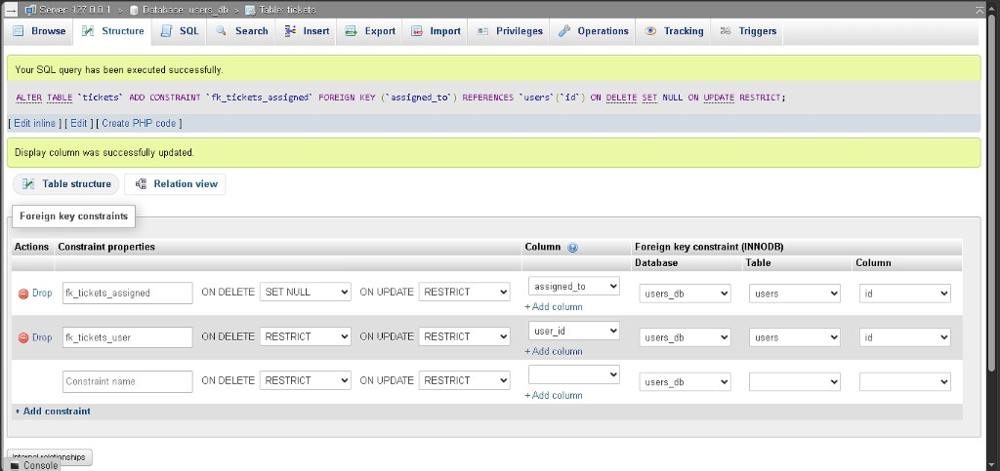

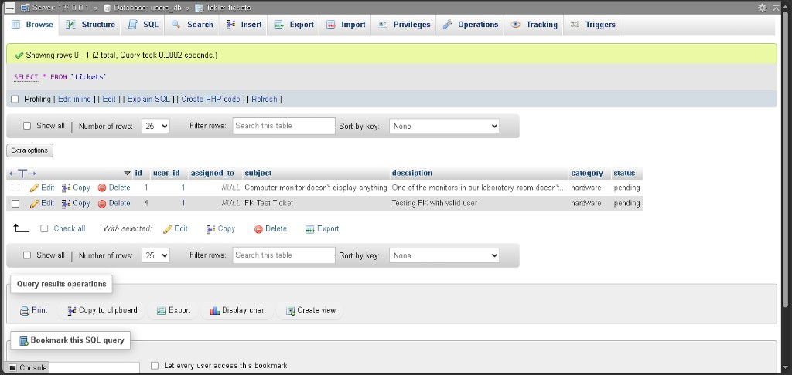

- **Fix snippet** (phpMyAdmin Structure + Relation view):

```sql
ALTER TABLE `tickets`
  ADD `assigned_to` INT(11) NULL DEFAULT NULL AFTER `user_id`;

ALTER TABLE `tickets`
  CHANGE `status` `status`
  ENUM('pending','ongoing','processing','resolved')
  NOT NULL DEFAULT 'pending';

ALTER TABLE `tickets`
  ADD CONSTRAINT `fk_tickets_assigned`
  FOREIGN KEY (`assigned_to`) REFERENCES `users` (`id`)
  ON DELETE SET NULL ON UPDATE RESTRICT;
```

- **In plain language:** Each ticket can now record which technician owns it (`assigned_to`), or stay unassigned (NULL). Status can move through four workflow steps instead of only pending. SET NULL means if a technician row is removed, the ticket stays but assignment clears. Existing tickets were not broken — they still show pending with no assignee.

### A-033 — Admin assign technician (in progress)

- **When:** 10 September 2026
- **Official stage:** 4 – v1.2 (Q-006)
- **Status:** in progress — **Part 1–2 done**; Part 3 logged as A-033 continued (19 Sep 2026)
- **What we did (Part 1):** At top of `admin.php`, load **`$technicians[]`** from active tech rows (`role = 'techn'`, `status = 'active'`). Expanded **`$all_tickets`** query to include **`t.assigned_to`**. Removed temporary `echo` / `print_r` debug block after Part 1 test. User signing up a **Technician** account + **Activate** on Utilities (no active tech existed yet).
- **What we did (Part 2):** Tickets tab — **Assigned To** header + per-row `<select>` (`Unassigned` + active technicians). CSS **`tickets-col-assigned`** + **`tickets-list-admin-five`** grid. **B-029** fixed. **`$tid = (int) $ticket['id']`** before each row; `#<?php echo $tid; ?>` and `aria-label` use `$tid`.
- **Part 2 retest:** **Tickets** tab — five columns aligned; #4 dropdown shows technician (**First Name 4 Last N…**); #1 **Unassigned**. Picking a name in the dropdown is UI-only until Part 3 — refresh reverts to whatever is in MySQL `assigned_to`.

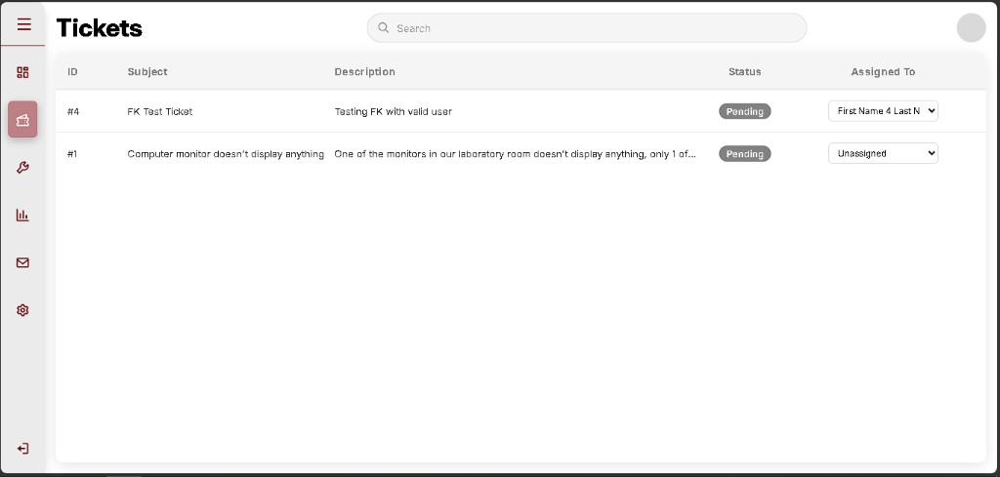
- **Where:** `pages/admin.php`, `css/main_interface.css`
- **Fix snippet:**

```php
$technicians = [];
$tech_result = $conn->query(
    "SELECT id, first_name, last_name
     FROM users
     WHERE role = 'techn' AND status = 'active'
     ORDER BY last_name, first_name"
);
if ($tech_result) {
    while ($row = $tech_result->fetch_assoc()) {
        $technicians[] = $row;
    }
}

$ticket_result = $conn->query(
    'SELECT t.id, t.subject, t.description, t.status, t.assigned_to,
            u.first_name, u.last_name
     FROM tickets t
     INNER JOIN users u ON t.user_id = u.id
     ORDER BY t.id DESC'
);
```

- **In plain language:** Before any dropdown appears, PHP must know (1) which technicians are allowed on the list, and (2) whether each ticket already has someone assigned. Part 1 only prepares that data; saving an assignment comes in Part 3.

### A-033 (continued) — Assign Save + status (Part 3)

- **When:** 19 September 2026
- **Official stage:** 4 – v1.2
- **Status:** done (B-030 layout; form posts `assigned_to` + `status`)
- **What we did:** `ticket_admin_mngmnt.php` UPDATEs `assigned_to` and `status`. Admin Tickets row is a `<form class="ticket-row">` with status `<select>`, assign `<select>`, **Save**. Assigned column widened to `minmax(240px, 1fr)`.
- **Where:** `pages/admin.php`, `logic/ticket_admin_mngmnt.php`, `css/main_interface.css`
- **Test:** Tickets → pick technician + status → Save → refresh keeps both; phpMyAdmin `tickets` Browse matches.
- **In plain language:** Admin can actually assign a technician and move the ticket through pending / ongoing / processing / resolved. Refreshing no longer throws the assignment away.

### A-034 — Technician assigned-ticket list (`techn.php`)

- **When:** 19 September 2026
- **Official stage:** 4 – v1.2
- **Status:** done (B-031 **fixed** — retest 19 Sep 2026: four spaced columns)
- **What we did:** `require_role('techn')`. SELECT tickets `WHERE assigned_to = current user`. Tickets tab lists those rows. Mailbox include + logout. **B-031** was `ticket-col-*` (no **s**); now `tickets-col-*`.
- **File:** `pages/techn.php`
- **Fix snippet:**

```php
$stmt = $conn->prepare(
    'SELECT id, subject, description, status FROM tickets WHERE assigned_to = ? ORDER BY id DESC'
);
```

- **In plain language:** A technician only sees jobs assigned to them, not every ticket in the school.

### A-035 — Mailbox UI + 3s poll (Q-006)

- **When:** 19 September 2026
- **Official stage:** 4 – v1.2
- **Status:** done (**B-033** closed 19 Sep 2026 — `messages` created; send works)
- **What we did:** Shared `pages/mailbox_panel.php` on user / admin / techn Messages tabs. `message_mngmnt.php` INSERT; `fetch_messages.php` JSON. `js/behavior.js` loads a thread on click. Poll matches `data-page="messages"` (B-032). phpMyAdmin `CREATE TABLE messages` with FKs to `tickets` and `users`.
- **Files:** `pages/mailbox_panel.php`, `logic/message_mngmnt.php`, `logic/fetch_messages.php`, `js/behavior.js`, `database/v1.2_stage4.sql`
- **Test:** SQL Go → empty result; Browse `messages` empty; send **Hello** from techn → maroon bubble; second account sees **Hello** left and sends **Ho**.
- **In plain language:** Chat now saves in MySQL. Both sides of a ticket can talk. Pane header can still say **Select a ticket** after a send (title not always refreshed).

### A-036 — Shared session, logout, role guards (Q-003); B-002 signup

- **When:** 19 September 2026
- **Official stage:** 4 – v1.2
- **Status:** done
- **What we did:** Pages and handlers use `logic/session_config.php` (`cookie path /CP2_V1.2/`). `require_role('admin'|'user'|'techn')` on dashboards. Logout → `logic/logout.php`. Public signup Role list is User + Technician only (B-002). Signup PHP already rejected `admin`.
- **In plain language:** You cannot open admin as a student. Logout really ends the session. Visitors cannot pick Administrator on the public form.

### A-037 — Priority queue panel (look only; 12 slots)

- **When:** 19 September 2026
- **Official stage:** 5 – v1.3 (Q-007)
- **Status:** done (look only). **B-034** closed — `4` → `3` after screenshot.
- **What we did:** Admin **Tickets** tab — grey **Priority queue** card above the ticket list. Three bands: Critical / Moderate / Low. First draft used **4** slots per band (**0 / 12**). Linked `dashboard_extra.css`. Subtitle under the title was removed so the doc screenshot is title + **0 / 9** + bands only.
- **Where:** `pages/admin.php` (`#page-tickets`), `css/dashboard_extra.css`
- **Fix snippet:**

```php
$queue_slots_per_band = 3;
$queue_total_slots = $queue_slots_per_band * 3;
```

- **In plain language:** Admin can see a queue board on Tickets before counts are wired to MySQL. After B-034, each colour band is **three** seats (**9** total). No subtitle under the title.

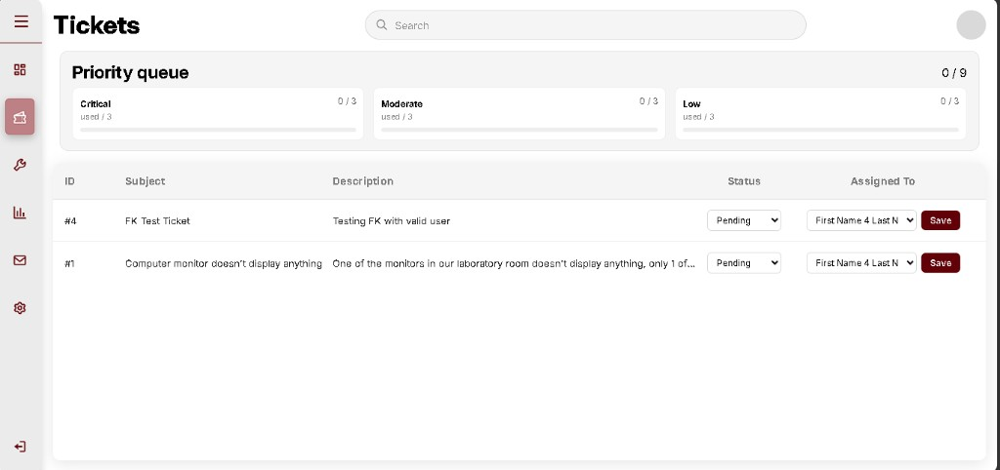

### A-038 — phpMyAdmin: `tickets.priority` (Structure)

- **When:** 19 September 2026
- **Official stage:** 5 – v1.3 (Q-007)
- **Status:** done (**B-035** closed — `priority` Null **Yes**, Default **NULL**)
- **What we did:** `users_db` → `tickets` → **Structure** → Add 1 column after `status`. Name `priority`, Type **ENUM**, Length/Values `'critical','moderate','low'`. First Save: **Null = No** (B-035). **Change**: tick **Null**, Default **None**, Save. Structure: column #8 **Null = Yes**, Default **NULL**. `category` already existed (#6).

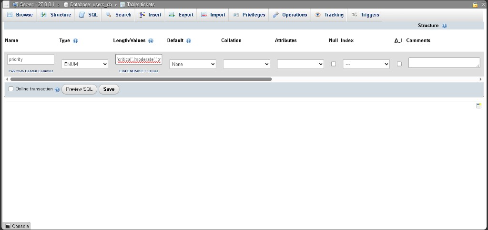

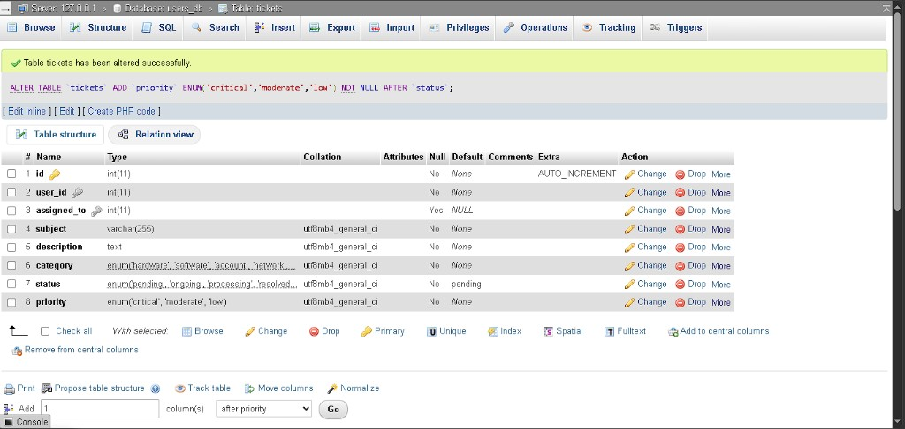

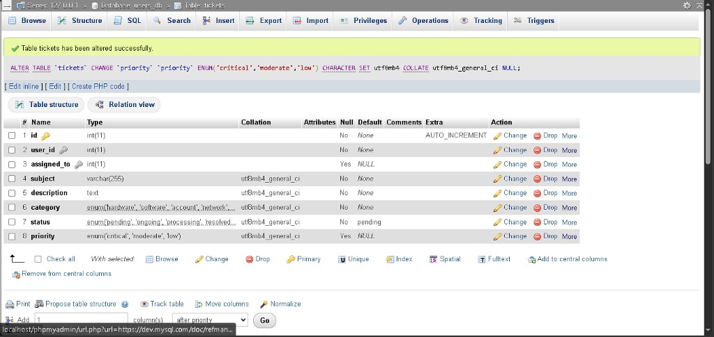
- **Where:** phpMyAdmin Structure (no SQL tab typed by hand; phpMyAdmin wrote the ALTER)
- **Fix snippet** (phpMyAdmin Structure Save):

```sql
ALTER TABLE `tickets`
  ADD `priority` ENUM('critical','moderate','low') NOT NULL AFTER `status`;
```

- **In plain language:** Each ticket can store a queue colour, or stay empty (NULL) until it is put on the board.

### A-039 — Queue counts from `tickets.priority`

- **When:** 19 September 2026
- **Official stage:** 5 – v1.3 (Q-007)
- **Status:** done (**B-036** closed — `'high'` → `'critical'`)
- **What we did:** `GROUP BY priority` into `$by_priority`. Board uses `$queue_counts` and bar fill `used / 3`. First draft looked up `'high'` (B-036); now `'critical'`.
- **Where:** `pages/admin.php`
- **Fix snippet:**

```php
'critical' => (int) ($by_priority['critical'] ?? 0),
```

- **In plain language:** Critical, Moderate, and Low counts come from the same words stored in MySQL.

### A-040 — Analytics status cards (static numbers)

- **When:** 19 September 2026
- **Official stage:** 5 – v1.3 (Q-007)
- **Status:** done (**B-037** closed — replaced with original 5-card COUNT UI)
- **What we did:** First draft had three cards with literals `4`, `2`, `12`. That did not match the original (Pending / Ongoing / Processing / Confirming / Resolved + icons).
- **Where:** `pages/admin.php` (`#page-analytics`)
- **Causing snippet (B-037):**

```php
$analytics_pending = 4;
$analytics_ongoing = 2;
$analytics_resolved = 12;
```

- **In plain language:** Those three numbers were a fake poster, not the original dashboard cards.

### A-041 — Original status cards + sample charts; priority Save

- **When:** 19 September 2026
- **Official stage:** 5 – v1.3 (Q-007)
- **Status:** done pending screenshot
- **What we did:** Copied look-lock `dashboard_status_cards.php` (5 cards, filled icons). Counts from `SELECT status, COUNT(*) GROUP BY status`. Same cards on **Dashboard** and **Analytics**. Analytics also has original static Chart.js sample (Tickets Report, Categories, Satisfaction, Severity). Tickets list **Priority** dropdown; `ticket_admin_mngmnt.php` UPDATEs `priority`. Confirming stays **0** until Stage 6 ENUM. Charts stay sample (same as original comment: display only).
- **Where:** `pages/partials/dashboard_status_cards.php`, `pages/partials/dashboard_charts.php`, `js/dashboard_static_charts.js`, `pages/admin.php`, `logic/ticket_admin_mngmnt.php`
- **Fix snippet:**

```php
$count_result = $conn->query('SELECT status, COUNT(*) AS cnt FROM tickets GROUP BY status');
```

- **In plain language:** Card numbers follow real ticket statuses. Charts are the original sample drawings, not live MySQL. Priority on a ticket can be saved and the 9-slot board counts it.

### A-042 — Close B-038–B-040; Settings shell; Performance / Tickets shots

- **When:** 19 September 2026
- **Official stage:** 5 – v1.3
- **Status:** done
- **What we did:** Fixed chart `dashbord` typo, Pending `pendng` filter, queue active-status rule. Settings Appearance + password. Logged Performance placeholders and Tickets queue/priority.
- **Files:** `js/dashboard_static_charts.js`, `logic/priority_queue.php`, `logic/settings_mngmnt.php`, `pages/admin.php`
- **In plain language:** Dashboard charts draw. Settings is no longer blank. Queue only counts work-in-progress tickets.

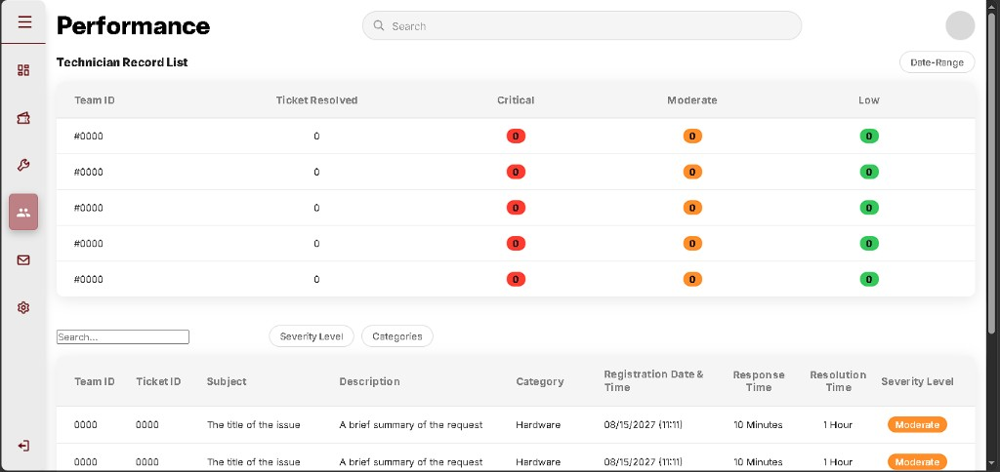

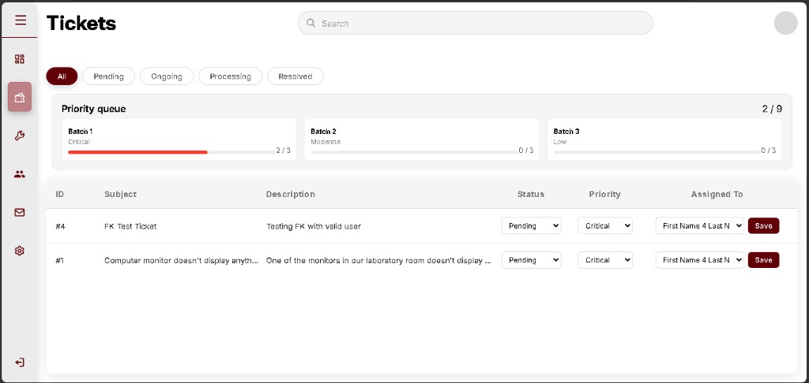

### A-043 — Utilities filters/actions + working theme toggle

- **When:** 19 September 2026
- **Official stage:** 5 – v1.3
- **Status:** done
- **What we did:** Restored original Utilities toolbar (role filters + Add User), Edit / Activate-Deactivate / Delete actions, and full `user_admin_mngmnt.php` handlers. Settings theme Light/Dark saves via session + cookie and applies `data-theme` + `theme.css`.
- **Files:** `pages/admin.php`, `logic/user_admin_mngmnt.php`, `logic/settings_mngmnt.php`, `logic/session_config.php`, `js/utilities_filter.js`, `css/theme.css`
- **In plain language:** Utilities matches the original admin user desk. Theme actually switches the dashboard look.

### A-044 — Fix B-043: local Chart.js for Dashboard samples

- **When:** 19 September 2026
- **Official stage:** 5 – v1.3
- **Status:** done
- **What we did:** Replaced CDN Chart.js with local `js/chart.umd.js`. Hardened `dashboard_static_charts.js` to redraw when returning to Dashboard.
- **Files:** `js/chart.umd.js`, `js/dashboard_static_charts.js`, `pages/admin.php`
- **In plain language:** Sample charts draw without needing the internet.

### A-045 — Fix B-044: queue counts open prioritized tickets

- **When:** 19 September 2026
- **Official stage:** 5 – v1.3
- **Status:** done
- **What we did:** Priority queue again counts `priority IS NOT NULL` (not resolved). Squashed GitHub history to a single **V1.3** commit.
- **Files:** `logic/priority_queue.php`
- **In plain language:** Set Priority to Critical and Save → Batch 1 moves (e.g. **2 / 3**, total **2 / 9**).

### A-046 — Queue retest OK; migrate folder to CP2_V1.4

- **When:** 19 September 2026
- **Official stage:** 5 → 6 (v1.3 close / v1.4 start)
- **Status:** done
- **What we did:** Retest — Priority queue **2 / 9** (Critical **1/3**, Moderate **1/3**, Low **0/3**) with two Pending tickets. Copied website to `C:\xampp\htdocs\CP2_V1.4` (cookie path `/CP2_V1.5/`). Stage 6 work continues only in the V1.4 folder.
- **In plain language:** V1.3 queue is verified. New lessons use the V1.4 copy so V1.3 on disk (and GitHub tag **V1.3**) stays frozen.

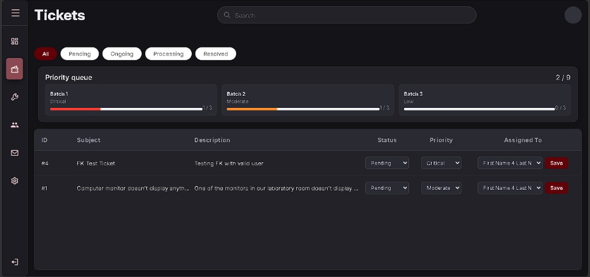

### A-047 — Utilities filters + actions retest (closes B-041 shot)

- **When:** 19 September 2026
- **Official stage:** 5 – v1.3
- **Status:** done
- **What we did:** Retest after A-043 — Utilities shows **All / User / Technician / Administrator / Pending Approval**, **Add User**, and per-row **Edit / Deactivate / Delete**. Edit User form opens with name, email, and **Role** dropdown + Save Changes.
- **In plain language:** Admin can filter accounts by role and change role / deactivate / delete from Utilities (B-041 fixed and verified).

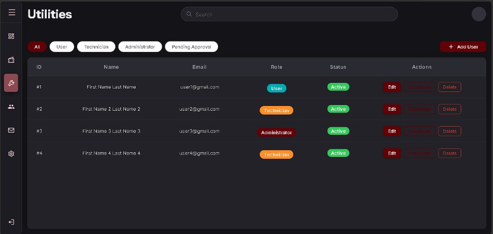

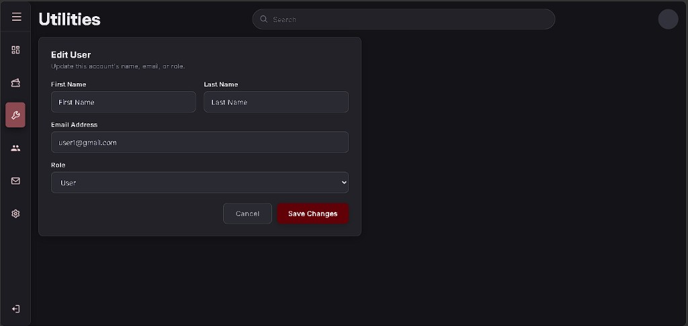

### A-049 — phpMyAdmin: `awaiting_confirmation` on `tickets.status`

- **When:** 19 September 2026
- **Official stage:** 6 – v1.4 (Q-012)
- **Status:** done
- **What we did:** Structure → Change `status` ENUM. Added `awaiting_confirmation`. Table altered successfully. Values now: pending, ongoing, processing, resolved, awaiting_confirmation (default pending).
- **Where:** `users_db.tickets.status`
- **In plain language:** MySQL can store the Confirming step between Processing and Resolved.

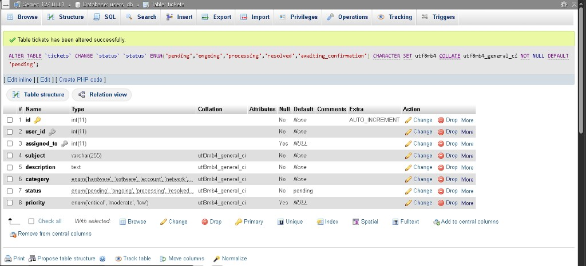

### A-050 — Confirmation workflow UI + handlers (planted B-045–B-047)

- **When:** 19 September 2026
- **Official stage:** 6 – v1.4 (Q-012)
- **Status:** in progress (bugs open for screenshots)
- **What we did:** Technician Tickets — status dropdown + Save (`ticket_techn_mngmnt.php`). User Tickets — Confirm column with Solved / Not Solved Yet (`ticket_confirm_mngmnt.php`). Admin status list includes Confirming. Helpers in `ticket_status.php`. Intentional bugs **B-045–B-047** left open for captures.
- **Files:** `pages/user.php`, `pages/techn.php`, `pages/admin.php`, `logic/ticket_status.php`, `logic/ticket_confirm_mngmnt.php`, `logic/ticket_techn_mngmnt.php`, `css/main_interface.css`
- **In plain language:** Stage 6 screens exist. Three planted typos/wrong rules will show up when you test — then we fix them.

---

### A-051 — Stage 6 confirmation closed (B-045–B-047 fixed)

- **When:** 19 September 2026
- **Official stage:** 6 – v1.4 (Q-012)
- **Status:** done
- **What we did:** Logged screenshots for B-045–B-047. Fixed typo confirm check, removed Resolved from technician statuses, Not Solved Yet → `ongoing`. Q-012 complete. Stage 7 = Python/Flask in `CP2_V1.5`.
- **In plain language:** Reporter can confirm fixes; tech cannot skip confirmation; rejected fixes go back to Ongoing.

---

### A-052 — Python 3.13 + pip + Flask installed

- **When:** 19 September 2026
- **Official stage:** 7 – AI (Q-008)
- **Status:** done
- **What we did:** Installed Python 3.13.15 with PATH. Verified `python` / `pip`. Installed `flask`, `flask-cors`, `requests`. Sanity check printed `Flask OK 3.1.3`.
- **Where:** local PC + `C:\xampp\htdocs\CP2_V1.5`
- **In plain language:** The machine can run a Python web helper beside XAMPP.

### A-053 — Flask keyword classifier (`ai/classifier_app.py`)

- **When:** 19 September 2026
- **Official stage:** 7 – AI (Q-008)
- **Status:** done (B-050 planted)
- **What we did:** Local Flask app on `127.0.0.1:5000` — `GET /health`, `POST /classify`. Keyword rules map subject/description → category + priority (no paid OpenAI key required for this rebuild).
- **Files:** `ai/classifier_app.py`, `ai/requirements.txt`, `ai/start_classifier.bat`

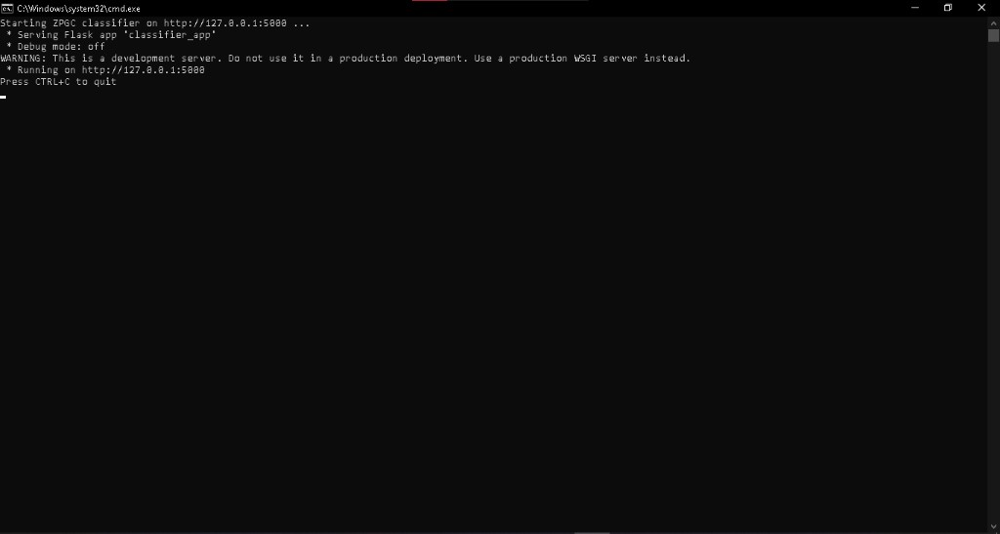

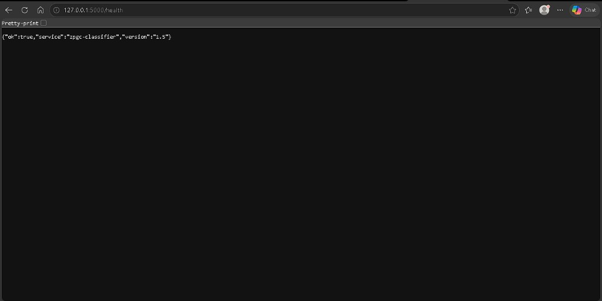

- **In plain language:** A small AI service guesses ticket category and urgency from the words you type.

### A-054 — Ticket form Suggest with AI + PHP bridge

- **When:** 19 September 2026
- **Official stage:** 7 – AI (Q-008)
- **Status:** in progress (B-049–B-051 open for screenshots)
- **What we did:** New Ticket: subject/description → **Suggest with AI** → fills category/priority dropdowns. Bridge `logic/ai_classify.php` / `ai_suggest.php` + `js/ticket_ai.js`. Intentional bugs left for captures.
- **Files:** `pages/ticket.php`, `logic/ai_classify.php`, `logic/ai_suggest.php`, `logic/ticket_mngmnt.php`, `js/ticket_ai.js`, `css/ticket.css`

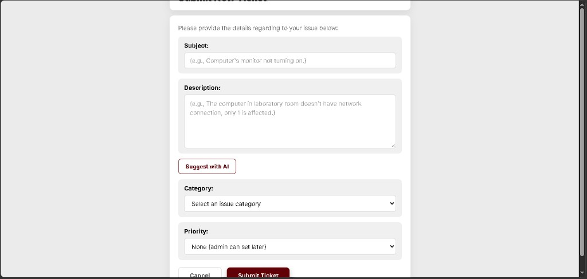

- **In plain language:** The ticket form can ask Flask for a suggestion; three planted mistakes will show up when you test.

---

## Issue log

Problems found or introduced. Each entry: what was seen, **Causing snippet**, mermaid, executed or planned fix. **In plain language** explains the snippet for readers who do not write PHP every day.

### B-001 — Apache 404 on landing; Go Live looked fine

- **When:** 29 June 2026 (1 day)
- **Status:** fixed
- **What I saw:** Go Live showed the welcome page. `.../landing_page.php` was Not Found.


- **Cause:** File was `landing_page.html`.
- **Causing snippet:** disk `pages/landing_page.html` vs URL `landing_page.php`.
- **In plain language:** The editor preview can open `.html`. The live Apache URL asked for `.php`, so it said Not Found.
- **Solution executed:** Rename to `landing_page.php`.

```
Rename: pages/landing_page.html  →  pages/landing_page.php
```

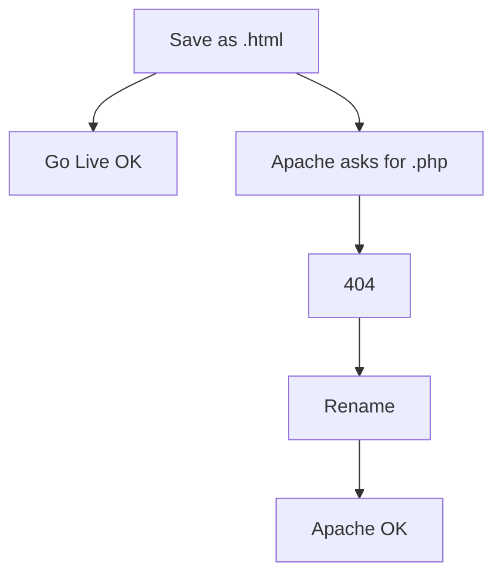
```mermaid
flowchart TD
  A[Save as .html] --> B[Go Live OK]
  A --> C[Apache asks for .php]
  C --> D[404]
  D --> E[Rename]
  E --> F[Apache OK]
```

### B-002 — Public signup offers Administrator (authentic early UI)

- **When:** 30 June – 4 July 2026 (same stretch as A-002)
- **Status:** fixed (A-036, 19 September 2026)
- **What I saw:** On **SIGNUP**, the Role list includes User, **Administrator**, and Technician. A visitor could pick Administrator on the public page. The first real build did this; later versions take Administrator off the public list. Admin accounts should not be self-created from the welcome flow.
- **Causing snippet** (`pages/login_signup.php` signup form):

```html
<select name="role" required>
    <option value="" disabled selected>Role</option>
    <option value="user">User</option>
    <option value="admin">Administrator</option>
    <option value="techn">Technician</option>
</select>
```

- **In plain language:** Anyone signing up could claim to be an admin. PHP would store `role = admin` for that row. The product still has an admin **role** — it must not stay a public dropdown choice.
- **Queued fix:** Delete the Administrator `<option>` from this public form (keep User + Technician). Do not remove the admin role from the database or from admin-only creation paths.
- **Solution executed (19 September 2026, A-036):** Removed `<option value="admin">` from `login_signup.php`. Handler already allowed only `user` / `techn`.

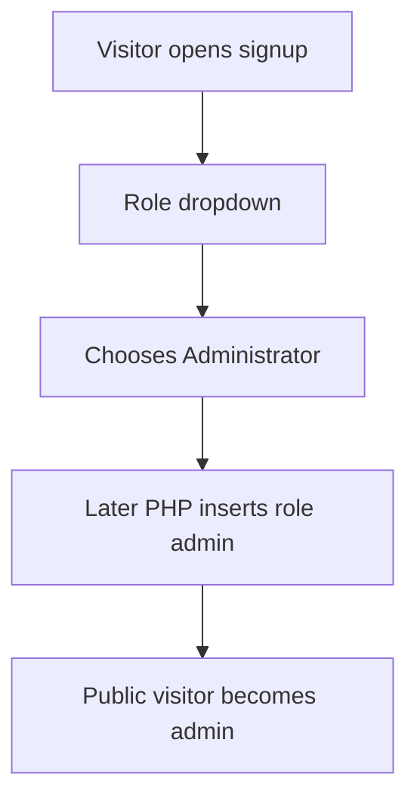
```mermaid
flowchart TD
  A[Visitor opens signup] --> B[Role dropdown]
  B --> C[Chooses Administrator]
  C --> D[Later PHP inserts role admin]
  D --> E[Public visitor becomes admin]
```

### B-003 — Signup stacked under login

- **When:** 5–6 July 2026 (2 days)
- **Status:** fixed
- **What I saw:** Go Live on `login_signup.html`. LOGIN typed normally. **Signup now!** showed SIGNUP **under** LOGIN instead of replacing it.

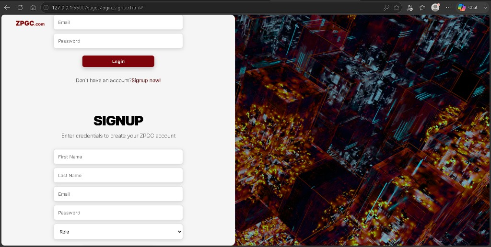

- **Cause:** JS used `.formBox`; HTML/CSS use `.form-box`.
- **Causing snippet:**

```javascript
document.querySelectorAll(".formBox")
```

- **In plain language:** The script looked for a class name that the HTML did not use. LOGIN never hid, so SIGNUP appeared underneath it.
- **Solution executed:**

```javascript
document.querySelectorAll(".form-box").forEach(function (form) {
    form.classList.remove("active");
});
```

### B-004 — Landing Signup now! opened LOGIN

- **When:** 9–11 July 2026 (3 days)
- **Status:** fixed
- **Cause:** Nothing read `?form=signup`.
- **Causing snippet:** landing link `login_signup.php?form=signup` with no matching `URLSearchParams` code yet.
- **In plain language:** The Signup now! button added extra text to the URL. The page ignored it, so it always showed LOGIN.
- **Solution executed:**

```javascript
window.addEventListener("DOMContentLoaded", function (form) {
    var params = new URLSearchParams(window.location.search);
    if (params.get("form") === "signup") {
        showForm("signup-form");
    }
})
```

### B-005 — `connection_error` vs `connect_error` (latent)

- **When:** 22 July 2026 (found on connect test)
- **Status:** open (page still printed Connected because MySQL was up)
- **What I saw:** Browser showed `Connected to users_db`.
- **Cause:** Success path never uses the die() line. The property on mysqli is `connect_error`. `connection_error` is empty, so a **failed** connect would die with a blank reason.
- **Exact causing snippet:**

```php
die("Connection failed: " . $conn->connection_error);
```

- **In plain language:** If MySQL is running, you never see this line. If MySQL is down, PHP should print why. The property name is misspelled, so the reason would be blank. Not fixed yet.

- **Queued fix:** `$conn->connect_error` in both the `if` and the `die` string.

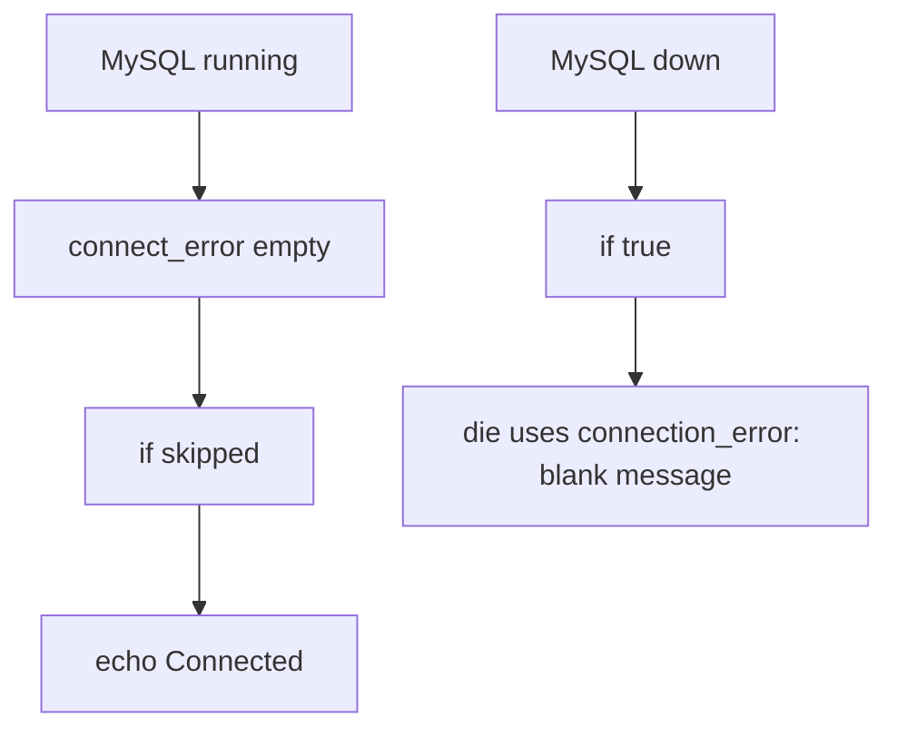
```mermaid
flowchart TD
  A[MySQL running] --> B[connect_error empty]
  B --> C[if skipped]
  C --> D[echo Connected]
  E[MySQL down] --> F[if true]
  F --> G["die uses connection_error: blank message"]
```

### B-006 — Stylesheet looked missing on first landing pass

- **When:** 28 June 2026 (1 extra day inside A-001)
- **Status:** fixed (simulated delay: wrong relative path, then `../css/landing_page.css`)
- **What I saw:** Raw HTML, no maroon bar, until the `link` href went up one folder into `css/`.

- **Causing snippet:** `href` pointed at `css/...` from `pages/` without `../`.
- **In plain language:** The style file lives one folder up from the page. Without `../`, the browser never found the maroon CSS.

### B-007 — Logo link still used `.html` after rename to `.php`

- **When:** 12–13 July 2026 (inside A-005)
- **Status:** fixed
- **What I saw:** After `landing_page.php` / `login_signup.php` existed, the ZPGC logo on login/signup could still point at `landing_page.html`. On Apache that old name is Not Found (same class of bug as B-001).
- **Causing snippet** (`pages/login_signup.php` logo):

```html
<a href="../pages/landing_page.html">
```

- **In plain language:** The files were renamed to `.php`, but the logo link still asked for `.html`. Apache treats those as different filenames.
- **Solution executed:**

```html
<a href="../pages/landing_page.php">
```

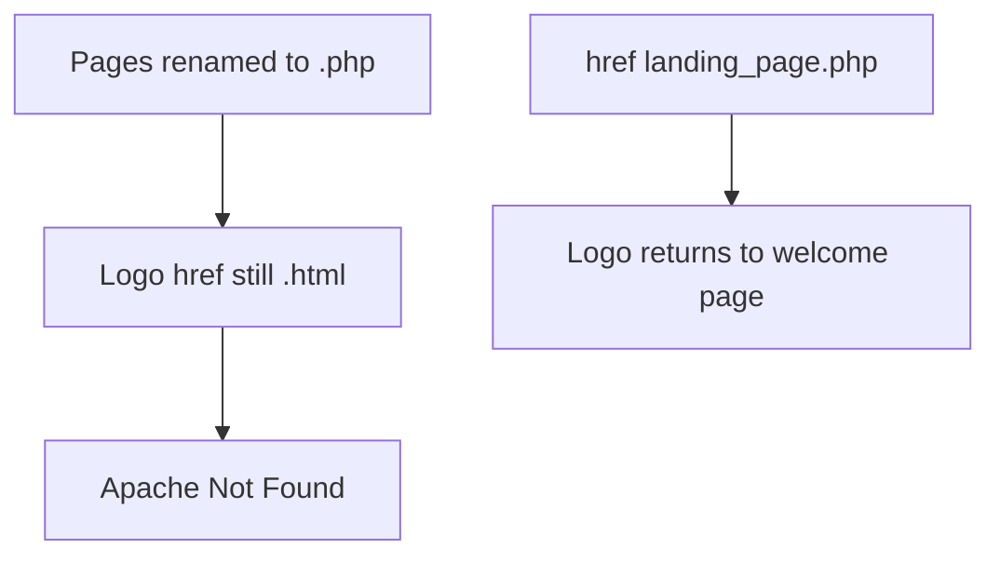
```mermaid
flowchart TD
  A[Pages renamed to .php] --> B[Logo href still .html]
  B --> C[Apache Not Found]
  D[href landing_page.php] --> E[Logo returns to welcome page]
```

### B-008 — `config.php` 404 until it lived in `logic/`

- **When:** 21 July 2026 (1 day inside A-007)
- **Status:** fixed
- **What I saw:** `.../pages/config.php` Not Found. File belongs in `logic/config.php`.

- **Causing snippet:** URL `pages/config.php` while the file is `logic/config.php`.
- **In plain language:** Connection code lives with the other PHP handlers, not next to the HTML pages. The wrong folder in the address bar is Not Found.

### B-009 — Signup submit: Apache 404

- **When:** 23 July 2026 (1 day, Stage 2)
- **Status:** fixed
- **What I saw:** Filled signup (User) and submitted. Browser showed **Not Found**.

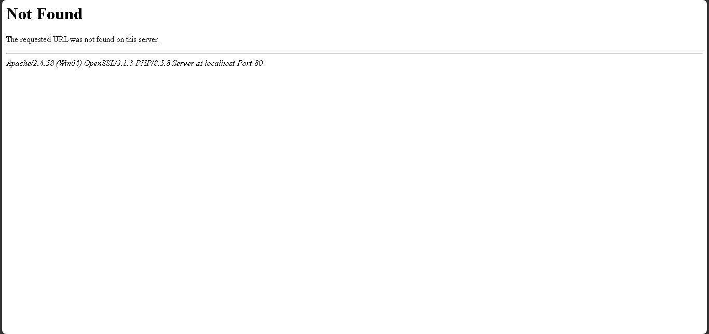

- **Cause:** Form `action` is `user_mngmnt.php` (underscore). Disk had `logic/user.mngmnt.php` (dot).
- **Causing snippet:** form `action=".../user_mngmnt.php"` vs filename `user.mngmnt.php`.
- **In plain language:** Submit posts to a filename with an underscore. The file on disk used a dot. Apache could not find it (404).
- **Solution executed:** Renamed to `logic/user_mngmnt.php`. Both forms `method="post"`. Signup then inserted a row (A-008).

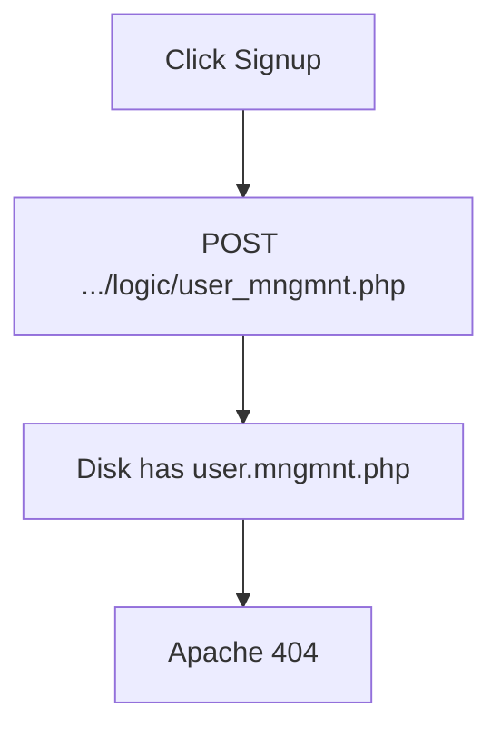
```mermaid
flowchart TD
  A[Click Signup] --> B["POST .../logic/user_mngmnt.php"]
  B --> C[Disk has user.mngmnt.php]
  C --> D[Apache 404]
```

### B-010 — `session_start()` missing semicolon (syntax errors)

- **When:** 25 July 2026 (Stage 2 login)
- **Status:** fixed
- **What I saw:** `user_mngmnt.php` — unexpected token `require_once`. `login_signup.php` — unexpected variable `$login_error`.
- **Cause:** `session_start()` had no `;`.
- **Causing snippet:**

```php
session_start()
```

- **In plain language:** PHP needs a semicolon at the end of that line. Without it, the next lines look like a syntax error and login never runs.
- **Solution executed:**

```php
session_start();
```

Login tests recorded as A-009.

### B-011 — Apache 404 on `user.php`

- **When:** 7 August 2026
- **Status:** fixed
- **What I saw:** `http://localhost/CP2_v1.1/pages/user.php` Not Found. Same 404 after switching the folder to `CP2_V1.1`. After rename, the URL loaded.


- **Cause:** File was `users.php`. URL is `user.php`.
- **Causing snippet:** disk `pages/users.php` vs URL `pages/user.php`.
- **In plain language:** The address bar asked for `user.php`. The file was named `users.php`. Apache treats those as different names.
- **Solution executed:** Renamed `pages/users.php` → `pages/user.php`.

### B-012 — Dashboard chrome: CSS layout not applied (`main_wrap`)

- **When:** 7 August 2026
- **Status:** fixed
- **What I saw:** `user.php` loaded; logo, Dashboard icon, and `h1` stacked in the top-left on white. No grey sidebar until the class matched CSS.


- **Cause:** `class="main_wrap"` vs CSS `.main-wrap`.
- **Causing snippet:**

```html
    <main class="main_wrap">
```

- **In plain language:** CSS styles the name with a hyphen. The HTML used an underscore, so the grey sidebar rules never applied.
- **Solution executed:**

```html
    <main class="main-wrap">
```

- **After fix:** Grey sidebar, logo, rose Dashboard control. Main area still mostly empty (search and extra nav not typed yet). Dashboard at sidebar bottom is `:last-child` until Logout is added. After-fix capture is on **A-010**.

### B-013 — Settings label under the gear (not beside it)

- **When:** 8 August 2026 (A-011 reload)
- **Status:** fixed
- **What I saw:** Tickets, Mailbox, and Logout keep icon + text on one row. **Settings** puts the word under the gear.

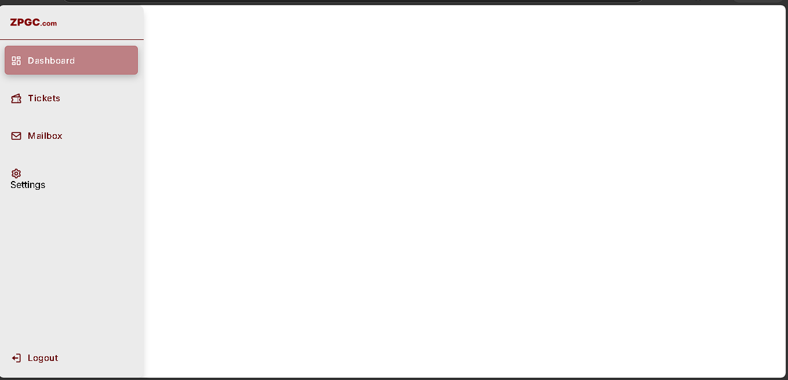

- **Cause:** `.nav-link` is `display: flex` (icon and `.link-text` on one row). Settings closed `</a>` **before** the `<span>`. The span is a sibling of the link, so it is not in that flex row.
- **Tried (does not fix layout):** `id="settings"` on the span. `id` names the element for later JS; `main_interface.css` has no `#settings` rule that changes display. Label still under the gear.

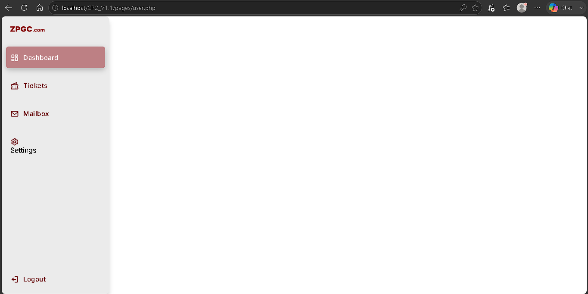

- **Exact causing snippet** (`pages/user.php` after that try):

```html
                                    </svg>
                                </a>
                                <span class="link-text" id="settings">Settings</span>
```

- **In plain language:** The word Settings sat outside the clickable row. Flex layout only lines up children inside that row, so the word wrapped under the gear.

- **Queued fix:** Move the span **inside** `.nav-link`, after `</svg>`, same as Tickets/Mailbox. Keep `id="settings"`.

```html
                                    <span class="link-text" id="settings">Settings</span>
                                </a>
```

- **Solution executed:** Span is a child of `.nav-link`, immediately after `</svg>` (same order as Tickets/Mailbox). Note: “before the svg” would put the word to the **left** of the gear; the file on disk is svg then span.

```html
                                    </svg>
                                    <span class="link-text" id="settings">Settings</span>
                                </a>
```

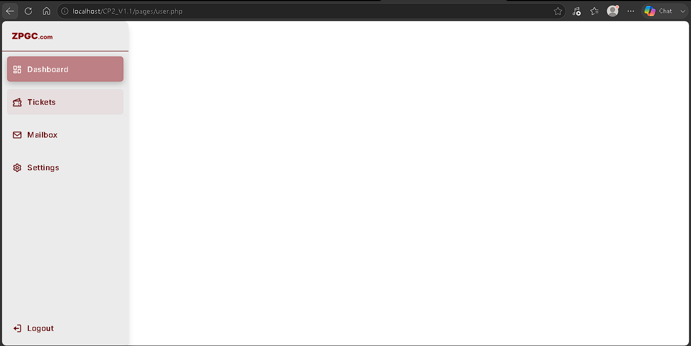

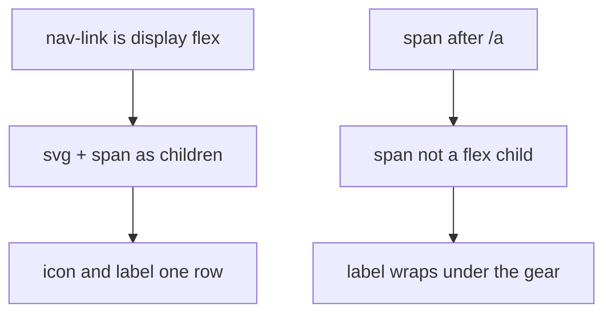
```mermaid
flowchart TD
  A["nav-link is display flex"] --> B[svg + span as children]
  B --> C[icon and label one row]
  D["span after /a"] --> E[span not a flex child]
  E --> F[label wraps under the gear]
```

### B-014 — Apache 404 on `admin.php`

- **When:** 11 August 2026 (A-014)
- **Status:** fixed
- **What I saw:** `http://localhost/CP2_v1.1/pages/admin.php` — Apache **Not Found**. `user.php` and `techn.php` loaded.


- **Cause:** The dashboard HTML lives at `logic/admin.php`. Apache asked for `pages/admin.php`. Same class of mismatch as B-008 (`config.php` in the wrong folder) and B-011 (`users.php` vs `user.php`). Folder casing `CP2_v1.1` vs `CP2_V1.1` is not why this 404 happened: `pages/` has no `admin.php`.
- **Exact causing location:**

```
logic/admin.php     ← file on disk
pages/admin.php     ← URL
```

- **In plain language:** The browser asked for a file in `pages/`. The HTML was saved under `logic/`. Wrong folder = Not Found.

- **Queued fix:** Move (or save a copy as) `pages/admin.php`. Do not keep the role dashboard under `logic/` (`logic/` is for PHP handlers like `user_mngmnt.php`). After the move, use `http://localhost/CP2_V1.1/pages/admin.php`.
- **Solution executed:** File is now `pages/admin.php`. `logic/admin.php` is gone. Prefer URL casing `CP2_V1.1` (cookie path later). Attached capture after the move still shows the old 404 URL; on disk the page is in `pages/`.

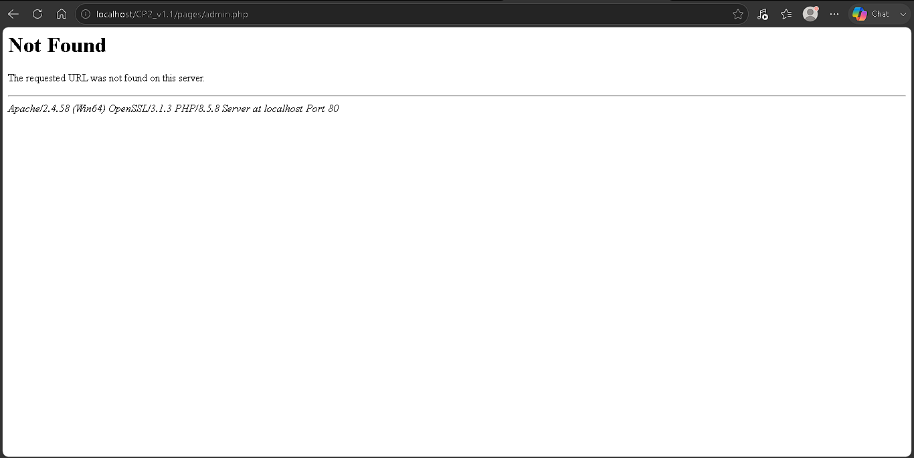

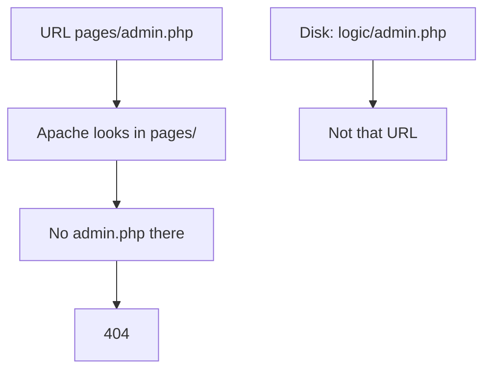
```mermaid
flowchart TD
  A["URL pages/admin.php"] --> B[Apache looks in pages/]
  B --> C[No admin.php there]
  C --> D[404]
  E["Disk: logic/admin.php"] --> F[Not that URL]
```

### B-015 — Analytics label under the icon (`admin.php`)

- **When:** 11 August 2026 (A-015)
- **Status:** fixed
- **What I saw:** Admin page loads. **Analytics** text sits under the bar-chart icon (same layout as Settings on **B-013**).
- **Cause:** `.nav-link` is `display: flex`. Analytics closed `</a>` before the `<span>`, so the span is not a flex child.
- **Exact causing snippet** (`pages/admin.php`):

```html
                            <li class="nav-list-item" data-nav="analytics">
                                <a href="#" class="nav-link">
                                    <svg xmlns="http://www.w3.org/2000/svg" width="24" height="24" fill="currentColor"
                                        viewBox="0 0 24 24">
                                        <path d="M4 2H2v19c0 .55.45 1 1 1h19v-2H4z"></path>
                                        <path d="M17 12h2v6h-2zm-5-8h2v14h-2zM7 9h2v9H7z"></path>
                                    </svg>
                                </a>
                                <span class="link-text">Analytics</span>
                            </li>
```

- **In plain language:** Same as Settings (B-013): the label was outside the link, so it sat under the icon.

- **Queued fix:** Same as B-013 — span inside `.nav-link` after `</svg>`:

```html
                                    </svg>
                                    <span class="link-text">Analytics</span>
                                </a>
```

- **Solution executed:** Span is inside `.nav-link` after `</svg>` (`pages/admin.php`).

- **Still leftover:** Utilities `<li>` still has `data-nav="tickets"`. Change to `data-nav="utilities"` on the next pass.

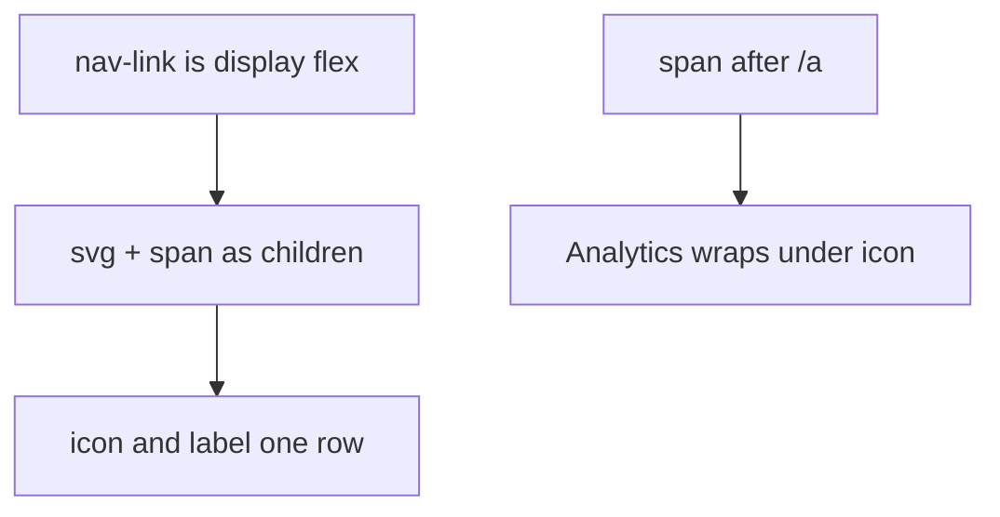
```mermaid
flowchart TD
  A["nav-link is display flex"] --> B[svg + span as children]
  B --> C[icon and label one row]
  D["span after /a"] --> E[Analytics wraps under icon]
```

### B-016 — Mailbox / Settings top bar unstyled (`<head>` vs `<header>`)

- **When:** 12 August 2026 (A-016)
- **Status:** fixed
- **What I saw:** Dashboard and Tickets used the pill search and profile circle. Mailbox and Settings showed a stacked `h1`, a small magnifying-glass, and a raw Search box (no pill, no circle). Sidebar still collapsed.

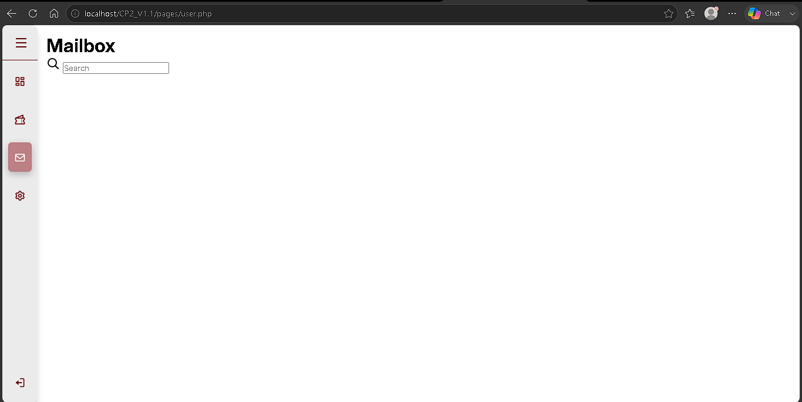

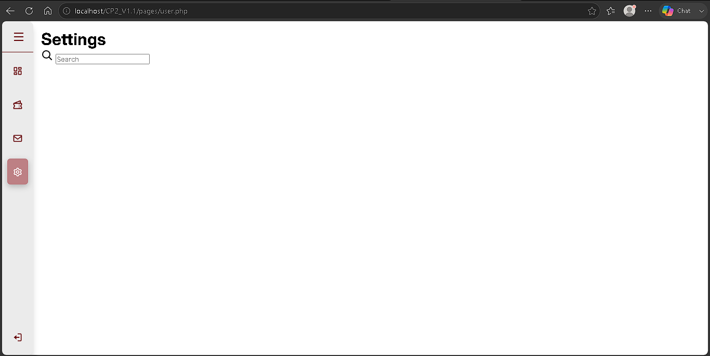

- **Cause:** Showcase CSS is `.showcase .head header` (class `head` on the wrapper, then a **`<header>`** element). Mailbox and Settings used **`<head>`** inside `.head`. `<head>` is the document-head tag, not the top bar. The `header` selector did not match, so search/profile rules did not apply. The browser may also move a nested `<head>` out of `.showcase`.
- **Exact causing snippet:**

```html
                <div class="head">
                    <head>
                        <h1>Mailbox</h1>
```

- **In plain language:** CSS styles a `<header>` inside the top bar. Mailbox used `<head>`, which is the tag for the document title area, so the search pill never applied.
- **Solution executed:** Same inner tag as Dashboard/Tickets:

```html
                <div class="head">
                    <header>
                        <h1>Mailbox</h1>
                        ...
                    </header>
                </div>
```

Same for Settings. Do not change `main_interface.css` for this.

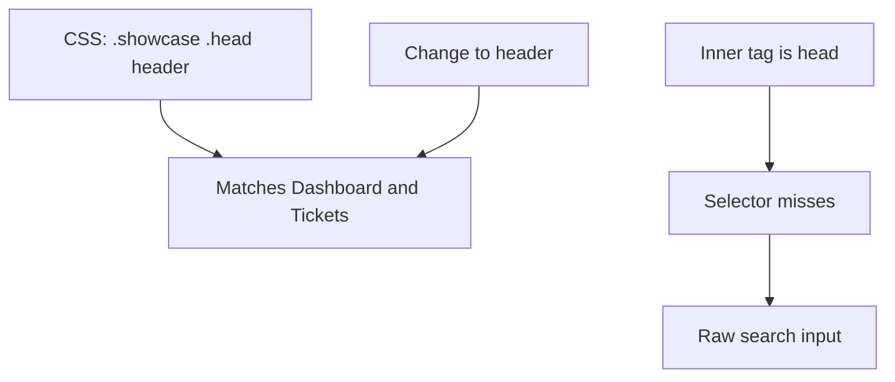
```mermaid
flowchart TD
  A["CSS: .showcase .head header"] --> B[Matches Dashboard and Tickets]
  C["Inner tag is head"] --> D[Selector misses]
  D --> E[Raw search input]
  F["Change to header"] --> B
```

### B-017 — New Ticket shows on Dashboard

- **When:** 13 August 2026 (A-017)
- **Status:** fixed
- **What I saw:** `user.php` with **Dashboard** selected and `h1` Dashboard. Maroon **New Ticket** still appears in the white area.

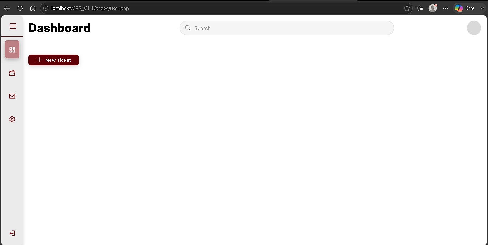

- **Cause:** `.page-content` is `display: none` except the matching `#page-…`. The toolbar was placed **after** `#page-tickets` closed, as a direct child of `.showcase`. It is not inside a `.page-content`, so it is never hidden.
- **Exact causing snippet** (`pages/user.php`):

```html
            </div>
            <div class="tickets-toolbar">
                <a href="../pages/ticket.php" class="btn-new-ticket">
```

The `</div>` above ends `#page-tickets`. The toolbar is the next sibling.
- **In plain language:** Hidden panels only hide what is inside them. New Ticket sat outside the Tickets panel, so it stayed visible on Dashboard too.
- **Queued fix:** Move `.tickets-toolbar` **inside** `#page-tickets`, after the Tickets `.head`, before that page-content `</div>`. Do not change CSS.
- **Solution executed:** Toolbar is a child of `#page-tickets` (after `.head`, before that `</div>`). Mailbox `#page-messages` follows.

```html
                </div>
                <div class="tickets-toolbar">
                    <a href="../pages/ticket.php" class="btn-new-ticket">
```

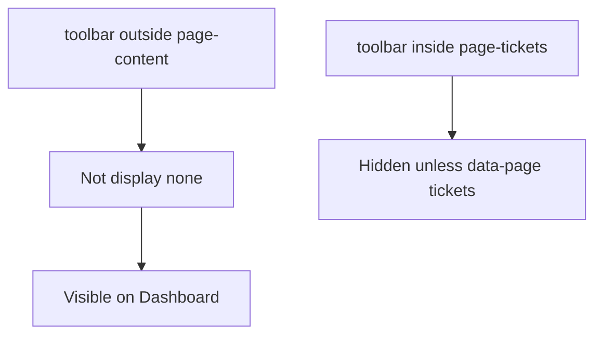
```mermaid
flowchart TD
  A["toolbar outside page-content"] --> B[Not display none]
  B --> C[Visible on Dashboard]
  D["toolbar inside page-tickets"] --> E[Hidden unless data-page tickets]
```

### B-018 — Submit Ticket: white page, not Apache 404

- **When:** 14 August 2026 (A-018)
- **Status:** fixed (A-019: `header` to `user.php`)
- **What I saw:** After submit, URL is `http://localhost/CP2_V1.1/logic/ticket_mngmnt.php`. The viewport is blank white. Not “Not Found”.

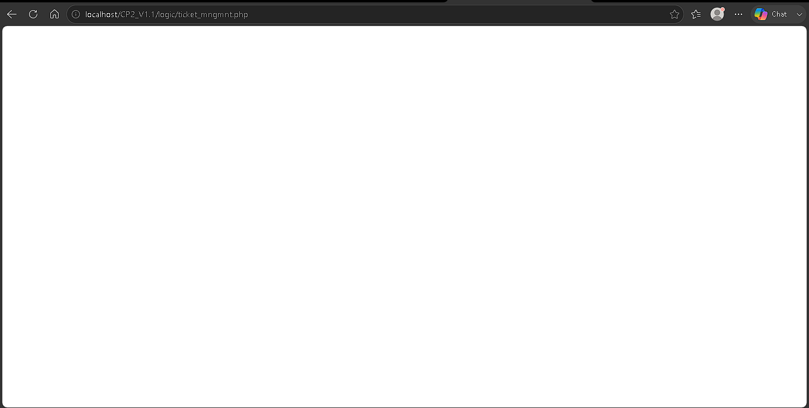

- **Cause:** Apache found the file. A missing URL would be 404. `logic/ticket_mngmnt.php` exists and is **empty**. PHP runs, prints nothing, so the browser shows a white page.
- **Causing snippet:** empty `logic/ticket_mngmnt.php` (no `header`, no HTML).
- **In plain language:** The address was correct, so this is not a 404. An empty PHP file has nothing to show, so the screen is white.
- **Queued:** Leave the file. Next lesson types PHP in it (then INSERT). Do not treat this as a CSS failure.
- **Solution executed:** `ticket_mngmnt.php` now runs `header('Location: ../pages/user.php')` on `submit-ticket` (A-019). White page gone. Still no INSERT.

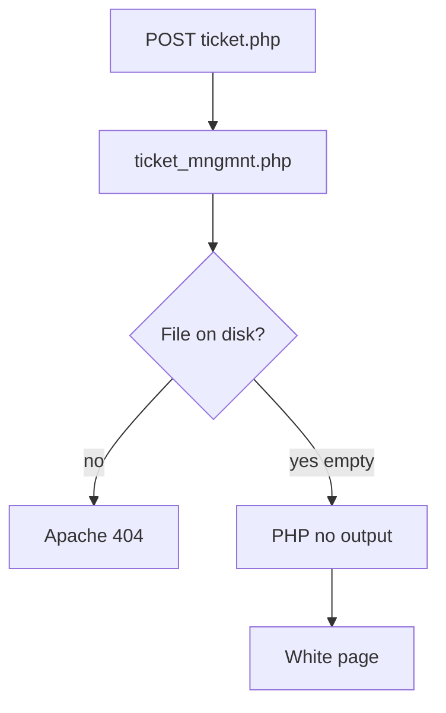
```mermaid
flowchart TD
  A[POST ticket.php] --> B[ticket_mngmnt.php]
  B --> C{File on disk?}
  C -->|no| D[Apache 404]
  C -->|yes empty| E[PHP no output]
  E --> F[White page]
```

### B-019 — #1064 saving table `tickets`

- **When:** 17 August 2026 (A-021)
- **Status:** fixed
- **What I saw:** phpMyAdmin create-table form for `tickets` in `users_db`. Save showed MariaDB:

```
#1064 - You have an error in your SQL syntax; check the manual that corresponds to your MariaDB server version for the right syntax to use near 'network', 'other') NOT NULL , `status` ENUM('pending') NOT NULL DEFAULT 'pend...' at line 1
```

No `tickets` table in the left list (only `users`).

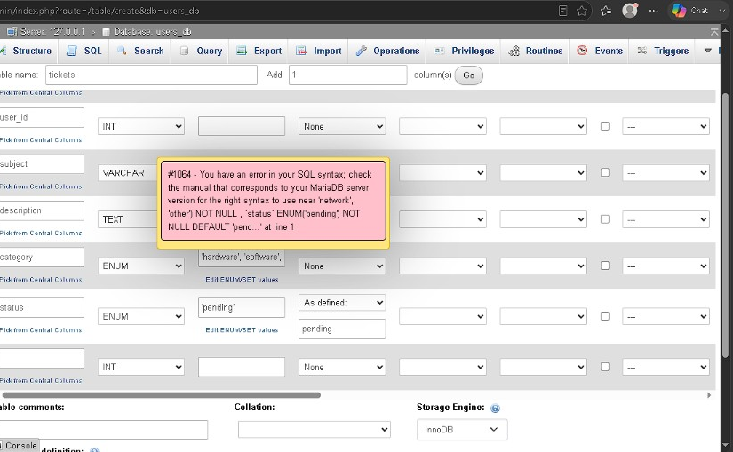

- **Cause:** phpMyAdmin builds `CREATE TABLE` from the designer. MariaDB rejected it at `'network', 'other')`. That token sits in the `category` ENUM. Usual cause: a missing or extra `'` in Length/Values for `category` (often around `account`), so the ENUM string is invalid before `'network'`. An unnamed extra `INT` row can also make invalid SQL after `status`.
- **Same Save attempt also had:** no `id` PRIMARY A_I; `subject` VARCHAR with blank length; leftover blank column row.
- **Causing snippet (designer Length/Values for `category`):** a broken ENUM string that MariaDB reported near `'network', 'other')`.
- **In plain language:** phpMyAdmin turns the grid into SQL. If the category list is missing a quote, MySQL rejects the whole Save and the table is not created.
- **Queued fix:** Dismiss the error. Keep table name `tickets`. Six named columns only. `category` Length/Values exactly `'hardware','software','account','network','other'` (straight quotes, every value quoted, commas between). Then Save again.
- **Solution executed:** Second Save. Table `tickets` exists. Structure matches A-021.

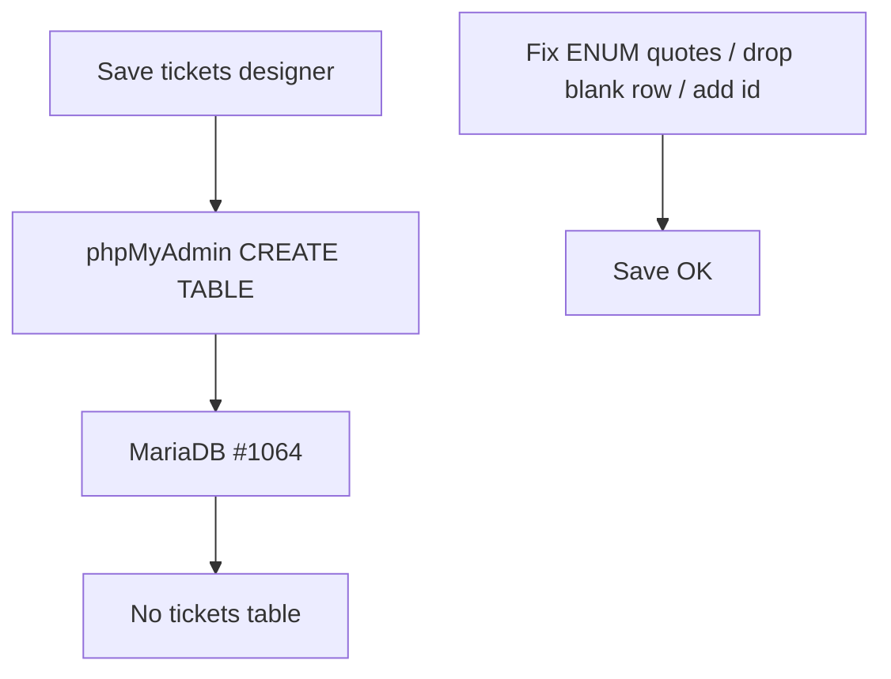
```mermaid
flowchart TD
  A[Save tickets designer] --> B[phpMyAdmin CREATE TABLE]
  B --> C[MariaDB #1064]
  C --> D[No tickets table]
  E[Fix ENUM quotes / drop blank row / add id] --> F[Save OK]
```

### B-020 — Submit Ticket opens LOGIN; no `tickets` row

- **When:** 18 August 2026 (A-022)
- **Status:** fixed
- **What I saw:** `http://localhost/CP2_V1.1.2/pages/ticket.php` with Hardware / subject / description. Submit Ticket. URL became `login_signup.php` (LOGIN form). `tickets` Browse unchanged (empty).

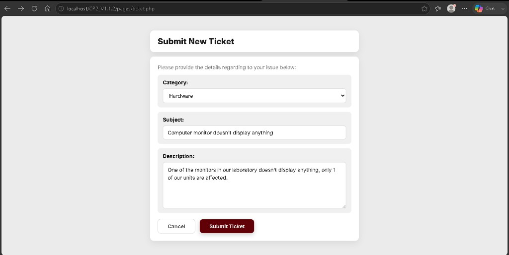

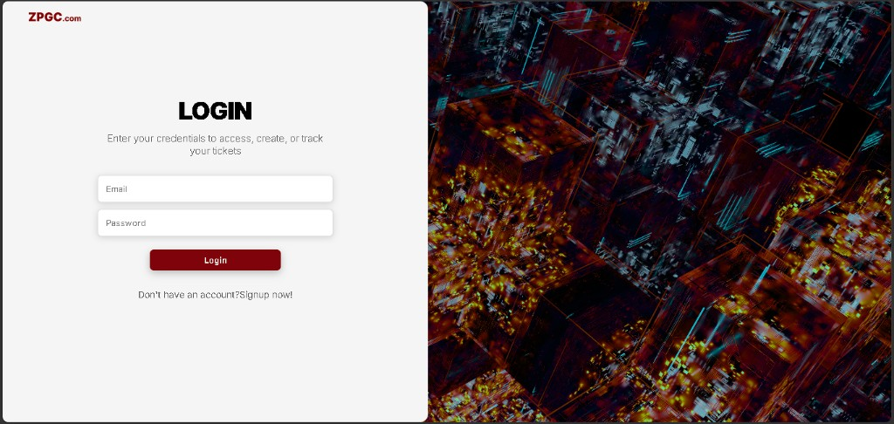

- **Cause:** Guard uses `$_POST['email']`. `ticket.php` has no `name="email"` field, so that key is never in POST. The `header` to `login_signup.php` runs every submit. `INSERT` never runs. Login stores email on `$_SESSION['email']`, not POST.
- **Exact causing snippet** (`logic/ticket_mngmnt.php`):

```php
    if (!isset($_POST['email'])) {
        header('Location: ../pages/login_signup.php');
        exit();
    }
    $email = $_SESSION['email'];
```

- **In plain language:** The ticket form never sends an email box. The code asked POST for email anyway, so the check always failed and sent you to LOGIN. The INSERT never ran. Email after login lives in the session.

- **Queued fix:** Same `if`, but `isset($_SESSION['email'])`. Do not add an email input on `ticket.php`. Then log in as an **active** user before submitting again.
- **Solution executed:** Guard is `isset($_SESSION['email'])`. After B-021, Submit Ticket → dashboard and a `tickets` row.

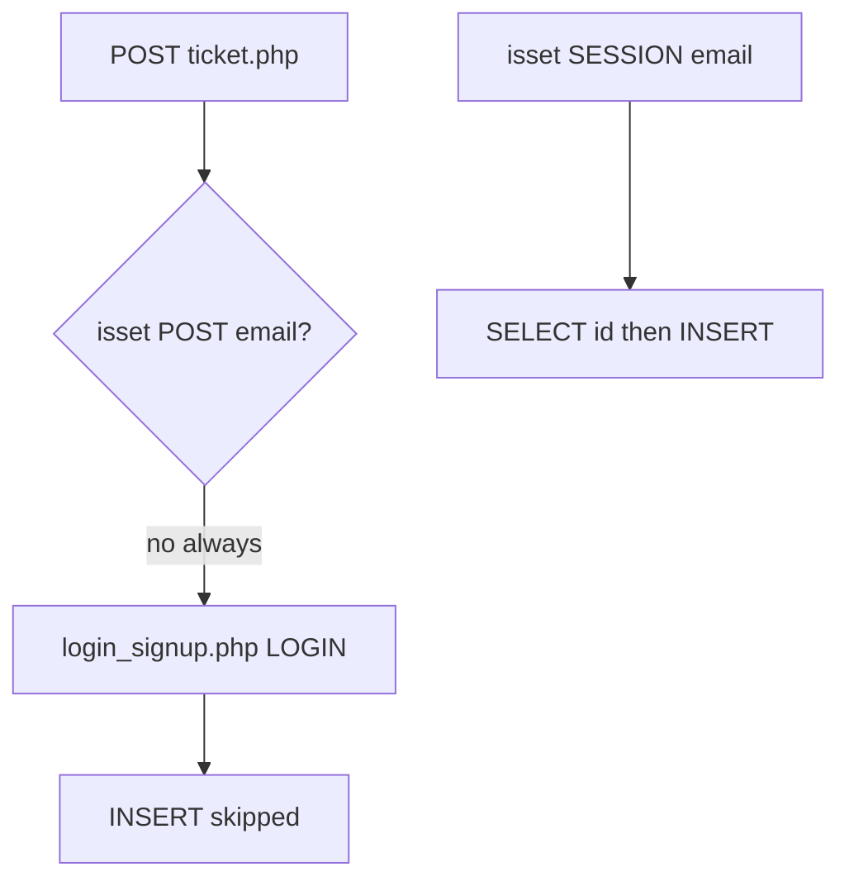
```mermaid
flowchart TD
  A[POST ticket.php] --> B{isset POST email?}
  B -->|no always| C[login_signup.php LOGIN]
  C --> D[INSERT skipped]
  E[isset SESSION email] --> F[SELECT id then INSERT]
```

### B-021 — Login `user1@gmail.com`: account not activated

- **When:** 18 August 2026 (A-023)
- **Status:** fixed (A-023 phpMyAdmin test row; ongoing approval via A-028 Activate)
- **What I saw:** `http://localhost/CP2_V1.1.2/pages/login_signup.php`. Email `user1@gmail.com`. After Login, gray text **Account is not activated yet.** Could not reach the dashboard to test tickets.

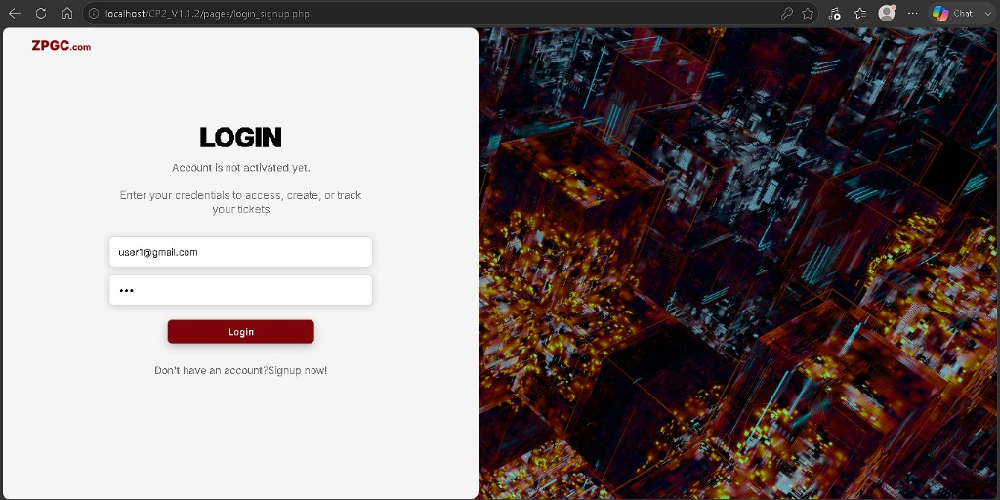

- **Cause:** Signup INSERT sets `users.status` to `inactive` (A-008). `user_mngmnt.php` refuses login unless `status === 'active'`. At the time of this test there was no **Activate** on Utilities yet (**A-028**).
- **Exact causing snippet** (`logic/user_mngmnt.php`):

```php
        if ($user['status'] !== 'active') {
            $_SESSION['login_error'] = 'Account is not activated yet.';
            header('Location: ../pages/login_signup.php');
            exit();
        }
```

- **In plain language:** This is not a crash. Signup stores accounts as inactive on purpose. Login shows that message until status is active. For the first ticket test, phpMyAdmin flipped one row (A-023). After A-028, admins use **Activate** on Utilities instead.
- **Queued fix (test only, A-023):** phpMyAdmin → `users_db` → `users` → Browse → that row → Change `status` from `inactive` to `active`. Save. Login again. Do **not** remove this check in PHP.
- **Solution executed:** `user1@gmail.com` set to `active` in phpMyAdmin for A-023. Login reached dashboard; ticket INSERT confirmed (A-022). `user_mngmnt.php` still requires `active`. **A-028** adds Utilities **Activate** so new pending signups no longer need phpMyAdmin.

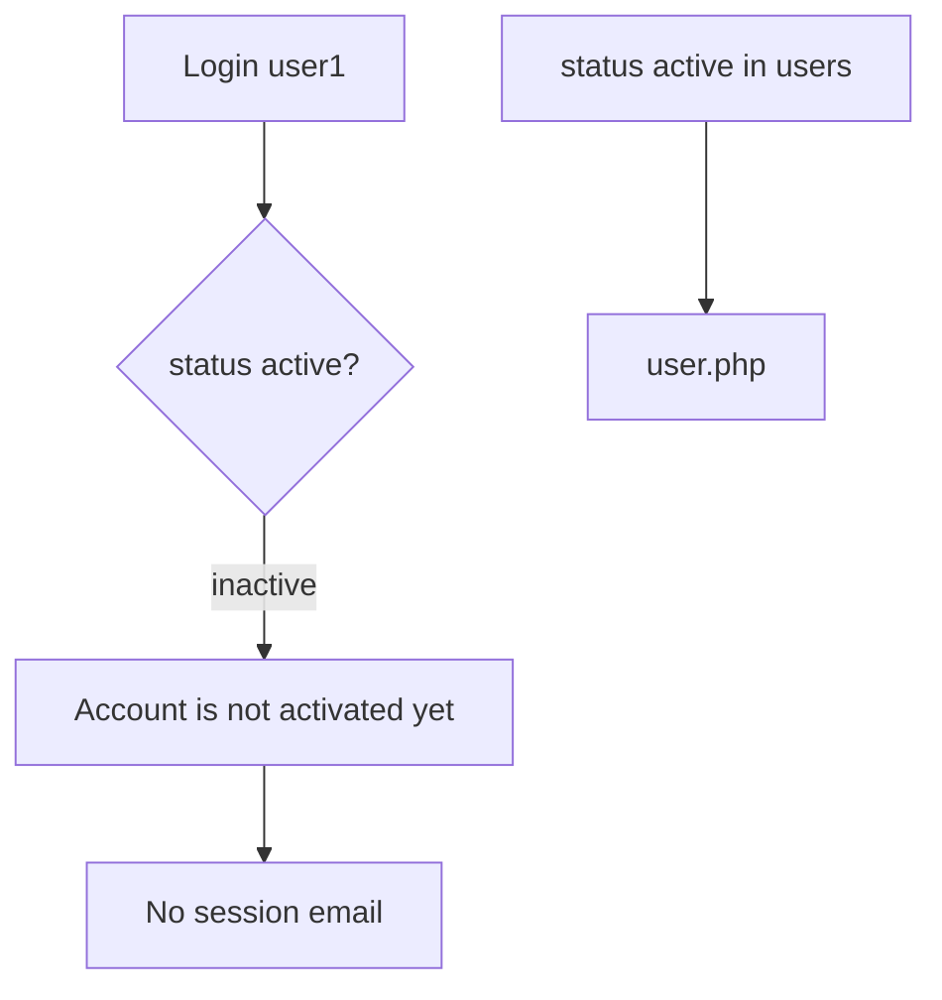
```mermaid
flowchart TD
  A[Login user1] --> B{status active?}
  B -->|inactive| C[Account is not activated yet]
  C --> D[No session email]
  E[status active in users] --> F[user.php]
```

### B-022 — Admin `h1` stays Dashboard

- **When:** 20 August 2026 (A-024)
- **Status:** fixed
- **What I saw:** Captures labeled `localhost/CP2_v1.1/pages/admin.php`. Utilities / Analytics / Mailbox / Settings highlighted. `h1` still **Dashboard**.

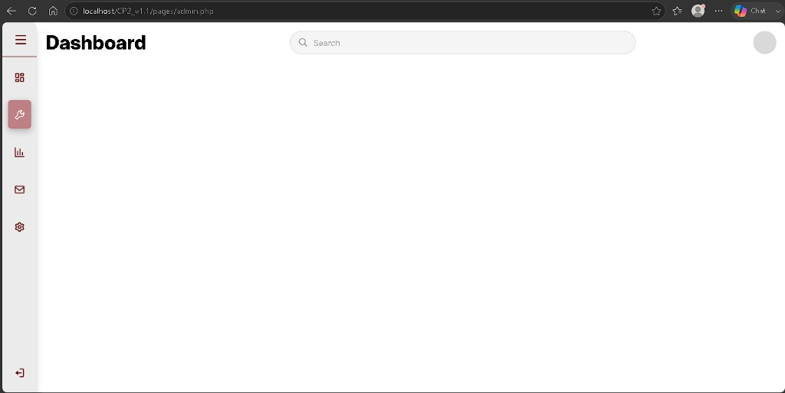

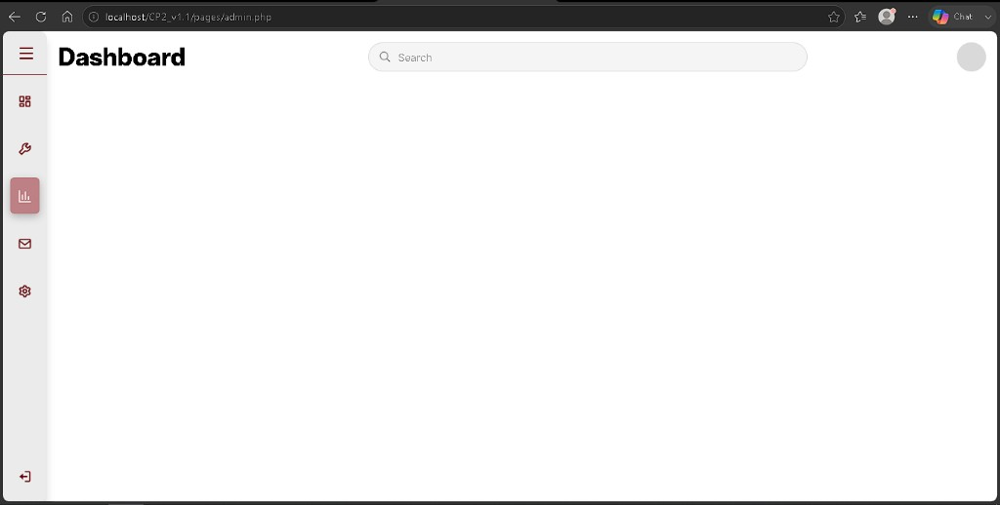

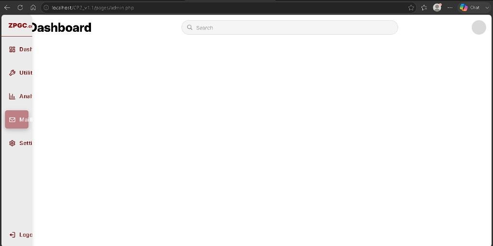

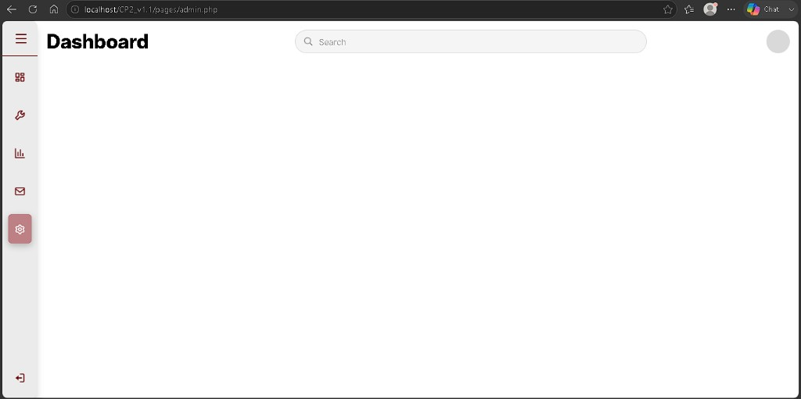

- **Cause (two parts):** (1) That URL is the **v1.1** folder (`CP2_v1.1` / `CP2_V1.1`), not `CP2_V1.1.2`. v1.1 `admin.php` has no `.page-content` panels. (2) In this folder, Dashboard `h1` is not inside `.page-content`. `id="page-dashboard"` was put on `<section class="showcase">`. CSS only hides `.page-content`. The Dashboard bar never hides.
- **Causing snippet** (`pages/admin.php` in this folder):

```html
        <section class="showcase" id="page-dashboard">
            <div class="head">
                <header>
                    <h1>Dashboard</h1>
```

- **In plain language:** The word Dashboard sits on the outer box, not in a hideable panel. Other titles can exist underneath, but you still see Dashboard. Also, testing `/CP2_v1.1/` opens the old folder from A-020.
- **Queued fix:** Use `http://localhost/CP2_V1.1.2/pages/admin.php`. Change the section to `<section class="showcase">` (no id). Wrap the Dashboard `.head` in `<div class="page-content" id="page-dashboard">` like `user.php`. Do not nest other `#page-*` inside `#page-dashboard`. Do not put `.showcase` inside `.sidebar-spacer`.
- **Solution executed:** Sibling `.page-content` blocks; empty `<div class="sidebar-spacer"></div>` then `<section class="showcase">`. Click Utilities → `h1` Utilities (same for Analytics, Mailbox, Settings).

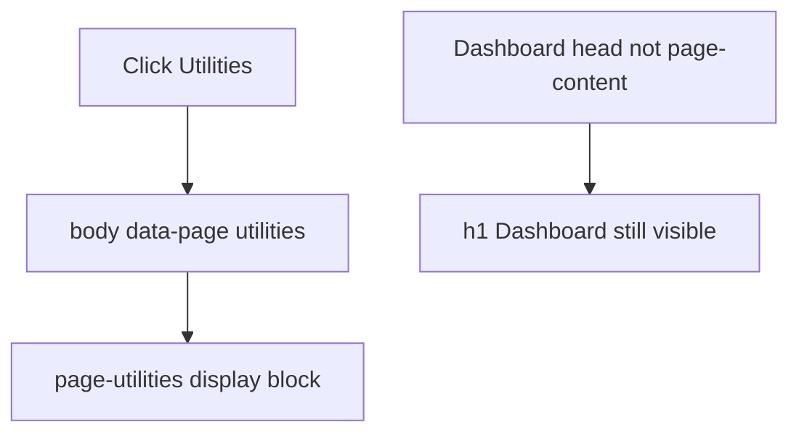
```mermaid
flowchart TD
  A[Click Utilities] --> B[body data-page utilities]
  B --> C[page-utilities display block]
  D[Dashboard head not page-content] --> E[h1 Dashboard still visible]
```

### B-023 — Login error looks like gray helper text

- **When:** 22 August 2026 (A-026; seen earlier on A-009 / B-021)
- **Status:** fixed
- **What I saw:** `http://localhost/CP2_V1.1.2/pages/login_signup.php`. After a failed login (wrong password or inactive account), the message under **LOGIN** was small gray text — same look as “Don’t have an account?” — not an obvious error banner like the reference system.


- **Cause:** The error was printed as a plain `<p>`. `login_signup.css` styles every `p` as muted gray (`#787777`, 14px). There was no `.form-error` class or alert box. The closing tag was also wrong (`<p>` instead of `</p>`).
- **Causing snippet** (`pages/login_signup.php`):

```php
<?php if ($login_error !== '') {echo '<p>' . htmlspecialchars($login_error) . '<p>'; } ?>
```

```css
p {
    color: #787777;
    font-size: 14px;
}
```

- **In plain language:** The page did show the right words, but they looked like normal hint text under the form, not a warning. Gray paragraph styling and a bare `<p>` tag hid the fact that login failed.
- **Queued fix:** Add `.form-error` in `login_signup.css`, `showError()` in `login_signup.php`, and `<?php echo showError($login_error); ?>` under **LOGIN**. Do not change `user_mngmnt.php` login rules (A-009).
- **Solution executed:** A-026 — pink `.form-error` banner; `showError()` wraps the message in a styled `<div>`.

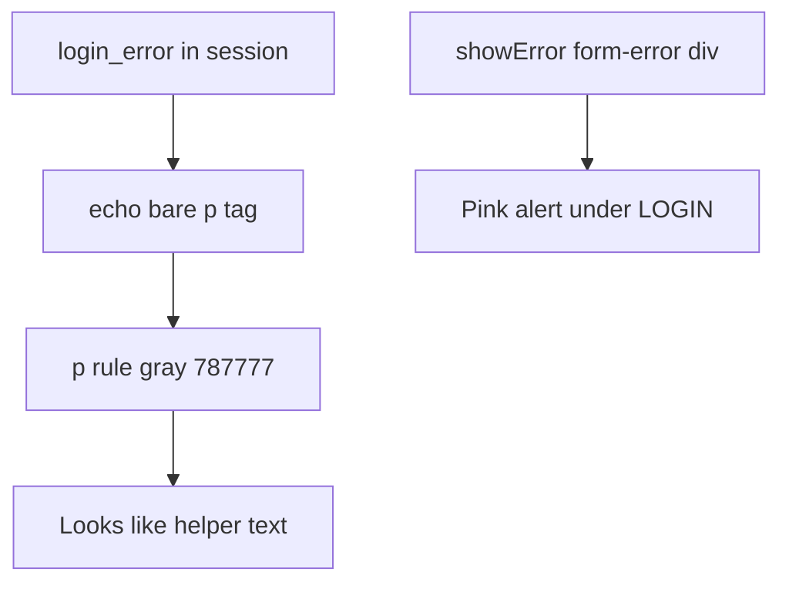
```mermaid
flowchart TD
  A[login_error in session] --> B[echo bare p tag]
  B --> C[p rule gray 787777]
  C --> D[Looks like helper text]
  E[showError form-error div] --> F[Pink alert under LOGIN]
```

### B-024 — Utilities user list: plain table, misaligned columns

- **When:** 23 August 2026 (A-025; fixed A-027)
- **Status:** fixed
- **What I saw:** `http://localhost/CP2_V1.1.2/pages/admin.php` → **Utilities**. User rows appeared, but as a raw HTML `<table>`: no white card, no column alignment, role and status as plain words (`user`, `active`) — unlike the reference admin Utilities screen.


- **Cause:** A-025 correctly loaded `users_db` rows but used a default browser `<table>` with no `main_interface.css` list classes. The project’s styled Utilities list uses `.tickets-list`, `.ticket-row`, and `.ucol-*` (same pattern as tickets in the reference build).
- **Causing snippet** (`pages/admin.php`, A-025):

```html
                <table>
                    <tr>
                        <th>ID</th>
                        <th>First name</th>
                        <th>Last name</th>
                        ...
                    </tr>
                    <?php while ($row = $users->fetch_assoc()) { ?>
                    <tr>
                        <td><?php echo htmlspecialchars($row['id']); ?></td>
                        ...
                    </tr>
                    <?php } ?>
                </table>
```

- **In plain language:** The data was correct, but the page skipped the layout CSS the rest of the admin dashboard uses. Headers and cells did not line up, and there were no colored role or status pills.
- **Queued fix:** Keep the same `SELECT` and data; replace the `<table>` with `.tickets-list` / `.ticket-row` markup and badge spans (A-027). Still no Activate button yet.
- **Solution executed:** A-027 — card table, `$all_users[]` + `foreach`, `.profile-role-badge` and `.status-badge` for role and Active/Pending.

```mermaid
flowchart TD
  A[SELECT users] --> B[plain table tr td]
  B --> C[Browser default layout]
  C --> D[Misaligned vs reference]
  E[tickets-list ticket-row ucol] --> F[Card table matches reference]
```

### B-025 — No Activate on Utilities; admin could not approve in the app

- **When:** 24 August 2026 (A-028; queued since B-021 / A-025)
- **Status:** fixed
- **What I saw:** `http://localhost/CP2_V1.1.2/pages/admin.php` → **Utilities** showed **Active** and **Pending** rows, but **Actions** was empty on Pending accounts. New signups stayed blocked at LOGIN (**Account is not activated yet.**). The only approval path was phpMyAdmin (B-021 test workaround), not the admin screen.
- **Cause:** A-025–A-027 listed users and styled the card table but never POSTed an approval action. There was no `user_admin_mngmnt.php`, and `.ucol-action` was an empty span.
- **Causing snippet** (`pages/admin.php`, before A-028):

```html
                            <span class="ucol-action"></span>
```

(No handler file on disk for `set_status`.)

- **In plain language:** The admin could see who was waiting, but could not approve anyone from the site. Every new signup needed a manual database edit until **Activate** existed.
- **Queued fix:** Add `logic/user_admin_mngmnt.php` with `UPDATE users SET status = 'active' WHERE id = ?`. In each Pending row, POST form with hidden `id`, `status=active`, and button `name="set_status"`. Keep the inactive login check in `user_mngmnt.php`.
- **Solution executed:** A-028 — **Activate** on Pending rows; login succeeds after admin clicks it. Two-account test: one Active (no button), one Pending (Activate → Active → user logs in without the activation error).

```mermaid
flowchart TD
  A[Pending row Utilities] --> B[Empty ucol-action]
  B --> C[No UPDATE in PHP]
  C --> D[Login blocked inactive]
  E[Activate POST] --> F[user_admin_mngmnt UPDATE active]
  F --> G[Login reaches dashboard]
```

### B-026 — `user.php` parse error: missing semicolon on `header()`

- **When:** 25 August 2026 (A-029)
- **Status:** fixed
- **What I saw:** `http://localhost/CP2_V1.1.2/pages/user.php` — PHP **syntax error, unexpected token "exit"**. Page would not load after adding the session guard and ticket query block at the top of `user.php`.

No screenshot stored for this entry.

- **Cause:** The `header('Location: login_signup.php')` line on the not-logged-in guard had no trailing semicolon. PHP treated the next line as part of the same statement and failed on `exit();` — same class of mistake as B-010 (`session_start()`).
- **Causing snippet** (`pages/user.php`):

```php
if (!isset($_SESSION['email'])) {
    header('Location: login_signup.php')
    exit();
}
```

- **In plain language:** Every PHP statement must end with a semicolon. Without one after `header(...)`, the file is invalid PHP, so Apache shows a parse error instead of the dashboard.
- **Queued fix:** Add `;` after the `header(...)` line.
- **Solution executed:**

```php
if (!isset($_SESSION['email'])) {
    header('Location: login_signup.php');
    exit();
}
```

```mermaid
flowchart TD
  A[header line no semicolon] --> B[unexpected token exit]
  B --> C[user.php parse error]
  D[header with semicolon] --> E[Page loads or redirects to login]
```

### B-027 — User Tickets: table on every tab; huge gap on Tickets

- **When:** 25 August 2026 (A-029)
- **Status:** fixed
- **What I saw:** `http://localhost/CP2_V1.1.2/pages/user.php` after A-029 (list worked, markup wrong).
  - **Tickets** tab: correct row data, but white card far below **New Ticket** (large gap vs reference).
  - **Dashboard**, **Mailbox**, and **Settings**: ticket table (headers + #1 row) still visible above each tab's own `h1` — table appeared on **every** tab.


- **Cause:** `.tickets-list` was a **sibling** of `#page-tickets`, not inside it. `#page-tickets` closed after `.tickets-toolbar`. CSS only hides `.page-content` blocks per tab — the orphan `.tickets-list` stayed visible everywhere. Same class of mistake as B-017 (control outside its panel).
- **Causing snippet** (`pages/user.php`):

```html
                <div class="tickets-toolbar">
                    ...
                </div>
            </div>
            <div class="tickets-list">
```

The first `</div>` ends `#page-tickets`. `.tickets-list` follows as the next sibling in `.showcase`.

- **In plain language:** The table lived outside the Tickets panel, so the site could not hide it when you switched tabs. On Tickets, flex layout could not attach the card to the toolbar, so a big empty gap appeared.
- **Queued fix:** Move the entire `.tickets-list` block inside `#page-tickets`, after `.tickets-toolbar`, before that panel's closing `</div>`. No CSS changes.
- **Solution executed:** Reparented `.tickets-list` inside `#page-tickets`. Retest: table only on **Tickets**; card sits directly under **New Ticket**; Dashboard / Mailbox / Settings clean.

```html
                <div class="tickets-toolbar">...</div>
                <div class="tickets-list">...</div>
            </div>
```

```mermaid
flowchart TD
  A[tickets-list outside page-tickets] --> B[Visible on every tab]
  A --> C[Flex gap on Tickets]
  D[tickets-list inside page-tickets] --> E[Hidden unless Tickets tab]
  E --> F[Card under New Ticket]
```

### B-028 — Admin Tickets: columns compressed (wrong class names)

- **When:** 10 September 2026 (A-031)
- **Status:** fixed
- **What I saw:** `http://localhost/CP2_V1.1.2/pages/admin.php` → **Tickets** tab. Data loaded (#4, #1, subjects, descriptions, **Pending** badges) but ID / Subject / Description / Status ran together in one tight line — not the spaced card columns on `user.php`.

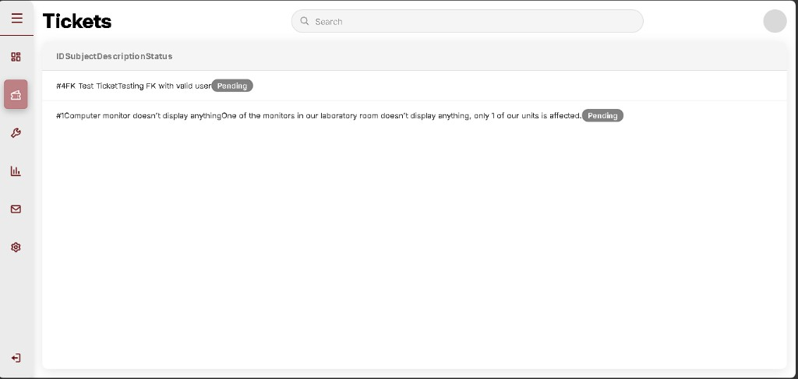

- **Cause:** `main_interface.css` grid rules target **`.tickets-col-*`** (with an **s**). A-031 markup used **`.ticket-col-*`** (no **s**). CSS never applied column widths, so spans stacked with no grid.
- **Causing snippet** (`pages/admin.php`):

```html
<span class="ticket-col-id">ID</span>
<span class="ticket-col-subject">Subject</span>
```

(`user.php` uses `tickets-col-id`, `tickets-col-subject`, etc.)

- **In plain language:** The HTML class names did not match the CSS file. The browser had no rules for `ticket-col-id`, so columns did not get their widths. Same data, wrong labels on the classes — like calling a CSS hook by the wrong name.
- **Queued fix:** In `#page-tickets` only, rename every `ticket-col-` → `tickets-col-` (header + each row). No CSS changes.

```html
<span class="tickets-col-id">ID</span>
<span class="tickets-col-subject">Subject</span>
<span class="tickets-col-description">Description</span>
<span class="tickets-col-status">Status</span>
```

(Rename the same four classes on each `.ticket-row` span.)

- **Solution executed:** Find/replace `ticket-col-` → `tickets-col-` in `#page-tickets` header and rows. Retest: columns align like `user.php` (#4 FK test ticket, #1 monitor ticket, **Pending** badges).


### B-029 — Admin Tickets: Status + Assigned To compressed (5 columns, flex only)

- **When:** 10 September 2026 (A-033 Part 2)
- **Status:** fixed
- **What I saw:** `admin.php` → **Tickets** tab. Five columns present (ID, Subject, Description, Status, **Assigned To**). Dropdown works (**Unassigned** + technician name), but **Status** and **Assigned To** headers overlap on the right; badges and dropdowns are squeezed into a narrow strip.

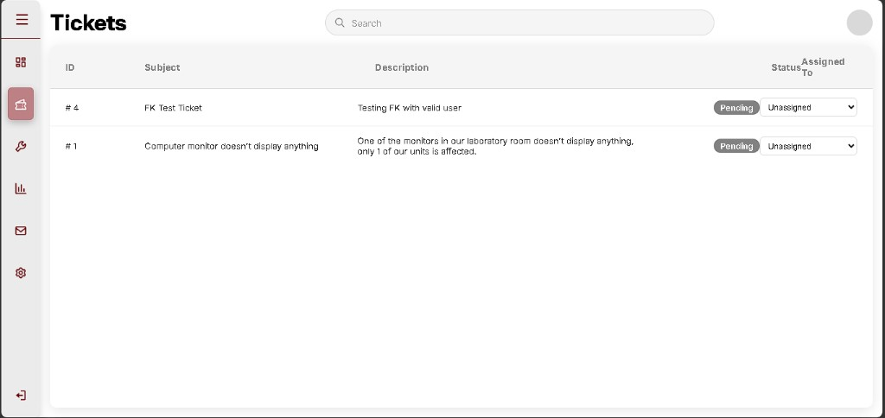

- **Cause:** `main_interface.css` column widths (`.tickets-col-*` **flex** rules) were written for **four** columns. Adding a fifth (`.tickets-col-assigned`) without a **grid** layout leaves Subject/Description taking most of the row; the last two columns fight for leftover space.
- **Causing snippet** (`css/main_interface.css` — flex-only, no 5-column grid):

```css
.tickets-col-id          { flex: 0 0 10%; }
.tickets-col-subject     { flex: 1 1 30%; }
.tickets-col-description { flex: 1 1 30%; }
.tickets-col-status      { flex: 0 0 12%; }
.tickets-col-assigned    { flex: 0 0 18%; }
```

(`pages/admin.php` uses `<div class="tickets-list">` with no admin 5-column grid hook.)

- **In plain language:** Flex percentages alone do not reserve enough fixed space for Status and Assigned To when Description text is long. The last columns get crushed and header labels stack on top of each other.
- **Queued fix (attempt 1):** Add class **`tickets-list-admin-five`** on the admin `.tickets-list` div. In CSS, use **`display: grid`** with **five explicit tracks** for that class only (does not change `user.php` four-column list). Retest: Status and Assigned To each have their own column; long descriptions truncate with ellipsis.

**Retest (same day) — worse layout:** After adding `tickets-list-admin-five` + grid CSS, headers **ID / Subject / Description** stack vertically on the left; **Status / Assigned To** stack on the right; dropdown missing on rows.

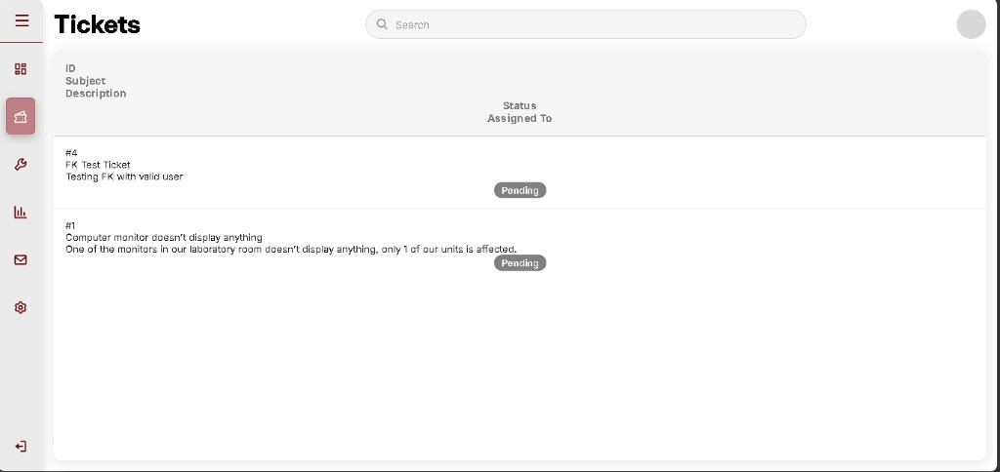

- **Cause (two bugs):**
  1. **Invalid `grid-template-columns`** — `minmax(140, 1fr)` is missing **`px`** on `140`. Browser drops the whole column rule; `display: grid` stays but flows as **one column**, so every header stacks vertically.
  2. **Row has 4 cells, header has 5** — Part 2 dropdown `<span class="tickets-col-assigned">` was never saved inside the `foreach` loop. Grid cannot align rows to headers.

- **Causing snippet 1** (`css/main_interface.css`):

```css
minmax(140, 1fr);   /* invalid — needs 140px */
```

- **Causing snippet 2** (`pages/admin.php` — row ends after Status, no Assigned To cell):

```html
<span class="tickets-col-status">...</span>
</div>   <!-- ticket-row closes — missing tickets-col-assigned -->
```

- **In plain language:** The grid recipe had a typo, so the browser ignored the column widths and stacked everything in one vertical line. Even with a fixed grid, each data row must have the same five cells as the header — including the assign dropdown.
- **Solution executed (attempt 2):** `minmax(140px, 1fr)` in `main_interface.css`; **`tickets-list-admin-five`** on admin `.tickets-list`; **Assigned To** `<select>` inside each `.ticket-row` (5 cells match 5 headers).

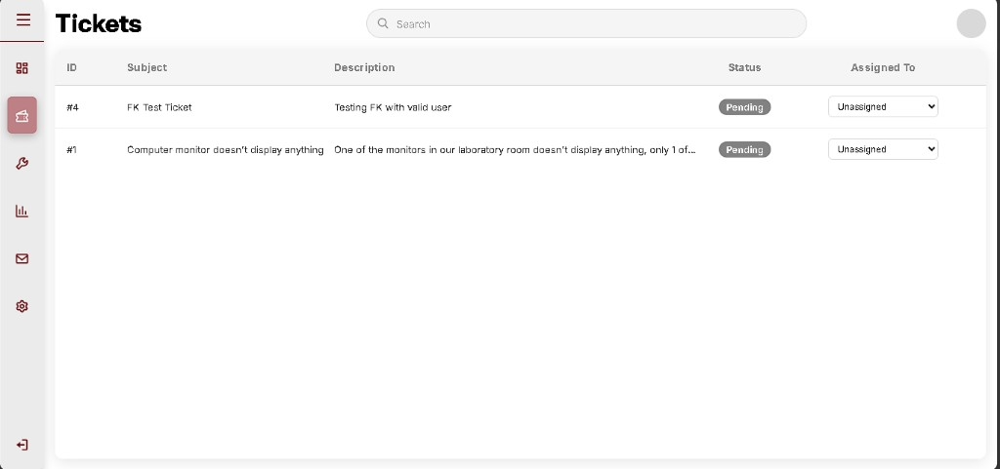

- **Fix snippet** (`css/main_interface.css`):

```css
.tickets-list-admin-five .tickets-list-header,
.tickets-list-admin-five .ticket-row {
    display: grid;
    grid-template-columns:
        72px
        minmax(0, 1.1fr)
        minmax(0, 2fr)
        110px
        minmax(140px, 1fr);
    column-gap: 10px;
    align-items: center;
}
```

- **In plain language:** Grid gives each column a fixed “slot” on the row. Status and Assigned To no longer share one crushed strip; long descriptions ellipsize instead of pushing the right columns off-screen. Retest: #4 and #1 show **Pending** + **Unassigned** dropdown in separate columns.

### B-030 — Admin Tickets: Save clipped / assign did not persist

- **When:** 16–19 September 2026 (A-033 Part 3)
- **Status:** fixed
- **What I saw:** Dropdown worked; no visible **Save**; refresh returned to Unassigned.
- **Cause:** Assigned To track `minmax(140px, 1fr)` + `flex-wrap: nowrap` hid the Save button. Dropdown change does not POST.
- **Causing snippet:** `minmax(140px, 1fr)` and a `<select>` with no form in Part 2.
- **In plain language:** The save control existed in code but sat off the edge of the column. Changing the list without submitting never updated MySQL.
- **Solution executed:** Row is a POST form; column `minmax(240px, 1fr)`; `overflow: visible`.

### B-031 — Technician Tickets: columns compressed (wrong class names)

- **When:** 19 September 2026 (A-034)
- **Status:** fixed
- **What I saw:** `techn.php` → **Tickets**. Headers ran as **IDSubjectDescriptionStatus**. Rows #4 and #1 packed into one line with **Pending** badges. Same class of failure as B-028.

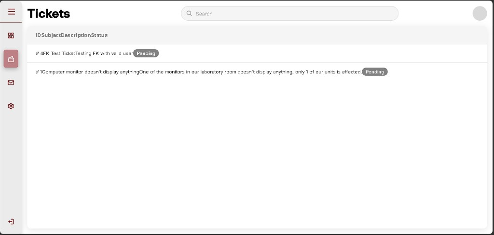

- **Cause:** CSS targets `.tickets-col-*`. Techn markup used `.ticket-col-*` (no **s**).
- **Causing snippet** (`pages/techn.php`):

```html
<span class="ticket-col-id">ID</span>
<span class="ticket-col-subject">Subject</span>
```

- **In plain language:** The class names do not match the stylesheet, so the browser never applies column widths.
- **Solution executed:** Find/replace `ticket-col-` → `tickets-col-` on the techn Tickets header and rows.

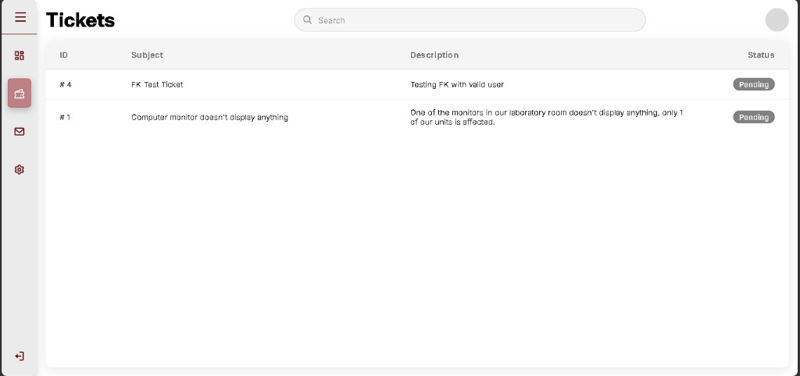

- **Retest (19 Sep 2026):** ID / Subject / Description / Status spaced. Rows #4 **FK Test Ticket** and #1 **Computer monitor…** with **Pending** badges. **B-031 closed.**

### B-032 — Mailbox poll never runs (`data-page` typo)

- **When:** 19 September 2026 (A-035)
- **Status:** fixed (poll typo). Send unblocked after **B-033**.
- **What I saw:** Messages tab — thread **FK Test Ticket** highlighted, header title set, composer has **Hello**, chat pane still **No conversation selected**. Live poll never filled the thread.

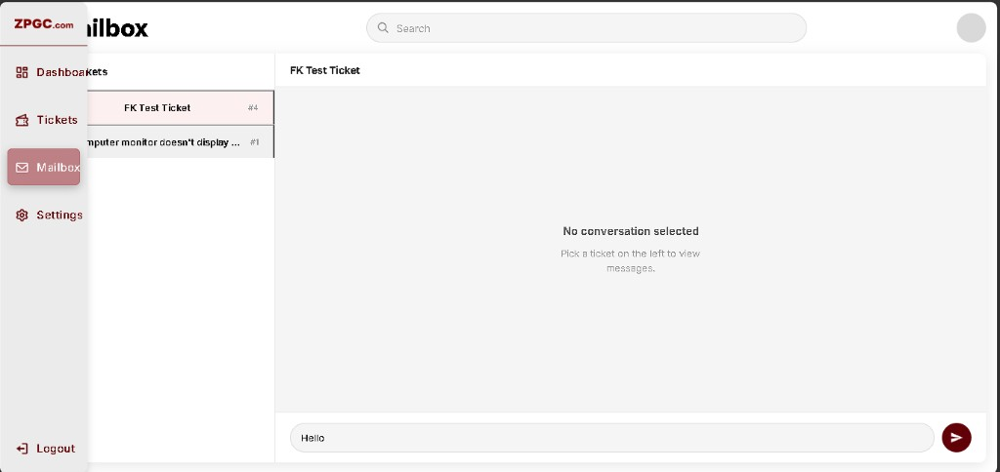

- **Cause:** Poll starts only if `data-page === "message"`. The app sets `data-page="messages"` (with **s**). Fetch on click also returned nothing because `messages` did not exist yet (B-033).
- **Causing snippet** (`js/behavior.js`):

```javascript
if (document.body.getAttribute("data-page") !== "message") {
    return;
}
```

- **In plain language:** The live updater looks for a tab name that does not exist, so it never ticks. Clicking a ticket can set the title without loading bubbles.
- **Solution executed:** `"message"` → `"messages"` in `startMailboxPoll()`.

### B-033 — Send message fatals: `users_db.messages` does not exist

- **When:** 19 September 2026 (A-035)
- **Status:** fixed
- **What I saw:** Typed **Hello** and sent. White page: **Table 'users_db.messages' doesn't exist** in `message_mngmnt.php` line 37 (`prepare()` INSERT). Same page on a second send after B-031 retest.

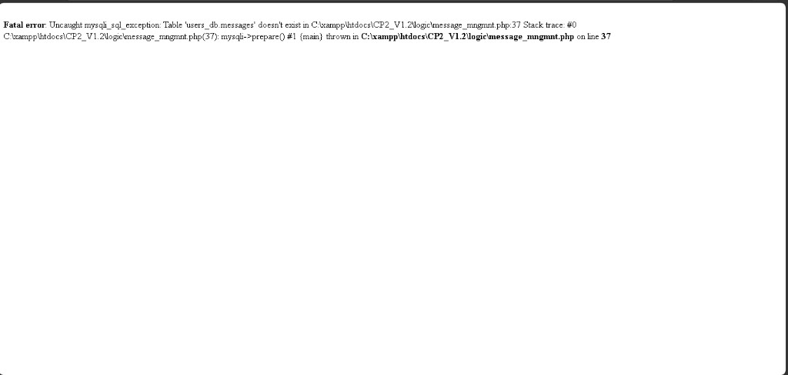

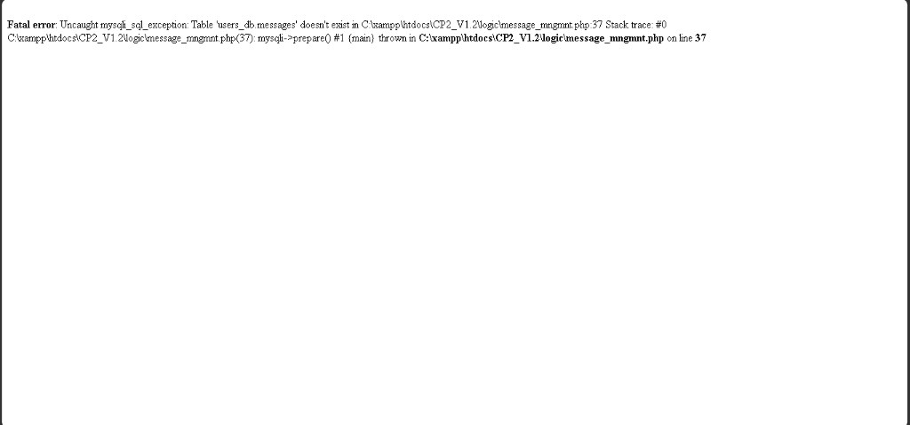

- **Cause:** Mailbox PHP was wired before the table existed. `INSERT INTO messages` has nowhere to go.
- **Causing snippet** (`logic/message_mngmnt.php`):

```php
$stmt = $conn->prepare(
    'INSERT INTO messages (ticket_id, sender_id, body) VALUES (?, ?, ?)'
);
```

- **In plain language:** The chat form posts to PHP, but MySQL has no `messages` drawer yet, so PHP crashes instead of saving **Hello**.
- **Solution executed:** phpMyAdmin → `users_db` → **SQL** → `CREATE TABLE messages` (FKs to `tickets.id` and `users.id`). Go returned an empty result (normal for CREATE). Left tree showed **messages**. Browse: columns `id`, `ticket_id`, `sender_id`, `body`, `created_at`, zero rows.

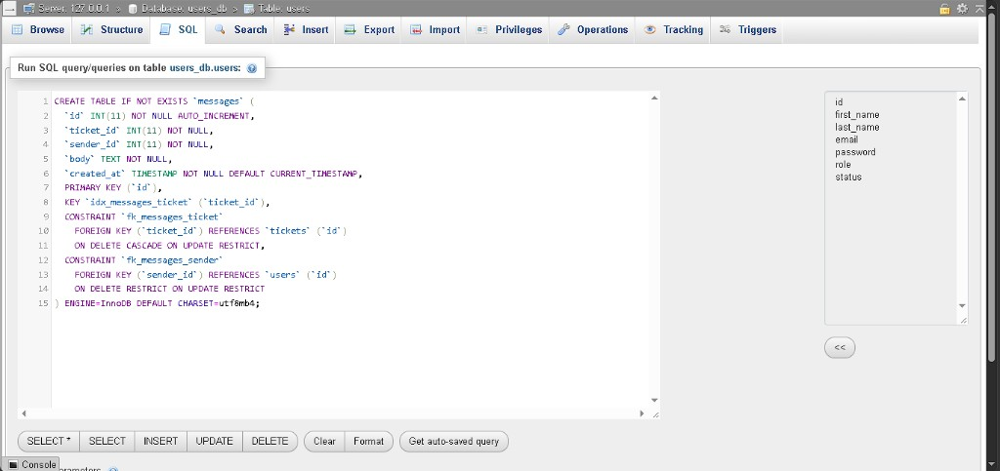

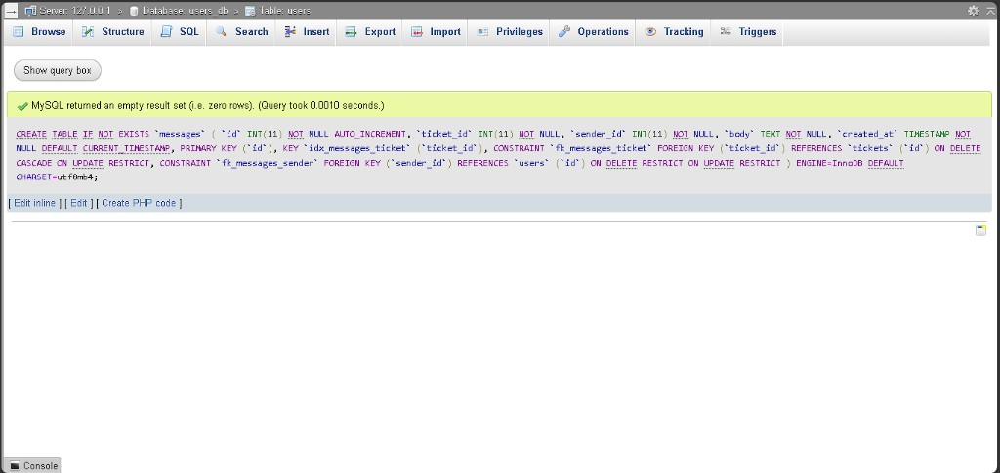

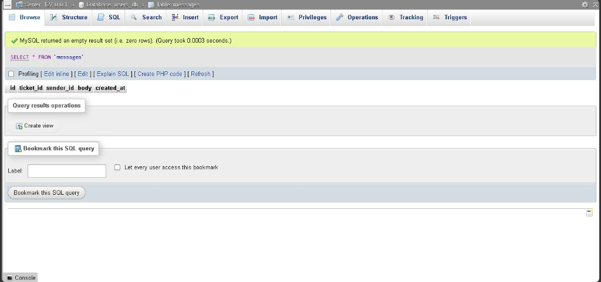

- **Retest send:** Mailbox → **FK Test Ticket** → **Hello**. No fatal. Maroon bubble on the right.

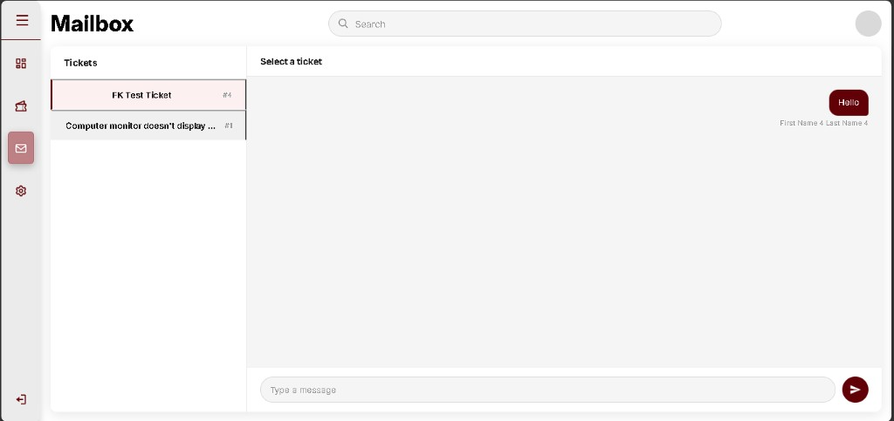

- **Two-role thread:** Other account sees **Hello** (white, left) and replies **Ho** (maroon, right).

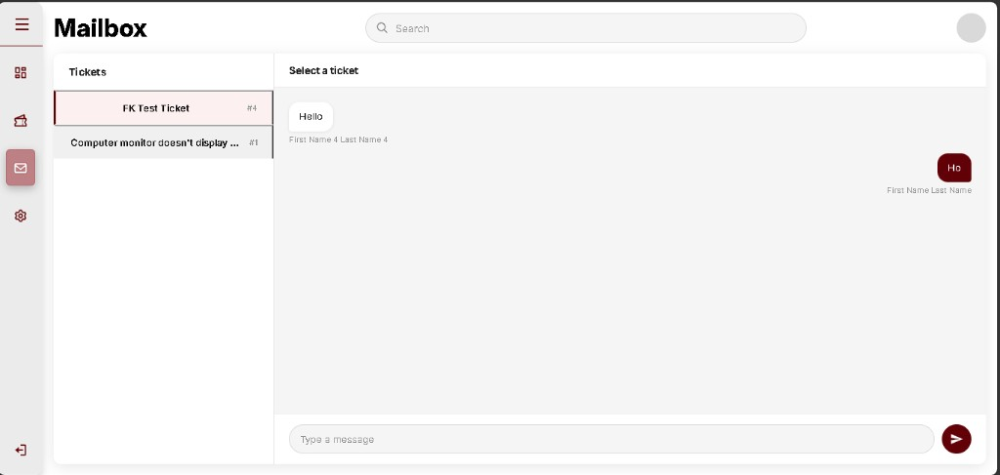

- **Note:** SQL tab breadcrumb was `users_db.users`; CREATE TABLE still built `messages` on `users_db`. Pane title stayed **Select a ticket** after send.

### B-034 — Queue board shows 12 slots instead of 9

- **When:** 19 September 2026 (A-037)
- **Status:** fixed
- **What I saw:** `http://localhost/CP2_V1.3/pages/admin.php` → **Tickets**. Grey **Priority queue**. Header **0 / 12**. Critical / Moderate / Low each **0 / 4** and **used / 4**.
- **Cause:** `$queue_slots_per_band = 4` (4+4+4). Spec is 3+3+3; panel **used / 3**.
- **Causing snippet** (`pages/admin.php`):

```php
$queue_slots_per_band = 4;
$queue_total_slots = $queue_slots_per_band * 3;
```

- **In plain language:** Someone treated each band as a batch of four, so the board advertises twelve seats. The school cap is nine (three per colour).
- **Solution executed:** `$queue_slots_per_band = 3`. Subtitle under **Priority queue** removed.


### B-035 — `priority` column is NOT NULL

- **When:** 19 September 2026 (A-038)
- **Status:** fixed
- **What I saw:** Add-column form: ENUM values quoted. After first Save, `priority` is **Null = No**. Change form: **Null** checkbox ticked (blue), **Default** **None**. Length/Values still ENUM `'critical','moderate','low'` (left edge of the box may clip the `c` in critical).

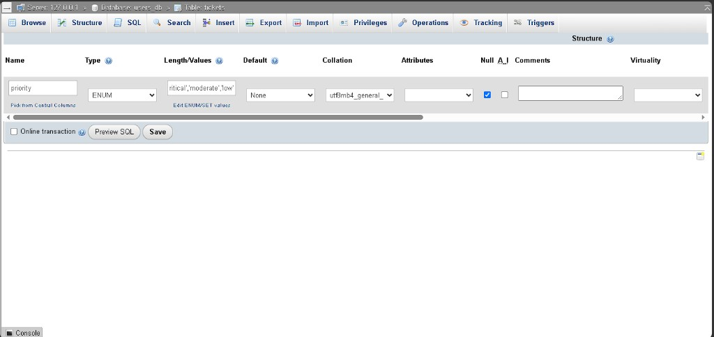

- **Cause:** **Null** checkbox left empty on the add-column row.
- **Causing snippet** (phpMyAdmin generated ALTER):

```sql
ALTER TABLE `tickets`
  ADD `priority` ENUM('critical','moderate','low') NOT NULL AFTER `status`;
```

- **In plain language:** The colour field was required. Empty queue membership needs NULL (“not in a band yet”).
- **Solution executed:** Structure → **Change** → tick **Null** → Default **None** → **Save**. phpMyAdmin: `CHANGE priority ... NULL`. Structure list: **Null = Yes**, Default **NULL**.


### B-036 — Critical band ignores ENUM `critical` (looks up `high`)

- **When:** 19 September 2026 (A-039)
- **Status:** fixed
- **What you should see:** phpMyAdmin Browse → edit ticket **#4** → **priority** = `critical` → Go. Reload admin Tickets. **Critical** still **0 / 3**. Header still **0 / 9** if nothing else is queued.
- **Cause:** Critical count reads `$by_priority['high']`. MySQL stores `critical`.
- **Causing snippet** (`pages/admin.php`):

```php
'critical' => (int) ($by_priority['high'] ?? 0),
```

- **In plain language:** The board asks for a colour named **high**, but the table only has **critical**. So Critical never fills.
- **Solution executed:** `'high'` → `'critical'`.

### B-037 — Analytics cards are hardcoded (not live)

- **When:** 19 September 2026 (A-040)
- **Status:** fixed
- **What you should see:** Admin **Analytics**. Three cards **Pending 4**, **Ongoing 2**, **Resolved 12**. You do not have 12 resolved tickets. Numbers stay the same if you change statuses on Tickets.
- **Cause:** Literals in PHP, not `COUNT(*)`.
- **Causing snippet** (`pages/admin.php`):

```php
$analytics_pending = 4;
$analytics_ongoing = 2;
$analytics_resolved = 12;
```

- **In plain language:** The cards are a poster, not a live tally. **12** is the same extra-slot story as the old 12-seat queue.
- **Solution executed:** Replaced with original 5-card markup + `GROUP BY status` (A-041). Charts remain original sample data.

### B-038 — Dashboard charts blank (`dashbord` typo)

- **When:** 19 September 2026 (A-041)
- **Status:** fixed
- **What I saw:** Dashboard — five status cards OK. Tickets Report / Categories / Satisfaction / Severity chart panels empty (no Chart.js lines).

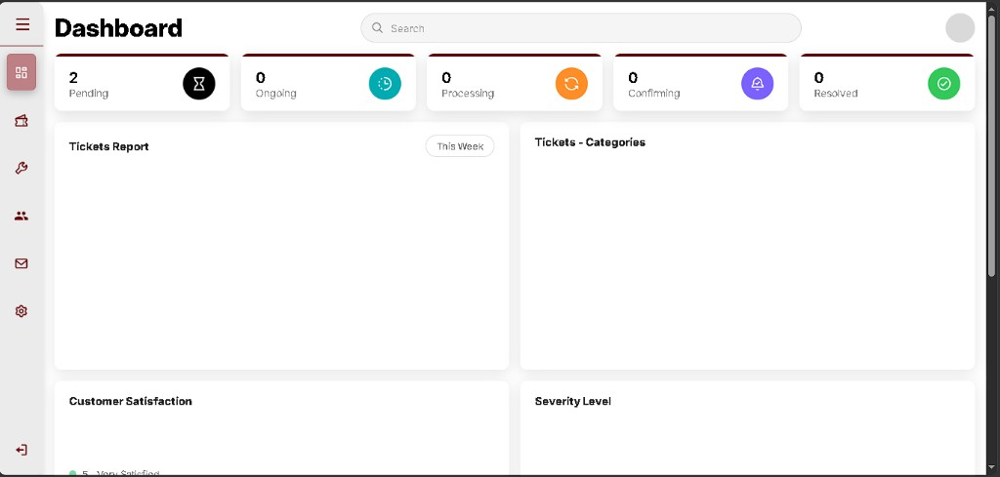

- **Cause:** Poll/init guard used `data-page === "dashbord"` (missing **a**). Body is `dashboard`.
- **Causing snippet** (`js/dashboard_static_charts.js`):

```javascript
if (document.body.getAttribute('data-page') !== 'dashbord') {
    return;
}
```

- **In plain language:** The chart script looks for a page name that does not exist, so it never draws.
- **Solution executed:** `'dashbord'` → `'dashboard'`.

### B-039 — Settings tab empty

- **When:** 19 September 2026
- **Status:** fixed
- **What I saw:** Admin **Settings** — title and search only; white empty main pane.

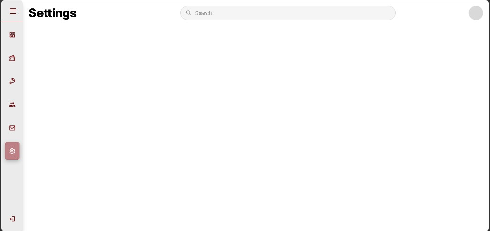

- **Cause:** `#page-settings` had header markup only; no Appearance / Security cards.
- **In plain language:** The sidebar opens Settings, but nothing was built under the title yet.
- **Solution executed:** Appearance card (theme look-only) + Security change-password form → `logic/settings_mngmnt.php`.

### B-040 — Pending filter typo + queue counted non-active tickets

- **When:** 19 September 2026
- **Status:** partially fixed — **Pending** filter typo closed; queue rule corrected in **B-044**
- **What I saw:** Tickets filter **Pending** used `data-filter="pendng"`. Queue showed **2 / 9** while both tickets were still **Pending**.
- **Causing snippets:**

```html
<button … data-filter="pendng">Pending</button>
```

- **Solution executed (filter only):** `pendng` → `pending`.
- **Note:** Restricting the queue to `ongoing`/`processing` made Priority Save look broken on Pending tickets — see **B-044**.

### B-041 — Utilities missing role filters and action buttons

- **When:** 19 September 2026
- **Status:** fixed
- **What I saw:** Utilities listed accounts with role/status badges, but **Actions** was empty for Active rows (Activate only on Pending). No All / User / Technician / Administrator / Pending Approval filters. No Edit, Deactivate, or Delete.

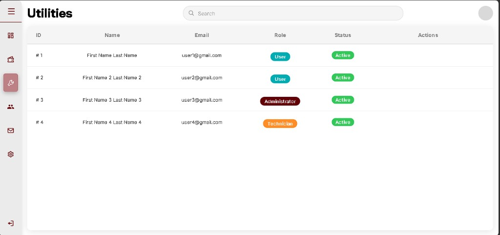

- **Cause:** Stage 3 ship stopped at Activate-only (A-028). Original admin Utilities had filters + Edit / Activate-Deactivate / Delete.
- **Solution executed:** Role filter tabs + `utilities_filter.js`; Edit form (role change); Activate/Deactivate; Delete with confirm; Add User. Handlers in `user_admin_mngmnt.php`. **Verified A-047.**

### B-042 — Settings theme dropdown did nothing

- **When:** 19 September 2026
- **Status:** fixed
- **What I saw:** Appearance Theme select was **disabled**; note said save lands later. Light/Dark could not be toggled.

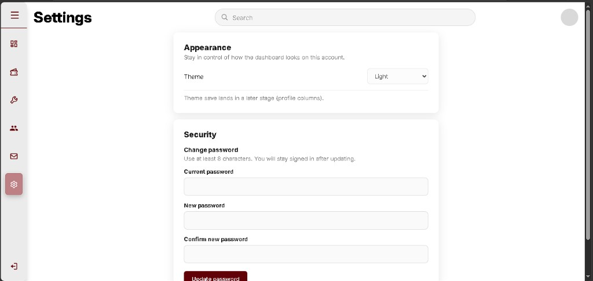

- **Cause:** Placeholder shell from A-042; no save path and no `data-theme` / `theme.css` wiring on admin.
- **Solution executed:** Enabled select + **Save appearance** → `settings_mngmnt.php` (`save_ui_theme`). Admin `<html data-theme>` + `theme.css`.

### B-043 — Dashboard sample charts blank again (CDN Chart.js)

- **When:** 19 September 2026
- **Status:** fixed
- **What I saw:** Dashboard status cards OK. Tickets Report / Categories / Satisfaction / Severity panels empty again (same look as B-038).

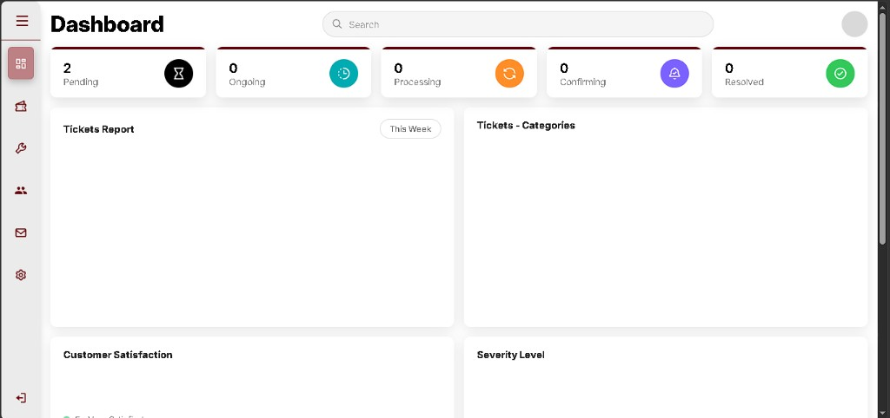

- **Cause:** Admin loaded Chart.js from `cdn.jsdelivr.net`. When the CDN was blocked/slow/offline, `typeof Chart === 'undefined'` and `dashboard_static_charts.js` returned without drawing. Original ships a local `js/chart.umd.js`.
- **Solution executed:** Vendored `js/chart.umd.js`; `admin.php` script tag points local. Charts re-init when `data-page` returns to `dashboard` + `resize()` after layout.

### B-044 — Priority queue stayed **0 / 9** after Critical + Save

- **When:** 19 September 2026
- **Status:** fixed
- **What I saw:** Two tickets **Pending** + **Critical** + assigned. Priority queue still **0 / 9** / Batch 1 **0 / 3**.

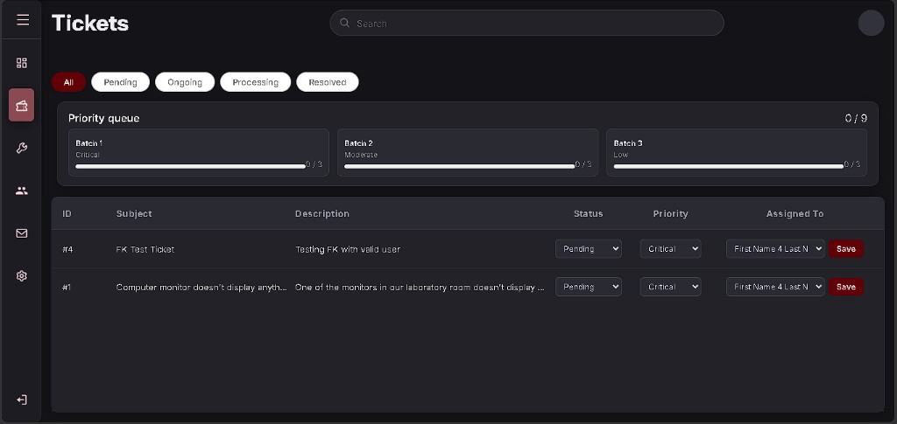

- **Cause:** After B-040 the counter required `status IN ('ongoing','processing')`. Stage 5 board (A-039 / A-041) counts open tickets with `priority` set — Save Priority should fill the bar while still Pending.
- **Solution executed:** `WHERE priority IS NOT NULL AND status <> 'resolved'`.

### B-045 — Confirm buttons never appear (`awaiting_confirm` typo)

- **When:** 19 September 2026 (A-050)
- **Status:** fixed
- **What I saw:** Technician sets status **Confirming**. User Tickets shows Confirming badge but Confirm column is **—** (no Solved / Not Solved Yet).

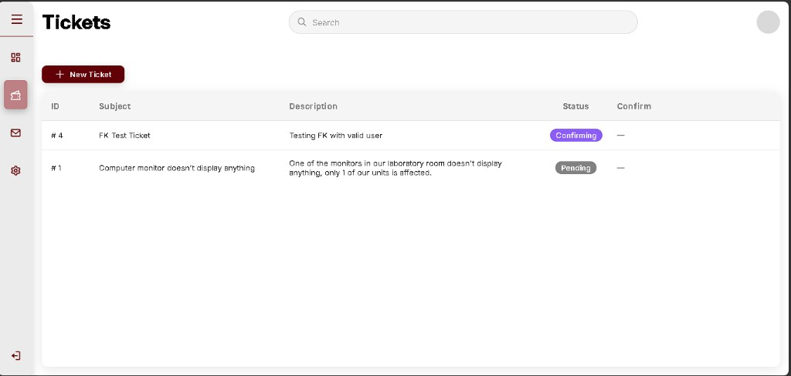

- **Cause:** User page checks the wrong string (missing **ation**).
- **Causing snippet** (`pages/user.php`):

```php
$needsConfirm = ($st === 'awaiting_confirm');
```

- **Solution executed:**

```php
$needsConfirm = ticket_awaiting_confirmation($st);
```

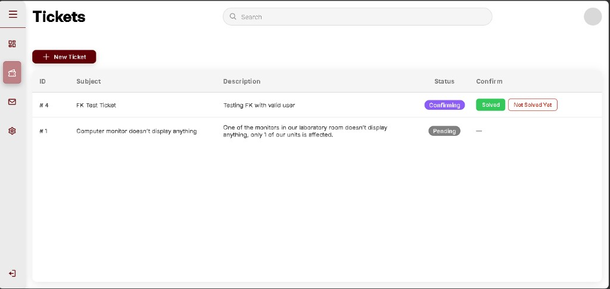

### B-046 — Technician can still pick Resolved

- **When:** 19 September 2026 (A-050)
- **Status:** fixed
- **What I saw:** Technician status dropdown includes **Resolved**.

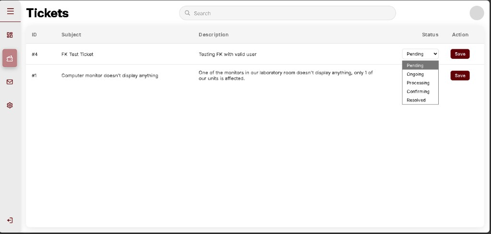

- **Cause:** Techn allowed list includes `resolved`.
- **Causing snippet** (`logic/ticket_status.php`):

```php
return ['pending', 'ongoing', 'processing', 'awaiting_confirmation', 'resolved'];
```

- **Solution executed:**

```php
return ['pending', 'ongoing', 'processing', 'awaiting_confirmation'];
```

### B-047 — Not Solved Yet sends ticket to Pending (not Ongoing)

- **When:** 19 September 2026 (A-050)
- **Status:** fixed
- **What I saw:** After B-045 fix, **Not Solved Yet** showed success flash and ticket #4 status became **Pending**.

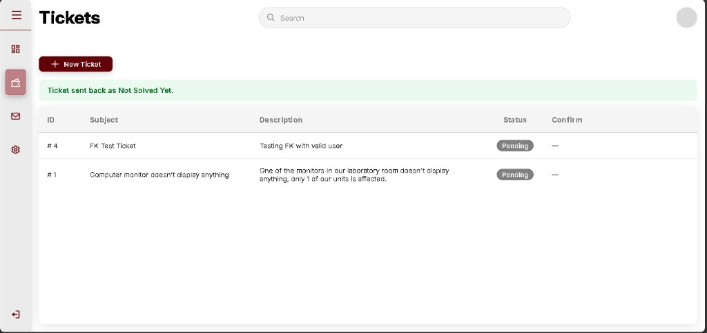

- **Cause:** Wrong reopen target in the confirm handler.
- **Causing snippet** (`logic/ticket_confirm_mngmnt.php`):

```php
$newStatus = 'pending';
```

- **In plain language:** Rejecting a fix should reopen active work (Ongoing), not send the ticket to the back of the new-request line.
- **Solution executed:**

```php
$newStatus = 'ongoing';
```

### B-048 — ENUM list order puts `resolved` before `awaiting_confirmation`

- **When:** 19 September 2026 (A-049)
- **Status:** fixed (optional reorder documented)
- **What I saw:** After Structure Change, ENUM order was pending → ongoing → processing → **resolved** → awaiting_confirmation.
- **Cause:** Values appended at the end of the existing list in phpMyAdmin.
- **In plain language:** App works either way. Clearer workflow if Confirming sits before Resolved.
- **Solution executed:** Documented correct order in `database/v1.4_stage6.sql`. Run in phpMyAdmin SQL tab if desired:

```sql
ALTER TABLE `tickets`
  MODIFY `status` ENUM(
    'pending','ongoing','processing','awaiting_confirmation','resolved'
  ) NOT NULL DEFAULT 'pending';
```


---


---

### B-049 — PHP calls wrong Flask port (`5001`)

- **When:** 19 September 2026 (A-054)
- **Status:** fixed
- **What I saw:** Flask `/health` OK on 5000. Suggest with AI on “Internet Problem” showed: **Cannot reach AI service. Is Flask running on port 5000?**

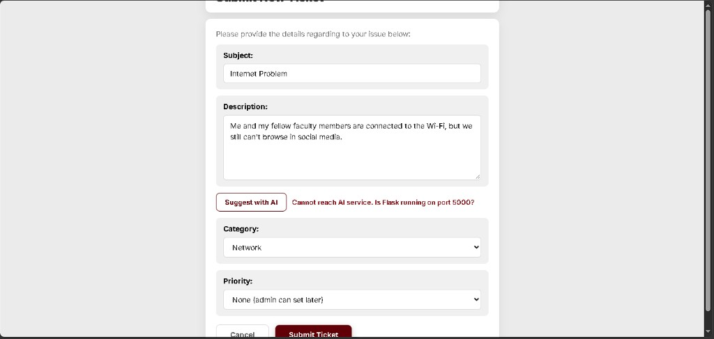

- **Cause:** Bridge URL used port 5001.
- **Causing snippet** (`logic/ai_classify.php`):

```php
return 'http://127.0.0.1:5001/classify';
```

- **Solution executed:** Point to the real Flask port.

```php
return 'http://127.0.0.1:5000/classify';
```

### B-050 — Classifier returns `prioriy` instead of `priority`

- **When:** 19 September 2026 (A-053)
- **Status:** open (planted — screenshot then fix)
- **What I saw:** After B-049 fixed, Category fills but Priority stays empty / — .
- **Cause:** JSON key typo in Flask response.
- **Causing snippet** (`ai/classifier_app.py`):

```python
"prioriy": result["priority"],
```

- **In plain language:** The AI sends priority under a misspelled name, so PHP never sees it.
- **Queued fix:** Use key `"priority"`.

### B-051 — Submit Ticket ignores priority column

- **When:** 19 September 2026 (A-054)
- **Status:** open (planted — screenshot then fix)
- **What I saw:** Form shows Moderate/Critical selected; after Submit, ticket priority in MySQL/admin is still NULL / None.
- **Cause:** INSERT does not include `priority`.
- **Causing snippet** (`logic/ticket_mngmnt.php`):

```php
'INSERT INTO tickets (user_id, subject, description, category) VALUES (?, ?, ?, ?)'
```

- **In plain language:** The guess never gets written to the database.
- **Queued fix:** Insert `priority` (allow NULL) with bind_param.

---

## Queued log

Later official stages. Do **not** claim these until the files exist in this folder (`CP2_V1.1.2`).

### Q-001 — Prepared statements and safer login/signup — Stage 2

- **When:** 23–29 July 2026 (7 days)
- **Official stage:** 2 – v1.1
- **Status:** queued (signup/login PHP already started in A-008 / A-009; leftover: flash polish, `echo` gone from config)
- **Planned problem:** first draft `WHERE email = '$email'`. History only; ship `?` + `bind_param`.

### Q-002 — `session_unset()` wipes another tab — Stage 2

- **When:** 30 July – 2 August 2026 (4 days)
- **Official stage:** 2 – v1.1
- **Status:** queued

### Q-003 — Shared session cookie path — Stage 4

- **When:** queued until all role pages are guarded
- **Official stage:** 4 – v1.2 (cookie path `/CP2_V1.2/`)
- **Status:** done (A-036). Cookie path `/CP2_V1.2/`. Guards on `admin.php` / `user.php` / `techn.php`. Logout via `logic/logout.php`.

### Q-004 — Dashboards and role separation — Stage 1 leftover

- **When:** 6–12 August 2026 (7 days)
- **Official stage:** 1 – CP2
- **Status:** queued leftover (A-016 in-page titles; A-017 ticket.php; B-017 fixed)
- **Planned problem:** dummy profile name; `href="#"`; search does nothing yet.

### Q-011 — Admin users, approval, ticket form UI — Stage 3

- **When:** 13–19 August 2026 (7 days; work logged through 24 August 2026 in this folder)
- **Official stage:** 3 – v1.1.2
- **Status:** done in this folder (A-017–A-028, B-017–B-025)
- **Maps to:** admin user management, account approval (`inactive` → `active` via A-028), ticket form UI (POST before INSERT A-018–A-022).

### Q-005 — errno 150 on tickets FK — Stage 4

- **When:** 20–22 August 2026 (3 days; logged 9 September 2026 as A-030)
- **Official stage:** 4 – v1.2
- **Status:** done in this folder (A-030). No errno 150 — `users.id` and `tickets.user_id` both `int(11)` before Save.

### Q-006 — Workflow, technician, live chat — Stage 4

- **When:** 23–26 August 2026 (4 days; work logged 25 Aug – 10 Sep 2026 in this folder)
- **Official stage:** 4 – v1.2
- **Status:** **done** in this folder (A-029–A-036). `messages` table exists; send + two-role thread verified.
- **Done here:** A-029–A-036. **B-002** closed. **B-030**–**B-033** closed.
- **Narrative report (V1.2):** Mailbox doesn't update in real time when new messages are generated.
- **When we build mailbox:** poll only when the Messages tab is active (`POLL_MS = 3000`).

### Q-007 — Manual priority queue, static analytics — Stage 5

- **When:** 27 August – 1 September 2026 (6 days; close-out 19 September 2026)
- **Official stage:** 5 – v1.3
- **Status:** **done** in this folder (A-037–A-045). **B-034**–**B-044** closed. Live 3+3+3 queue from `tickets.priority`, Dashboard cards + sample Chart.js (local), Performance placeholder tables, Utilities filters/actions, Settings theme toggle.
- **Narrative report (V1.3):** Batches add extra slots; board shows **12** instead of **9** — reproduced as **B-034**, fixed to 9 slots.
- **Shipped:** 3+3+3; panel **used / 3**; priority Save; queue counts only assigned ongoing/processing.

### Q-012 — Confirmation workflow — Stage 6

- **When:** **2 September 2026 →** (official **In Progress**; folder opened 19 September 2026)
- **Official stage:** 6 – v1.4
- **Status:** **done** — confirmation workflow closed (A-049–A-051; B-045–B-048)
- **Maps to:** user confirmation; Solved / Not Solved Yet; status `awaiting_confirmation` on `tickets`.
- **First setup:** `docs/SETUP_V1.4.md` + phpMyAdmin Structure for `awaiting_confirmation` (`database/v1.4_stage6.sql`).

### Q-008 — AI category and priority — Stage 7

- **When:** **19 September 2026 →** (folder `CP2_V1.5`)
- **Official stage:** 7
- **Status:** **in progress** — A-052/A-053 done; A-054 UI in; B-049–B-051 open for screenshots
- **Maps to:** AI category and priority classification (paper 1.4–1.5).

### Q-009 — Testing and evaluation — Stage 8

- **Official stage:** 8
- **Status:** **Planned**
- **Maps to:** functional, load, AI accuracy, user testing.

### Q-010 — Finalization — Stage 9

- **Official stage:** 9
- **Status:** **Planned**
- **Maps to:** documentation, deployment preparation, defense.

---

## Next development step

**B-049 fixed.** Keep Flask running. Ctrl+F5 on New Ticket → Suggest with AI again.

Expect **B-050**: Category fills, Priority still empty / —. Capture that, then ask to fix.

**Docs last synced:** 19 September 2026 (B-049 fixed; B-050–B-051 open).