# ZPGC Services — backlog

Living log. Diary dates start **27 June 2026**. Official “Completed” on Stages 1–5 is the **product line**. This folder does not yet contain all of that.

**Active folder (4 Oct 2026):** `C:\xampp\htdocs\CP2_V1.6` (adviser follow-up from frozen `CP2_V1.5`). Session cookie path **auto-detects** the install folder (A-104); default detect for this tree is `/CP2_V1.6/`.

| Category | IDs |
|----------|-----|
| **Activity** | A-001 … A-115 (continuous; A-101 removed — auth-blocked note retired) |
| **Issue** | B-001 … B-073 (continuous; no skipped IDs) |
| **Queued** | Q-001 … Q-012 (later stages; not claimed in this folder) |

### How snippets are recorded (standard)

Existing diary text, screenshots, tables, and mermaid stay as they are. Every Activity and Issue also records code (or a phpMyAdmin action) plus a short explanation for readers who do not write PHP every day.

| Log | Required snippet | Required explanation |
|-----|------------------|----------------------|
| **Activity** | **Fix snippet** — the code (or table-designer action) that made the work succeed or closed a B-issue | **In plain language:** what this does for a person using the site, in everyday words |
| **Issue** | **Causing snippet** — the code (or designer input) that produced the failure | **In plain language:** what you would see, then why that snippet caused it |

Older entries may still say **Executed snippet**. Treat that as the **Fix snippet**. Do not delete it. Add **Fix snippet** / **Causing snippet** and **In plain language** when they are missing.

From now on, new Activity rows always include **Fix snippet** + **In plain language**. New Issue rows always include **Causing snippet** + **In plain language**.

Browser captures from this rebuild live in `docs/screenshots/`. Each image is named for the activity/issue it belongs to and is also embedded under that entry. **phpMyAdmin** captures: crop out the left navigation tree only (database list sidebar) — leave the main pane and results untouched; do not resize.

| File | Belongs to |
|------|------------|
| `screenshots/a001-b001-landing-apache-404.png` | A-001 / B-001 |
| `screenshots/a002-b003-signup-stacked-under-login.jpg` | A-002 / B-003 |
| `screenshots/timeline-official-development.png` | Official timeline |
| `screenshots/timeline-official-development-2.png` | Official timeline |
| `screenshots/a008-b009-signup-submit-404.png` | A-008 / B-009 |
| `screenshots/a010-b011-user-php-404-lowercase-folder.png` | A-010 / B-011 |
| `screenshots/a010-b011-user-php-404-after-url-casing.png` | A-010 / B-011 |
| `screenshots/a010-b012-user-php-unstyled-main-wrap.png` | A-010 / B-012 |
| `screenshots/a010-user-php-chrome-after-main-wrap.png` | A-010 |
| `screenshots/a012-user-php-search-and-profile-circle.png` | A-012 |
| `screenshots/a011-b013-settings-label-outside-nav-link.png` | A-011 / B-013 (first reload) |
| `screenshots/b013-id-settings-span-still-outside-nav-link.png` | B-013 (`id` added; span still outside `.nav-link`) |
| `screenshots/b013-settings-label-inside-nav-link.png` | B-013 (fixed) |
| `screenshots/a014-b014-admin-php-404-wrong-folder.png` | A-014 / B-014 |
| `screenshots/b014-admin-url-after-move.png` | B-014 (URL they used after the move) |
| `screenshots/a016-b016-mailbox-unstyled-inner-head.png` | A-016 / B-016 |
| `screenshots/a016-b016-settings-unstyled-inner-head.png` | A-016 / B-016 |
| `screenshots/a017-b017-new-ticket-on-dashboard.png` | A-017 / B-017 |
| `screenshots/a018-b018-empty-ticket-mngmnt-white-page.png` | A-018 / B-018 |
| `screenshots/b019-tickets-enum-1064.png` | B-019 |
| `screenshots/a022-b020-submit-ticket-form.png` | A-022 / B-020 |
| `screenshots/a022-b020-after-submit-login-form.jpg` | A-022 / B-020 |
| `screenshots/a023-b021-user1-not-activated.jpg` | A-023 / B-021 / B-023 |
| `screenshots/a024-b022-admin-utilities-h1-still-dashboard.png` | A-024 / B-022 |
| `screenshots/a024-b022-admin-analytics-h1-still-dashboard.png` | A-024 / B-022 |
| `screenshots/a024-b022-admin-mailbox-h1-still-dashboard.png` | A-024 / B-022 |
| `screenshots/a024-b022-admin-settings-h1-still-dashboard.png` | A-024 / B-022 |
| `screenshots/a025-admin-utilities-user-list.png` | A-025 / B-024 |
| `screenshots/a029-user-tickets-list-tickets-tab.png` | A-029 / B-027 |
| `screenshots/a029-b027-dashboard-stray-table-headers.png` | A-029 / B-027 (before) |
| `screenshots/a029-b027-stray-table-mailbox-tab.png` | B-027 (before) |
| `screenshots/a029-b027-stray-table-settings-tab.png` | B-027 (before) |
| `screenshots/a030-fk-relation-view-saved.png` | A-030 (Relation view — FK saved) |
| `screenshots/a030-fk-good-insert-form.png` | A-030 (good row — Insert tab, before Go) |
| `screenshots/a030-fk-good-insert-success.png` | A-030 (good row — after Go) |
| `screenshots/a030-fk-good-tickets-tab.png` | A-030 (website Tickets tab) |
| `screenshots/a030-fk-bad-insert-sql.png` | A-030 (bad row — SQL tab, before Go) |
| `screenshots/a030-fk-bad-insert-1452-error.png` | A-030 (bad row — #1452 blocked) |
| `screenshots/a031-admin-tickets-list.png` | A-031 (after B-028 fix — optional) |
| `screenshots/b028-admin-tickets-compressed-columns.png` | B-028 (before — wrong column classes) |
| `screenshots/a032-assigned-to-column-added.png` | A-032 (Structure — `assigned_to` added) |
| `screenshots/a032-status-enum-expanded.png` | A-032 (Structure — status ENUM expanded) |
| `screenshots/a032-fk-tickets-assigned-saved.png` | A-032 (Relation view — `fk_tickets_assigned`) |
| `screenshots/a032-tickets-browse-assigned-null.png` | A-032 (Browse — existing rows NULL) |
| `screenshots/b029-status-assigned-compressed.png` | B-029 (before — Status + Assigned To squeezed) |
| `screenshots/b029-grid-collapsed-vertical-stack.png` | B-029 (after grid CSS — headers stack vertically) |
| `screenshots/b029-admin-tickets-five-columns-fixed.png` | B-029 (fixed — 5-column grid + dropdown) |
| `screenshots/a033-part2-assign-dropdown-retest.png` | A-033 Part 2 retest (`$tid` + dropdown shows tech name) |
| `screenshots/b031-techn-tickets-compressed-columns.png` | B-031 (before — `ticket-col-*`) |
| `screenshots/b031-techn-tickets-four-columns-fixed.png` | B-031 (after — four spaced columns) |
| `screenshots/b032-mailbox-no-live-update.png` | B-032 (Mailbox empty / no live poll) |
| `screenshots/b033-messages-table-missing-fatal.png` | B-033 (`messages` table missing — first send) |
| `screenshots/b033-messages-table-missing-fatal-retest.png` | B-033 (retest send — same fatal) |
| `screenshots/a035-create-messages-sql.png` | A-035 / B-033 (SQL — CREATE TABLE `messages`) |
| `screenshots/a035-create-messages-go-result.png` | A-035 / B-033 (Go — empty result = table created) |
| `screenshots/a035-messages-browse-empty.png` | A-035 / B-033 (Browse `messages` — zero rows) |
| `screenshots/b033-mailbox-hello-after-table.png` | B-033 (send **Hello** after table exists) |
| `screenshots/a035-mailbox-two-role-thread.png` | A-035 (two accounts — **Hello** + **Ho**) |
| `screenshots/a038-priority-column-add-form.png` | A-038 (Structure — add `priority` ENUM) |
| `screenshots/a038-priority-column-saved.png` | A-038 (Structure after Save; **B-035** Null = No) |
| `screenshots/b035-priority-change-null-ticked.png` | B-035 (Change — **Null** checked, Default **None**) |
| `screenshots/b035-priority-null-yes-saved.png` | B-035 (Structure after Save — Null **Yes**, Default **NULL**) |
| `screenshots/b034-queue-nine-slots-fixed.png` | B-034 (after — **0 / 9**, **used / 3**, no subtitle) |
| `screenshots/b038-dashboard-charts-blank.png` | B-038 (Dashboard charts blank — `dashbord` typo) |
| `screenshots/b039-settings-empty.png` | B-039 (Settings tab empty) |
| `screenshots/a041-performance-placeholder-tables.png` | A-041 (Performance — placeholder tables) |
| `screenshots/a041-tickets-queue-and-priority.png` | A-041 (Tickets — queue **2 / 9**, Priority dropdown) |
| `screenshots/b041-utilities-actions-empty.png` | B-041 (Utilities — empty Actions / no role filters) |
| `screenshots/b042-settings-theme-disabled.png` | B-042 (Settings theme disabled) |
| `screenshots/b043-dashboard-charts-blank-again.png` | B-043 (Dashboard charts blank again — CDN Chart.js) |
| `screenshots/b044-queue-zero-with-critical-pending.png` | B-044 (Queue **0 / 9** while Critical Pending tickets exist) |
| `screenshots/a045-queue-critical-moderate-working.png` | A-045 / A-046 (Queue **2 / 9** — Critical **1/3** + Moderate **1/3**) |
| `screenshots/a047-utilities-filters-and-actions.png` | A-047 (Utilities — role filters + Edit / Deactivate / Delete) |
| `screenshots/a047-utilities-edit-user-form.png` | A-047 (Utilities — Edit User form / role change) |

| screenshots/a056-b1-submit-new-ticket-form.png | A-056 B1 (Submit New Ticket form) |
| screenshots/a056-b2-ai-suggest-hardware-moderate.png | A-056 B2 (AI → hardware / moderate) |
| screenshots/a056-b5-user-ticket-1005-pending.png | A-056 B5 (#1005 on user list) |
| screenshots/a056-c-admin-ticket-1005-assigned-queue.png | A-056 C (admin assign + queue 4/9) |
| screenshots/a056-d3-techn-status-confirming.png | A-056 D3 (techn → Confirming) |
| screenshots/a056-e1-user-confirm-buttons.png | A-056 E1 (Solved / Not Solved Yet) |
| screenshots/a056-e3-not-solved-ongoing.png | A-056 E3 (Not Solved Yet → Ongoing) |
| screenshots/a066-matplotlib-dashboard-top.png | A-066 (matplotlib Dashboard — cards + report + categories) |
| screenshots/a066-matplotlib-dashboard-bottom.png | A-066 (matplotlib Dashboard — satisfaction + severity) |
---

## Official Development Timeline

| Stage | Milestone | Main activities | Official status | This folder | Backlog IDs |
|-------|-----------|-----------------|-----------------|-------------|-------------|
| **1 – CP2** | Initial prototype | Login, registration, dashboards, role separation | Completed | Landing, login/signup, `user.php` / `techn.php` / `admin.php` shells | A-001–A-005, A-010–A-016, B-001–B-004, B-006–B-007, B-011–B-016, Q-004 |
| **2 – v1.1** | Security improvement | Prepared statements, role validation, safer authentication | Completed | **Done** in `CP2_V1.1`. We moved here for v1.1.2. | A-006–A-009, B-005, B-008–B-010, Q-001–Q-003 |
| **3 – v1.1.2** | Administration and ticket interface | Admin user management, account approval, ticket form UI | Completed | **This folder.** `tickets` INSERT (A-022). Admin panels (A-024). User list + polish (A-025–A-027). Activate (A-028). **Stage 3 v1.1.2 complete here.** | A-017–A-028, B-017–B-025, Q-011 |
| **4 – v1.2** | Minimum Viable Product | Ticket persistence, workflow, technician functions, live chat | Completed | **Done** (A-029–A-036). Mailbox polls every 3 seconds. | A-029–A-036, B-026–B-033, Q-005, Q-006 |
| **5 – v1.3** | Queue and analytics | Manual priority, 9-slot queue, Chart.js samples, theme | Completed | **Done** (A-037–A-045). Queue fixed at 9 slots. | Q-007, B-034–B-044 |
| **6 – v1.4** | Confirmation workflow | User confirmation; Solved / Not Solved Yet | Completed | **Done** (A-049–A-051). Status `awaiting_confirmation`. | Q-012, B-045–B-048 |
| **7 – v1.5** | AI Integration | Keyword AI, then Luna, auto-assign, low-priority tips, live charts | Extended in V1.6 | Built in `CP2_V1.5` (A-052–A-066). Live Luna needs API credits; otherwise `kw-quota`. | Q-008 |
| **7b – v1.6** | Paper matrix, performance, profile | Submit scores the ticket; Tables 4–7; category performance; My Profile | **Current build** | **This folder** `CP2_V1.6` (A-067–A-076). | B-058–B-075 |
| **8** | Testing and Evaluation | Functional, load, AI accuracy, user testing | **In progress** | Functional paths tested. Load test and accuracy study not run. | Q-009 |
| **9** | Finalization | Documentation, deployment preparation, defense | **Planned** | Living docs, including `docs/VERSION_PROGRESS.md`. | Q-010 |

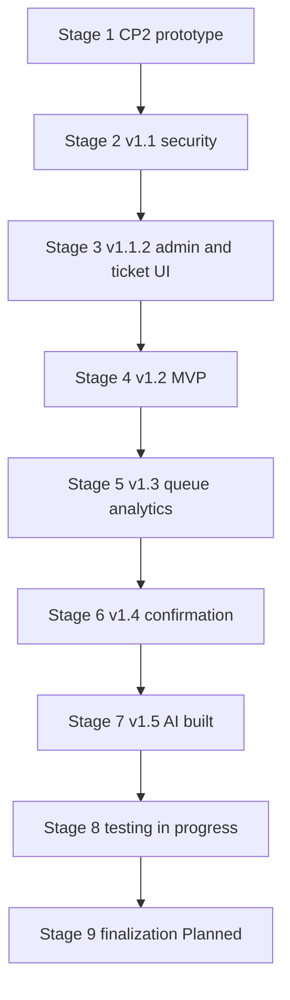
```mermaid
flowchart TD
  S1[Stage 1 CP2 prototype]
  S2[Stage 2 v1.1 security]
  S3[Stage 3 v1.1.2 admin and ticket UI]
  S4[Stage 4 v1.2 MVP]
  S5[Stage 5 v1.3 queue analytics]
  S6[Stage 6 v1.4 confirmation]
  S7[Stage 7 v1.5 AI built]
  S8[Stage 8 testing in progress]
  S9[Stage 9 finalization Planned]
  S1 --> S2 --> S3 --> S4 --> S5 --> S6
  S6 --> S7 --> S8 --> S9
```

Team source (screenshots):


### Diary dates (aligned to official stages)

| Dates | Official stage | Notes |
|-------|----------------|--------|
| 27 Jun – 13 Jul 2026 | Stage 1 | Landing, login/signup HTML/JS, Apache names |
| 14 – 22 Jul 2026 | Stage 2 (start) | `users_db`, `config.php` |
| 23 Jul – 5 Aug 2026 | Stage 2 (rest) | Prepared statements, sessions (Q-001–Q-003) |
| 6 – 12 Aug 2026 | Stage 1 leftover + Stage 3 start | Dashboards / role pages (Q-004, A-010) |
| 13 – 19 Aug 2026 | Stage 3 | Admin utilities, account approval, ticket form UI (Q-011) |
| 20 – 26 Aug 2026 | Stage 4 | Tickets, workflow, techn, mailbox (Q-005, Q-006) |
| 25 Aug – 10 Sep 2026 | Stage 4 (this folder) | A-029 user list; A-030 FK; A-031 admin list; A-032 `assigned_to`; B-026–B-028 |
| 27 Aug – 1 Sep 2026 | Stage 5 | Manual 9-slot queue, static cards (Q-007) |
| **2 - 15 Sep 2026** | Stage 6 **done** | Confirmation workflow (Q-012, A-049-A-051) |
| **16 - 20 Sep 2026** | Stage 7 **built** | AI in `CP2_V1.5` (Q-008). Live Luna needs API credits. |
| **25 Sep - 1 Oct 2026** | V1.6 **current** | Tables 4-7, performance, My Profile (A-067-A-076). See `docs/VERSION_PROGRESS.md`. |
| Later | Stages 8-9 | Functional tests in progress. Load, accuracy, and defense still open. |

---

## Activity log

Work completed and confirmed in the browser or phpMyAdmin. **Fix snippet** = the code that made it work. **In plain language** = the same idea without assuming PHP knowledge.

### A-001 — Landing page HTML

- **When:** 27–28 June 2026 (2 days: markup + CSS path)
- **Official stage:** 1 – CP2
- **Status:** done
- **What we did:** Public welcome page: navbar, logo, Login, hero, Signup now!. Linked `css/landing_page.css` and `images/ZPGC.com.png`.
- **File:** `pages/landing_page.php` (first saved as `.html`; see B-001)
- **Test:** Go Live showed the maroon landing layout. Apache on `landing_page.php` was 404 until B-001.

- **Fix snippet:**

```
Rename: pages/landing_page.html  →  pages/landing_page.php
```

- **In plain language:** The welcome page was saved with the wrong file ending. The live site asks for `.php`. After the rename, the same design opens at the Apache URL.


### A-002 — Login / signup HTML form

- **When:** 30 June – 4 July 2026 (5 days: split panel, two forms, Role list)
- **Official stage:** 1 – CP2 (registration UI)
- **Status:** done
- **What we did:** Login/signup HTML skeleton (no PHP). Role: User, Admin, Technician. `action="#"`. Linked `css/login_signup.css`.
- **File:** `pages/login_signup.php`
- **Test:** Go Live showed LOGIN. Signup stacked under LOGIN until B-003 (screenshot on that issue).
- **Executed snippet (form we created):**

```html
<select name="role" required>
    <option value="" disabled selected>Role</option>
    <option value="user">User</option>
    <option value="admin">Admin</option>
    <option value="techn">Technician</option>
</select>
```

- **Fix snippet:** same `<select name="role">` block above.
- **In plain language:** Signup asks the person to pick User, Admin, or Technician. That choice is stored later as `role`. There is no PHP on this page yet — only the list on the form.

### A-003 — Form toggle script

- **When:** 30 June 2026 (same stretch as A-002; selector fix 5–6 July)
- **Official stage:** 1 – CP2
- **Status:** done (B-003)
- **File:** `js/script.js`
- **Fix snippet:**

```javascript
document.querySelectorAll(".form-box").forEach(function (form) {
    form.classList.remove("active");
});
```

- **In plain language:** The page has two boxes (LOGIN and SIGNUP). This script hides one and shows the other. The class name must match the HTML (`.form-box`). If it does not, both boxes stay visible (B-003).

### A-004 — Landing buttons open login/signup

- **When:** 7–11 July 2026 (2 days links + 3 days query-string, B-004)
- **Official stage:** 1 – CP2
- **Status:** done
- **What we did:** Login → `login_signup` ; Signup now! → `?form=signup`. Later names became `.php` for Apache.
- **Executed snippet:**

```html
<button class="btnW"><a href="../pages/login_signup.php">Login</a></button>
...
<button class="btnR"><a href="../pages/login_signup.php?form=signup">Signup now!</a></button>
```

- **Fix snippet:** the two landing `<a href="...">` buttons above.
- **In plain language:** Login opens the login page. Signup now! opens the same page but asks it to show the signup box (`?form=signup`). B-004 happened until the script read that extra bit in the URL.

### A-005 — Pages renamed to `.php`; forms use POST (`action="#"` until handler)

- **When:** 12–13 July 2026 (2 days: renames + landing links + `method="post"`)
- **Official stage:** 1 – CP2 (Apache owns the pages before database work)
- **Status:** done (B-007: logo link `.html` → `.php`)
- **What we did:** Renamed `landing_page.html` → `landing_page.php` and `login_signup.html` → `login_signup.php`. Updated landing Login / Signup now! `href`s to `.php`. Set both login and signup forms to `method="post"`. Left `action="#"` because `logic/user_mngmnt.php` did not exist yet — submit stayed on the page until A-008 wired the handler (B-009).
- **Files:** `pages/landing_page.php`, `pages/login_signup.php`
- **Test:** `http://localhost/CP2_V1.1/pages/landing_page.php` and `login_signup.php` load on Apache. Form toggle and `?form=signup` still work. Submit does not reach PHP yet.

- **Fix snippet:**

```
Rename: pages/landing_page.html   →  pages/landing_page.php
Rename: pages/login_signup.html   →  pages/login_signup.php
```

```html
<form action="#" method="post">
```

(Landing buttons — same as A-004 but with `.php`:)

```html
<button class="btnW"><a href="../pages/login_signup.php">Login</a></button>
<button class="btnR"><a href="../pages/login_signup.php?form=signup">Signup now!</a></button>
```

- **In plain language:** Apache looks for `.php` files. POST is how login and signup will send data later. `#` means “nowhere yet” until `user_mngmnt.php` exists. B-001 fixed the landing rename; this step also renamed login/signup and set POST on both forms.

### A-006 — Created `users_db` and table `users`

- **When:** 14–19 July 2026 (6 days: drop old DB, designer, 7 columns, ENUM, Browse check)
- **Official stage:** 2 – v1.1 (safer auth needs a users table)
- **Status:** done
- **What we did:** New database `users_db`. phpMyAdmin table wizard (not SQL tab): name `users`, **7** columns, Save. Structure correct. Browse empty with headers id, first_name, last_name, email, password, role, status.

| Column | Type | Length / values | Extra |
|--------|------|-----------------|--------|
| `id` | INT | — | PRIMARY, A_I |
| `first_name` | VARCHAR | 100 | |
| `last_name` | VARCHAR | 100 | |
| `email` | VARCHAR | 255 | UNIQUE |
| `password` | VARCHAR | 255 | hash later |
| `role` | ENUM | `'user','admin','techn'` | |
| `status` | ENUM | `'inactive','active'` | default `inactive` |

- **Fix snippet:** phpMyAdmin table designer (not the SQL tab). Table name `users`, 7 columns as in the table above. Save.
- **In plain language:** This is a list of accounts. Each row is one person. `status` starts as inactive so they cannot log in until someone approves them.

### A-007 — `logic/config.php` connection

- **When:** 20–22 July 2026 (3 days: file location, mysqli, browser test)
- **Official stage:** 2 – v1.1
- **Status:** done (test echo still in file; remove before `user_mngmnt.php`)
- **What we did:** Created `logic/config.php`. Opened `http://localhost/CP2_v1.1/logic/config.php`. Page showed `Connected to users_db`.
- **Executed snippet:**

```php
<?php
$host = "localhost";
$user = "root";
$password = "";
$database = "users_db";

$conn = new mysqli($host, $user, $password, $database);

if ($conn->connect_error) {
    die("Connection failed: " . $conn->connection_error);
}

echo "Connected to users_db";
```

- **Fix snippet:** the `config.php` block above (`mysqli` to `users_db`).
- **In plain language:** This file is the phone line to MySQL. Other PHP files include it instead of repeating the host name. The echo was only a test message. B-005: the error property name is misspelled but you would only notice if MySQL were down.

### A-008 — Signup INSERT works (prepared statement)

- **When:** 24 July 2026
- **Official stage:** 2 – v1.1
- **Status:** done
- **What we did:** After B-009, submitted sample User signup. Browser went to the **login** form (that redirect is the success `header` in `user_mngmnt.php`). phpMyAdmin → `users_db` → `users` → Browse showed the new row.
- **Files:** `pages/login_signup.php` (`method="post"`), `logic/user_mngmnt.php`
- **Confirmed:** Row stored in MySQL. Hashed `password`, `status` `inactive`.

- **Fix snippet:**

```php
    $stmt = $conn->prepare(
        'INSERT INTO users (first_name, last_name, email, password, role, status)
        VALUES (?, ?, ?, ?, ?, ?)'
    );
    $stmt->bind_param('ssssss', $first_name, $last_name, $email, $hash, $role, $status);
```

- **In plain language:** When someone clicks Signup, this writes a new row. The `?` marks are placeholders so the typed name and email are not mixed into the SQL text (safer). The password is stored as a hash, not the plain password. The account is inactive until approval.

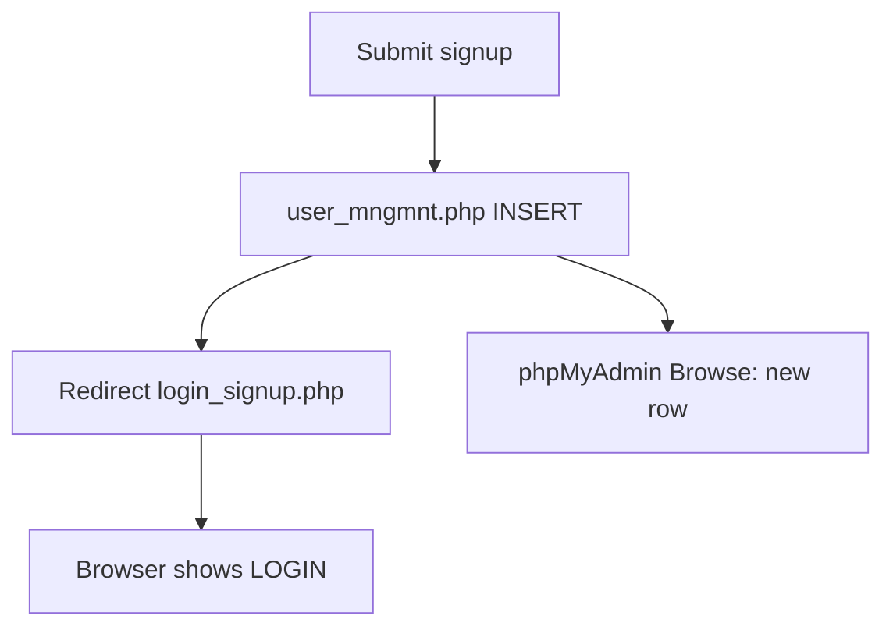
```mermaid
flowchart TD
  A[Submit signup] --> B[user_mngmnt.php INSERT]
  B --> C[Redirect login_signup.php]
  C --> D[Browser shows LOGIN]
  B --> E[phpMyAdmin Browse: new row]
```

### A-009 — Login: inactive vs unknown account

- **When:** 26 July 2026
- **Official stage:** 2 – v1.1
- **Status:** done
- **What we did:** Tested the login form after B-010 (`;` on `session_start()`).
  - Email/password that **exist** in `users_db` (signup row, still `inactive`): account **not yet activated**. Stayed on LOGIN.
  - Email/password **not** signed up: **incorrect credentials**. Stayed on LOGIN.
- **Files:** `logic/user_mngmnt.php` (`password_verify` + `status`), `pages/login_signup.php` (shows `$login_error`)

- **Fix snippet:**

```php
        if ($user['status'] !== 'active') {
            $_SESSION['login_error'] = 'Account is not activated yet.';
            header('Location: ../pages/login_signup.php');
            exit();
        }
```

- **In plain language:** Login checks the password, then checks whether the account is allowed in. If status is still inactive, the person stays on LOGIN and sees that message. That is intended (A-009). To test tickets we later set one row to active in phpMyAdmin (B-021), not by deleting this check.

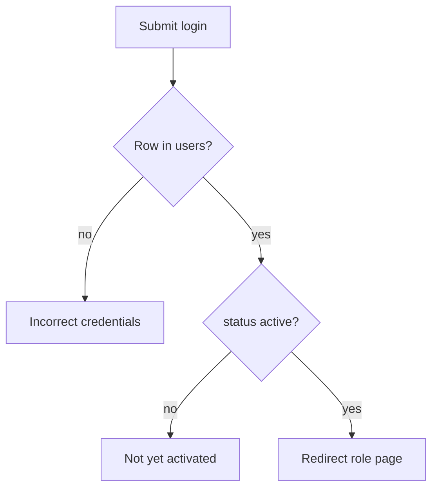
```mermaid
flowchart TD
  A[Submit login] --> B{Row in users?}
  B -->|no| C[Incorrect credentials]
  B -->|yes| D{status active?}
  D -->|no| E[Not yet activated]
  D -->|yes| F[Redirect role page]
```

### A-010 — `user.php` dashboard chrome

- **When:** 7 August 2026
- **Official stage:** 1 – CP2
- **Status:** done
- **What we did:** Created `pages/user.php` (`data-page="dashboard"`, `.main-wrap`, logo `ZPGC.com2.png`, toggler, Dashboard `.selected`, `main_interface.css`). Rename B-011; class hyphen B-012.
- **Test:** `http://localhost/CP2_V1.1/pages/user.php` — grey sidebar, logo, highlighted Dashboard at the **bottom** (`:last-child`) until A-011 added Logout. Search and profile circle came later as **A-012**. `behavior.js` not in this file yet.


- **Fix snippet:**

```html
    <main class="main-wrap">
```

- **In plain language:** The dashboard layout CSS looks for the class name `main-wrap` (with a hyphen). Underscore `main_wrap` meant the grey sidebar never applied (B-012).

### A-011 — Remaining sidebar items on `user.php`

- **When:** 8 August 2026
- **Official stage:** 1 – CP2
- **Status:** done (B-013 later: Settings span inside `.nav-link`)
- **What we did:** After Dashboard, typed Tickets (`data-nav="tickets"`), Mailbox (`data-nav="messages"`), Settings (`data-nav="settings"`), Logout last (`href="../pages/login_signup.php"`). SVG `d` paths were typed in full. No `behavior.js`, search, or session guard yet.
- **File:** `pages/user.php`
- **Test:** Reload `http://localhost/CP2_V1.1/pages/user.php` — five labels; Dashboard still `.selected`; Logout at the bottom of the grey column. Settings **label sits under the gear** (B-013). Screenshot on B-013.

- **Fix snippet (Settings, after B-013):**

```html
                                    </svg>
                                    <span class="link-text" id="settings">Settings</span>
                                </a>
```

- **In plain language:** Icon and word must sit inside the same clickable row. If the word is outside that row, it drops under the gear.

### A-012 — Showcase search bar and profile circle

- **When:** 9 August 2026
- **Official stage:** 1 – CP2
- **Status:** done
- **What we did:** After `<h1>Dashboard</h1>` in `.showcase .head header`, typed `.search-bar-wrapper` (icon + `input type="search"`) and empty `.profile-circle`. No form, no search JS, no avatar. `behavior.js` still not linked.
- **File:** `pages/user.php`
- **Test:** Reload `http://localhost/CP2_V1.1/pages/user.php` — pill search with placeholder Search; empty grey circle on the right; sidebar unchanged.


- **Executed snippet:**

```html
                    <div class="search-bar-wrapper">
                        <svg class="search-icon" xmlns="http://www.w3.org/2000/svg" width="24" height="24"
                            fill="currentColor" viewBox="0 0 24 24">
                            <path
                                d="M18 10c0-4.41-3.59-8-8-8s-8 3.59-8 8 3.59 8 8 8c1.85 0 3.54-.63 4.9-1.69l5.1 5.1L21.41 20l-5.1-5.1A8 8 0 0 0 18 10M4 10c0-3.31 2.69-6 6-6s6 2.69 6 6-2.69 6-6 6-6-2.69-6-6">
                            </path>
                        </svg>
                        <input type="search" class="search-bar" placeholder="Search" aria-label = "Search">
                    </div>
                    <div class="profile-circle"></div>
```

- **Fix snippet:** the search wrapper + empty profile circle above.
- **In plain language:** This draws the pill Search box and a blank circle for a profile picture later. Search does not filter anything yet.

### A-013 — `behavior.js` sidebar collapse and nav highlight

- **When:** 10 August 2026
- **Official stage:** 1 – CP2
- **Status:** done
- **What we did:** Created `js/behavior.js`. Linked it at the bottom of `user.php`. Collapse uses class `active` on `.main-head`. Clicks on `href="#"` move `.selected` and `body data-page`. Logout still follows `login_signup.php`.
- **Files:** `js/behavior.js`, `pages/user.php`
- **Test:** Collapse/expand on hover and toggler works. Tickets / Mailbox / Settings take the rose highlight. Logout still opens login/signup.
- **URL with no `#`:** **Normal.** Those four links are `href="#"`. The click handler calls `event.preventDefault()` so the browser never applies the fragment. The address bar stays `http://localhost/CP2_V1.1/pages/user.php`. If `preventDefault` were omitted, the URL would typically become `user.php#`. Not a bug; not a new issue ID.

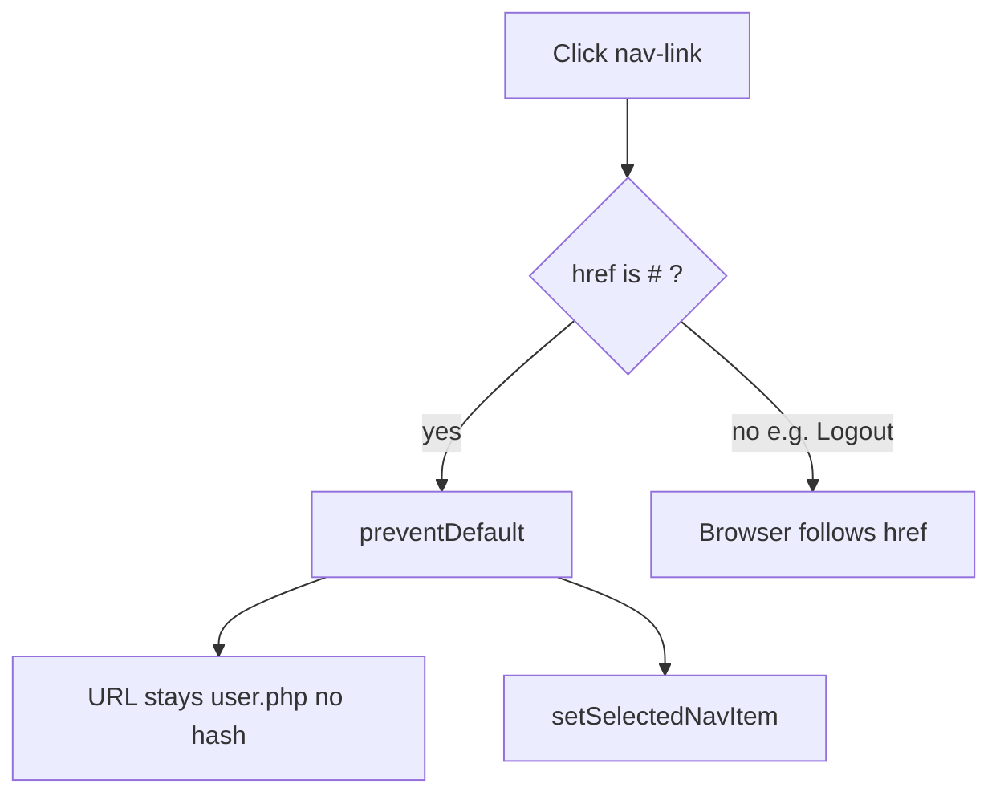
```mermaid
flowchart TD
  A[Click nav-link] --> B{href is # ?}
  B -->|yes| C[preventDefault]
  C --> D[URL stays user.php no hash]
  C --> E[setSelectedNavItem]
  B -->|no e.g. Logout| F[Browser follows href]
```

- **Executed snippet** (`initNavClickSelection`, as typed):

```javascript
        link.addEventListener("click", function(event) {
            const href = link.getAttribute("href") || "";
            if (href && href !== "#") {
                return;
            }
            event.preventDefault();
            setSelectedNavItem(item);
        });
```

- **Executed snippet** (`user.php`):

```html
    <script src="../js/behavior.js"></script>
```

- **Fix snippet:** the click handler and the `<script src="../js/behavior.js">` include above.
- **In plain language:** Clicking Tickets (and the other `#` links) changes which panel you see without adding `#` to the URL. Logout is a real link, so it leaves the dashboard.

### A-014 — `techn.php` shell (same nav as user)

- **When:** 11 August 2026
- **Official stage:** 1 – CP2
- **Status:** done (`admin.php` 404: **B-014**)
- **What we did:** Copied `user.php` to `pages/techn.php`. Title `ZPGC Services | Technician`. Same Tickets / Mailbox / Settings / Logout. Linked `../js/behavior.js`.
- **File:** `pages/techn.php`
- **Test:** `http://localhost/CP2_V1.1/pages/techn.php` — same chrome as user. `pages/admin.php` Apache 404 (B-014).

- **Fix snippet:** `pages/techn.php` is a copy of `user.php` with title Technician. Same `behavior.js` link as A-013.
- **In plain language:** Technicians get the same left menu and top bar. The file must live in `pages/`, same as `user.php`.

### A-015 — `admin.php` in `pages/` (Utilities + Analytics)

- **When:** 11 August 2026 (after B-014 move)
- **Official stage:** 1 – CP2
- **Status:** done (Analytics label wrap: **B-015**)
- **What we did:** Moved `admin.php` from `logic/` to `pages/`. Nav: Dashboard, Utilities, Analytics, Mailbox, Settings, Logout. Same `behavior.js`.
- **File:** `pages/admin.php`
- **Test:** Page loads (B-014 fixed). Analytics text sits under the chart icon (B-015). Utilities label is on one row.

- **Fix snippet:** file lives at `pages/admin.php` (moved off `logic/`). Analytics span inside `.nav-link` (B-015).
- **In plain language:** Admin is a dashboard page, not a handler. If the file sits in `logic/`, the URL `pages/admin.php` is Not Found (B-014).

### A-016 — In-page sections on `user.php` (`data-page` / `.page-content`)

- **When:** 12 August 2026
- **Official stage:** 1 leftover / Stage 3 UI start
- **Status:** done (Mailbox/Settings bar unstyled: **B-016**, then fixed)
- **What we did:** Wrapped showcase in `#page-dashboard`, `#page-tickets`, `#page-messages`, `#page-settings`. `behavior.js` already sets `body data-page`. CSS shows the matching `#page-…`.
- **Test:** Clicking Dashboard / Tickets / Mailbox / Settings changes the `h1`. Search and profile sit in each panel. Mailbox and Settings were unstyled until B-016.

- **Fix snippet:**

```html
                <div class="head">
                    <header>
                        <h1>Mailbox</h1>
```

- **In plain language:** Each sidebar item shows a different panel on the same page. The top bar must use the `<header>` tag so the search pill styles apply. `<head>` is the wrong tag (B-016).

### A-017 — New Ticket control + `ticket.php` form (look only)

- **When:** 13 August 2026
- **Official stage:** 3 – v1.1.2 (ticket form UI)
- **Status:** done (B-017: toolbar moved inside `#page-tickets`)
- **What we did:** Added `.tickets-toolbar` / `.btn-new-ticket` linking to `pages/ticket.php`. Created `ticket.php` with `ticket.css`. Form `action="#"`, `method="post"`. No INSERT.
- **Files:** `pages/user.php`, `pages/ticket.php`
- **Executed snippet** (`ticket.php` form, as typed):

```html
        <form action="#" class="ticket-form" method="post">
```

Submit button `name="submit-ticket"` (hyphen). Handler later will look for `submit_ticket` if we match original v1.2.

- **Fix snippet:** form `action="#"` at first; toolbar inside `#page-tickets` (B-017).
- **In plain language:** New Ticket is a button on the Tickets panel that opens a separate form page. It does not save a ticket by itself. If the button sits outside that panel, it also shows on Dashboard (B-017).

### A-018 — Ticket form POSTs to `ticket_mngmnt.php`

- **When:** 14 August 2026
- **Official stage:** 3 – v1.1.2 (POST before INSERT)
- **Status:** done (blank page: **B-018**; later filled in A-019)
- **What we did:** Changed `ticket.php` `action` from `#` to `../logic/ticket_mngmnt.php`.
- **File:** `pages/ticket.php`
- **Executed snippet:**

```html
        <form action="../logic/ticket_mngmnt.php" class="ticket-form" method="post">
```

- **Test:** Submit → URL `http://localhost/CP2_V1.1/logic/ticket_mngmnt.php`. White page (B-018), not Apache 404.

- **Fix snippet:** `action="../logic/ticket_mngmnt.php"` on the form (block above).
- **In plain language:** Submit sends the form to a PHP file in `logic/`. An empty file is not “page missing” (that would be 404). Empty PHP shows a white screen (B-018).

### A-019 — `ticket_mngmnt.php` receives POST, no INSERT

- **When:** 15 August 2026
- **Official stage:** 3 – v1.1.2
- **Status:** done
- **What we did:** Typed PHP in `logic/ticket_mngmnt.php`: cookie params + `session_start()`, `config.php`, `isset($_POST['submit-ticket'])`, `trim` on category/subject/description, `header` to `user.php`. No SQL.
- **File:** `logic/ticket_mngmnt.php`
- **Test:** Submit Ticket → `user.php`. phpMyAdmin: no tickets row.
- **Executed snippet:**

```php
if (isset($_POST['submit-ticket'])) {
    $category = trim($_POST['category']);
    $subject = trim($_POST['subject']);
    $description = trim($_POST['description']);

    header('Location: ../pages/user.php');
    exit();
}
header('Location: ../pages/ticket.php');
exit();
```

- **Fix snippet:** the `isset($_POST['submit-ticket'])` + `header` block above.
- **In plain language:** After Submit, the browser is sent back to the user dashboard instead of staying on a blank PHP file. At this step nothing is written to MySQL yet.

### A-020 — Migrated here from `CP2_V1.1`

- **When:** 16 August 2026
- **Official stage:** 3 – v1.1.2
- **Status:** done
- **What we did:** **v1.1 is done** (`CP2_V1.1`). **We are moving to v1.1.2 here.** This folder is a full copy of `CP2_V1.1` as of the split. Ticket files stay here. `user_mngmnt.php` / `ticket_mngmnt.php` cookie path is `CP2_V1.1.2/logic/`. Continue tickets table, INSERT, Utilities **in this folder**. v1.1 tree no longer has `ticket.php`.
- **Demo:** http://localhost/CP2_V1.1.2/pages/landing_page.php
- **Test:** Landing and `user.php` → 200. Tickets tab shows New Ticket. `pages/ticket.php` → 200. POST `ticket_mngmnt.php` → 302 `../pages/user.php` (no INSERT). v1.1 `ticket.php` stays 404.

- **Fix snippet:**

```php
session_set_cookie_params(0, 'CP2_V1.1.2/logic/');
```

- **In plain language:** v1.1 work stays in its own folder. This folder is v1.1.2. The cookie path string was updated so login/session belong to `/CP2_V1.1.2/`, not the old folder name. Ticket files live only here.

### A-021 — phpMyAdmin: created table `tickets`

- **When:** 17 August 2026
- **Official stage:** 3 – v1.1.2
- **Status:** done (B-019 fixed on second Save)
- **What we did:** First Save failed (#1064, B-019). Corrected the designer (`id` PRIMARY A_I, six named columns, ENUM quotes, VARCHAR 255, no blank row). Second Save succeeded. `users_db` left list: `tickets` and `users`.
- **Confirmed (Structure, no screenshot in this log):**

| Column | Type | Extra |
|--------|------|--------|
| `id` | INT | PRIMARY, A_I |
| `user_id` | INT | not UNSIGNED; no FK |
| `subject` | VARCHAR(255) | |
| `description` | TEXT | |
| `category` | ENUM hardware / software / account / network / other | |
| `status` | ENUM `'pending'` | default `pending` |

Indexes: PRIMARY on `id` only. Browse still empty until INSERT.

- **Fix snippet:** phpMyAdmin designer for table `tickets`. Six named columns as in the table above. `category` Length/Values: `'hardware','software','account','network','other'`.
- **In plain language:** This is a list of help requests. Each row is one ticket. `user_id` says which account opened it. `status` starts as pending. We did not add a foreign key yet (that comes later).

### A-022 — `ticket_mngmnt.php` INSERT (lookup `user_id` by email)

- **When:** 18 August 2026
- **Official stage:** 3 – v1.1.2
- **Status:** done (B-020 and B-021 cleared)
- **What we did:** After A-021, added `SELECT id FROM users WHERE email = ?` then `INSERT INTO tickets (user_id, subject, description, category)`. `status` left to table default `pending`. Guard is `isset($_SESSION['email'])`.
- **File:** `logic/ticket_mngmnt.php`
- **Test (first):** Filled `ticket.php` → LOGIN. Browse empty (B-020).
- **Test (after B-020/B-021):** Submit Ticket → `user.php` (dashboard). phpMyAdmin `tickets` Browse: row stored as expected.

- **Fix snippet:**

```php
    if (!isset($_SESSION['email'])) {
        header('Location: ../pages/login_signup.php');
        exit();
    }
    $email = $_SESSION['email'];
    $find = $conn->prepare('SELECT id FROM users WHERE email = ?');
    $find->bind_param('s', $email);
    $find->execute();
    $found = $find->get_result()->fetch_assoc();
    // ...
    $stmt = $conn->prepare(
        'INSERT INTO tickets (user_id, subject, description, category)
        VALUES (?, ?, ?, ?)'
    );
    $stmt->bind_param('isss', $user_id, $subject, $description, $category);
    $stmt->execute();
```

- **In plain language:** The ticket form does not send an email field. After login, the email is already stored in the session. This code finds that person's `id`, then writes a new tickets row. `status` is left as pending by the table default. Using `$_POST['email']` instead always sent people to LOGIN (B-020).

### A-023 — Login to test ticket INSERT (`user1@gmail.com`)

- **When:** 18 August 2026
- **Official stage:** 3 – v1.1.2 (needs an active session for A-022)
- **Status:** done (B-021: phpMyAdmin `status` → `active`)
- **What we did:** Opened `login_signup.php`, entered `user1@gmail.com` and password, Login.
- **Test (first):** Stayed on LOGIN. **Account is not activated yet.**
- **Test (after Browse `status` active):** Login reached dashboard. Ticket submit then stored a `tickets` row (A-022).

- **Fix snippet (test only, not the Admin Utilities page):** phpMyAdmin → `users` → Browse → `user1@gmail.com` → set `status` to `active`.
- **In plain language:** Signup always creates inactive accounts. Login is supposed to block them. For this test we flipped one row to active in phpMyAdmin. **A-028** later added **Activate** on Utilities so admins can approve without phpMyAdmin.

### A-024 — Admin in-page sections (`data-nav` / `.page-content`)

- **When:** 20 August 2026
- **Official stage:** 3 – v1.1.2
- **Status:** done (B-022 fixed)
- **What we did:** `data-nav="utilities"` on Utilities. Five sibling `.page-content` blocks in `.showcase` (`#page-dashboard`, `#page-utilities`, `#page-analytics`, `#page-messages`, `#page-settings`). Empty `.sidebar-spacer` is a sibling of `.showcase`, not a wrapper.
- **File:** `pages/admin.php`
- **Test (first):** `h1` stayed Dashboard (B-022).
- **Test (after B-022):** Click Utilities / Analytics / Mailbox / Settings → `h1` matches the sidebar item.

- **Fix snippet:**

```html
        <div class="sidebar-spacer"></div>
        <section class="showcase">
            <div class="page-content" id="page-dashboard">
                <div class="head">
                    <header>
                        <h1>Dashboard</h1>
```

(Other `#page-*` blocks are **siblings** of `#page-dashboard`, not nested inside it.)

- **In plain language:** Each menu item has its own titled strip. CSS hides the ones that do not match. Nested panels or putting Dashboard on the outer `<section>` kept the word Dashboard on screen.

### A-025 — Utilities user list from `users_db`

- **When:** 21 August 2026
- **Official stage:** 3 – v1.1.2 (Q-011 user list)
- **Status:** done
- **What we did:** Top of `admin.php`: `require_once config.php` + `SELECT` all users. Inside `#page-utilities`, after `.head`, a `<table>` with `while ($row = $users->fetch_assoc())` prints id, name, email, role, status.
- **File:** `pages/admin.php`
- **Test:** `http://localhost/CP2_V1.1.2/pages/admin.php` → Utilities. Table shows signup rows (e.g. `user1@gmail.com`, `active`). Plain HTML table (no Activate button yet).


- **Fix snippet:**

```php
<?php
require_once '../logic/config.php';

$users = $conn->query(
    'SELECT id, first_name, last_name, email, role, status FROM users'
);
?>
```

```html
                <table>
                    <tr>
                        <th>ID</th>
                        ...
                    </tr>
                    <?php while ($row = $users->fetch_assoc()) { ?>
                    <tr>
                        <td><?php echo htmlspecialchars($row['id']); ?></td>
                        ...
                    </tr>
                    <?php } ?>
                </table>
```

(Table sits inside `#page-utilities`, after the Utilities `.head`.)

- **In plain language:** When an admin opens Utilities, the page asks MySQL for every account and prints one table row per person. `htmlspecialchars` keeps names safe on screen. At this step the list was a plain table; **A-027** styled it and **A-028** added **Activate**.

### A-026 — Login error banner (styled)

- **When:** 22 August 2026
- **Official stage:** 3 – v1.1.2 (Q-011)
- **Status:** done (B-023)
- **What we did:** On failed login, replaced the bare `<p>` under **LOGIN** with a pink alert box. Added `.form-error` in `login_signup.css` and `showError()` in `login_signup.php`. `user_mngmnt.php` still sets `$_SESSION['login_error']` the same way (A-009); only the display changed.
- **Files:** `css/login_signup.css`, `pages/login_signup.php`
- **Test:** `http://localhost/CP2_V1.1.2/pages/login_signup.php` — wrong password → pink banner under **LOGIN**, not gray text like “Don’t have an account?”. Same for an `inactive` account with correct password (B-021 / A-009 message).

- **Fix snippet:**

```css
.form-error {
    padding: 12px;
    background-color: #bd8084;
    border-radius: 6px;
    text-align: center;
    margin-bottom: 20px;
    color: #7e030b;
    font-weight: 600;
    font-size: 14px;
    width: 100%;
}
```

```php
function showError($error) {
    if ($error !== '') {
        return '<div class="form-error">' . htmlspecialchars($error, ENT_QUOTES, 'UTF-8') . '</div>';
    }
    return '';
}

$login_error = $_SESSION['login_error'] ?? '';
unset($_SESSION['login_error']);
```

```php
                <h1>LOGIN</h1>
                <?php echo showError($login_error); ?>
                <h5>Enter your credentials to access, create, or track your tickets</h5>
```

(Replaces `echo '<p>' . htmlspecialchars($login_error) . '<p>';` — the old closing tag was also wrong.)

- **In plain language:** When login fails, the page shows a clear pink warning box under **LOGIN**, matching the reference system. The server still blocks wrong passwords and inactive accounts the same way as A-009; only the alert styling changed.

### A-027 — Utilities card table (reference layout)

- **When:** 23 August 2026
- **Official stage:** 3 – v1.1.2 (Q-011)
- **Status:** done (B-024)
- **What we did:** Replaced the plain `<table>` from A-025 with the reference card list: `.tickets-list`, `.tickets-list-header`, `.ticket-row`, and `.ucol-*` columns (styles already in `main_interface.css`). PHP loads rows into `$all_users[]`, then `foreach` prints each user. Name is one column; role and status use colored badges. **Actions** header stays; cells stay empty until Activate (next Q-011 step). No filter tabs or Add User yet.
- **File:** `pages/admin.php`
- **Test:** `http://localhost/CP2_V1.1.2/pages/admin.php` → **Utilities** → white card, aligned columns, `#1` IDs, role pill, green **Active** / gray **Pending**. Same `users_db` rows as A-025.

- **Fix snippet:**

```php
$all_users = [];
$result = $conn->query('SELECT id, first_name, last_name, email, role, status FROM users');
if ($result) {
    while ($row = $result->fetch_assoc()) {
        $all_users[] = $row;
    }
}

$role_labels = [
    'user' => 'User',
    'techn' => 'Technician',
    'admin' => 'Administrator',
];
```

```html
                <div class="tickets-list">
                    <div class="tickets-list-header">
                        <span class="ucol-id">ID</span>
                        <span class="ucol-name">Name</span>
                        <span class="ucol-email">Email</span>
                        <span class="ucol-role">Role</span>
                        <span class="ucol-status">Status</span>
                        <span class="ucol-action">Actions</span>
                    </div>
                    <div class="tickets-list-body" id="utilities-users-body">
                        <?php foreach ($all_users as $u) {
                            $isActive = ($u['status'] === 'active');
                            $roleLabel = $role_labels[$u['role']] ?? ucfirst($u['role']);
                        ?>
                        <div class="ticket-row">
                            <span class="ucol-id">#<?php echo (int) $u['id']; ?></span>
                            <span class="ucol-name"><?php echo htmlspecialchars($u['first_name'] . ' ' . $u['last_name']); ?></span>
                            <span class="ucol-email"><?php echo htmlspecialchars($u['email']); ?></span>
                            <span class="ucol-role">
                                <span class="profile-role-badge role-<?php echo htmlspecialchars($u['role']); ?>">
                                    <?php echo htmlspecialchars($roleLabel); ?>
                                </span>
                            </span>
                            <span class="ucol-status">
                                <?php if ($isActive) { ?>
                                <span class="status-badge active-account">Active</span>
                                <?php } else { ?>
                                <span class="status-badge inactive-account">Pending</span>
                                <?php } ?>
                            </span>
                            <span class="ucol-action"></span>
                        </div>
                        <?php } ?>
                    </div>
                </div>
```

(Inside `#page-utilities`, after the Utilities `.head`. Replaces the A-025 `<table>`.)

- **In plain language:** Utilities still lists every account from the database, but it now uses the same white card layout and colored labels as the full admin screen. The Actions column was still empty until A-028 added **Activate**.

### A-028 — Admin Activate pending account (Utilities)

- **When:** 24 August 2026
- **Official stage:** 3 – v1.1.2 (Q-011)
- **Status:** done (B-025)
- **What we did:** Created `logic/user_admin_mngmnt.php` with a prepared `UPDATE users SET status = ? WHERE id = ?`. On `#page-utilities`, each **Pending** row gets an **Activate** form in `.ucol-action` that POSTs `id` and `status=active`. Active rows show no button. Login still blocks `inactive` accounts in `user_mngmnt.php` (A-009); admin approval unblocks them without phpMyAdmin.
- **Files:** `logic/user_admin_mngmnt.php`, `pages/admin.php`
- **Test:** `http://localhost/CP2_V1.1.2/pages/admin.php` → **Utilities** → two accounts: one **Active**, one **Pending** with **Activate** under Actions. Click **Activate** → row becomes **Active**; button gone. Log in as that user → reaches dashboard; no **Account is not activated yet.** message (B-021 / A-009 behavior after approval).

No screenshot stored for this entry.

- **Fix snippet:**

```php
if (isset($_POST['set_status'])) {
    $id = (int) $_POST['id'];
    $status = $_POST['status'];

    if ($id <= 0 || $status !== 'active') {
        header('Location: ../pages/admin.php');
        exit();
    }

    $stmt = $conn->prepare('UPDATE users SET status = ? WHERE id = ?');
    $stmt->bind_param('si', $status, $id);
    $stmt->execute();
    $stmt->close();

    header('Location: ../pages/admin.php');
    exit();
}
```

(`logic/user_admin_mngmnt.php` — after `session_start()` and `require_once 'config.php'`.)

```php
                            <span class="ucol-action">
                                <?php if (!$isActive) { ?>
                                <form action="../logic/user_admin_mngmnt.php" method="post">
                                    <input type="hidden" name="id" value="<?php echo (int) $u['id']; ?>">
                                    <input type="hidden" name="status" value="active">
                                    <button type="submit" name="set_status" class="btn-update-status">Activate</button>
                                </form>
                                <?php } ?>
                            </span>
```

(Inside the Utilities `foreach ($all_users as $u)` loop, replacing the empty `.ucol-action` from A-027.)

- **In plain language:** An admin can approve a new signup from Utilities with one click. MySQL flips that person to active; they can log in normally afterward. You no longer need phpMyAdmin for every new account (B-021 test workaround).

### A-029 — User ticket list on `user.php` (Tickets tab)

- **When:** 25 August 2026
- **Official stage:** 4 – v1.2 (Q-006)
- **Status:** done (B-026, B-027)
- **What we did:** Top of `user.php`: `session_start()`, session guard, lookup `user_id` by `$_SESSION['email']`, then `SELECT` from `tickets` into `$user_tickets[]`. `.tickets-list` card inside `#page-tickets` (after `.tickets-toolbar`) prints ID, subject, description, and **Pending** badge per row. B-027: moved list inside the panel so it hides on other tabs and sits under **New Ticket** on Tickets.
- **File:** `pages/user.php`
- **Test (first):** Tickets tab showed data but table on every tab + huge gap (B-027).
- **Test (after B-027):** **Dashboard**, **Mailbox**, and **Settings** show only their own content. **Tickets** → card directly under **New Ticket**; one row (monitor ticket, **Pending**).


- **Fix snippet:**

```php
$user_tickets = [];
$email = $_SESSION['email'];

$find = $conn->prepare('SELECT id FROM users WHERE email = ?');
$find->bind_param('s', $email);
$find->execute();
$found = $find->get_result()->fetch_assoc();
$find->close();

if ($found) {
    $user_id = (int) $found['id'];
    $stmt = $conn->prepare(
        'SELECT id, subject, description, status FROM tickets WHERE user_id = ? ORDER BY id DESC'
    );
    $stmt->bind_param('i', $user_id);
    $stmt->execute();
    $result = $stmt->get_result();
    while ($row = $result->fetch_assoc()) {
        $user_tickets[] = $row;
    }
    $stmt->close();
}
```

```html
                <div class="tickets-toolbar">...</div>
                <div class="tickets-list">
                    <div class="tickets-list-header">...</div>
                    <div class="tickets-list-body" id="user-tickets-body">
                        <?php foreach ($user_tickets as $ticket) { ... ?>
                    </div>
                </div>
            </div>
```

(`.tickets-list` is a **child** of `#page-tickets`, after `.tickets-toolbar`, before that panel's closing `</div>`.)

- **In plain language:** Logged-in users see their own tickets on the Tickets tab. The list only appears there — not on Dashboard, Mailbox, or Settings — and sits right under **New Ticket** like the reference system (B-027).

### A-030 — Foreign key `tickets.user_id` → `users.id` (phpMyAdmin)

- **When:** 2–3 September 2026 (2 days: FK types + Relation view)
- **Official stage:** 4 – v1.2 (Q-005)
- **Status:** done (FK saved + both tests passed)
- **What we did:** Pre-check: `users.id` and `tickets.user_id` both `int(11)`; Browse showed one row (`user_id = 1`, pending monitor ticket). **Structure** → **Relation view** on `tickets`: constraint `fk_tickets_user`, column `user_id` → `users_db`.`users`.`id`, ON DELETE **RESTRICT**, ON UPDATE **RESTRICT**. Save succeeded (green success + ALTER below).
- **Where:** phpMyAdmin → `users_db` → `tickets` → Structure → Relation view (not SQL tab)


- **Test (good row):** **Insert** tab — `id` blank; `user_id` = **First Name - 1** (dropdown); `subject` = `FK Test Ticket`; `description` = `Testing FK with valid user`; `category` = `hardware`; `status` = `pending`. **Go** → **1 row inserted**, id **4**. Website **Tickets** tab shows the new row above the original monitor ticket.
- **Test (bad row):** **SQL** tab (not Insert) — Relation view makes `user_id` a dropdown of real users only, so `999` cannot be chosen on Insert. SQL tab with **Enable foreign key checks** on:

```sql
INSERT INTO tickets (user_id, subject, description, category)
VALUES (999, 'Test FK', 'user_id 999 does not exist', 'other');
```

**Go** → **#1452** — `Cannot add or update a child row: a foreign key constraint fails` (`fk_tickets_user`). No extra row added.


- **Fix snippet** (phpMyAdmin Relation view → Save; SQL phpMyAdmin ran):

```sql
ALTER TABLE `tickets`
  ADD CONSTRAINT `fk_tickets_user`
  FOREIGN KEY (`user_id`) REFERENCES `users` (`id`)
  ON DELETE RESTRICT ON UPDATE RESTRICT;
```

(Relation view fields: Constraint name `fk_tickets_user`; Column `user_id`; Database `users_db`; Table `users`; Column `id`.)

- **In plain language:** Every ticket must belong to a real account. MySQL checks `user_id` against `users.id` before it saves a ticket row. RESTRICT means you cannot delete a user who still has tickets without fixing those tickets first. Valid `user_id = 1` saved ticket #4 through the Insert tab. The bad test used SQL because the Insert dropdown only lists existing users — you cannot pick a fake id there. MySQL still rejected `user_id = 999` with error #1452, so the FK is working.

### A-031 — Admin ticket list on `admin.php` (Tickets tab)

- **When:** 4 September 2026
- **Official stage:** 4 – v1.2 (Q-006)
- **Status:** done (B-028 fixed)
- **What we did:** Top of `admin.php`: `$all_tickets[]` from `SELECT` on `tickets` **INNER JOIN** `users` (all rows, newest first). Sidebar **Tickets** nav (`data-nav="tickets"`). New `#page-tickets` panel with `.tickets-list` inside it (same pattern as A-029 on `user.php`). While typing: fixed `ehco` → `echo`, `quert` → `query`, `conn` → `$conn` (fatal **Undefined constant "conn"** without `$`). B-028: renamed `ticket-col-*` → `tickets-col-*`.
- **File:** `pages/admin.php`
- **Test:** **Tickets** tab lists rows #4 and #1 — ID, Subject, Description, **Pending** in spaced columns (matches `user.php` layout). **Dashboard** / **Utilities** do not show the ticket table.


- **Fix snippet** (PHP — after `$role_labels`):

```php
$all_tickets = [];
$ticket_result = $conn->query(
    'SELECT t.id, t.subject, t.description, t.status,
            u.first_name, u.last_name
     FROM tickets t
     INNER JOIN users u ON t.user_id = u.id
     ORDER BY t.id DESC'
);
if ($ticket_result) {
    while ($row = $ticket_result->fetch_assoc()) {
        $all_tickets[] = $row;
    }
}
```

```html
<li class="nav-list-item" data-nav="tickets">...</li>
```

(`#page-tickets` sits after `#page-dashboard`, before `#page-utilities`. `.tickets-list` is **inside** `#page-tickets`.)

- **In plain language:** Admin sees every ticket in the database, not just one user’s. The JOIN adds submitter names for later columns. The list only shows on the Tickets tab because it lives inside `#page-tickets`, like B-027 on the user side.

### A-032 — `tickets.assigned_to` + expanded `status` ENUM (phpMyAdmin)

- **When:** 5 September 2026
- **Official stage:** 4 – v1.2 (assign workflow prep)
- **Status:** done
- **What we did:** **Structure** on `tickets`: added **`assigned_to`** `INT(11)` **NULL** default **NULL** after `user_id`. Changed **`status`** ENUM from `'pending'` only to `'pending','ongoing','processing','resolved'` (default **pending**). **Relation view:** constraint **`fk_tickets_assigned`** — `assigned_to` → `users`.`id`, ON DELETE **SET NULL**, ON UPDATE **RESTRICT**. **`fk_tickets_user`** unchanged. Browse: rows #1 and #4 still **pending**; **`assigned_to`** **NULL** on both.
- **Where:** phpMyAdmin → `users_db` → `tickets` → Structure / Relation view


- **Fix snippet** (phpMyAdmin Structure + Relation view):

```sql
ALTER TABLE `tickets`
  ADD `assigned_to` INT(11) NULL DEFAULT NULL AFTER `user_id`;

ALTER TABLE `tickets`
  CHANGE `status` `status`
  ENUM('pending','ongoing','processing','resolved')
  NOT NULL DEFAULT 'pending';

ALTER TABLE `tickets`
  ADD CONSTRAINT `fk_tickets_assigned`
  FOREIGN KEY (`assigned_to`) REFERENCES `users` (`id`)
  ON DELETE SET NULL ON UPDATE RESTRICT;
```

- **In plain language:** Each ticket can now record which technician owns it (`assigned_to`), or stay unassigned (NULL). Status can move through four workflow steps instead of only pending. SET NULL means if a technician row is removed, the ticket stays but assignment clears. Existing tickets were not broken — they still show pending with no assignee.

### A-033 — Admin assign technician (in progress)

- **When:** 6–7 September 2026 (assign UI + retest)
- **Official stage:** 4 – v1.2 (Q-006)
- **Status:** in progress — **Part 1–2 done**; Part 3 logged as A-033 continued (19 Sep 2026)
- **What we did (Part 1):** At top of `admin.php`, load **`$technicians[]`** from active tech rows (`role = 'techn'`, `status = 'active'`). Expanded **`$all_tickets`** query to include **`t.assigned_to`**. Removed temporary `echo` / `print_r` debug block after Part 1 test. User signing up a **Technician** account + **Activate** on Utilities (no active tech existed yet).
- **What we did (Part 2):** Tickets tab — **Assigned To** header + per-row `<select>` (`Unassigned` + active technicians). CSS **`tickets-col-assigned`** + **`tickets-list-admin-five`** grid. **B-029** fixed. **`$tid = (int) $ticket['id']`** before each row; `#<?php echo $tid; ?>` and `aria-label` use `$tid`.
- **Part 2 retest:** **Tickets** tab — five columns aligned; #4 dropdown shows technician (**First Name 4 Last N…**); #1 **Unassigned**. Picking a name in the dropdown is UI-only until Part 3 — refresh reverts to whatever is in MySQL `assigned_to`.


- **Where:** `pages/admin.php`, `css/main_interface.css`
- **Fix snippet:**

```php
$technicians = [];
$tech_result = $conn->query(
    "SELECT id, first_name, last_name
     FROM users
     WHERE role = 'techn' AND status = 'active'
     ORDER BY last_name, first_name"
);
if ($tech_result) {
    while ($row = $tech_result->fetch_assoc()) {
        $technicians[] = $row;
    }
}

$ticket_result = $conn->query(
    'SELECT t.id, t.subject, t.description, t.status, t.assigned_to,
            u.first_name, u.last_name
     FROM tickets t
     INNER JOIN users u ON t.user_id = u.id
     ORDER BY t.id DESC'
);
```

- **In plain language:** Before any dropdown appears, PHP must know (1) which technicians are allowed on the list, and (2) whether each ticket already has someone assigned. Part 1 only prepares that data; saving an assignment comes in Part 3.

### A-033 (continued) — Assign Save + status (Part 3)

- **When:** 6–7 September 2026 (assign UI + retest)
- **Official stage:** 4 – v1.2
- **Status:** done (B-030 layout; form posts `assigned_to` + `status`)
- **What we did:** `ticket_admin_mngmnt.php` UPDATEs `assigned_to` and `status`. Admin Tickets row is a `<form class="ticket-row">` with status `<select>`, assign `<select>`, **Save**. Assigned column widened to `minmax(240px, 1fr)`.
- **Where:** `pages/admin.php`, `logic/ticket_admin_mngmnt.php`, `css/main_interface.css`
- **Test:** Tickets → pick technician + status → Save → refresh keeps both; phpMyAdmin `tickets` Browse matches.
- **In plain language:** Admin can actually assign a technician and move the ticket through pending / ongoing / processing / resolved. Refreshing no longer throws the assignment away.

### A-034 — Technician assigned-ticket list (`techn.php`)

- **When:** 8 September 2026
- **Official stage:** 4 – v1.2
- **Status:** done (B-031 **fixed** — retest 19 Sep 2026: four spaced columns)
- **What we did:** `require_role('techn')`. SELECT tickets `WHERE assigned_to = current user`. Tickets tab lists those rows. Mailbox include + logout. **B-031** was `ticket-col-*` (no **s**); now `tickets-col-*`.
- **File:** `pages/techn.php`
- **Fix snippet:**

```php
$stmt = $conn->prepare(
    'SELECT id, subject, description, status FROM tickets WHERE assigned_to = ? ORDER BY id DESC'
);
```

- **In plain language:** A technician only sees jobs assigned to them, not every ticket in the school.

### A-035 — Mailbox UI + 3s poll (Q-006)

- **When:** 8–9 September 2026 (messages table + mailbox thread)
- **Official stage:** 4 – v1.2
- **Status:** done (**B-033** closed 19 Sep 2026 — `messages` created; send works)
- **What we did:** Shared `pages/mailbox_panel.php` on user / admin / techn Messages tabs. `message_mngmnt.php` INSERT; `fetch_messages.php` JSON. `js/behavior.js` loads a thread on click. Poll matches `data-page="messages"` (B-032). phpMyAdmin `CREATE TABLE messages` with FKs to `tickets` and `users`.
- **Files:** `pages/mailbox_panel.php`, `logic/message_mngmnt.php`, `logic/fetch_messages.php`, `js/behavior.js`, `database/v1.2_stage4.sql`
- **Test:** SQL Go → empty result; Browse `messages` empty; send **Hello** from techn → maroon bubble; second account sees **Hello** left and sends **Ho**.
- **In plain language:** Chat now saves in MySQL. Both sides of a ticket can talk. Pane header can still say **Select a ticket** after a send (title not always refreshed).

### A-036 — Shared session, logout, role guards (Q-003); B-002 signup

- **When:** 9 September 2026
- **Official stage:** 4 – v1.2
- **Status:** done
- **What we did:** Pages and handlers use `logic/session_config.php` (`cookie path /CP2_V1.2/`). `require_role('admin'|'user'|'techn')` on dashboards. Logout → `logic/logout.php`. Public signup Role list is User + Technician only (B-002). Signup PHP already rejected `admin`.
- **In plain language:** You cannot open admin as a student. Logout really ends the session. Visitors cannot pick Administrator on the public form.

### A-037 — Priority queue panel (look only; 12 slots)

- **When:** 10 September 2026
- **Official stage:** 5 – v1.3 (Q-007)
- **Status:** done (look only). **B-034** closed — `4` → `3` after screenshot.
- **What we did:** Admin **Tickets** tab — grey **Priority queue** card above the ticket list. Three bands: Critical / Moderate / Low. First draft used **4** slots per band (**0 / 12**). Linked `dashboard_extra.css`. Subtitle under the title was removed so the doc screenshot is title + **0 / 9** + bands only.
- **Where:** `pages/admin.php` (`#page-tickets`), `css/dashboard_extra.css`
- **Fix snippet:**

```php
$queue_slots_per_band = 3;
$queue_total_slots = $queue_slots_per_band * 3;
```

- **In plain language:** Admin can see a queue board on Tickets before counts are wired to MySQL. After B-034, each colour band is **three** seats (**9** total). No subtitle under the title.


### A-038 — phpMyAdmin: `tickets.priority` (Structure)

- **When:** 10–11 September 2026
- **Official stage:** 5 – v1.3 (Q-007)
- **Status:** done (**B-035** closed — `priority` Null **Yes**, Default **NULL**)
- **What we did:** `users_db` → `tickets` → **Structure** → Add 1 column after `status`. Name `priority`, Type **ENUM**, Length/Values `'critical','moderate','low'`. First Save: **Null = No** (B-035). **Change**: tick **Null**, Default **None**, Save. Structure: column #8 **Null = Yes**, Default **NULL**. `category` already existed (#6).


- **Where:** phpMyAdmin Structure (no SQL tab typed by hand; phpMyAdmin wrote the ALTER)
- **Fix snippet** (phpMyAdmin Structure Save):

```sql
ALTER TABLE `tickets`
  ADD `priority` ENUM('critical','moderate','low') NOT NULL AFTER `status`;
```

- **In plain language:** Each ticket can store a queue colour, or stay empty (NULL) until it is put on the board.

### A-039 — Queue counts from `tickets.priority`

- **When:** 11 September 2026
- **Official stage:** 5 – v1.3 (Q-007)
- **Status:** done (**B-036** closed — `'high'` → `'critical'`)
- **What we did:** `GROUP BY priority` into `$by_priority`. Board uses `$queue_counts` and bar fill `used / 3`. First draft looked up `'high'` (B-036); now `'critical'`.
- **Where:** `pages/admin.php`
- **Fix snippet:**

```php
'critical' => (int) ($by_priority['critical'] ?? 0),
```

- **In plain language:** Critical, Moderate, and Low counts come from the same words stored in MySQL.

### A-040 — Analytics status cards (static numbers)

- **When:** 11 September 2026
- **Official stage:** 5 – v1.3 (Q-007)
- **Status:** done (**B-037** closed — replaced with original 5-card COUNT UI)
- **What we did:** First draft had three cards with literals `4`, `2`, `12`. That did not match the original (Pending / Ongoing / Processing / Confirming / Resolved + icons).
- **Where:** `pages/admin.php` (`#page-analytics`)
- **Causing snippet (B-037):**

```php
$analytics_pending = 4;
$analytics_ongoing = 2;
$analytics_resolved = 12;
```

- **In plain language:** Those three numbers were a fake poster, not the original dashboard cards.

### A-041 — Original status cards + sample charts; priority Save

- **When:** 12 September 2026
- **Official stage:** 5 – v1.3 (Q-007)
- **Status:** done pending screenshot
- **What we did:** Copied look-lock `dashboard_status_cards.php` (5 cards, filled icons). Counts from `SELECT status, COUNT(*) GROUP BY status`. Same cards on **Dashboard** and **Analytics**. Analytics also has original static Chart.js sample (Tickets Report, Categories, Satisfaction, Severity). Tickets list **Priority** dropdown; `ticket_admin_mngmnt.php` UPDATEs `priority`. Confirming stays **0** until Stage 6 ENUM. Charts stay sample (same as original comment: display only).
- **Where:** `pages/partials/dashboard_status_cards.php`, `pages/partials/dashboard_charts.php`, `js/dashboard_static_charts.js`, `pages/admin.php`, `logic/ticket_admin_mngmnt.php`
- **Fix snippet:**

```php
$count_result = $conn->query('SELECT status, COUNT(*) AS cnt FROM tickets GROUP BY status');
```

- **In plain language:** Card numbers follow real ticket statuses. Charts are the original sample drawings, not live MySQL. Priority on a ticket can be saved and the 9-slot board counts it.

### A-042 — Close B-038–B-040; Settings shell; Performance / Tickets shots

- **When:** 12 September 2026
- **Official stage:** 5 – v1.3
- **Status:** done
- **What we did:** Fixed chart `dashbord` typo, Pending `pendng` filter, queue active-status rule. Settings Appearance + password. Logged Performance placeholders and Tickets queue/priority.
- **Files:** `js/dashboard_static_charts.js`, `logic/priority_queue.php`, `logic/settings_mngmnt.php`, `pages/admin.php`
- **In plain language:** Dashboard charts draw. Settings is no longer blank. Queue only counts work-in-progress tickets.


### A-043 — Utilities filters/actions + working theme toggle

- **When:** 12 September 2026
- **Official stage:** 5 – v1.3
- **Status:** done
- **What we did:** Restored original Utilities toolbar (role filters + Add User), Edit / Activate-Deactivate / Delete actions, and full `user_admin_mngmnt.php` handlers. Settings theme Light/Dark saves via session + cookie and applies `data-theme` + `theme.css`.
- **Files:** `pages/admin.php`, `logic/user_admin_mngmnt.php`, `logic/settings_mngmnt.php`, `logic/session_config.php`, `js/utilities_filter.js`, `css/theme.css`
- **In plain language:** Utilities matches the original admin user desk. Theme actually switches the dashboard look.

### A-044 — Fix B-043: local Chart.js for Dashboard samples

- **When:** 12 September 2026
- **Official stage:** 5 – v1.3
- **Status:** done
- **What we did:** Replaced CDN Chart.js with local `js/chart.umd.js`. Hardened `dashboard_static_charts.js` to redraw when returning to Dashboard.
- **Files:** `js/chart.umd.js`, `js/dashboard_static_charts.js`, `pages/admin.php`
- **In plain language:** Sample charts draw without needing the internet.

### A-045 — Fix B-044: queue counts open prioritized tickets

- **When:** 13 September 2026
- **Official stage:** 5 – v1.3
- **Status:** done
- **What we did:** Priority queue again counts `priority IS NOT NULL` (not resolved). Squashed GitHub history to a single **V1.3** commit.
- **Files:** `logic/priority_queue.php`
- **In plain language:** Set Priority to Critical and Save → Batch 1 moves (e.g. **2 / 3**, total **2 / 9**).

### A-046 — Queue retest OK; migrate folder to CP2_V1.4

- **When:** 13 September 2026
- **Official stage:** 5 → 6 (v1.3 close / v1.4 start)
- **Status:** done
- **What we did:** Retest — Priority queue **2 / 9** (Critical **1/3**, Moderate **1/3**, Low **0/3**) with two Pending tickets. Copied website to `C:\xampp\htdocs\CP2_V1.4` (cookie path `/CP2_V1.5/`). Stage 6 work continues only in the V1.4 folder.
- **In plain language:** V1.3 queue is verified. New lessons use the V1.4 copy so V1.3 on disk (and GitHub tag **V1.3**) stays frozen.


### A-047 — Utilities filters + actions retest (closes B-041 shot)

- **When:** 13–14 September 2026
- **Official stage:** 5 – v1.3
- **Status:** done
- **What we did:** Retest after A-043 — Utilities shows **All / User / Technician / Administrator / Pending Approval**, **Add User**, and per-row **Edit / Deactivate / Delete**. Edit User form opens with name, email, and **Role** dropdown + Save Changes.
- **In plain language:** Admin can filter accounts by role and change role / deactivate / delete from Utilities (B-041 fixed and verified).


### A-049 — phpMyAdmin: `awaiting_confirmation` on `tickets.status`

- **When:** 14 September 2026
- **Official stage:** 6 – v1.4 (Q-012)
- **Status:** done
- **What we did:** Structure → Change `status` ENUM. Added `awaiting_confirmation`. Table altered successfully. Values now: pending, ongoing, processing, resolved, awaiting_confirmation (default pending).
- **Where:** `users_db.tickets.status`
- **In plain language:** MySQL can store the Confirming step between Processing and Resolved.


### A-050 — Confirmation workflow UI + handlers (planted B-045–B-047)

- **When:** 14–15 September 2026
- **Official stage:** 6 – v1.4 (Q-012)
- **Status:** in progress (bugs open for screenshots)
- **What we did:** Technician Tickets — status dropdown + Save (`ticket_techn_mngmnt.php`). User Tickets — Confirm column with Solved / Not Solved Yet (`ticket_confirm_mngmnt.php`). Admin status list includes Confirming. Helpers in `ticket_status.php`. Intentional bugs **B-045–B-047** left open for captures.
- **Files:** `pages/user.php`, `pages/techn.php`, `pages/admin.php`, `logic/ticket_status.php`, `logic/ticket_confirm_mngmnt.php`, `logic/ticket_techn_mngmnt.php`, `css/main_interface.css`
- **In plain language:** Stage 6 screens exist. Three planted typos/wrong rules will show up when you test — then we fix them.

---

### A-051 — Stage 6 confirmation closed (B-045–B-047 fixed)

- **When:** 15 September 2026
- **Official stage:** 6 – v1.4 (Q-012)
- **Status:** done
- **What we did:** Logged screenshots for B-045–B-047. Fixed typo confirm check, removed Resolved from technician statuses, Not Solved Yet → `ongoing`. Q-012 complete. Stage 7 = Python/Flask in `CP2_V1.5`.
- **In plain language:** Reporter can confirm fixes; tech cannot skip confirmation; rejected fixes go back to Ongoing.

---

### A-052 — Python 3.13 + pip + Flask installed

- **When:** 16 September 2026
- **Official stage:** 7 – AI (Q-008)
- **Status:** done
- **What we did:** Installed Python 3.13.15 with PATH. Verified `python` / `pip`. Installed `flask`, `flask-cors`, `requests`. Sanity check printed `Flask OK 3.1.3`.
- **Where:** local PC + `C:\xampp\htdocs\CP2_V1.5`
- **In plain language:** The machine can run a Python web helper beside XAMPP.

### A-053 — Flask keyword classifier (`ai/classifier_app.py`)

- **When:** 16–17 September 2026
- **Official stage:** 7 – AI (Q-008)
- **Status:** done (B-050 planted)
- **What we did:** Local Flask app on `127.0.0.1:5000` — `GET /health`, `POST /classify`. Keyword rules map subject/description → category + priority (no paid OpenAI key required for this rebuild).
- **Files:** `ai/classifier_app.py`, `ai/requirements.txt`, `ai/start_classifier.bat`


- **In plain language:** A small AI service guesses ticket category and urgency from the words you type.

### A-054 — Ticket form Suggest with AI + PHP bridge

- **When:** 17 September 2026
- **Official stage:** 7 – AI (Q-008)
- **Status:** in progress (B-049–B-051 open for screenshots)
- **What we did:** New Ticket: subject/description → **Suggest with AI** → fills category/priority dropdowns. Bridge `logic/ai_classify.php` / `ai_suggest.php` + `js/ticket_ai.js`. Intentional bugs left for captures.
- **Files:** `pages/ticket.php`, `logic/ai_classify.php`, `logic/ai_suggest.php`, `logic/ticket_mngmnt.php`, `js/ticket_ai.js`, `css/ticket.css`


- **In plain language:** The ticket form can ask Flask for a suggestion; three planted mistakes will show up when you test.

---

### A-055 — Stage 7 AI suggest verified (B-051 / B-052 closed)

- **When:** 17–18 September 2026
- **Official stage:** 7 – AI (Q-008)
- **Status:** done
- **What we did:** Confirmed Suggest with AI fills category + priority; Submit stores priority (#1004 Moderate; queue 3/9). Fixed New Ticket title clip. Planted bugs B-049–B-051 all closed; layout bug B-052 closed.
- **Files:** i/classifier_app.py, logic/ai_classify.php, logic/ticket_mngmnt.php, pages/ticket.php, css/ticket.css, js/ticket_ai.js
- **In plain language:** Stage 7 AI helper works end-to-end on the ticket form.


---

### A-056 — Stage 8 testing (Q-009)

- **When:** 18 September 2026
- **Official stage:** 8 – Testing (Q-009)
- **Status:** nearly done (Settings/Utilities smoke optional)
- **What we did:** Full role path on #1005; B-053/B-054 found and fixed; Test **G** AI-down path on #1006.

#### Results

| Test | Result | Evidence |
|------|--------|----------|
| **A1** Login page | **pass** | |
| **B** New Ticket + AI + Submit | **pass** | #1005 hardware/moderate |
| **C** Admin assign / queue | **pass** | |
| **D** Techn → Confirming | **pass** | |
| **E** Not Solved Yet → Ongoing | **pass** | |
| **F** Mailbox live | **pass** | chat Hello/Hi |
| **F** Techn sees Resolved | **pass** | after **B-054** |
| **G1** AI down → clear error | **pass** | Cannot reach AI / port 5000 |
| **G2–G3** Manual submit without AI | **pass** | #1006 Account/Moderate saved |
| **F** Settings / Utilities | **optional** | not blocking |

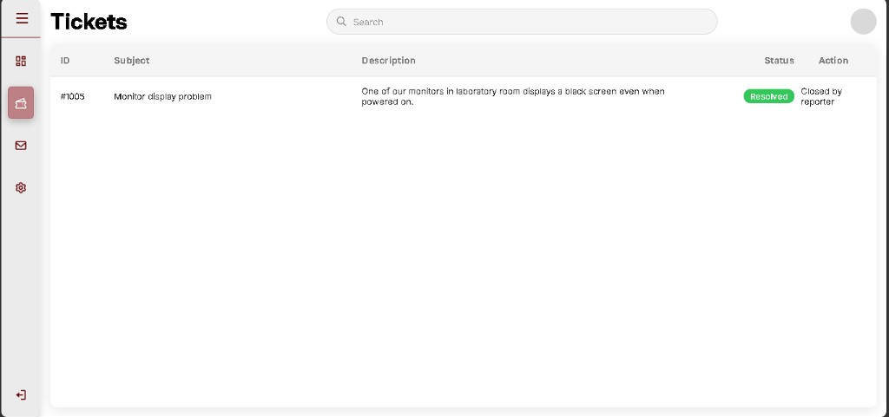

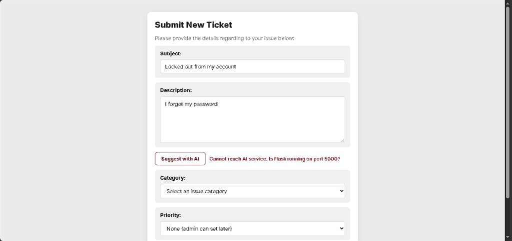

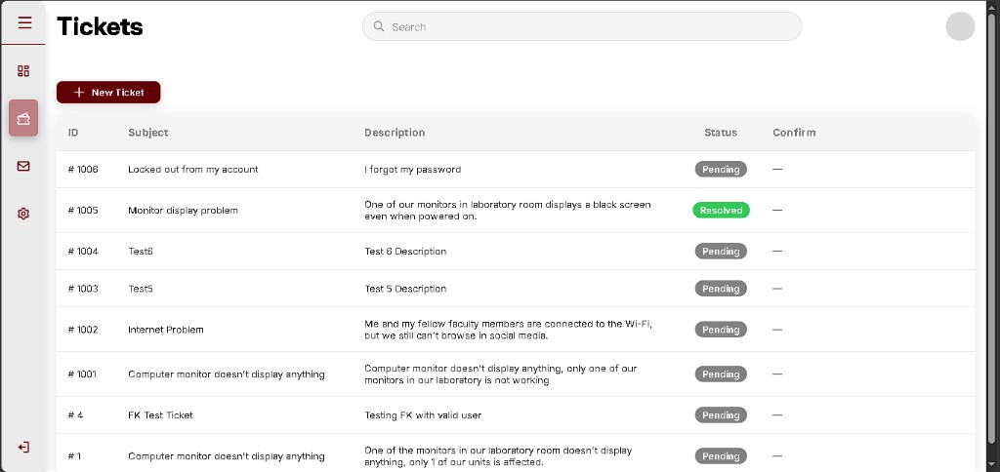

- **In plain language:** Stage 8 core checks passed. AI can be off and tickets still submit by hand. Technician now sees when a reporter closes a ticket.


### A-057 — OpenAI gpt-5.6-luna classifier + secure API key

- **When:** 19 September 2026
- **Official stage:** 7 – AI Integration (paper model)
- **Status:** done (key optional until billing)
- **What we did:** Upgraded `ai/classifier_app.py` to call OpenAI **`gpt-5.6-luna`** when `ai/.env` has `OPENAI_API_KEY`; otherwise keyword fallback. Added `ai/.env.example`, gitignore for `.env`, `docs/SETUP_OPENAI.md`. Priorities mapped to DB ENUM `critical|moderate|low`. Endpoints: `/classify`, `/suggest`, `/health`.
- **Fix snippet** (`ai/.env`):

```env
OPENAI_API_KEY=sk-your-key-here
OPENAI_MODEL=gpt-5.6-luna
OPENAI_REASONING_EFFORT=none
```

- **In plain language:** The campus AI can use the real Luna model when you paste an API key. Without a key it still suggests category/priority using simple word rules so demos never break.
- **Credits note:** Free ChatGPT chat ≠ API. Trial API credit (if any) can test before buying $5; if balance is $0 you need prepaid API credit.


### A-058 — Automatic ticket assignment

- **When:** 19 September 2026
- **Official stage:** 7 / FR auto-assign
- **Status:** done
- **What we did:** `logic/ticket_assign.php` picks the active technician with the fewest open tickets. On Submit, **critical** and **moderate** tickets auto-assign and move to `ongoing`. Admin can still reassign manually.
- **Fix snippet:**

```php
$tech = ticket_auto_assign($conn, $ticket_id, 'ongoing');
```

- **In plain language:** After you submit a serious or medium ticket, the system gives it to the least-busy technician automatically.


### A-059 — Low-priority AI troubleshooting + escalate

- **When:** 19 September 2026
- **Official stage:** 7 / FR AI self-help
- **Status:** done
- **What we did:** Low-priority submit calls `/suggest`, stores tips in `tickets.ai_guidance`, leaves ticket unassigned. User Tickets shows **AI troubleshooting tips** and **Still not fixed — Request Technician** (`ticket_escalate_mngmnt.php` → auto-assign). SQL: `database/v1.5_openai_features.sql` (`ai_guidance`, `ai_method`, `created_at`).
- **In plain language:** Small problems get step-by-step help first. If that fails, one click sends the ticket to a real technician.


### A-060 — Live admin Dashboard charts

- **When:** 19 September 2026
- **Official stage:** 5 leftover / FR Dashboard
- **Status:** done (Performance deferred)
- **What we did:** `logic/dashboard_stats.php` builds counts from MySQL; `admin.php` injects `window.DASHBOARD_CHART_DATA`; charts JS reads live category/severity/week data. Satisfaction remains a **proxy** until a survey table exists. **Technician Performance** left for team consultation.
- **In plain language:** Admin Dashboard graphs now follow real tickets in the database, not fake sample numbers.


### A-061 — Smoke test: AI suggest + auto-assign (#1007)

- **When:** 19–20 September 2026
- **Official stage:** 7 / 8 retest after Luna key + auto-assign
- **Status:** pass
- **What we did / saw:**
  1. Flask `/health` → `openai_configured: true`, model `gpt-5.6-luna`.
  2. New Ticket: subject **Locked out from my account** / description **I forgot my password** → **Suggest with AI** → Category **account**, Priority **critical**, Confidence **72%**.
  3. Submit → green flash: **Ticket #1007 submitted and automatically assigned to a technician.** Status **Ongoing**.
  4. Technician Tickets shows **#1007** with status **Ongoing** (assigned).
- **In plain language:** After AI sets Critical, the system hands the ticket to a technician without the admin clicking Assign.
- **Note:** 72% confidence matches the keyword path; Luna may still fall back until Billing/API credit is added. Auto-assign does not need Luna to work.


### A-062 — Smoke test: low-priority AI tips + Request Technician (#1008)

- **When:** 20 September 2026
- **Official stage:** 7 / FR AI troubleshooting
- **Status:** pass (tests 1–2)
- **What we did / saw:**
  1. **Test 1 — Low submit + tips:** New Ticket **Changing profile picture** / *I don't know how to change my profile picture* → Priority **Low** → Submit. Green flash: *Ticket #1008 submitted. Try the AI troubleshooting tips first…* Status **Pending**. Expanded **AI troubleshooting tips** (keyword steps) + button **Still not fixed — Request Technician**.
  2. **Test 2 — Escalate:** Clicked **Request Technician** → green flash: *Technician assigned to ticket #1008…* Status **Ongoing**. Technician Tickets shows **#1008 Ongoing**. Admin: Priority **Low**, Assigned To technician, queue **6 / 9** (Low **1/3**).
- **In plain language:** Small problems get self-help first. If that fails, one click gives the ticket to a technician.


### A-063 — Live Dashboard charts verified (Test 3)

- **When:** 20 September 2026
- **Official stage:** 5 leftover / FR Dashboard
- **Status:** pass
- **What we did / saw:** Admin Dashboard status cards matched DB (Pending **7**, Ongoing **2**, Resolved **1**). Charts used live ticket counts: Categories Hardware **4** / Network **1** / Account **2** / Other **3**; Severity Critical **29%** / Moderate **43%** / Low **29%**; Report spiked on Sunday (Submitted **10**, Resolved **1**). Recent Ticket History showed **#1008**. Fallback/error banner text was removed. Matplotlib service confirmed (`matplotlib: true`); PNGs rendered for the paper stack.
- **In plain language:** The graphs finally followed the real tickets, same as the cards and history list.


### A-064 — Dashboard UI restored to Chart.js look (live data)

- **When:** 20 September 2026
- **Official stage:** 5 / polish
- **Status:** done
- **What we did:** Matplotlib PNGs worked but looked like pasted science plots (axes titles “(live)”, default matplotlib style). Dashboard UI switched back to **original Chart.js** styling while still feeding **live MySQL** via `DASHBOARD_CHART_DATA`. Matplotlib kept for paper/PNG export (`docs/SETUP_MATPLOTLIB.md`).
- **In plain language:** The Dashboard looks like the original charts again, but the numbers are real—not the old fake poster.


### A-065 — Chart validation + matplotlib docs look (clean titles)

- **When:** 20 September 2026
- **Official stage:** 5 / documentation
- **Status:** done
- **Validation (live DB):** Cards Pending **7** / Ongoing **2** / Resolved **1** (=10). Report Sun Submitted **10** / Resolved **1**. Categories **4 / 0 / 1 / 2 / 3**. Severity **2 / 3 / 2** (~29% / 43% / 29%). Satisfaction proxy **5 / 3 / 14 / 9 / 5** (not a real survey). Chart.js UI pass kept as A-064 screenshots; Dashboard switched back to **matplotlib PNGs** for paper docs with **no “(live)” / fallback text**. Chart.js revert path noted in `docs/SETUP_MATPLOTLIB.md`.
- **In plain language:** Every chart matches the real ticket counts. Docs shots use the matplotlib style without extra labels on the pictures.


### A-066 — Document matplotlib Dashboard shots + revert to Chart.js UI

- **When:** 20 September 2026
- **Official stage:** 5 / documentation
- **Status:** done
- **What we documented (matplotlib PNGs, clean titles):**
  - Status cards: Pending **7**, Ongoing **2**, Processing **0**, Confirming **0**, Resolved **1**.
  - Tickets Report: Sunday Submitted **10**, Resolved **1**.
  - Categories: Hardware **4**, Software **0**, Network **1**, Account **2**, Other **3** (bar value labels on PNG).
  - Customer Satisfaction proxy bars (~**5 / 3 / 14 / 9 / 5**).
  - Severity donut: Critical **29%**, Moderate **43%**, Low **29%**.
  - Recent Ticket History header present (#1008 on prior shots).
- **What we did after docs:** Reverted Admin Dashboard UI to **Chart.js** live look (`pages/partials/dashboard_charts.php` canvases + `dashboard_static_charts.js`). Matplotlib PNG pipeline kept for paper (`logic/dashboard_chart_png.php`, `ai/charts.py`).
- **In plain language:** The matplotlib Dashboard screenshots are the ones for the paper. Day-to-day admin view is back to the smoother Chart.js charts with the same real numbers.

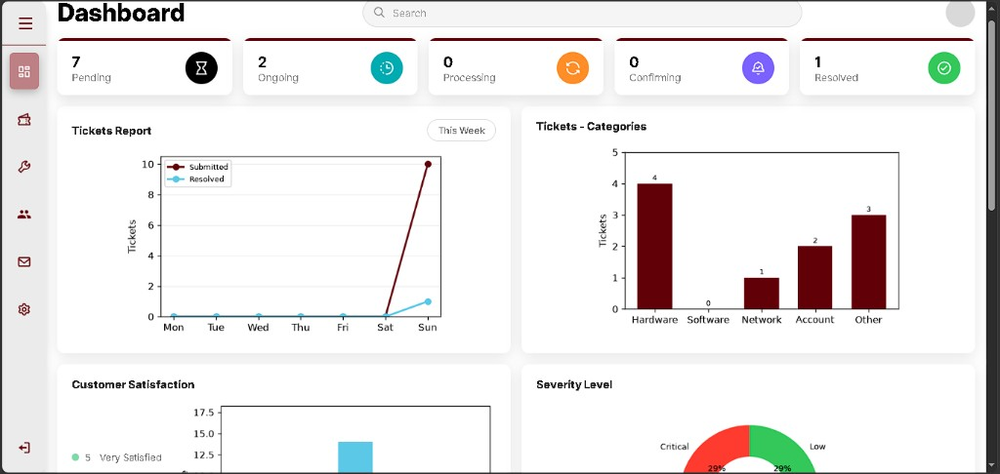

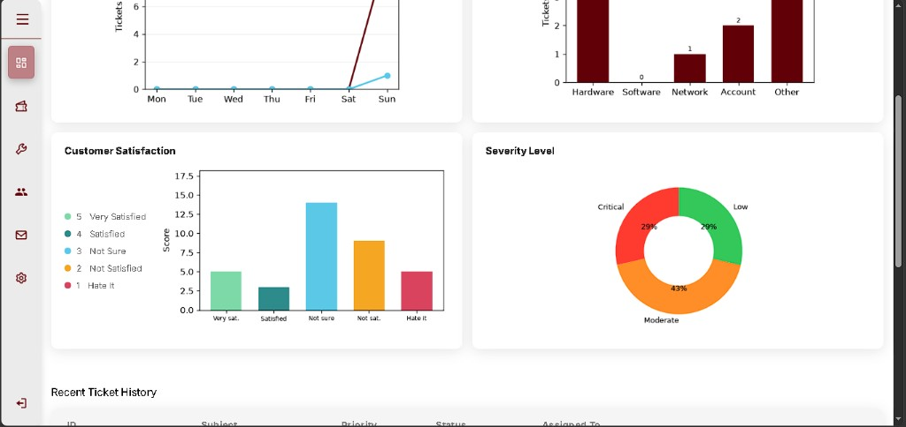


### A-067 — Submit ticket auto-priority and auto-assign (V1.6)

- **When:** 25 September 2026
- **Official stage:** adviser follow-up after showcase
- **Status:** done (fixes B-056, B-057)
- **What we did:** Copied the showcase build into `CP2_V1.6` (cookie `/CP2_V1.6/`). New Ticket no longer shows Priority or **Suggest with AI**. On Submit, Flask classifies priority (`gpt-5.6-luna` or keyword fallback; default **moderate** if the service is down) and the ticket is assigned to the least-busy active technician immediately.
- **In plain language:** The user only describes the problem and picks a category. The system sets how urgent it is and who will handle it.


### A-069 — Priority score and 9-slot borrowing (paper tables 4–7)

- **When:** 28 September 2026
- **Official stage:** V1.6, after the revised paper tables
- **Status:** done (fixes B-059, B-060, B-061)
- **What we did:** Compared the live queue and classifier with Tables 4, 5, 6, and 7 in `ZPGC Capstone Paper REVISED.docx`. They did not match. Submit now scores urgency (1–3) × impact (1–3). Table 6 maps the score: 1–2 Low, 3–6 Moderate, 7 and above Critical. Table 5 adds **+40** when 30 or more open tickets share the same subject, which forces Critical. The admin queue now selects a batch of at most 9 and gives unused lower slots to the highest severity that still has tickets (Table 7). Checked with `tools/check_matrix.php` (all cases pass).
- **Paper conflict kept on purpose:** the Table 4 figure says **+30** points. Table 5 text says **+40**. The code follows Table 5.
- **In plain language:** A ticket is no longer labeled from one word. The system multiplies how bad it is by how many people it affects, then the queue fills nine seats and lends empty seats upward.


### A-070 — Login fatal when MySQL is stopped (B-062)

- **When:** 28 September 2026
- **Status:** done
- **What we did:** Sign-in threw an uncaught `mysqli_sql_exception` because MySQL was not running. Started MySQL. `config.php` now turns off mysqli exceptions so a stopped database shows “Connection failed… Start MySQL” instead of a stack trace.
- **In plain language:** The login page can connect again. If MySQL is off, the page says to start it in XAMPP instead of dumping a fatal error.


### A-071 — Score retest #1012 and restore Low self-help (B-063)

- **When:** 28 September 2026
- **Status:** done
- **What we saw:** Submit **Changing profile picture** / *I don't know how to do it.* Green message: *Ticket #1012 submitted. Priority set to Low (score 1)*. phpMyAdmin: `urgency=1`, `impact_level=1`, `severity_score=1`, `priority=low`, `ai_method=kw-quota`. Admin queue **9 / 9**, Low **4 / 4 (+1 borrowed)** because Critical only used 2 of 3 seats.
- **What we fixed after that shot:** Low tickets were still assigned immediately, so troubleshooting never appeared. A Low submit now stores tips, stays **Pending** and unassigned, and the user chooses **These steps worked** or **Still not fixed — Request Technician**. Moderate and Critical still assign on submit.
- **In plain language:** #1012 proved the score and the borrowed seat. Low problems now get steps first; a technician is only called if those steps fail.

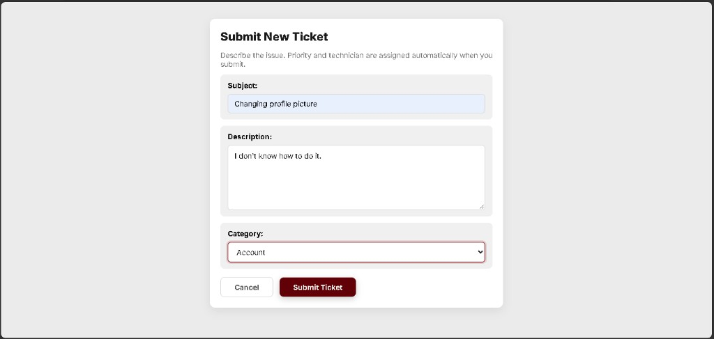

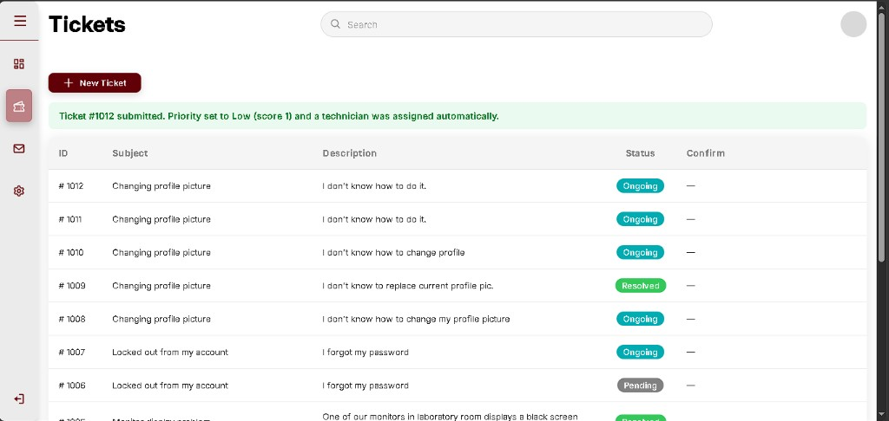

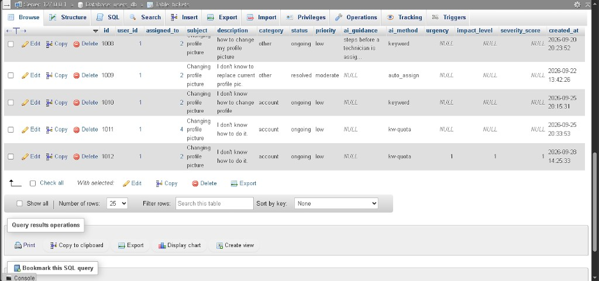

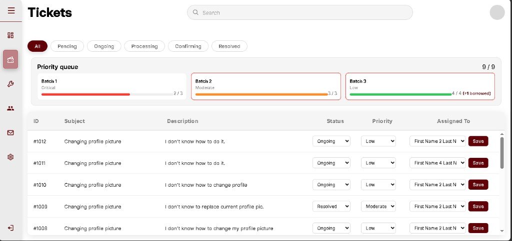

### A-072 — Low self-help: steps worked (#1013) and request technician (#1014)

- **When:** 28 September 2026
- **Status:** done (B-064 found on the resolved row)
- **What we did:**
  1. Submit **Changing profile picture** / *I don't know how to change my profile.* → *Ticket #1013 submitted as Low (score 1). Try the troubleshooting steps first.* Status **Pending**. Tips opened, with **These steps worked** and **Still not fixed — Request Technician**.
  2. Clicked **These steps worked** → *Ticket #1013 marked resolved from the troubleshooting steps.* Status **Resolved**.
  3. New ticket **#1014** *I don't know how to replace my profile.* Same Low tips, then **Request Technician** → *Technician assigned to ticket #1014.* Status **Ongoing**.
- **In plain language:** A small problem can be closed by the user after the steps, or handed to a technician if the steps fail.

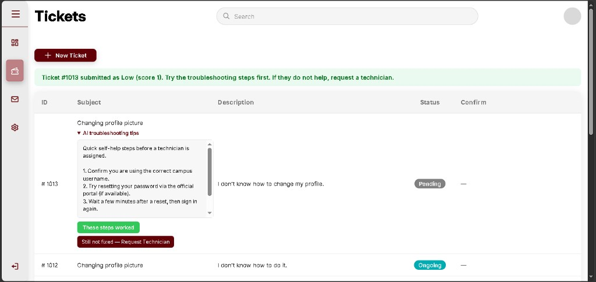

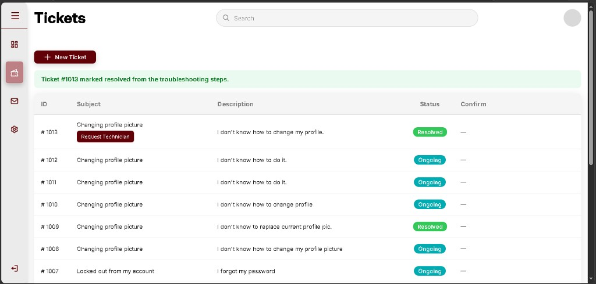

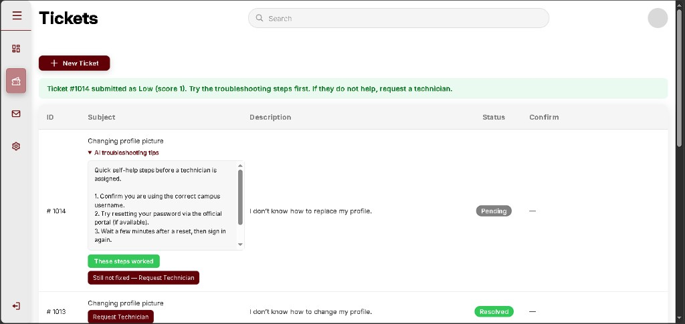

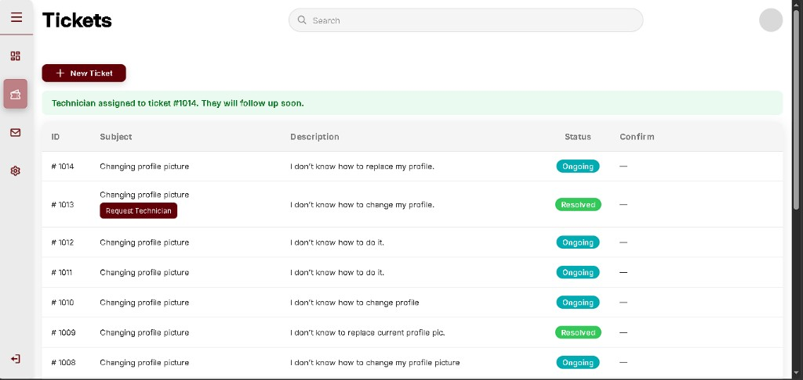


### A-073 — Performance uses resolved tickets by category

- **When:** 30 September 2026
- **Status:** done (fixes B-065, B-066)
- **What we did:** Removed Team ID and the Technician Record List. The first table is **Resolved by Category** (total, Critical, Moderate, Low) from tickets whose status is resolved. The log below lists those same tickets: Category, Ticket ID, Subject, Description, registration time, response time, resolution time, and severity. Response time is registration to first technician assignment. Resolution time is registration to the moment it became resolved. Technician role routing stays out.
- **In plain language:** Performance now counts real closed tickets for each kind of problem, instead of fake team numbers.
- **Retest (30 September 2026):** Admin Performance. **Resolved by Category** shows Hardware **1** Low, Account **1** Low, Other **1** Moderate, Software and Network **0**. The log lists **#1013** Account Low, **#1009** Other Moderate, and **#1005** Hardware Low, with real registration dates. Response Time and Resolution Time are **—** because those tickets were closed before the clocks existed.

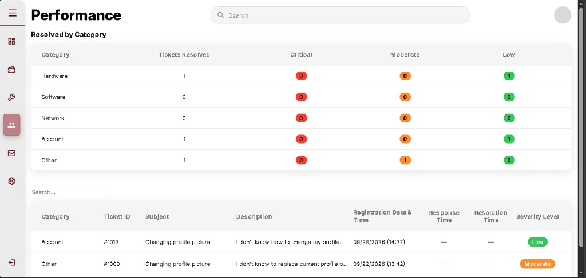

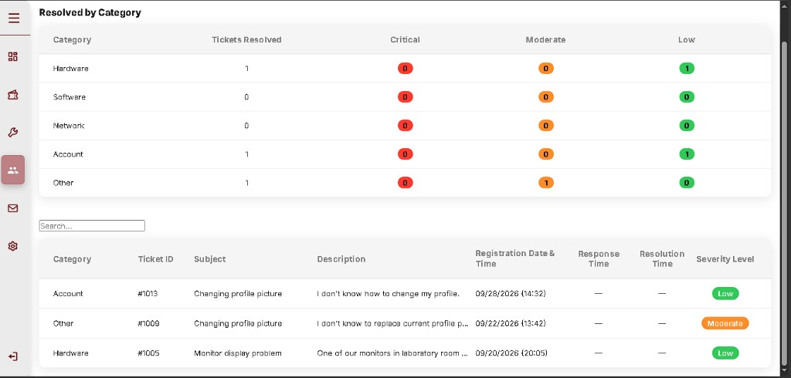


### A-074 — Profile circle menu (settings and logout moved)

- **When:** 1 October 2026
- **Status:** in progress (B-067–B-069 still open for screenshots)
- **What we did:** Took Settings and Logout off the left sidebar on user, technician, and admin. The top-right circle opens **Profile**, **Settings**, and **Logout**. Settings still opens the existing settings page. Logout still uses `logic/logout.php`. Profile can save first name and last name.
- **In plain language:** The account controls now sit in the circle. Three problems are still on the page on purpose so they can be photographed before the fix.


---

## Issue log

Problems found or introduced. Each entry: what was seen, **Causing snippet**, mermaid, executed or planned fix. **In plain language** explains the snippet for readers who do not write PHP every day.

### B-001 — Apache 404 on landing; Go Live looked fine

- **When:** 29 June 2026 (1 day)
- **Status:** fixed
- **What I saw:** Go Live showed the welcome page. `.../landing_page.php` was Not Found.


- **Cause:** File was `landing_page.html`.
- **Causing snippet:** disk `pages/landing_page.html` vs URL `landing_page.php`.
- **In plain language:** The editor preview can open `.html`. The live Apache URL asked for `.php`, so it said Not Found.
- **Solution executed:** Rename to `landing_page.php`.

```
Rename: pages/landing_page.html  →  pages/landing_page.php
```

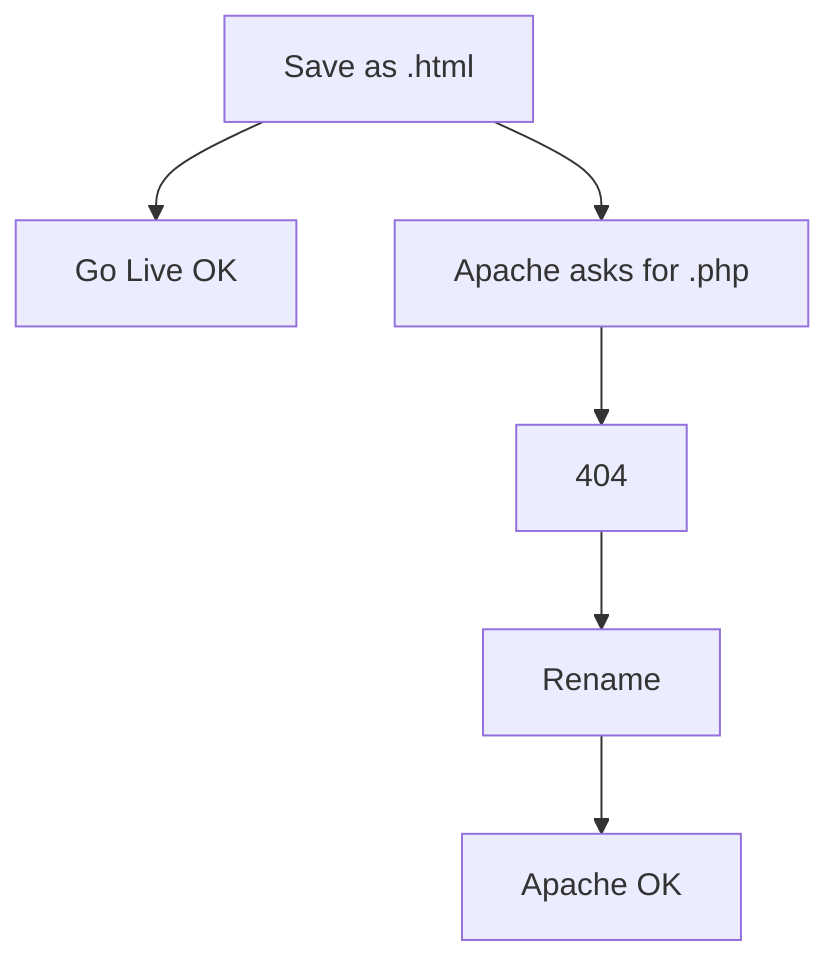
```mermaid
flowchart TD
  A[Save as .html] --> B[Go Live OK]
  A --> C[Apache asks for .php]
  C --> D[404]
  D --> E[Rename]
  E --> F[Apache OK]
```

### B-002 — Public signup offers Administrator (authentic early UI)

- **When:** 30 June – 4 July 2026 (same stretch as A-002)
- **Status:** fixed (A-036, 9 September 2026)
- **What I saw:** On **SIGNUP**, the Role list includes User, **Administrator**, and Technician. A visitor could pick Administrator on the public page. The first real build did this; later versions take Administrator off the public list. Admin accounts should not be self-created from the welcome flow.
- **Causing snippet** (`pages/login_signup.php` signup form):

```html
<select name="role" required>
    <option value="" disabled selected>Role</option>
    <option value="user">User</option>
    <option value="admin">Administrator</option>
    <option value="techn">Technician</option>
</select>
```

- **In plain language:** Anyone signing up could claim to be an admin. PHP would store `role = admin` for that row. The product still has an admin **role** — it must not stay a public dropdown choice.
- **Queued fix:** Delete the Administrator `<option>` from this public form (keep User + Technician). Do not remove the admin role from the database or from admin-only creation paths.
- **Solution executed (9 September 2026, A-036):** Removed `<option value="admin">` from `login_signup.php`. Handler already allowed only `user` / `techn`.

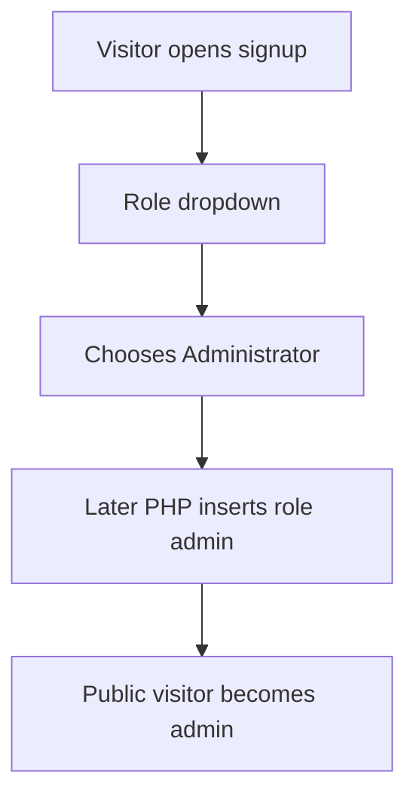
```mermaid
flowchart TD
  A[Visitor opens signup] --> B[Role dropdown]
  B --> C[Chooses Administrator]
  C --> D[Later PHP inserts role admin]
  D --> E[Public visitor becomes admin]
```

### B-003 — Signup stacked under login

- **When:** 5–6 July 2026 (2 days)
- **Status:** fixed
- **What I saw:** Go Live on `login_signup.html`. LOGIN typed normally. **Signup now!** showed SIGNUP **under** LOGIN instead of replacing it.


- **Cause:** JS used `.formBox`; HTML/CSS use `.form-box`.
- **Causing snippet:**

```javascript
document.querySelectorAll(".formBox")
```

- **In plain language:** The script looked for a class name that the HTML did not use. LOGIN never hid, so SIGNUP appeared underneath it.
- **Solution executed:**

```javascript
document.querySelectorAll(".form-box").forEach(function (form) {
    form.classList.remove("active");
});
```

### B-004 — Landing Signup now! opened LOGIN

- **When:** 9–11 July 2026 (3 days)
- **Status:** fixed
- **Cause:** Nothing read `?form=signup`.
- **Causing snippet:** landing link `login_signup.php?form=signup` with no matching `URLSearchParams` code yet.
- **In plain language:** The Signup now! button added extra text to the URL. The page ignored it, so it always showed LOGIN.
- **Solution executed:**

```javascript
window.addEventListener("DOMContentLoaded", function (form) {
    var params = new URLSearchParams(window.location.search);
    if (params.get("form") === "signup") {
        showForm("signup-form");
    }
})
```

### B-005 — `connection_error` vs `connect_error` (latent)

- **When:** 22 July 2026 (found on connect test)
- **Status:** open (page still printed Connected because MySQL was up)
- **What I saw:** Browser showed `Connected to users_db`.
- **Cause:** Success path never uses the die() line. The property on mysqli is `connect_error`. `connection_error` is empty, so a **failed** connect would die with a blank reason.
- **Exact causing snippet:**

```php
die("Connection failed: " . $conn->connection_error);
```

- **In plain language:** If MySQL is running, you never see this line. If MySQL is down, PHP should print why. The property name is misspelled, so the reason would be blank. Not fixed yet.

- **Queued fix:** `$conn->connect_error` in both the `if` and the `die` string.

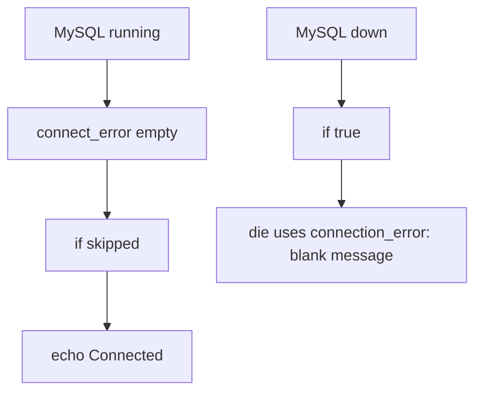
```mermaid
flowchart TD
  A[MySQL running] --> B[connect_error empty]
  B --> C[if skipped]
  C --> D[echo Connected]
  E[MySQL down] --> F[if true]
  F --> G["die uses connection_error: blank message"]
```

### B-006 — Stylesheet looked missing on first landing pass

- **When:** 28 June 2026 (1 extra day inside A-001)
- **Status:** fixed (simulated delay: wrong relative path, then `../css/landing_page.css`)
- **What I saw:** Raw HTML, no maroon bar, until the `link` href went up one folder into `css/`.

- **Causing snippet:** `href` pointed at `css/...` from `pages/` without `../`.
- **In plain language:** The style file lives one folder up from the page. Without `../`, the browser never found the maroon CSS.

### B-007 — Logo link still used `.html` after rename to `.php`

- **When:** 12–13 July 2026 (inside A-005)
- **Status:** fixed
- **What I saw:** After `landing_page.php` / `login_signup.php` existed, the ZPGC logo on login/signup could still point at `landing_page.html`. On Apache that old name is Not Found (same class of bug as B-001).
- **Causing snippet** (`pages/login_signup.php` logo):

```html
<a href="../pages/landing_page.html">
```

- **In plain language:** The files were renamed to `.php`, but the logo link still asked for `.html`. Apache treats those as different filenames.
- **Solution executed:**

```html
<a href="../pages/landing_page.php">
```

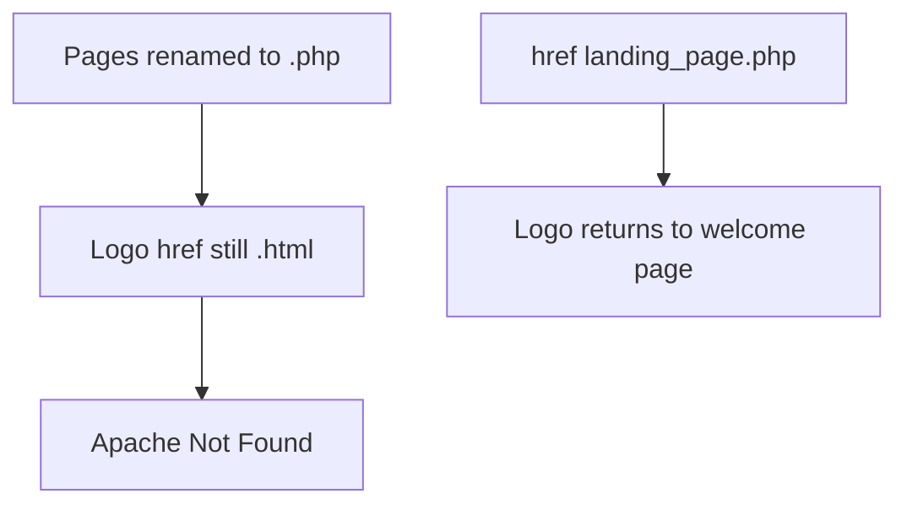
```mermaid
flowchart TD
  A[Pages renamed to .php] --> B[Logo href still .html]
  B --> C[Apache Not Found]
  D[href landing_page.php] --> E[Logo returns to welcome page]
```

### B-008 — `config.php` 404 until it lived in `logic/`

- **When:** 21 July 2026 (1 day inside A-007)
- **Status:** fixed
- **What I saw:** `.../pages/config.php` Not Found. File belongs in `logic/config.php`.

- **Causing snippet:** URL `pages/config.php` while the file is `logic/config.php`.
- **In plain language:** Connection code lives with the other PHP handlers, not next to the HTML pages. The wrong folder in the address bar is Not Found.

### B-009 — Signup submit: Apache 404

- **When:** 23 July 2026 (1 day, Stage 2)
- **Status:** fixed
- **What I saw:** Filled signup (User) and submitted. Browser showed **Not Found**.


- **Cause:** Form `action` is `user_mngmnt.php` (underscore). Disk had `logic/user.mngmnt.php` (dot).
- **Causing snippet:** form `action=".../user_mngmnt.php"` vs filename `user.mngmnt.php`.
- **In plain language:** Submit posts to a filename with an underscore. The file on disk used a dot. Apache could not find it (404).
- **Solution executed:** Renamed to `logic/user_mngmnt.php`. Both forms `method="post"`. Signup then inserted a row (A-008).

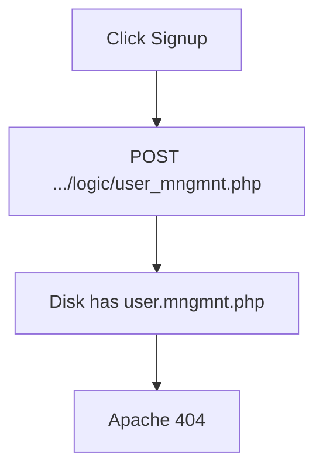
```mermaid
flowchart TD
  A[Click Signup] --> B["POST .../logic/user_mngmnt.php"]
  B --> C[Disk has user.mngmnt.php]
  C --> D[Apache 404]
```

### B-010 — `session_start()` missing semicolon (syntax errors)

- **When:** 25 July 2026 (Stage 2 login)
- **Status:** fixed
- **What I saw:** `user_mngmnt.php` — unexpected token `require_once`. `login_signup.php` — unexpected variable `$login_error`.
- **Cause:** `session_start()` had no `;`.
- **Causing snippet:**

```php
session_start()
```

- **In plain language:** PHP needs a semicolon at the end of that line. Without it, the next lines look like a syntax error and login never runs.
- **Solution executed:**

```php
session_start();
```

Login tests recorded as A-009.

### B-011 — Apache 404 on `user.php`

- **When:** 7 August 2026
- **Status:** fixed
- **What I saw:** `http://localhost/CP2_v1.1/pages/user.php` Not Found. Same 404 after switching the folder to `CP2_V1.1`. After rename, the URL loaded.


- **Cause:** File was `users.php`. URL is `user.php`.
- **Causing snippet:** disk `pages/users.php` vs URL `pages/user.php`.
- **In plain language:** The address bar asked for `user.php`. The file was named `users.php`. Apache treats those as different names.
- **Solution executed:** Renamed `pages/users.php` → `pages/user.php`.

### B-012 — Dashboard chrome: CSS layout not applied (`main_wrap`)

- **When:** 7 August 2026
- **Status:** fixed
- **What I saw:** `user.php` loaded; logo, Dashboard icon, and `h1` stacked in the top-left on white. No grey sidebar until the class matched CSS.


- **Cause:** `class="main_wrap"` vs CSS `.main-wrap`.
- **Causing snippet:**

```html
    <main class="main_wrap">
```

- **In plain language:** CSS styles the name with a hyphen. The HTML used an underscore, so the grey sidebar rules never applied.
- **Solution executed:**

```html
    <main class="main-wrap">
```

- **After fix:** Grey sidebar, logo, rose Dashboard control. Main area still mostly empty (search and extra nav not typed yet). Dashboard at sidebar bottom is `:last-child` until Logout is added. After-fix capture is on **A-010**.

### B-013 — Settings label under the gear (not beside it)

- **When:** 8 August 2026 (A-011 reload)
- **Status:** fixed
- **What I saw:** Tickets, Mailbox, and Logout keep icon + text on one row. **Settings** puts the word under the gear.


- **Cause:** `.nav-link` is `display: flex` (icon and `.link-text` on one row). Settings closed `</a>` **before** the `<span>`. The span is a sibling of the link, so it is not in that flex row.
- **Tried (does not fix layout):** `id="settings"` on the span. `id` names the element for later JS; `main_interface.css` has no `#settings` rule that changes display. Label still under the gear.


- **Exact causing snippet** (`pages/user.php` after that try):

```html
                                    </svg>
                                </a>
                                <span class="link-text" id="settings">Settings</span>
```

- **In plain language:** The word Settings sat outside the clickable row. Flex layout only lines up children inside that row, so the word wrapped under the gear.

- **Queued fix:** Move the span **inside** `.nav-link`, after `</svg>`, same as Tickets/Mailbox. Keep `id="settings"`.

```html
                                    <span class="link-text" id="settings">Settings</span>
                                </a>
```

- **Solution executed:** Span is a child of `.nav-link`, immediately after `</svg>` (same order as Tickets/Mailbox). Note: “before the svg” would put the word to the **left** of the gear; the file on disk is svg then span.

```html
                                    </svg>
                                    <span class="link-text" id="settings">Settings</span>
                                </a>
```


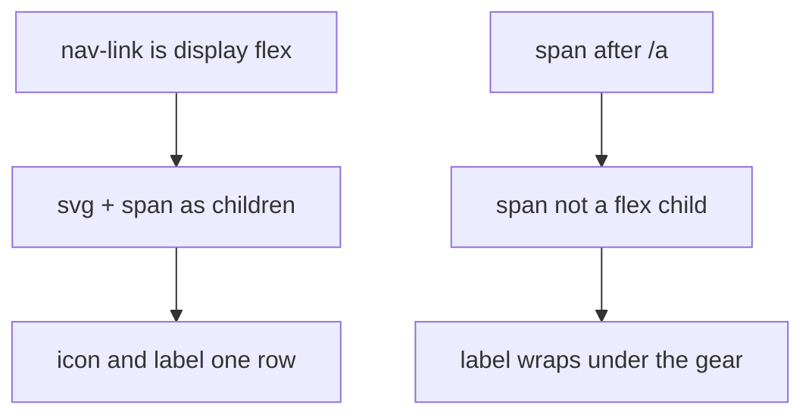
```mermaid
flowchart TD
  A["nav-link is display flex"] --> B[svg + span as children]
  B --> C[icon and label one row]
  D["span after /a"] --> E[span not a flex child]
  E --> F[label wraps under the gear]
```

### B-014 — Apache 404 on `admin.php`

- **When:** 11 August 2026 (A-014)
- **Status:** fixed
- **What I saw:** `http://localhost/CP2_v1.1/pages/admin.php` — Apache **Not Found**. `user.php` and `techn.php` loaded.


- **Cause:** The dashboard HTML lives at `logic/admin.php`. Apache asked for `pages/admin.php`. Same class of mismatch as B-008 (`config.php` in the wrong folder) and B-011 (`users.php` vs `user.php`). Folder casing `CP2_v1.1` vs `CP2_V1.1` is not why this 404 happened: `pages/` has no `admin.php`.
- **Exact causing location:**

```
logic/admin.php     ← file on disk
pages/admin.php     ← URL
```

- **In plain language:** The browser asked for a file in `pages/`. The HTML was saved under `logic/`. Wrong folder = Not Found.

- **Queued fix:** Move (or save a copy as) `pages/admin.php`. Do not keep the role dashboard under `logic/` (`logic/` is for PHP handlers like `user_mngmnt.php`). After the move, use `http://localhost/CP2_V1.1/pages/admin.php`.
- **Solution executed:** File is now `pages/admin.php`. `logic/admin.php` is gone. Prefer URL casing `CP2_V1.1` (cookie path later). Attached capture after the move still shows the old 404 URL; on disk the page is in `pages/`.


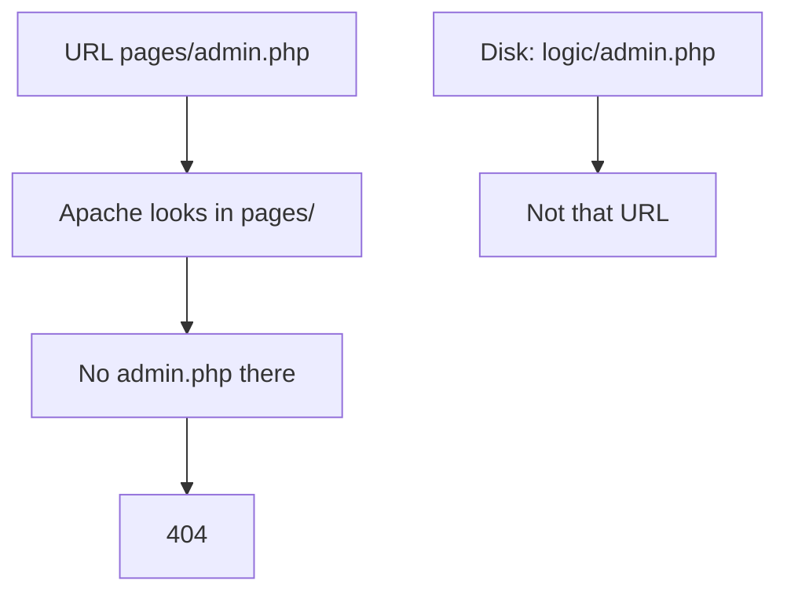
```mermaid
flowchart TD
  A["URL pages/admin.php"] --> B[Apache looks in pages/]
  B --> C[No admin.php there]
  C --> D[404]
  E["Disk: logic/admin.php"] --> F[Not that URL]
```

### B-015 — Analytics label under the icon (`admin.php`)

- **When:** 11 August 2026 (A-015)
- **Status:** fixed
- **What I saw:** Admin page loads. **Analytics** text sits under the bar-chart icon (same layout as Settings on **B-013**).
- **Cause:** `.nav-link` is `display: flex`. Analytics closed `</a>` before the `<span>`, so the span is not a flex child.
- **Exact causing snippet** (`pages/admin.php`):

```html
                            <li class="nav-list-item" data-nav="analytics">
                                <a href="#" class="nav-link">
                                    <svg xmlns="http://www.w3.org/2000/svg" width="24" height="24" fill="currentColor"
                                        viewBox="0 0 24 24">
                                        <path d="M4 2H2v19c0 .55.45 1 1 1h19v-2H4z"></path>
                                        <path d="M17 12h2v6h-2zm-5-8h2v14h-2zM7 9h2v9H7z"></path>
                                    </svg>
                                </a>
                                <span class="link-text">Analytics</span>
                            </li>
```

- **In plain language:** Same as Settings (B-013): the label was outside the link, so it sat under the icon.

- **Queued fix:** Same as B-013 — span inside `.nav-link` after `</svg>`:

```html
                                    </svg>
                                    <span class="link-text">Analytics</span>
                                </a>
```

- **Solution executed:** Span is inside `.nav-link` after `</svg>` (`pages/admin.php`).

- **Still leftover:** Utilities `<li>` still has `data-nav="tickets"`. Change to `data-nav="utilities"` on the next pass.

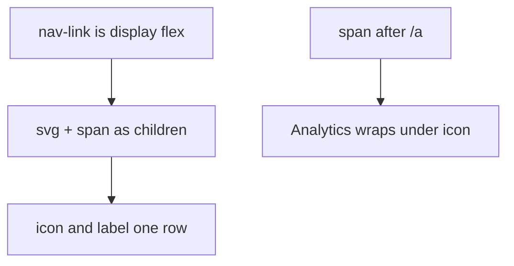
```mermaid
flowchart TD
  A["nav-link is display flex"] --> B[svg + span as children]
  B --> C[icon and label one row]
  D["span after /a"] --> E[Analytics wraps under icon]
```

### B-016 — Mailbox / Settings top bar unstyled (`<head>` vs `<header>`)

- **When:** 12 August 2026 (A-016)
- **Status:** fixed
- **What I saw:** Dashboard and Tickets used the pill search and profile circle. Mailbox and Settings showed a stacked `h1`, a small magnifying-glass, and a raw Search box (no pill, no circle). Sidebar still collapsed.


- **Cause:** Showcase CSS is `.showcase .head header` (class `head` on the wrapper, then a **`<header>`** element). Mailbox and Settings used **`<head>`** inside `.head`. `<head>` is the document-head tag, not the top bar. The `header` selector did not match, so search/profile rules did not apply. The browser may also move a nested `<head>` out of `.showcase`.
- **Exact causing snippet:**

```html
                <div class="head">
                    <head>
                        <h1>Mailbox</h1>
```

- **In plain language:** CSS styles a `<header>` inside the top bar. Mailbox used `<head>`, which is the tag for the document title area, so the search pill never applied.
- **Solution executed:** Same inner tag as Dashboard/Tickets:

```html
                <div class="head">
                    <header>
                        <h1>Mailbox</h1>
                        ...
                    </header>
                </div>
```

Same for Settings. Do not change `main_interface.css` for this.

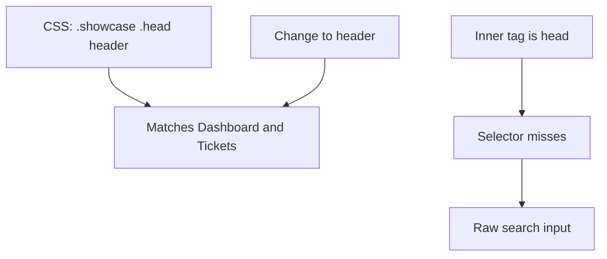
```mermaid
flowchart TD
  A["CSS: .showcase .head header"] --> B[Matches Dashboard and Tickets]
  C["Inner tag is head"] --> D[Selector misses]
  D --> E[Raw search input]
  F["Change to header"] --> B
```

### B-017 — New Ticket shows on Dashboard

- **When:** 13 August 2026 (A-017)
- **Status:** fixed
- **What I saw:** `user.php` with **Dashboard** selected and `h1` Dashboard. Maroon **New Ticket** still appears in the white area.


- **Cause:** `.page-content` is `display: none` except the matching `#page-…`. The toolbar was placed **after** `#page-tickets` closed, as a direct child of `.showcase`. It is not inside a `.page-content`, so it is never hidden.
- **Exact causing snippet** (`pages/user.php`):

```html
            </div>
            <div class="tickets-toolbar">
                <a href="../pages/ticket.php" class="btn-new-ticket">
```

The `</div>` above ends `#page-tickets`. The toolbar is the next sibling.
- **In plain language:** Hidden panels only hide what is inside them. New Ticket sat outside the Tickets panel, so it stayed visible on Dashboard too.
- **Queued fix:** Move `.tickets-toolbar` **inside** `#page-tickets`, after the Tickets `.head`, before that page-content `</div>`. Do not change CSS.
- **Solution executed:** Toolbar is a child of `#page-tickets` (after `.head`, before that `</div>`). Mailbox `#page-messages` follows.

```html
                </div>
                <div class="tickets-toolbar">
                    <a href="../pages/ticket.php" class="btn-new-ticket">
```

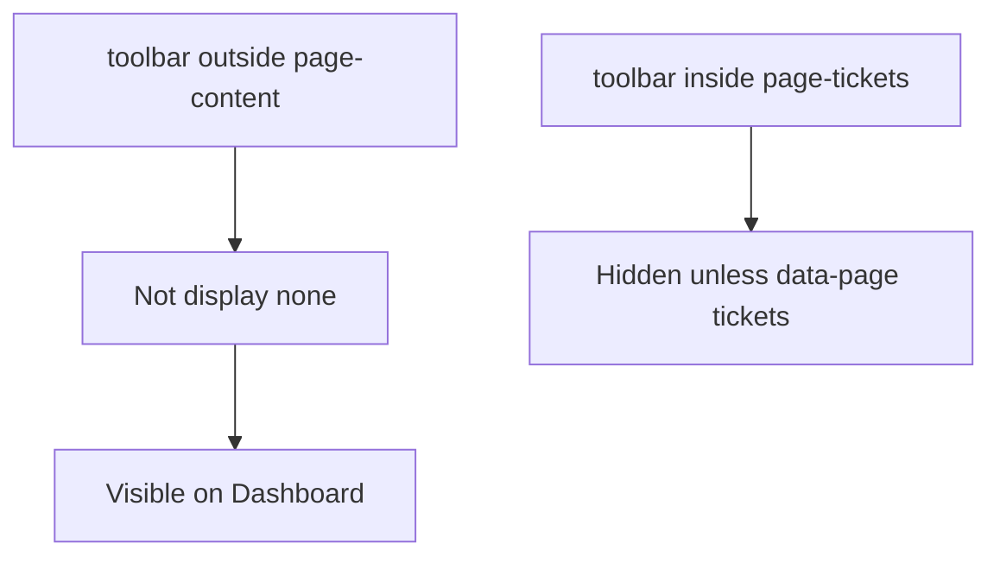
```mermaid
flowchart TD
  A["toolbar outside page-content"] --> B[Not display none]
  B --> C[Visible on Dashboard]
  D["toolbar inside page-tickets"] --> E[Hidden unless data-page tickets]
```

### B-018 — Submit Ticket: white page, not Apache 404

- **When:** 14 August 2026 (A-018)
- **Status:** fixed (A-019: `header` to `user.php`)
- **What I saw:** After submit, URL is `http://localhost/CP2_V1.1/logic/ticket_mngmnt.php`. The viewport is blank white. Not “Not Found”.


- **Cause:** Apache found the file. A missing URL would be 404. `logic/ticket_mngmnt.php` exists and is **empty**. PHP runs, prints nothing, so the browser shows a white page.
- **Causing snippet:** empty `logic/ticket_mngmnt.php` (no `header`, no HTML).
- **In plain language:** The address was correct, so this is not a 404. An empty PHP file has nothing to show, so the screen is white.
- **Queued:** Leave the file. Next lesson types PHP in it (then INSERT). Do not treat this as a CSS failure.
- **Solution executed:** `ticket_mngmnt.php` now runs `header('Location: ../pages/user.php')` on `submit-ticket` (A-019). White page gone. Still no INSERT.

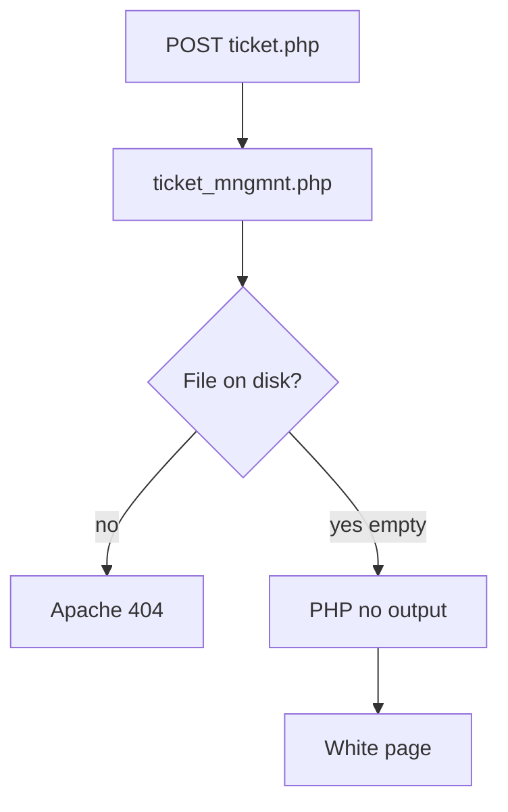
```mermaid
flowchart TD
  A[POST ticket.php] --> B[ticket_mngmnt.php]
  B --> C{File on disk?}
  C -->|no| D[Apache 404]
  C -->|yes empty| E[PHP no output]
  E --> F[White page]
```

### B-019 — #1064 saving table `tickets`

- **When:** 17 August 2026 (A-021)
- **Status:** fixed
- **What I saw:** phpMyAdmin create-table form for `tickets` in `users_db`. Save showed MariaDB:

```
#1064 - You have an error in your SQL syntax; check the manual that corresponds to your MariaDB server version for the right syntax to use near 'network', 'other') NOT NULL , `status` ENUM('pending') NOT NULL DEFAULT 'pend...' at line 1
```

No `tickets` table in the left list (only `users`).


- **Cause:** phpMyAdmin builds `CREATE TABLE` from the designer. MariaDB rejected it at `'network', 'other')`. That token sits in the `category` ENUM. Usual cause: a missing or extra `'` in Length/Values for `category` (often around `account`), so the ENUM string is invalid before `'network'`. An unnamed extra `INT` row can also make invalid SQL after `status`.
- **Same Save attempt also had:** no `id` PRIMARY A_I; `subject` VARCHAR with blank length; leftover blank column row.
- **Causing snippet (designer Length/Values for `category`):** a broken ENUM string that MariaDB reported near `'network', 'other')`.
- **In plain language:** phpMyAdmin turns the grid into SQL. If the category list is missing a quote, MySQL rejects the whole Save and the table is not created.
- **Queued fix:** Dismiss the error. Keep table name `tickets`. Six named columns only. `category` Length/Values exactly `'hardware','software','account','network','other'` (straight quotes, every value quoted, commas between). Then Save again.
- **Solution executed:** Second Save. Table `tickets` exists. Structure matches A-021.

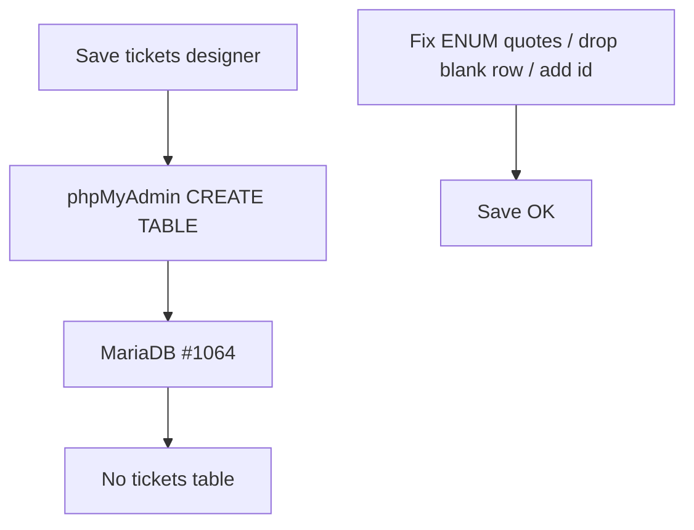
```mermaid
flowchart TD
  A[Save tickets designer] --> B[phpMyAdmin CREATE TABLE]
  B --> C[MariaDB #1064]
  C --> D[No tickets table]
  E[Fix ENUM quotes / drop blank row / add id] --> F[Save OK]
```

### B-020 — Submit Ticket opens LOGIN; no `tickets` row

- **When:** 18 August 2026 (A-022)
- **Status:** fixed
- **What I saw:** `http://localhost/CP2_V1.1.2/pages/ticket.php` with Hardware / subject / description. Submit Ticket. URL became `login_signup.php` (LOGIN form). `tickets` Browse unchanged (empty).


- **Cause:** Guard uses `$_POST['email']`. `ticket.php` has no `name="email"` field, so that key is never in POST. The `header` to `login_signup.php` runs every submit. `INSERT` never runs. Login stores email on `$_SESSION['email']`, not POST.
- **Exact causing snippet** (`logic/ticket_mngmnt.php`):

```php
    if (!isset($_POST['email'])) {
        header('Location: ../pages/login_signup.php');
        exit();
    }
    $email = $_SESSION['email'];
```

- **In plain language:** The ticket form never sends an email box. The code asked POST for email anyway, so the check always failed and sent you to LOGIN. The INSERT never ran. Email after login lives in the session.

- **Queued fix:** Same `if`, but `isset($_SESSION['email'])`. Do not add an email input on `ticket.php`. Then log in as an **active** user before submitting again.
- **Solution executed:** Guard is `isset($_SESSION['email'])`. After B-021, Submit Ticket → dashboard and a `tickets` row.

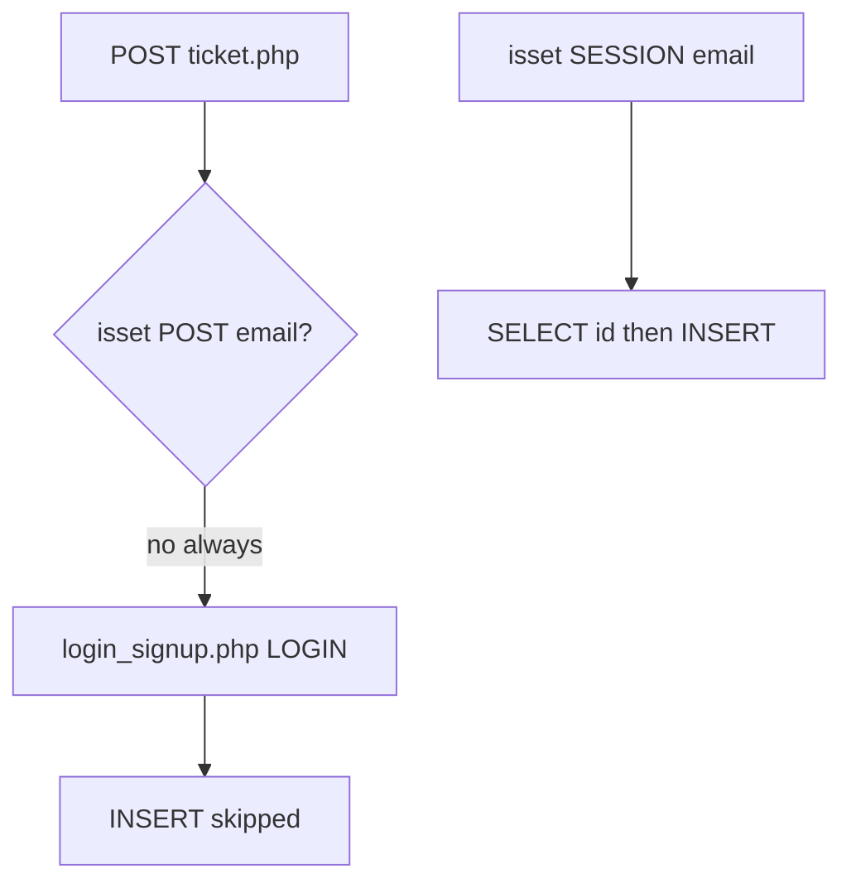
```mermaid
flowchart TD
  A[POST ticket.php] --> B{isset POST email?}
  B -->|no always| C[login_signup.php LOGIN]
  C --> D[INSERT skipped]
  E[isset SESSION email] --> F[SELECT id then INSERT]
```

### B-021 — Login `user1@gmail.com`: account not activated

- **When:** 18 August 2026 (A-023)
- **Status:** fixed (A-023 phpMyAdmin test row; ongoing approval via A-028 Activate)
- **What I saw:** `http://localhost/CP2_V1.1.2/pages/login_signup.php`. Email `user1@gmail.com`. After Login, gray text **Account is not activated yet.** Could not reach the dashboard to test tickets.


- **Cause:** Signup INSERT sets `users.status` to `inactive` (A-008). `user_mngmnt.php` refuses login unless `status === 'active'`. At the time of this test there was no **Activate** on Utilities yet (**A-028**).
- **Exact causing snippet** (`logic/user_mngmnt.php`):

```php
        if ($user['status'] !== 'active') {
            $_SESSION['login_error'] = 'Account is not activated yet.';
            header('Location: ../pages/login_signup.php');
            exit();
        }
```

- **In plain language:** This is not a crash. Signup stores accounts as inactive on purpose. Login shows that message until status is active. For the first ticket test, phpMyAdmin flipped one row (A-023). After A-028, admins use **Activate** on Utilities instead.
- **Queued fix (test only, A-023):** phpMyAdmin → `users_db` → `users` → Browse → that row → Change `status` from `inactive` to `active`. Save. Login again. Do **not** remove this check in PHP.
- **Solution executed:** `user1@gmail.com` set to `active` in phpMyAdmin for A-023. Login reached dashboard; ticket INSERT confirmed (A-022). `user_mngmnt.php` still requires `active`. **A-028** adds Utilities **Activate** so new pending signups no longer need phpMyAdmin.

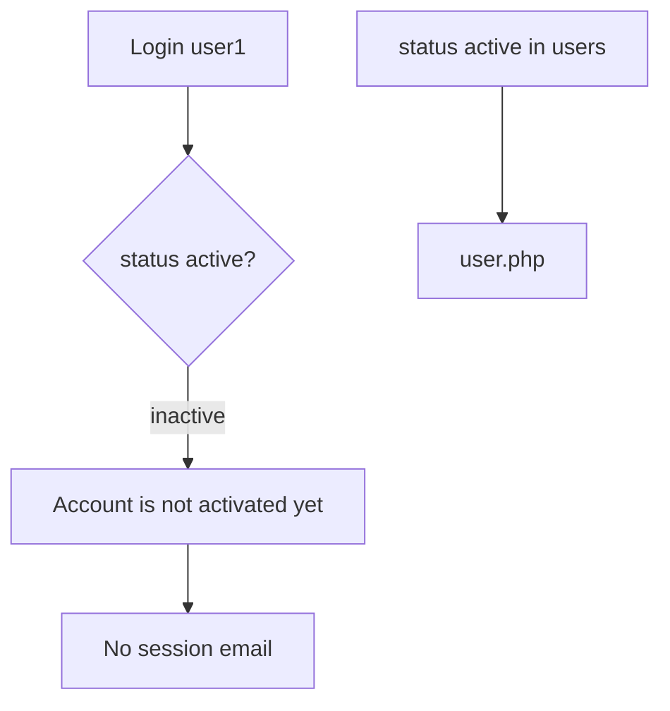
```mermaid
flowchart TD
  A[Login user1] --> B{status active?}
  B -->|inactive| C[Account is not activated yet]
  C --> D[No session email]
  E[status active in users] --> F[user.php]
```

### B-022 — Admin `h1` stays Dashboard

- **When:** 20 August 2026 (A-024)
- **Status:** fixed
- **What I saw:** Captures labeled `localhost/CP2_v1.1/pages/admin.php`. Utilities / Analytics / Mailbox / Settings highlighted. `h1` still **Dashboard**.


- **Cause (two parts):** (1) That URL is the **v1.1** folder (`CP2_v1.1` / `CP2_V1.1`), not `CP2_V1.1.2`. v1.1 `admin.php` has no `.page-content` panels. (2) In this folder, Dashboard `h1` is not inside `.page-content`. `id="page-dashboard"` was put on `<section class="showcase">`. CSS only hides `.page-content`. The Dashboard bar never hides.
- **Causing snippet** (`pages/admin.php` in this folder):

```html
        <section class="showcase" id="page-dashboard">
            <div class="head">
                <header>
                    <h1>Dashboard</h1>
```

- **In plain language:** The word Dashboard sits on the outer box, not in a hideable panel. Other titles can exist underneath, but you still see Dashboard. Also, testing `/CP2_v1.1/` opens the old folder from A-020.
- **Queued fix:** Use `http://localhost/CP2_V1.1.2/pages/admin.php`. Change the section to `<section class="showcase">` (no id). Wrap the Dashboard `.head` in `<div class="page-content" id="page-dashboard">` like `user.php`. Do not nest other `#page-*` inside `#page-dashboard`. Do not put `.showcase` inside `.sidebar-spacer`.
- **Solution executed:** Sibling `.page-content` blocks; empty `<div class="sidebar-spacer"></div>` then `<section class="showcase">`. Click Utilities → `h1` Utilities (same for Analytics, Mailbox, Settings).

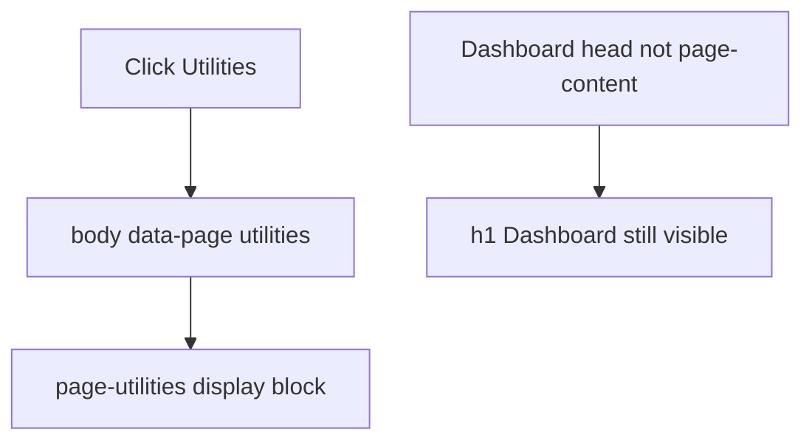
```mermaid
flowchart TD
  A[Click Utilities] --> B[body data-page utilities]
  B --> C[page-utilities display block]
  D[Dashboard head not page-content] --> E[h1 Dashboard still visible]
```

### B-023 — Login error looks like gray helper text

- **When:** 22 August 2026 (A-026; seen earlier on A-009 / B-021)
- **Status:** fixed
- **What I saw:** `http://localhost/CP2_V1.1.2/pages/login_signup.php`. After a failed login (wrong password or inactive account), the message under **LOGIN** was small gray text — same look as “Don’t have an account?” — not an obvious error banner like the reference system.


- **Cause:** The error was printed as a plain `<p>`. `login_signup.css` styles every `p` as muted gray (`#787777`, 14px). There was no `.form-error` class or alert box. The closing tag was also wrong (`<p>` instead of `</p>`).
- **Causing snippet** (`pages/login_signup.php`):

```php
<?php if ($login_error !== '') {echo '<p>' . htmlspecialchars($login_error) . '<p>'; } ?>
```

```css
p {
    color: #787777;
    font-size: 14px;
}
```

- **In plain language:** The page did show the right words, but they looked like normal hint text under the form, not a warning. Gray paragraph styling and a bare `<p>` tag hid the fact that login failed.
- **Queued fix:** Add `.form-error` in `login_signup.css`, `showError()` in `login_signup.php`, and `<?php echo showError($login_error); ?>` under **LOGIN**. Do not change `user_mngmnt.php` login rules (A-009).
- **Solution executed:** A-026 — pink `.form-error` banner; `showError()` wraps the message in a styled `<div>`.

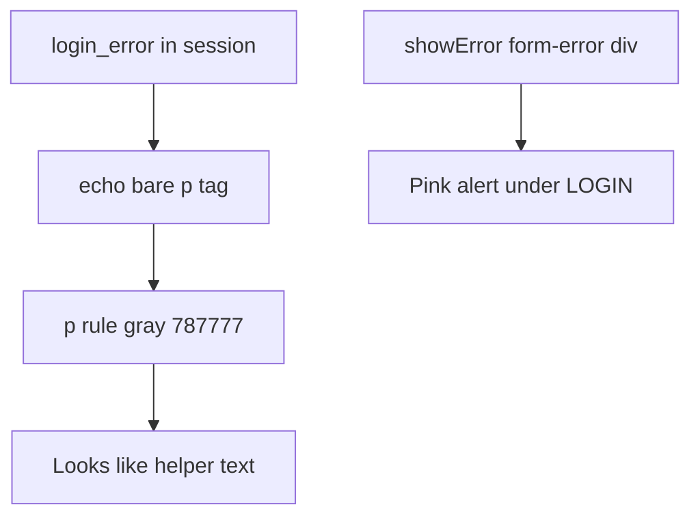
```mermaid
flowchart TD
  A[login_error in session] --> B[echo bare p tag]
  B --> C[p rule gray 787777]
  C --> D[Looks like helper text]
  E[showError form-error div] --> F[Pink alert under LOGIN]
```

### B-024 — Utilities user list: plain table, misaligned columns

- **When:** 23 August 2026 (A-025; fixed A-027)
- **Status:** fixed
- **What I saw:** `http://localhost/CP2_V1.1.2/pages/admin.php` → **Utilities**. User rows appeared, but as a raw HTML `<table>`: no white card, no column alignment, role and status as plain words (`user`, `active`) — unlike the reference admin Utilities screen.


- **Cause:** A-025 correctly loaded `users_db` rows but used a default browser `<table>` with no `main_interface.css` list classes. The project’s styled Utilities list uses `.tickets-list`, `.ticket-row`, and `.ucol-*` (same pattern as tickets in the reference build).
- **Causing snippet** (`pages/admin.php`, A-025):

```html
                <table>
                    <tr>
                        <th>ID</th>
                        <th>First name</th>
                        <th>Last name</th>
                        ...
                    </tr>
                    <?php while ($row = $users->fetch_assoc()) { ?>
                    <tr>
                        <td><?php echo htmlspecialchars($row['id']); ?></td>
                        ...
                    </tr>
                    <?php } ?>
                </table>
```

- **In plain language:** The data was correct, but the page skipped the layout CSS the rest of the admin dashboard uses. Headers and cells did not line up, and there were no colored role or status pills.
- **Queued fix:** Keep the same `SELECT` and data; replace the `<table>` with `.tickets-list` / `.ticket-row` markup and badge spans (A-027). Still no Activate button yet.
- **Solution executed:** A-027 — card table, `$all_users[]` + `foreach`, `.profile-role-badge` and `.status-badge` for role and Active/Pending.

```mermaid
flowchart TD
  A[SELECT users] --> B[plain table tr td]
  B --> C[Browser default layout]
  C --> D[Misaligned vs reference]
  E[tickets-list ticket-row ucol] --> F[Card table matches reference]
```

### B-025 — No Activate on Utilities; admin could not approve in the app

- **When:** 24 August 2026 (A-028; queued since B-021 / A-025)
- **Status:** fixed
- **What I saw:** `http://localhost/CP2_V1.1.2/pages/admin.php` → **Utilities** showed **Active** and **Pending** rows, but **Actions** was empty on Pending accounts. New signups stayed blocked at LOGIN (**Account is not activated yet.**). The only approval path was phpMyAdmin (B-021 test workaround), not the admin screen.
- **Cause:** A-025–A-027 listed users and styled the card table but never POSTed an approval action. There was no `user_admin_mngmnt.php`, and `.ucol-action` was an empty span.
- **Causing snippet** (`pages/admin.php`, before A-028):

```html
                            <span class="ucol-action"></span>
```

(No handler file on disk for `set_status`.)

- **In plain language:** The admin could see who was waiting, but could not approve anyone from the site. Every new signup needed a manual database edit until **Activate** existed.
- **Queued fix:** Add `logic/user_admin_mngmnt.php` with `UPDATE users SET status = 'active' WHERE id = ?`. In each Pending row, POST form with hidden `id`, `status=active`, and button `name="set_status"`. Keep the inactive login check in `user_mngmnt.php`.
- **Solution executed:** A-028 — **Activate** on Pending rows; login succeeds after admin clicks it. Two-account test: one Active (no button), one Pending (Activate → Active → user logs in without the activation error).

```mermaid
flowchart TD
  A[Pending row Utilities] --> B[Empty ucol-action]
  B --> C[No UPDATE in PHP]
  C --> D[Login blocked inactive]
  E[Activate POST] --> F[user_admin_mngmnt UPDATE active]
  F --> G[Login reaches dashboard]
```

### B-026 — `user.php` parse error: missing semicolon on `header()`

- **When:** 25 August 2026 (A-029)
- **Status:** fixed
- **What I saw:** `http://localhost/CP2_V1.1.2/pages/user.php` — PHP **syntax error, unexpected token "exit"**. Page would not load after adding the session guard and ticket query block at the top of `user.php`.

No screenshot stored for this entry.

- **Cause:** The `header('Location: login_signup.php')` line on the not-logged-in guard had no trailing semicolon. PHP treated the next line as part of the same statement and failed on `exit();` — same class of mistake as B-010 (`session_start()`).
- **Causing snippet** (`pages/user.php`):

```php
if (!isset($_SESSION['email'])) {
    header('Location: login_signup.php')
    exit();
}
```

- **In plain language:** Every PHP statement must end with a semicolon. Without one after `header(...)`, the file is invalid PHP, so Apache shows a parse error instead of the dashboard.
- **Queued fix:** Add `;` after the `header(...)` line.
- **Solution executed:**

```php
if (!isset($_SESSION['email'])) {
    header('Location: login_signup.php');
    exit();
}
```

```mermaid
flowchart TD
  A[header line no semicolon] --> B[unexpected token exit]
  B --> C[user.php parse error]
  D[header with semicolon] --> E[Page loads or redirects to login]
```

### B-027 — User Tickets: table on every tab; huge gap on Tickets

- **When:** 25 August 2026 (A-029)
- **Status:** fixed
- **What I saw:** `http://localhost/CP2_V1.1.2/pages/user.php` after A-029 (list worked, markup wrong).
  - **Tickets** tab: correct row data, but white card far below **New Ticket** (large gap vs reference).
  - **Dashboard**, **Mailbox**, and **Settings**: ticket table (headers + #1 row) still visible above each tab's own `h1` — table appeared on **every** tab.


- **Cause:** `.tickets-list` was a **sibling** of `#page-tickets`, not inside it. `#page-tickets` closed after `.tickets-toolbar`. CSS only hides `.page-content` blocks per tab — the orphan `.tickets-list` stayed visible everywhere. Same class of mistake as B-017 (control outside its panel).
- **Causing snippet** (`pages/user.php`):

```html
                <div class="tickets-toolbar">
                    ...
                </div>
            </div>
            <div class="tickets-list">
```

The first `</div>` ends `#page-tickets`. `.tickets-list` follows as the next sibling in `.showcase`.

- **In plain language:** The table lived outside the Tickets panel, so the site could not hide it when you switched tabs. On Tickets, flex layout could not attach the card to the toolbar, so a big empty gap appeared.
- **Queued fix:** Move the entire `.tickets-list` block inside `#page-tickets`, after `.tickets-toolbar`, before that panel's closing `</div>`. No CSS changes.
- **Solution executed:** Reparented `.tickets-list` inside `#page-tickets`. Retest: table only on **Tickets**; card sits directly under **New Ticket**; Dashboard / Mailbox / Settings clean.

```html
                <div class="tickets-toolbar">...</div>
                <div class="tickets-list">...</div>
            </div>
```

```mermaid
flowchart TD
  A[tickets-list outside page-tickets] --> B[Visible on every tab]
  A --> C[Flex gap on Tickets]
  D[tickets-list inside page-tickets] --> E[Hidden unless Tickets tab]
  E --> F[Card under New Ticket]
```

### B-028 — Admin Tickets: columns compressed (wrong class names)

- **When:** 4 September 2026 (A-031)
- **Status:** fixed
- **What I saw:** `http://localhost/CP2_V1.1.2/pages/admin.php` → **Tickets** tab. Data loaded (#4, #1, subjects, descriptions, **Pending** badges) but ID / Subject / Description / Status ran together in one tight line — not the spaced card columns on `user.php`.


- **Cause:** `main_interface.css` grid rules target **`.tickets-col-*`** (with an **s**). A-031 markup used **`.ticket-col-*`** (no **s**). CSS never applied column widths, so spans stacked with no grid.
- **Causing snippet** (`pages/admin.php`):

```html
<span class="ticket-col-id">ID</span>
<span class="ticket-col-subject">Subject</span>
```

(`user.php` uses `tickets-col-id`, `tickets-col-subject`, etc.)

- **In plain language:** The HTML class names did not match the CSS file. The browser had no rules for `ticket-col-id`, so columns did not get their widths. Same data, wrong labels on the classes — like calling a CSS hook by the wrong name.
- **Queued fix:** In `#page-tickets` only, rename every `ticket-col-` → `tickets-col-` (header + each row). No CSS changes.

```html
<span class="tickets-col-id">ID</span>
<span class="tickets-col-subject">Subject</span>
<span class="tickets-col-description">Description</span>
<span class="tickets-col-status">Status</span>
```

(Rename the same four classes on each `.ticket-row` span.)

- **Solution executed:** Find/replace `ticket-col-` → `tickets-col-` in `#page-tickets` header and rows. Retest: columns align like `user.php` (#4 FK test ticket, #1 monitor ticket, **Pending** badges).


### B-029 — Admin Tickets: Status + Assigned To compressed (5 columns, flex only)

- **When:** 6–7 September 2026 (A-033 Part 2)
- **Status:** fixed
- **What I saw:** `admin.php` → **Tickets** tab. Five columns present (ID, Subject, Description, Status, **Assigned To**). Dropdown works (**Unassigned** + technician name), but **Status** and **Assigned To** headers overlap on the right; badges and dropdowns are squeezed into a narrow strip.


- **Cause:** `main_interface.css` column widths (`.tickets-col-*` **flex** rules) were written for **four** columns. Adding a fifth (`.tickets-col-assigned`) without a **grid** layout leaves Subject/Description taking most of the row; the last two columns fight for leftover space.
- **Causing snippet** (`css/main_interface.css` — flex-only, no 5-column grid):

```css
.tickets-col-id          { flex: 0 0 10%; }
.tickets-col-subject     { flex: 1 1 30%; }
.tickets-col-description { flex: 1 1 30%; }
.tickets-col-status      { flex: 0 0 12%; }
.tickets-col-assigned    { flex: 0 0 18%; }
```

(`pages/admin.php` uses `<div class="tickets-list">` with no admin 5-column grid hook.)

- **In plain language:** Flex percentages alone do not reserve enough fixed space for Status and Assigned To when Description text is long. The last columns get crushed and header labels stack on top of each other.
- **Queued fix (attempt 1):** Add class **`tickets-list-admin-five`** on the admin `.tickets-list` div. In CSS, use **`display: grid`** with **five explicit tracks** for that class only (does not change `user.php` four-column list). Retest: Status and Assigned To each have their own column; long descriptions truncate with ellipsis.

**Retest (same day) — worse layout:** After adding `tickets-list-admin-five` + grid CSS, headers **ID / Subject / Description** stack vertically on the left; **Status / Assigned To** stack on the right; dropdown missing on rows.


- **Cause (two bugs):**
  1. **Invalid `grid-template-columns`** — `minmax(140, 1fr)` is missing **`px`** on `140`. Browser drops the whole column rule; `display: grid` stays but flows as **one column**, so every header stacks vertically.
  2. **Row has 4 cells, header has 5** — Part 2 dropdown `<span class="tickets-col-assigned">` was never saved inside the `foreach` loop. Grid cannot align rows to headers.

- **Causing snippet 1** (`css/main_interface.css`):

```css
minmax(140, 1fr);   /* invalid — needs 140px */
```

- **Causing snippet 2** (`pages/admin.php` — row ends after Status, no Assigned To cell):

```html
<span class="tickets-col-status">...</span>
</div>   <!-- ticket-row closes — missing tickets-col-assigned -->
```

- **In plain language:** The grid recipe had a typo, so the browser ignored the column widths and stacked everything in one vertical line. Even with a fixed grid, each data row must have the same five cells as the header — including the assign dropdown.
- **Solution executed (attempt 2):** `minmax(140px, 1fr)` in `main_interface.css`; **`tickets-list-admin-five`** on admin `.tickets-list`; **Assigned To** `<select>` inside each `.ticket-row` (5 cells match 5 headers).


- **Fix snippet** (`css/main_interface.css`):

```css
.tickets-list-admin-five .tickets-list-header,
.tickets-list-admin-five .ticket-row {
    display: grid;
    grid-template-columns:
        72px
        minmax(0, 1.1fr)
        minmax(0, 2fr)
        110px
        minmax(140px, 1fr);
    column-gap: 10px;
    align-items: center;
}
```

- **In plain language:** Grid gives each column a fixed “slot” on the row. Status and Assigned To no longer share one crushed strip; long descriptions ellipsize instead of pushing the right columns off-screen. Retest: #4 and #1 show **Pending** + **Unassigned** dropdown in separate columns.

### B-030 — Admin Tickets: Save clipped / assign did not persist

- **When:** 6–7 September 2026 (A-033 Part 3)
- **Status:** fixed
- **What I saw:** Dropdown worked; no visible **Save**; refresh returned to Unassigned.
- **Cause:** Assigned To track `minmax(140px, 1fr)` + `flex-wrap: nowrap` hid the Save button. Dropdown change does not POST.
- **Causing snippet:** `minmax(140px, 1fr)` and a `<select>` with no form in Part 2.
- **In plain language:** The save control existed in code but sat off the edge of the column. Changing the list without submitting never updated MySQL.
- **Solution executed:** Row is a POST form; column `minmax(240px, 1fr)`; `overflow: visible`.

### B-031 — Technician Tickets: columns compressed (wrong class names)

- **When:** 8 September 2026 (A-034)
- **Status:** fixed
- **What I saw:** `techn.php` → **Tickets**. Headers ran as **IDSubjectDescriptionStatus**. Rows #4 and #1 packed into one line with **Pending** badges. Same class of failure as B-028.


- **Cause:** CSS targets `.tickets-col-*`. Techn markup used `.ticket-col-*` (no **s**).
- **Causing snippet** (`pages/techn.php`):

```html
<span class="ticket-col-id">ID</span>
<span class="ticket-col-subject">Subject</span>
```

- **In plain language:** The class names do not match the stylesheet, so the browser never applies column widths.
- **Solution executed:** Find/replace `ticket-col-` → `tickets-col-` on the techn Tickets header and rows.


- **Retest (19 Sep 2026):** ID / Subject / Description / Status spaced. Rows #4 **FK Test Ticket** and #1 **Computer monitor…** with **Pending** badges. **B-031 closed.**

### B-032 — Mailbox poll never runs (`data-page` typo)

- **When:** 8–9 September 2026 (A-035)
- **Status:** fixed (poll typo). Send unblocked after **B-033**.
- **What I saw:** Messages tab — thread **FK Test Ticket** highlighted, header title set, composer has **Hello**, chat pane still **No conversation selected**. Live poll never filled the thread.


- **Cause:** Poll starts only if `data-page === "message"`. The app sets `data-page="messages"` (with **s**). Fetch on click also returned nothing because `messages` did not exist yet (B-033).
- **Causing snippet** (`js/behavior.js`):

```javascript
if (document.body.getAttribute("data-page") !== "message") {
    return;
}
```

- **In plain language:** The live updater looks for a tab name that does not exist, so it never ticks. Clicking a ticket can set the title without loading bubbles.
- **Solution executed:** `"message"` → `"messages"` in `startMailboxPoll()`.

### B-033 — Send message fatals: `users_db.messages` does not exist

- **When:** 8–9 September 2026 (A-035)
- **Status:** fixed
- **What I saw:** Typed **Hello** and sent. White page: **Table 'users_db.messages' doesn't exist** in `message_mngmnt.php` line 37 (`prepare()` INSERT). Same page on a second send after B-031 retest.


- **Cause:** Mailbox PHP was wired before the table existed. `INSERT INTO messages` has nowhere to go.
- **Causing snippet** (`logic/message_mngmnt.php`):

```php
$stmt = $conn->prepare(
    'INSERT INTO messages (ticket_id, sender_id, body) VALUES (?, ?, ?)'
);
```

- **In plain language:** The chat form posts to PHP, but MySQL has no `messages` drawer yet, so PHP crashes instead of saving **Hello**.
- **Solution executed:** phpMyAdmin → `users_db` → **SQL** → `CREATE TABLE messages` (FKs to `tickets.id` and `users.id`). Go returned an empty result (normal for CREATE). Left tree showed **messages**. Browse: columns `id`, `ticket_id`, `sender_id`, `body`, `created_at`, zero rows.


- **Retest send:** Mailbox → **FK Test Ticket** → **Hello**. No fatal. Maroon bubble on the right.


- **Two-role thread:** Other account sees **Hello** (white, left) and replies **Ho** (maroon, right).


- **Note:** SQL tab breadcrumb was `users_db.users`; CREATE TABLE still built `messages` on `users_db`. Pane title stayed **Select a ticket** after send.

### B-034 — Queue board shows 12 slots instead of 9

- **When:** 10 September 2026 (A-037)
- **Status:** fixed
- **What I saw:** `http://localhost/CP2_V1.3/pages/admin.php` → **Tickets**. Grey **Priority queue**. Header **0 / 12**. Critical / Moderate / Low each **0 / 4** and **used / 4**.
- **Cause:** `$queue_slots_per_band = 4` (4+4+4). Spec is 3+3+3; panel **used / 3**.
- **Causing snippet** (`pages/admin.php`):

```php
$queue_slots_per_band = 4;
$queue_total_slots = $queue_slots_per_band * 3;
```

- **In plain language:** Someone treated each band as a batch of four, so the board advertises twelve seats. The school cap is nine (three per colour).
- **Solution executed:** `$queue_slots_per_band = 3`. Subtitle under **Priority queue** removed.


### B-035 — `priority` column is NOT NULL

- **When:** 10–11 September 2026 (A-038)
- **Status:** fixed
- **What I saw:** Add-column form: ENUM values quoted. After first Save, `priority` is **Null = No**. Change form: **Null** checkbox ticked (blue), **Default** **None**. Length/Values still ENUM `'critical','moderate','low'` (left edge of the box may clip the `c` in critical).


- **Cause:** **Null** checkbox left empty on the add-column row.
- **Causing snippet** (phpMyAdmin generated ALTER):

```sql
ALTER TABLE `tickets`
  ADD `priority` ENUM('critical','moderate','low') NOT NULL AFTER `status`;
```

- **In plain language:** The colour field was required. Empty queue membership needs NULL (“not in a band yet”).
- **Solution executed:** Structure → **Change** → tick **Null** → Default **None** → **Save**. phpMyAdmin: `CHANGE priority ... NULL`. Structure list: **Null = Yes**, Default **NULL**.


### B-036 — Critical band ignores ENUM `critical` (looks up `high`)

- **When:** 11 September 2026 (A-039)
- **Status:** fixed
- **What you should see:** phpMyAdmin Browse → edit ticket **#4** → **priority** = `critical` → Go. Reload admin Tickets. **Critical** still **0 / 3**. Header still **0 / 9** if nothing else is queued.
- **Cause:** Critical count reads `$by_priority['high']`. MySQL stores `critical`.
- **Causing snippet** (`pages/admin.php`):

```php
'critical' => (int) ($by_priority['high'] ?? 0),
```

- **In plain language:** The board asks for a colour named **high**, but the table only has **critical**. So Critical never fills.
- **Solution executed:** `'high'` → `'critical'`.

### B-037 — Analytics cards are hardcoded (not live)

- **When:** 11 September 2026 (A-040)
- **Status:** fixed
- **What you should see:** Admin **Analytics**. Three cards **Pending 4**, **Ongoing 2**, **Resolved 12**. You do not have 12 resolved tickets. Numbers stay the same if you change statuses on Tickets.
- **Cause:** Literals in PHP, not `COUNT(*)`.
- **Causing snippet** (`pages/admin.php`):

```php
$analytics_pending = 4;
$analytics_ongoing = 2;
$analytics_resolved = 12;
```

- **In plain language:** The cards are a poster, not a live tally. **12** is the same extra-slot story as the old 12-seat queue.
- **Solution executed:** Replaced with original 5-card markup + `GROUP BY status` (A-041). Charts remain original sample data.

### B-038 — Dashboard charts blank (`dashbord` typo)

- **When:** 12 September 2026
- **Status:** fixed
- **What I saw:** Dashboard — five status cards OK. Tickets Report / Categories / Satisfaction / Severity chart panels empty (no Chart.js lines).


- **Cause:** Poll/init guard used `data-page === "dashbord"` (missing **a**). Body is `dashboard`.
- **Causing snippet** (`js/dashboard_static_charts.js`):

```javascript
if (document.body.getAttribute('data-page') !== 'dashbord') {
    return;
}
```

- **In plain language:** The chart script looks for a page name that does not exist, so it never draws.
- **Solution executed:** `'dashbord'` → `'dashboard'`.

### B-039 — Settings tab empty

- **When:** 12 September 2026
- **Status:** fixed
- **What I saw:** Admin **Settings** — title and search only; white empty main pane.


- **Cause:** `#page-settings` had header markup only; no Appearance / Security cards.
- **In plain language:** The sidebar opens Settings, but nothing was built under the title yet.
- **Solution executed:** Appearance card (theme look-only) + Security change-password form → `logic/settings_mngmnt.php`.

### B-040 — Pending filter typo + queue counted non-active tickets

- **When:** 12 September 2026
- **Status:** partially fixed — **Pending** filter typo closed; queue rule corrected in **B-044**
- **What I saw:** Tickets filter **Pending** used `data-filter="pendng"`. Queue showed **2 / 9** while both tickets were still **Pending**.
- **Causing snippets:**

```html
<button … data-filter="pendng">Pending</button>
```

- **Solution executed (filter only):** `pendng` → `pending`.
- **Note:** Restricting the queue to `ongoing`/`processing` made Priority Save look broken on Pending tickets — see **B-044**.

### B-041 — Utilities missing role filters and action buttons

- **When:** 12 September 2026
- **Status:** fixed
- **What I saw:** Utilities listed accounts with role/status badges, but **Actions** was empty for Active rows (Activate only on Pending). No All / User / Technician / Administrator / Pending Approval filters. No Edit, Deactivate, or Delete.


- **Cause:** Stage 3 ship stopped at Activate-only (A-028). Original admin Utilities had filters + Edit / Activate-Deactivate / Delete.
- **Solution executed:** Role filter tabs + `utilities_filter.js`; Edit form (role change); Activate/Deactivate; Delete with confirm; Add User. Handlers in `user_admin_mngmnt.php`. **Verified A-047.**

### B-042 — Settings theme dropdown did nothing

- **When:** 12 September 2026
- **Status:** fixed
- **What I saw:** Appearance Theme select was **disabled**; note said save lands later. Light/Dark could not be toggled.


- **Cause:** Placeholder shell from A-042; no save path and no `data-theme` / `theme.css` wiring on admin.
- **Solution executed:** Enabled select + **Save appearance** → `settings_mngmnt.php` (`save_ui_theme`). Admin `<html data-theme>` + `theme.css`.

### B-043 — Dashboard sample charts blank again (CDN Chart.js)

- **When:** 12 September 2026
- **Status:** fixed
- **What I saw:** Dashboard status cards OK. Tickets Report / Categories / Satisfaction / Severity panels empty again (same look as B-038).


- **Cause:** Admin loaded Chart.js from `cdn.jsdelivr.net`. When the CDN was blocked/slow/offline, `typeof Chart === 'undefined'` and `dashboard_static_charts.js` returned without drawing. Original ships a local `js/chart.umd.js`.
- **Solution executed:** Vendored `js/chart.umd.js`; `admin.php` script tag points local. Charts re-init when `data-page` returns to `dashboard` + `resize()` after layout.

### B-044 — Priority queue stayed **0 / 9** after Critical + Save

- **When:** 13 September 2026
- **Status:** fixed
- **What I saw:** Two tickets **Pending** + **Critical** + assigned. Priority queue still **0 / 9** / Batch 1 **0 / 3**.


- **Cause:** After B-040 the counter required `status IN ('ongoing','processing')`. Stage 5 board (A-039 / A-041) counts open tickets with `priority` set — Save Priority should fill the bar while still Pending.
- **Solution executed:** `WHERE priority IS NOT NULL AND status <> 'resolved'`.

### B-045 — Confirm buttons never appear (`awaiting_confirm` typo)

- **When:** 14–15 September 2026 (A-050)
- **Status:** fixed
- **What I saw:** Technician sets status **Confirming**. User Tickets shows Confirming badge but Confirm column is **—** (no Solved / Not Solved Yet).


- **Cause:** User page checks the wrong string (missing **ation**).
- **Causing snippet** (`pages/user.php`):

```php
$needsConfirm = ($st === 'awaiting_confirm');
```

- **Solution executed:**

```php
$needsConfirm = ticket_awaiting_confirmation($st);
```


### B-046 — Technician can still pick Resolved

- **When:** 14–15 September 2026 (A-050)
- **Status:** fixed
- **What I saw:** Technician status dropdown includes **Resolved**.


- **Cause:** Techn allowed list includes `resolved`.
- **Causing snippet** (`logic/ticket_status.php`):

```php
return ['pending', 'ongoing', 'processing', 'awaiting_confirmation', 'resolved'];
```

- **Solution executed:**

```php
return ['pending', 'ongoing', 'processing', 'awaiting_confirmation'];
```

### B-047 — Not Solved Yet sends ticket to Pending (not Ongoing)

- **When:** 14–15 September 2026 (A-050)
- **Status:** fixed
- **What I saw:** After B-045 fix, **Not Solved Yet** showed success flash and ticket #4 status became **Pending**.


- **Cause:** Wrong reopen target in the confirm handler.
- **Causing snippet** (`logic/ticket_confirm_mngmnt.php`):

```php
$newStatus = 'pending';
```

- **In plain language:** Rejecting a fix should reopen active work (Ongoing), not send the ticket to the back of the new-request line.
- **Solution executed:**

```php
$newStatus = 'ongoing';
```

### B-048 — ENUM list order puts `resolved` before `awaiting_confirmation`

- **When:** 14 September 2026 (A-049)
- **Status:** fixed (optional reorder documented)
- **What I saw:** After Structure Change, ENUM order was pending → ongoing → processing → **resolved** → awaiting_confirmation.
- **Cause:** Values appended at the end of the existing list in phpMyAdmin.
- **In plain language:** App works either way. Clearer workflow if Confirming sits before Resolved.
- **Solution executed:** Documented correct order in `database/v1.4_stage6.sql`. Run in phpMyAdmin SQL tab if desired:

```sql
ALTER TABLE `tickets`
  MODIFY `status` ENUM(
    'pending','ongoing','processing','awaiting_confirmation','resolved'
  ) NOT NULL DEFAULT 'pending';
```


---


---

### B-049 — PHP calls wrong Flask port (`5001`)

- **When:** 17 September 2026 (A-054)
- **Status:** fixed
- **What I saw:** Flask `/health` OK on 5000. Suggest with AI on “Internet Problem” showed: **Cannot reach AI service. Is Flask running on port 5000?**


- **Cause:** Bridge URL used port 5001.
- **Causing snippet** (`logic/ai_classify.php`):

```php
return 'http://127.0.0.1:5001/classify';
```

- **Solution executed:** Point to the real Flask port.

```php
return 'http://127.0.0.1:5000/classify';
```

### B-050 — Classifier returns `prioriy` instead of `priority`

- **When:** 16–17 September 2026 (A-053)
- **Status:** fixed
- **What I saw:** Suggest with AI on locked-out / forgot password: Category **Account**, message **Priority missing from AI response**, suggestion box **Priority: —**, Priority dropdown still **None**.

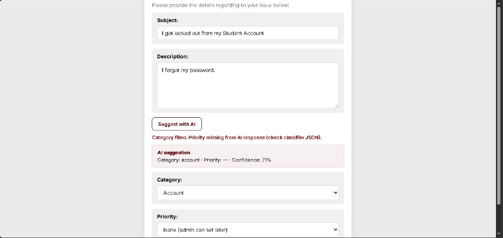

- **Cause:** JSON key typo in Flask response.
- **Causing snippet** (`ai/classifier_app.py`):

```python
"prioriy": result["priority"],
```

- **Solution executed:** Rename key to `priority`. **Restart Flask** after this change.

```python
"priority": result["priority"],
```

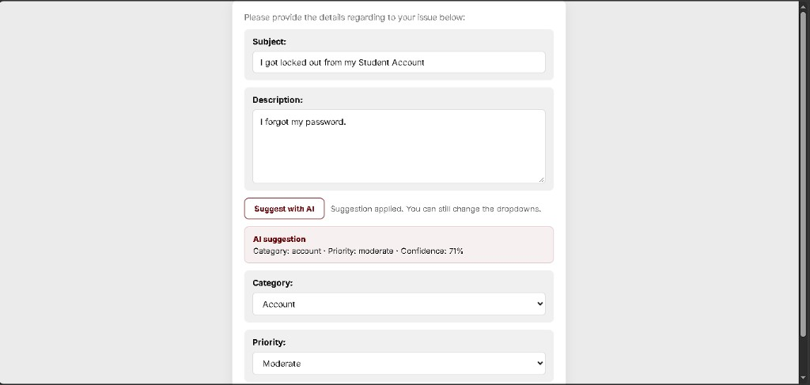


### B-051 ? Submit Ticket ignores priority column

- **When:** 17 September 2026 (A-054)
- **Status:** fixed
- **What I saw:** AI Suggest set Category **other** / Priority **moderate**. After Submit, admin Tickets showed **#1003 Test5** with Priority **None**. Queue stayed **2 / 9** (Moderate still 1/3).


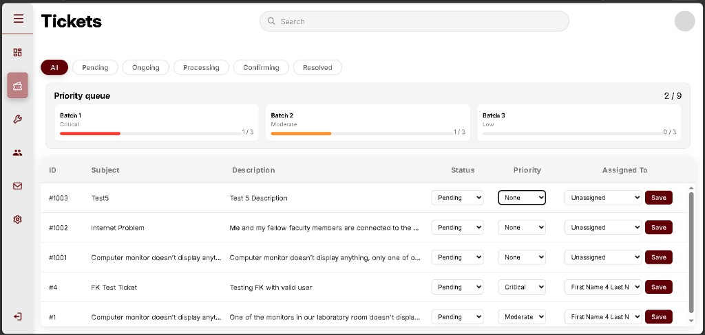

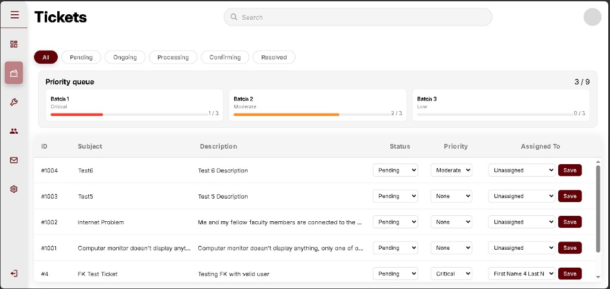

- **Cause:** INSERT omitted `priority`.
- **Causing snippet** (`logic/ticket_mngmnt.php`):

```php
'INSERT INTO tickets (user_id, subject, description, category) VALUES (?, ?, ?, ?)'
```

- **Solution executed:** Insert `priority` when the form sends critical/moderate/low.

```php
'INSERT INTO tickets (user_id, subject, description, category, priority) VALUES (?, ?, ?, ?, ?)'
```


### B-052 — New Ticket title clipped at top of viewport

- **When:** 17–18 September 2026
- **Status:** fixed
- **What I saw:** **Submit New Ticket** heading was cut off at the top of the page (only the lower half of the letters showed). Bottom actions were easy to miss on a short viewport.

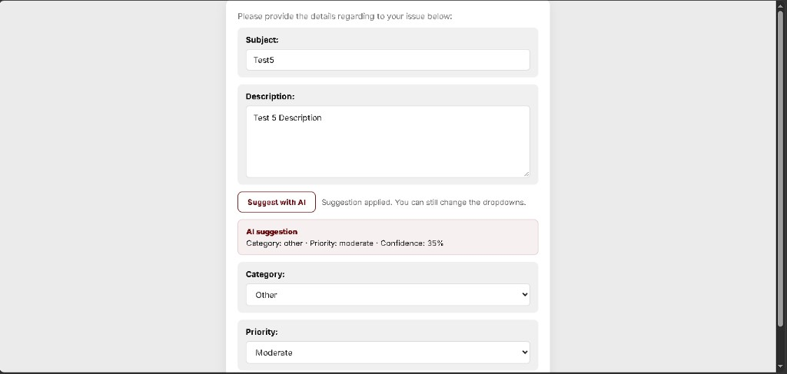

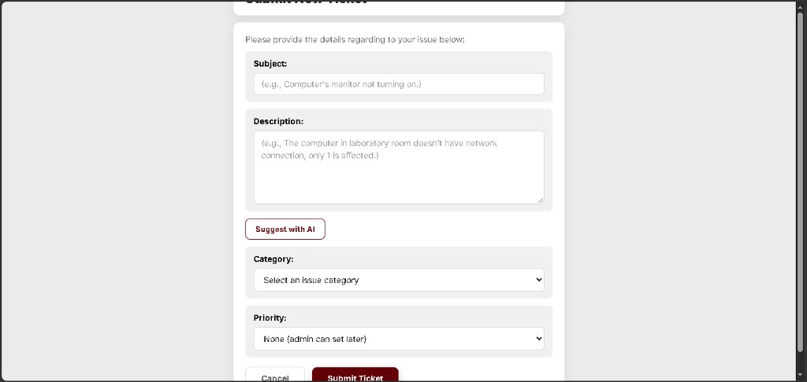

- **Cause:** Tall form + ody vertical flex centering pushed the separate header card above the fold. First fix (lex-start) was not enough.
- **Solution executed:** Put the title inside the form card; remove body flex centering; cache-bust CSS (	icket.css?v=20260920).

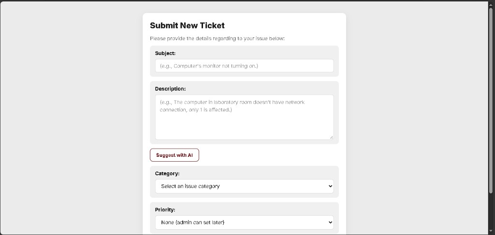

- **In plain language:** The page now starts with a full readable title, then the fields.


### B-053 — New Ticket sends logged-in user to login page

- **When:** 18 September 2026 (Stage 8 test B)
- **Status:** fixed
- **What I saw:** On user Tickets, **+ New Ticket** left the tickets list and opened **LOGIN** instead of Submit New Ticket.

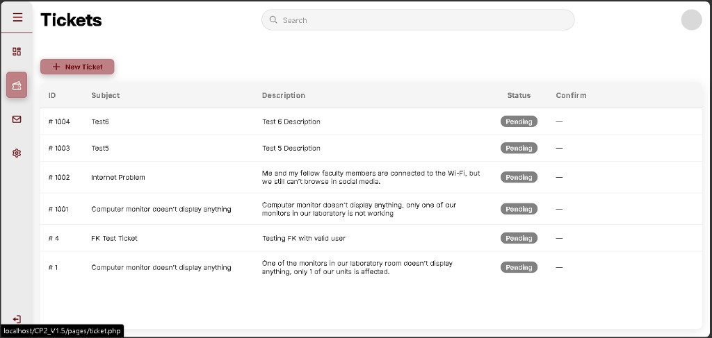


- **Cause:** login_signup.php called bare session_start() (cookie path /) while the rest of the app starts sessions with path /CP2_V1.5/. Session cookie mismatch made 
equire_role('user') on 	icket.php think the user was logged out.
- **Causing snippet** (pages/login_signup.php):

`php
session_start();
`

- **Solution executed:** Use shared session_config.php on the login page; set cookie path /CP2_V1.5/ explicitly; New Ticket link 	icket.php (same folder).

`php
require_once '../logic/session_config.php';
`

- **Retest:** Log out → log in again as user → Tickets → **+ New Ticket** → Submit New Ticket form (not login).


### B-054 — Technician still shows Pending after ticket is Resolved

- **When:** 18 September 2026 (Stage 8 F — mailbox OK)
- **Status:** fixed
- **What I saw:** User #1005 **Resolved**. Admin Resolved filter shows Resolved. Technician Tickets still showed status dropdown **Pending**. Mailbox chat worked live.

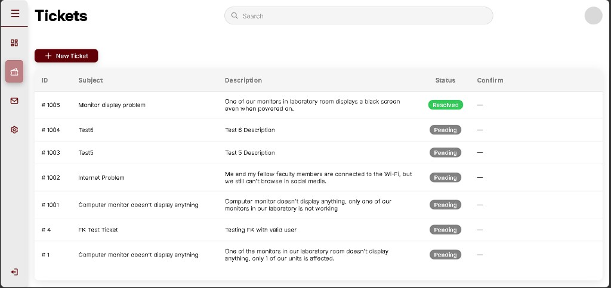

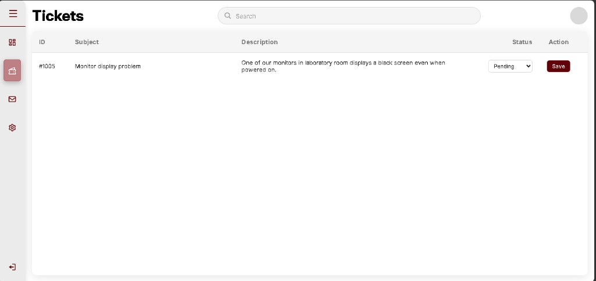

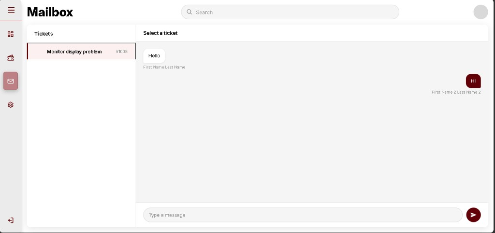

- **Cause:** Techn status <select> only lists allowed statuses (no 
esolved). When DB status is 
esolved, no <option> matches, so the browser displays the first option (**Pending**).
- **Causing snippet** (pages/techn.php): loop only over 	icket_techn_allowed_statuses().
- **Solution executed:** If status is not editable by techn (e.g. resolved), show a **Resolved** badge + “Closed by reporter” instead of a misleading dropdown.

- **Retest:** Techn Tickets → #1005 should show green **Resolved** (not Pending).


- **Retest result:** **pass** — Resolved + Closed by reporter.


### B-055 — Dashboard charts showed sample data while history was live

- **When:** 20 September 2026 (Test 3)
- **Status:** fixed (A-063)
- **What I saw:** Status cards (Pending 7 / Ongoing 2 / …) and Recent Ticket History (#1008) were correct. Tickets Report / Categories / Satisfaction still looked like the old demo numbers (~50 submitted, category bars ~70–95, satisfaction 35/30/20/10/5).
- **Cause:** Cached old `dashboard_static_charts.js` sample arrays; live JSON was injected **after** the script tag; matplotlib endpoint not wired into Flask yet.
- **Causing snippet:** hardcoded Chart.js sample datasets + script order.
- **In plain language:** The cards told the truth; the pretty graphs were still showing a fake poster from an earlier build.
- **Solution executed:** Live Chart.js UI (original look) + matplotlib PNG pipeline for paper; removed fallback banner text. See **A-063** / **A-064**.


### B-056 — Priority is chosen by the user instead of the system

- **When:** 25 September 2026 (showcase feedback)
- **Status:** fixed (A-067)
- **What I saw:** Submit New Ticket still had a **Priority** dropdown (None / Critical / Moderate / Low). The adviser said priority must be set when the client presses Submit, not by the client.
- **Cause:** The form posted `priority` and the handler trusted that value.
- **Causing snippet** (`pages/ticket.php`):

```html
<select name="priority" id="priority">
    <option value="" selected>None (admin can set later)</option>
    <option value="critical">Critical</option>
    <option value="moderate">Moderate</option>
    <option value="low">Low</option>
</select>
```

- **In plain language:** The person reporting the issue could pick how urgent it was, or leave it blank. That should be decided by the system from the description.
- **Solution executed:** Remove the dropdown. On submit, classify priority automatically.


### B-057 — Suggest with AI is a separate click

- **When:** 25 September 2026 (showcase feedback)
- **Status:** fixed (A-067)
- **What I saw:** Classification only ran if the user clicked **Suggest with AI**. Submit did not run the AI by itself. Low-priority tickets also waited for self-help instead of assigning a technician right away.
- **Cause:** The suggest button called `ai_suggest.php`; submit used the posted priority and only auto-assigned when the user had already set critical/moderate.
- **Causing snippet** (`pages/ticket.php`):

```html
<button type="button" id="btn-ai-suggest" class="btn-ai-suggest">Suggest with AI</button>
```

- **In plain language:** AI was optional. The adviser wants Submit itself to process the ticket and assign a technician.
- **Solution executed:** Remove the button. Submit classifies priority and assigns a technician for every new ticket.


### B-058 — Automatic priority came from keywords, not Luna (#1010)

- **When:** 25 September 2026 (V1.6 submit test)
- **Status:** fixed (A-068)
- **What I saw:** Submit New Ticket no longer shows Priority or Suggest with AI. Subject **Changing profile picture**, description **I don't know how to change profile**, category **Account**. After Submit: *Ticket #1010 submitted. Priority set to Low and a technician was assigned automatically.* Row status **Ongoing**. phpMyAdmin: `priority=low`, `assigned_to=2`, `status=ongoing`, **`ai_method=keyword`**.
- **Cause:** OpenAI returned HTTP 429 `credit_balance_exhausted` (no API credits left). The classifier hid that error and used keywords. The phrase **how to** then forced priority **low**.
- **Causing snippet** (`ai/classifier_app.py`): a failed Luna call returned `None` with no reason, then:

```python
elif re.search(r"\b(minor|small|question|how\s+to)\b", blob, flags=re.IGNORECASE):
    priority = "low"
```

- **In plain language:** The ticket was filed and given to a technician. Urgency was not from GPT-5.6 Luna. The API account has no credits, so the backup word rules ran and “how to” made it Low. The green message did not say Luna was skipped.
- **Solution executed (A-068):** Record `fallback_reason=quota` and save `ai_method=kw-quota` instead of a plain keyword success. Luna runs again after API credits are added and Flask is restarted.


### A-068 — Record when Luna is skipped for lack of credits

- **When:** 25 September 2026
- **Official stage:** V1.6 follow-up to B-058
- **Status:** done
- **What we did:** Reproduced `/classify` for the #1010 text. The API error is `credit_balance_exhausted`. Classifier now sets `method` to `kw-quota` when that happens. Submit stores that method. Assignment still proceeds so tickets are not blocked.
- **Fix snippet:**

```python
if "insufficient_quota" in text or "credit_balance_exhausted" in text:
    _LAST_OPENAI_ERROR = "quota"
```

- **In plain language:** If the paid AI has no credits, the ticket still gets a priority and a technician, but the record shows it was the backup, not Luna.
- **Still required for real Luna:** add API credits at platform.openai.com, then restart `ai\start_classifier.bat`.
- **Retest #1011 (25 September 2026):** user submit → priority **Low**, status **Ongoing**. Admin shows **Low** and Assigned To **First Name 4**. That technician’s list shows **#1011 Ongoing**. phpMyAdmin: `assigned_to=4`, `priority=low`, `ai_method=kw-quota`.

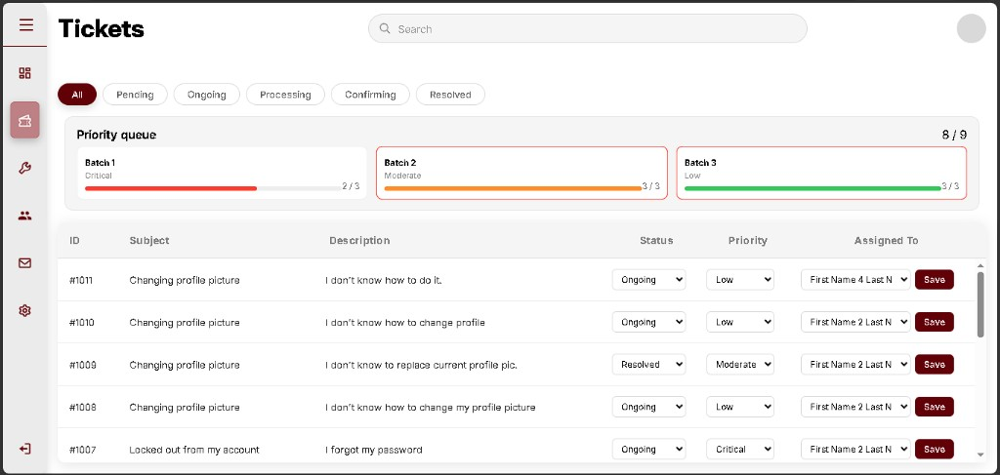

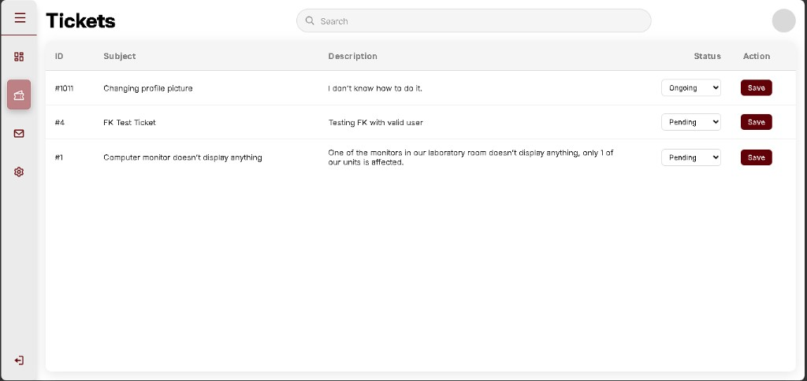

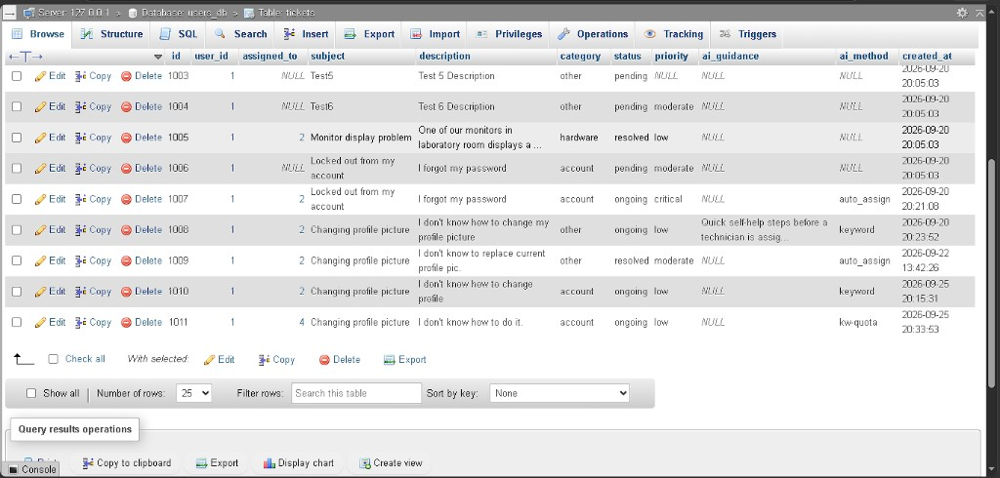


### B-059 — Priority was a word label, not an urgency × impact score

- **When:** 28 September 2026
- **Status:** fixed (A-069)
- **What I saw:** Tables 4 and 6 score urgency times impact, then map 1–2 Low, 3–6 Moderate, 7+ Critical. #1011 became Low only because the text contained “how to”. No score was stored.
- **Cause:** Submit stored the classifier’s priority word.
- **Causing snippet** (`logic/ticket_mngmnt.php` before A-069):

```php
$priority = $ai['priority'] ?? null;
```

- **In plain language:** The system picked Low or Critical from wording. It never multiplied how urgent the problem is by how many people it hits.
- **Solution executed:** `logic/severity_matrix.php` computes the score and stores `urgency`, `impact_level`, and `severity_score`.


### B-060 — Queue did not lend empty slots

- **When:** 28 September 2026
- **Status:** fixed (A-069)
- **What I saw:** Table 7 borrows unused Low or Moderate seats so a batch still processes up to 9. The panel always used a hard cap of 3 per color and counted every open ticket. Empty Low seats were not given to Critical.
- **Cause:** The band builder set `limit` to 3 and `borrowed` only when the raw count was already over 3.
- **Causing snippet** (`logic/priority_queue.php` before A-069):

```php
'limit' => $baseLimit,
'borrowed' => max(0, $used - $baseLimit),
```

- **In plain language:** If nobody filed a Low ticket, those three seats stayed empty instead of being used for a Critical one.
- **Solution executed:** `priority_queue_allocate()` fills each color up to 3, then gives leftover seats to Critical, then Moderate, then Low.


### B-061 — Keyword urgency forced every impact to a single user

- **When:** 28 September 2026 (while wiring A-069)
- **Status:** fixed
- **What I saw:** The first wiring trusted `urgency` from the keyword classifier. That value came from the old Low/Moderate/Critical label, and impact was always 1. “Campus server down, whole laboratory cannot work” would score 3×1 = 3 (Moderate) instead of 3×3 = 9 (Critical).
- **Cause:** Submit used the AI urgency whenever it was 1, 2, or 3, including the keyword backup.
- **Causing snippet:**

```php
$urgency = (int) ($ai['urgency'] ?? 0);
if ($urgency < 1 || $urgency > 3) {
    $urgency = $axes['urgency'];
}
```

- **In plain language:** A building-wide outage was treated like one person’s problem, because the backup classifier does not know the impact column of Table 4.
- **Solution executed:** Use the text estimate for urgency and impact unless the method is `openai`. Table 6 then maps the product.


### B-062 — Sign-in fatals: MySQL connection refused

- **When:** 28 September 2026
- **Status:** fixed (A-070)
- **What I saw:** Opening login produced a white fatal page: `No connection could be made because the target machine actively refused it` in `logic/config.php` line 7.
- **Cause:** MySQL was not running, so port 3306 refused the connection. PHP 8 throws `mysqli_sql_exception` from `new mysqli()` before the `connect_error` check can run, so the page never reached `die()`.
- **Causing snippet** (`logic/config.php`):

```php
$conn = new mysqli($host, $user, $password, $database);
```

- **In plain language:** The database program was off. Signing in tried to talk to it and the page crashed instead of saying MySQL was stopped.
- **Solution executed:** Start MySQL from the XAMPP Control Panel. In `config.php`, call `mysqli_report(MYSQLI_REPORT_OFF)` so a future outage prints “Start MySQL in the XAMPP Control Panel” instead of a fatal trace.


### B-063 — Low ticket skipped troubleshooting and went straight to a technician

- **When:** 28 September 2026 (after #1012)
- **Status:** fixed (A-071)
- **What I saw:** #1012 was Low (score 1) but the green message said a technician was assigned. The user list had no **AI troubleshooting tips**. The adviser still wants Low tickets to show steps first, then let the user say whether they worked. If not, transfer to a technician.
- **Cause:** After A-067, every submit called `ticket_auto_assign`, including Low. Tips are only shown when `ai_guidance` is stored and `assigned_to` is empty, so the steps never appeared.
- **Causing snippet** (`logic/ticket_mngmnt.php`):

```php
$tech = ticket_auto_assign($conn, $ticket_id, 'ongoing');
```

- **In plain language:** A small “how to” ticket jumped the self-help step and landed on a technician immediately.
- **Solution executed:** Low submit saves troubleshooting text and stays Pending. Buttons: **These steps worked** (Resolved) and **Still not fixed — Request Technician**. Moderate and Critical still assign immediately.


### B-064 — Resolved Low ticket still shows Request Technician

- **When:** 28 September 2026 (A-072, #1013)
- **Status:** fixed
- **What I saw:** After **These steps worked**, #1013 was **Resolved**, but a **Request Technician** button stayed under the subject.
- **Cause:** The fallback button checked “unassigned and Low” and did not check that the ticket was already resolved. Self-help closes the ticket without assigning anyone, so that button still matched.
- **Causing snippet** (`pages/user.php`):

```php
} elseif ($unassigned && ($ticket['priority'] ?? '') === 'low') {
```

- **In plain language:** A ticket the user already closed still offered to call a technician.
- **Solution executed:** Hide that button when the status is resolved.
- **Retest (28 September 2026):** User Tickets list. **#1013** is **Resolved** and the subject line has no **Request Technician** button. **#1014** stays **Ongoing** after a technician was requested.

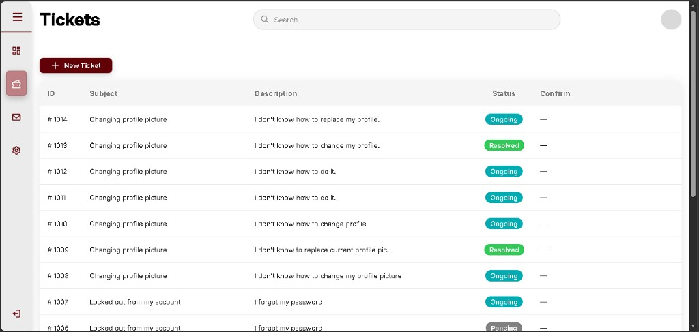


### B-065 — Performance tab shows fake team rows

- **When:** 30 September 2026
- **Status:** fixed (A-073)
- **What I saw:** Performance showed **Technician Record List** with Team ID **#0000** and zeros, and a second list of Ticket ID **0000**, subject “The title of the issue,” and date **08/15/2027**. None of that was a real ticket. The meeting said the label should be **Category**, and both lists should use resolved tickets.
- **Cause:** The page looped a hardcoded placeholder instead of querying `tickets`.
- **Causing snippet** (`pages/admin.php`):

```php
<?php for ($i = 0; $i < 5; $i++) { ?>
<span class="pcol-teamid">#0000</span>
```

- **In plain language:** The performance page was a poster of sample rows. Closing a real ticket did not change those numbers.
- **Solution executed:** Count resolved tickets per category, and list each resolved ticket under that table.

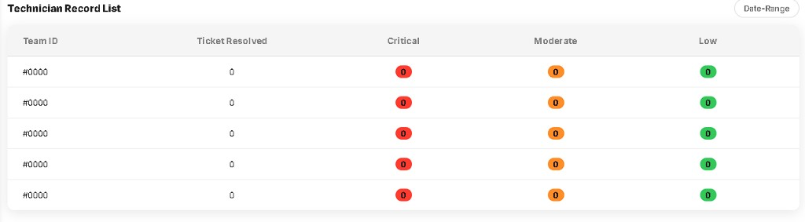

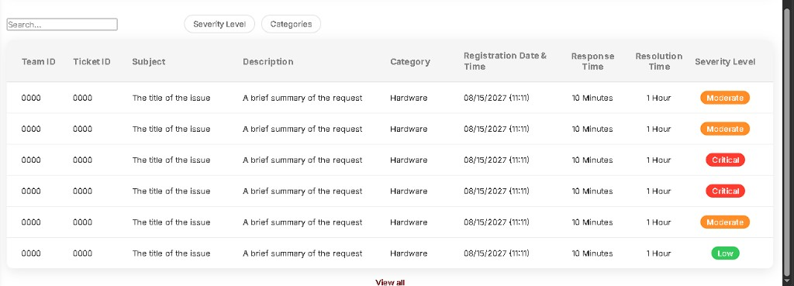


### B-066 — Response and resolution times were not stored

- **When:** 30 September 2026
- **Status:** fixed (A-073)
- **What I saw:** The sample log said every ticket took **10 Minutes** to respond and **1 Hour** to resolve. The `tickets` table had `created_at` only, so those durations could not come from the database.
- **Cause:** Nothing wrote a time when a technician was assigned or when the ticket became resolved.
- **Causing snippet:** no `responded_at` or `resolved_at` columns before `database/v1.6_performance_times.sql`.
- **Retest (1 October 2026):** **#1015** Account Low shows Response Time and Resolution Time filled (about 40 hours), not a dash. Account resolved count is **2**. Older rows **#1013**, **#1009**, and **#1005** still show **—**. This shot is enough for the clocks. The long duration text is squeezed in the column.

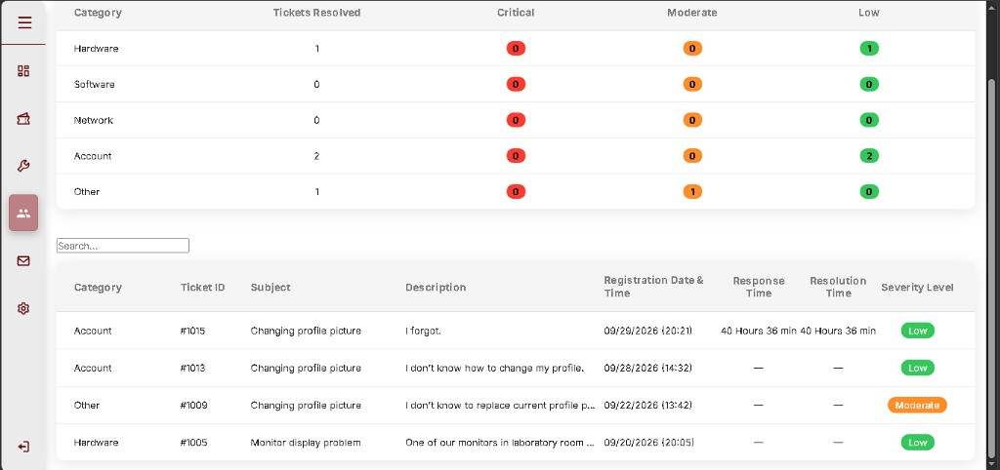
- **Solution executed:** Add `responded_at` and `resolved_at`. Set the first when a technician is assigned, and the second when the ticket is marked resolved.
- **In plain language:** The clocks on the performance log were made up. Existing closed tickets still show **—**. A ticket closed after the clocks were added shows a real duration.


### B-067 — Sidebar item sticks to the bottom after Logout moved

- **When:** 1 October 2026
- **Status:** fixed
- **What I saw:** After Settings and Logout left the sidebar, Mailbox sits at the bottom of the grey bar. User and technician show a gap between Tickets and Mailbox. Admin shows the same gap under Performance.
- **Cause:** CSS puts `margin-top: auto` on the last sidebar item, which used to be Logout.
- **Causing snippet** (`css/main_interface.css`):

```css
.nav-list-item:last-child { /* margin-top: auto */ }
```

- **In plain language:** The last icon is pushed down as if it were still the logout button.
- **Solution executed:** Set the last sidebar item’s `margin-top` back to 0 so Mailbox stays under the other items.

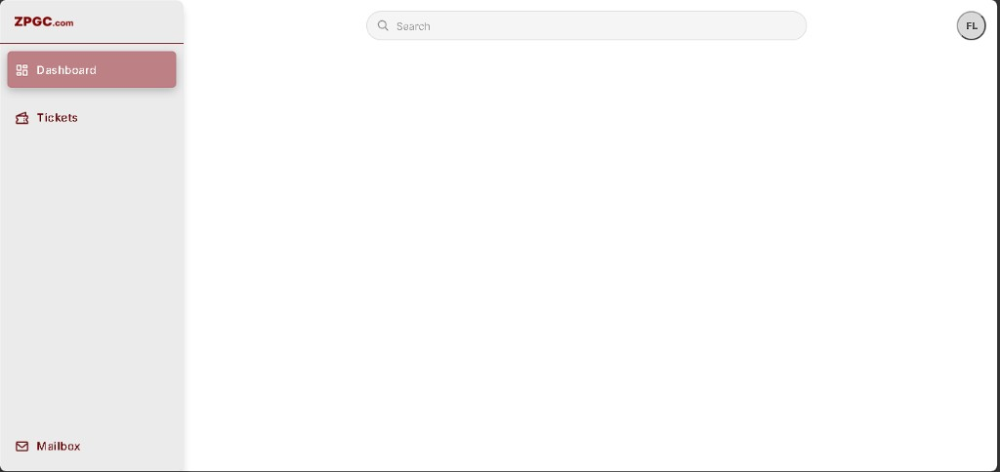

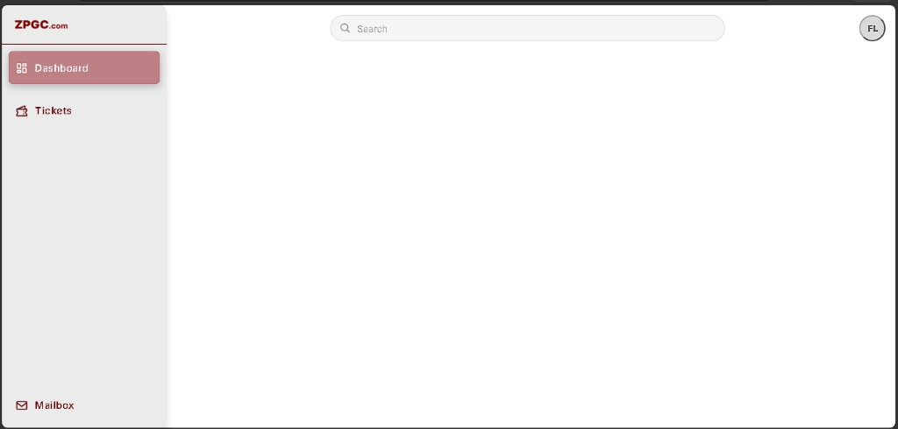

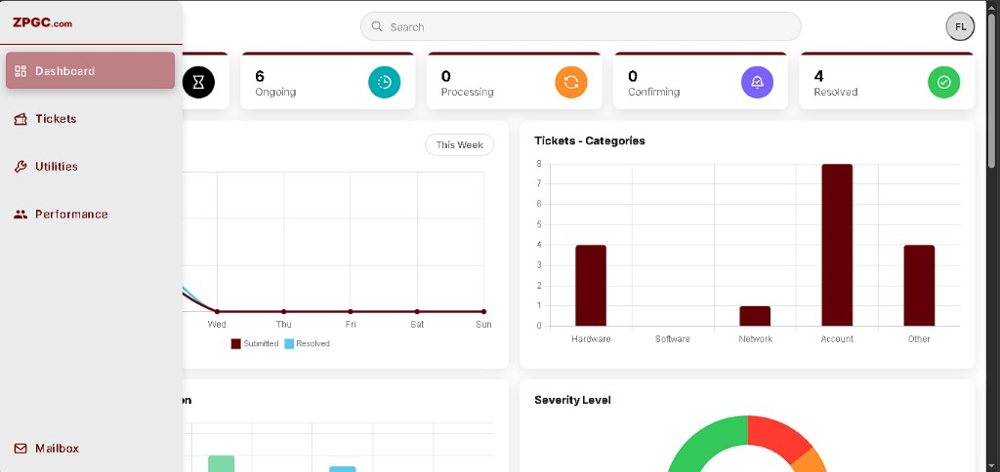


### B-068 — Profile email looks editable but does not save

- **When:** 1 October 2026
- **Status:** fixed
- **What I saw:** Profile has an Email box. Changing it and clicking Save profile keeps the old email.
- **Cause:** The input is named `contact_email`. The save handler only updates first name and last name.
- **Causing snippet** (`pages/partials/profile_panel.php`):

```html
<input type="email" id="profile-email" name="contact_email" required>
```

- **In plain language:** The email box invites a change, then ignores it.
- **Solution executed:** Name the field `email` and update `users.email` plus the signed-in session.


### B-069 — Profile role shows the database word

- **When:** 1 October 2026
- **Status:** fixed
- **What I saw:** The Role box shows `user`, `techn`, or `admin` instead of User, Technician, or Administrator.
- **Cause:** The field prints `users.role` with no label map.
- **Causing snippet** (`pages/partials/profile_panel.php`):

```php
echo htmlspecialchars((string) $profile['role']);
```

- **In plain language:** The role is the short code stored in the table, not the name a person would read.
- **Solution executed:** Show User, Technician, or Administrator. The page now follows My Profile: avatar, name, personal information, and a working email.


### B-070 — Profile circle does not open the menu

- **When:** 1 October 2026
- **Status:** fixed
- **What I saw:** The circle shows initials (**FL**) on user, technician, and admin, but clicking it does not open Profile, Settings, or Logout.
- **Cause:** The menu CSS set `display: flex` on `.profile-dropdown`, which overrides the `hidden` attribute, and the document click handler closed the menu in the same click.
- **Causing snippet** (`css/main_interface.css`):

```css
.profile-dropdown { display: flex; }
```

- **In plain language:** The account menu was forced visible in a way the click logic could not keep open, so the circle looked dead.
- **Solution executed:** Hide the menu with `.profile-dropdown[hidden] { display: none !important; }` and open it only on the circle click.


### B-071 — User and technician dashboards are blank

- **When:** 1 October 2026
- **Status:** fixed
- **What I saw:** User and technician Dashboard show only the title and search bar. The rest of the page is white. Admin Dashboard still shows the charts.
- **Cause:** Those two dashboards had a header and no body. Ticket lists live on the Tickets tab only.
- **Causing snippet** (`pages/user.php` dashboard block ended after the header):

```html
</header>
</div>
</div>
```

- **In plain language:** Opening Dashboard as a user or technician looked like the page failed to load.
- **Solution executed:** Show the same status cards (Pending, Ongoing, Processing, Confirming, Resolved) counted from that person’s tickets. That first pass still did not match the paper, so the paper layout is **B-073**.


### B-072 — Settings from the circle returns to Dashboard

- **When:** 1 October 2026
- **Status:** fixed
- **What I saw:** Profile and Logout from the circle work. Settings, on user, technician, and admin, lands back on Dashboard. User and technician Settings pages were also empty under the title.
- **Cause:** The page switcher only changes tabs that still have a sidebar item. Settings was removed from the sidebar, so `?tab=settings` was ignored and the selected item stayed Dashboard.
- **Causing snippet** (`js/behavior.js`):

```javascript
var item = document.querySelector('.nav-list-item[data-nav="' + tab + '"]');
```

- **In plain language:** Settings had nowhere to go, so the site showed Dashboard again. The user and technician settings screens also had no form.
- **Solution executed:** Treat Settings like Profile. Put Appearance and Security (password) on all three roles.

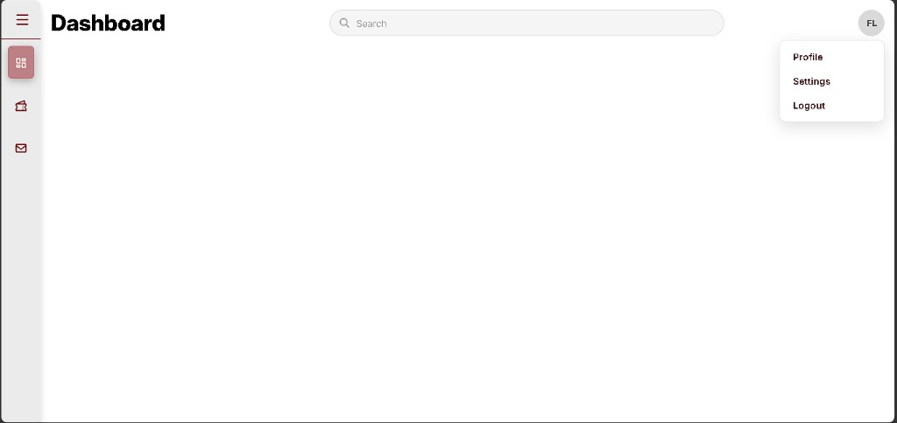

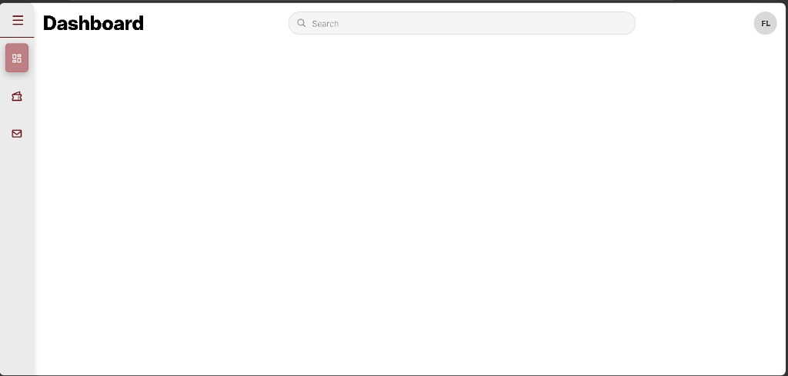


### B-073 — User and technician dashboards do not match the paper

- **When:** 1 October 2026
- **Status:** fixed
- **What I saw:** The paper user dashboard has Ongoing, Processing, and Resolved counts plus a ticket list. The technician dashboard has those plus Pending, and a ticket table with category and severity. Both pages were a title bar and blank space.
- **Cause:** Only the admin dashboard was built out.
- **In plain language:** A user or technician opening Dashboard did not see the summary the paper shows.
- **Solution executed:** User dashboard shows Ongoing, Processing, and Resolved plus recent tickets. Technician dashboard adds Pending and shows category and severity on the assigned list.


### B-074 — Profile page crashes on bind_param

- **When:** 1 October 2026
- **Status:** fixed (A-075)
- **What I saw:** Opening the user page shows a fatal error at the top right. The rest of the page is blank under the search bar. The message is `Call to a member function bind_param() on false` in `logic/profile_user.php`, from `current_profile_user()` in `pages/partials/profile_panel.php`, included by `pages/user.php` line 118.
- **Cause:** My Profile selects `phone`, `email_notify`, `sms_notify`, and `preferred_language` from `users`. Those columns were not on the table. MySQL errors are turned off in `logic/config.php`, so `prepare()` returns false instead of throwing. The next line calls `bind_param()` on that false value.
- **Causing snippet** (`logic/profile_user.php`):

```php
$stmt = $conn->prepare(
    'SELECT id, first_name, last_name, email, role, phone, email_notify, sms_notify, preferred_language
     FROM users WHERE id = ? LIMIT 1'
);
$stmt->bind_param('i', $id);
```

- **In plain language:** The profile query asked for columns the `users` table did not have. The database call failed quietly, then PHP tried to bind a parameter to that failed call and stopped the page.
- **Solution executed:** Add the four columns with `database/v1.6_user_profile_columns.sql` and apply it to `users_db`. Check that `prepare()` returned a statement before calling `bind_param()`.

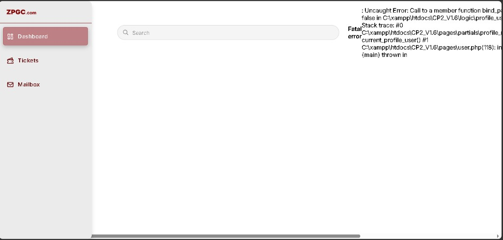


### A-075 — Add users profile columns so My Profile loads

- **When:** 1 October 2026
- **Official stage:** V1.6 follow-up to B-074
- **Status:** done
- **What we did:** `users` had `id`, name, email, password, role, and status only. Added `phone` (varchar 30, nullable), `email_notify` (default on), `sms_notify` (default off), and `preferred_language` (default English). Applied the script in phpMyAdmin’s database `users_db`. Profile load and profile save now check `prepare()` before `bind_param()`.
- **Fix snippet** (`database/v1.6_user_profile_columns.sql`):

```sql
ALTER TABLE `users` ADD COLUMN `phone` VARCHAR(30) NULL DEFAULT NULL AFTER `status`;
ALTER TABLE `users` ADD COLUMN `email_notify` TINYINT(1) NOT NULL DEFAULT 1 AFTER `phone`;
```

- **In plain language:** The table now has a place for the phone number and contact preferences the profile query reads, so opening the account page no longer dies on a failed database statement.


### B-075 — My Profile is a plain form, not the paper layout

- **When:** 1 October 2026
- **Status:** fixed (A-076)
- **What I saw:** After the column crash was fixed, My Profile for a technician showed a grey circle with initials, the full name, the word Technician, and one card of text boxes: First name, Last name, E-mail, Role, and a maroon **Save profile** button. Image 4 of the paper is different: avatar with a small dot, name only, then two cards side by side. Personal Information lists Name, E-mail, and Phone Number with icons and a pencil. Contact Preferences lists E-mail Notifications, SMS Notifications, and a Preferred Language dropdown.
- **Cause:** The page still used the short settings form. The icon rows and toggles from the paper were not in the markup.
- **Causing snippet** (`pages/partials/profile_panel.php`):

```html
<label for="profile-first-name">First name</label>
<input type="text" id="profile-first-name" name="first_name" required>
```

- **In plain language:** The profile page worked, but it looked like a data-entry form. The paper shows an account card with icons, edit pencils, and notification switches.
- **Solution executed:** Rebuild My Profile as the two cards. Use the boxicon SVGs for name, e-mail, phone, SMS, and language. Pencils open the fields. Switches and the language list save with the profile.

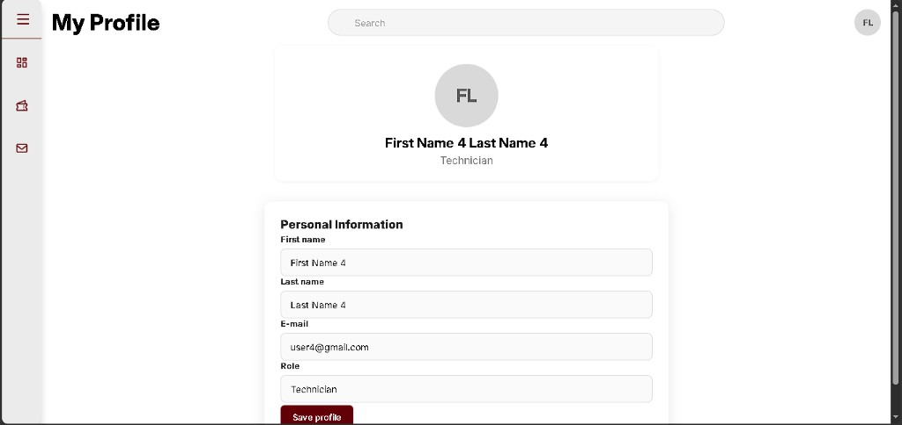


### A-076 — My Profile matches the paper cards and icons

- **When:** 1 October 2026
- **Official stage:** V1.6 follow-up to B-075
- **Status:** done
- **What we did:** Header stays My Profile. The identity block is the initials circle, a small dot, and the full name. Personal Information shows Name, E-mail, and Phone Number with the supplied icons and a pencil on each row. Contact Preferences shows E-mail Notifications and SMS Notifications as switches, and Preferred Language as a full-width list (English or Filipino). Save writes `first_name`, `last_name`, `email`, `phone`, `email_notify`, `sms_notify`, and `preferred_language`.
- **In plain language:** My Profile now follows Image 4: two cards, the planned icons, and working contact choices.
- **Retest (1 October 2026):** User account **user1@gmail.com**. My Profile shows the green **Profile saved.** message, initials **FL**, name **First Name Last Name**, e-mail **user1@gmail.com**, phone **09111111111**, E-mail Notifications on, SMS Notifications off, and Preferred Language **English**. phpMyAdmin `users` id **1** matches: `phone=09111111111`, `email_notify=1`, `sms_notify=0`, `preferred_language=English`. Ids 2–4 still have a null phone and the column defaults.

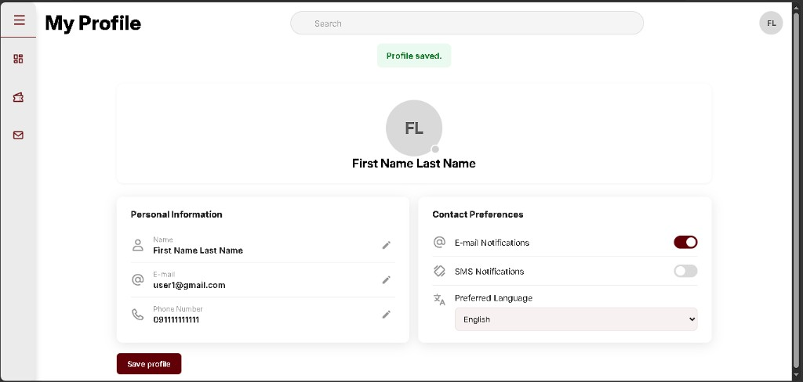

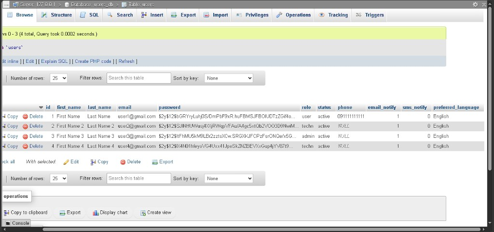


### B-077 — User image attach does not send the file

- **When:** 2 October 2026
- **Status:** fixed (2 October 2026)
- **What I saw:** The user Tickets list has a trash icon and a paperclip under every ticket, including Resolved ones. Choosing an image never left the browser.
- **Cause:** The user attach form was not `multipart/form-data`. Delete was offered even after the ticket was resolved.
- **Causing snippet** (`pages/user.php`):

```html
<form action="../logic/ticket_attachment_mngmnt.php" method="post" class="ticket-attach-form">
```

- **In plain language:** The paperclip sat on the ticket list and did not send the picture. Resolved tickets still offered delete.
- **Solution executed:** Move the paperclip to the left of **Type a message** in Mailbox for the user and the technician. That form sends the file. The trash icon stays on Tickets only when the status is not Resolved. The server also refuses a resolved ticket.
- **Objective:** Communication Module for the image. Issue Request Management for deleting an open ticket.

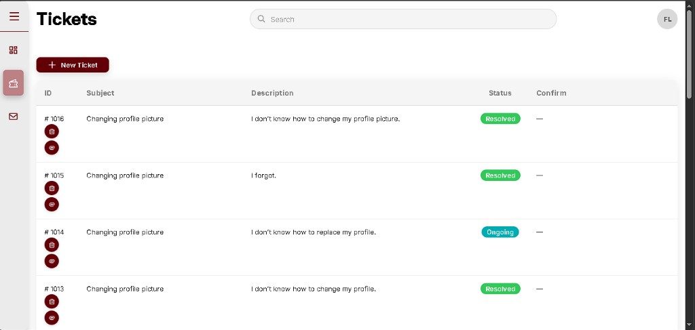


### B-078 — Utilities still offers Delete on an administrator

- **When:** 2 October 2026
- **Status:** fixed (2 October 2026)
- **What I saw:** Utilities shows Delete on every row, including Administrator **user3@gmail.com**.
- **Cause:** The button was printed for every role. The handler already refused administrators, but the button was still there.
- **Causing snippet** (`pages/admin.php`):

```html
<button type="submit" name="delete_user" class="btn-delete">Delete</button>
```

- **In plain language:** An administrator account still looked deletable.
- **Solution executed:** Hide Delete when the role is admin. User and technician rows keep Delete. The handler still refuses an administrator if a request is posted anyway.
- **Objective:** Users Management.

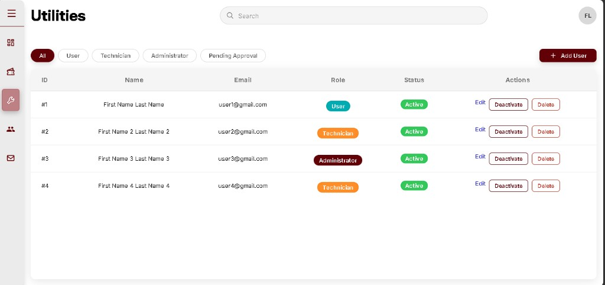


### B-079 — Mailbox composer sits over the ticket list

- **When:** 2 October 2026
- **Status:** fixed
- **What I saw:** On user and technician Mailbox, the paperclip and send button sit on top of the ticket list. The type box is not a full bar. The page keeps growing, so the type box is reached only by scrolling the whole page. The open chat does not name the ticket.
- **Cause:** The composer lost its row layout, and the Mailbox page was allowed to grow past the screen.
- **In plain language:** The message bar was not pinned to the bottom, and it did not say which ticket was open.
- **Solution executed:** Paperclip stays on the left of the type box for the user and technician. Send stays on the right. Admin has no paperclip. Messages scroll inside the chat. The header shows the subject, the ticket number, and the issue.

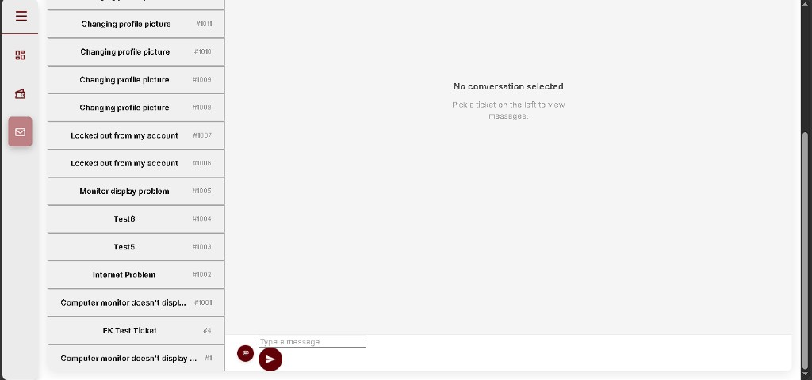


### B-080 — Utilities Edit button lost its style

- **When:** 2 October 2026
- **Status:** fixed
- **What I saw:** Utilities actions no longer match the working screen. Edit is plain text instead of the maroon button.
- **Cause:** The style block for `.btn-assign` was split, so the button rules no longer applied.
- **Solution executed:** Restore the Edit button style.

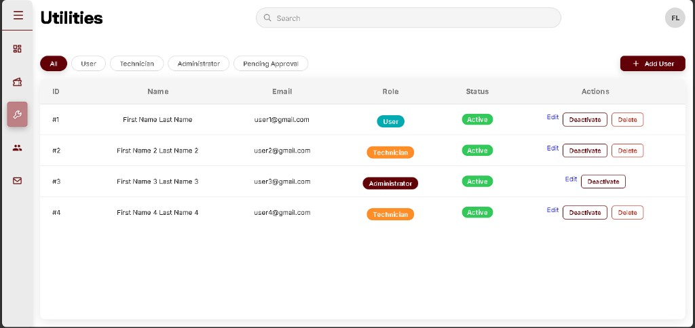


### A-081 — Mailbox images, search, and technician replace control

- **When:** 2 October 2026
- **Official stage:** V1.6
- **Status:** done
- **What we did:** An attached picture in Mailbox shows with the sender’s name and can be clicked to zoom. An administrator can view the picture but cannot send a message. Search ticket ID filters the left list. The technician replace control is the swap icon beside Save.
- **Objective:** Communication Module for the conversation. Ticket Routing Module for the replacement request.
- **In plain language:** The chat picture belongs to a person, the list can be searched by ticket number, and asking for a new technician is an action next to Save.

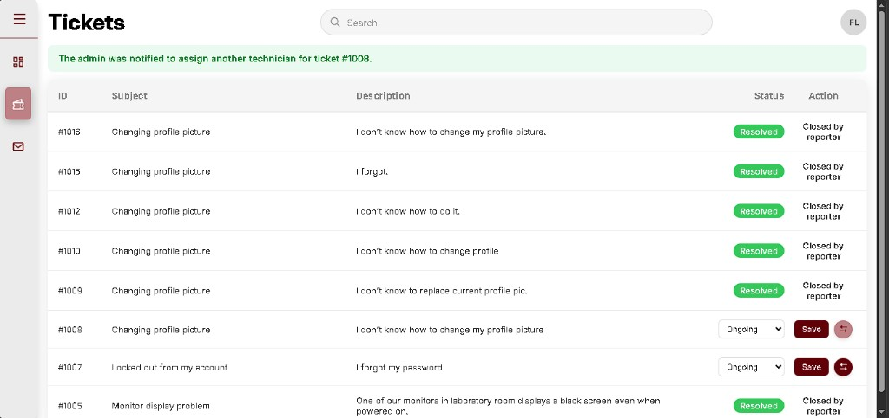

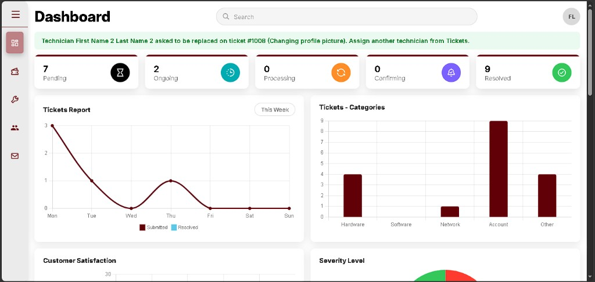


### A-082 — Admin highlights a ticket that needs a new technician

- **When:** 2 October 2026
- **Official stage:** V1.6
- **Status:** done
- **What I saw:** On Admin Tickets, **#1008** has an orange bar while it is still assigned to First Name 2 Last Name 2. The **Replacement** filter shows only that ticket. The other rows stay on All.
- **Objective:** Ticket Control and Ticket Routing Module. The admin can find the ticket that a technician asked to leave.
- **In plain language:** The ticket that needs another technician is marked, and one filter shows only those tickets.

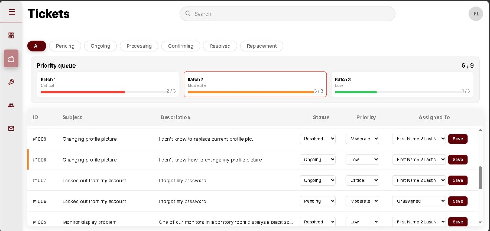

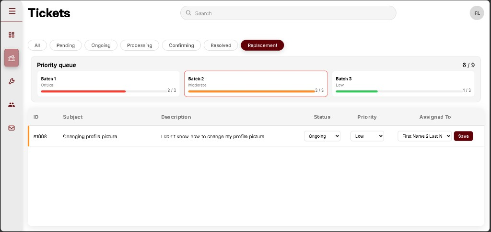


### A-083 — User satisfaction rating and admin audit list

- **When:** 2 October 2026
- **Official stage:** V1.6
- **Status:** done (extended by A-085)
- **What we did:** A resolved ticket shows a rating list for the user who owns it: Very satisfied, Satisfied, Not sure, Not satisfied, or Hate it. The admin satisfaction chart counts those saved ratings. Utilities now ends with Audit security check: who created or edited an account, changed active status, tried to delete an administrator, or saved a ticket.
- **Objective:** User satisfaction in the paper evaluation, and Admin Audit Security Check.
- **In plain language:** The reporter can say how the closed ticket went, and the admin can read a list of account and ticket changes.

### A-085 — Satisfaction overlay after Solved; audit panel layout

- **When:** 2 October 2026
- **Official stage:** V1.6 follow-up
- **Status:** done
- **What we did:** Removed the Rate dropdown from the ticket row. After the user confirms Solved, a full-screen survey asks for satisfaction. The row then shows the saved label. Utilities Audit security check was rewritten as its own `.audit-panel` under the user table so the When / Who / Action / Detail header no longer overlaps account rows. Utilities page scrolls as one column.
- **Where:** `pages/user.php`, `logic/ticket_confirm_mngmnt.php`, `logic/ticket_rating_mngmnt.php`, `pages/admin.php`, `css/main_interface.css`
- **Objective:** User satisfaction survey; Admin Audit Security Check usable on screen.
- **In plain language:** Rate the visit in a pop-up after Solved, and the admin audit list sits cleanly under the accounts.

### A-086 — Default ticket list puts attention tickets first

- **When:** 2 October 2026
- **Official stage:** V1.6 follow-up
- **Status:** done
- **What we did:** Default All order is: confirmation and pending replacement requests first, then other open tickets, then resolved at the bottom. Newest id first inside each group. Status and Replacement filters still only show or hide rows. Applied on admin, user, and technician ticket lists via `ticket_sort_for_attention()`.
- **Where:** `logic/ticket_status.php`, `pages/admin.php`, `pages/user.php`, `pages/techn.php`
- **Objective:** Ticket Control — urgent work stays visible without a filter.
- **In plain language:** Confirming and replacement tickets rise to the top; resolved ones sink.

### A-087 — Common subjects and word limits on Submit New Ticket

- **When:** 2 October 2026
- **Official stage:** V1.6 follow-up
- **Status:** done
- **What we did:** Category first, then a subject combobox that lists common subjects for Hardware, Software, Network, Account, and Other and filters as the user types. Others keeps a typed custom subject. Limits: 15 words subject, 80 words description, enforced in the form and in `ticket_subject_from_post()`, sized so a normal classify + tips call fits a $5 OpenAI credit demo.
- **Where:** `pages/ticket.php`, `css/ticket.css`, `logic/ticket_subjects.php`, `logic/ticket_mngmnt.php`
- **Objective:** Issue-request management; controlled input for AI classification cost.
- **In plain language:** Pick a common subject or type your own, without pasting a long essay into OpenAI.

### A-084 — Gmail SMTP for email notifications and password flows

- **When:** 3 October 2026
- **Official stage:** V1.6 follow-up
- **Status:** done (verified send); recipients must be real inboxes
- **What we did / saw:** PHP SMTP to `smtp.gmail.com:587` with App Password in gitignored `logic/mail.env` (no PHPMailer). Signup requires Terms of Agreement (`pages/terms.php`), a deliverable email, and a verification link (`pages/verify_email.php`). Login needs verified email, then admin activation. Forgot Password and Reset Password use `auth_tokens`. Ticket submit, assign, confirming, reopen, and resolve email users with E-mail Notifications on. SMS stays preference-only. Official mailbox admin **zpgc111@gmail.com** created as Administrator #6 beside the dummy admin. Live test: assignment mail for ticket #1008 sent; Gmail bounced `user2@gmail.com` as Address not found (dummy recipient).
- **Where:** `logic/mail_config.php`, `logic/mail_smtp.php`, `logic/auth_mail.php`, `logic/user_mngmnt.php`, `logic/mail.env`, `pages/terms.php`, `pages/verify_email.php`, `pages/forgot_password.php`, `pages/reset_password.php`, `pages/login_signup.php`, ticket handlers
- **What is still short:** Edit dummy users/technicians in Utilities so `email` is a real inbox (or `zpgc111+label@gmail.com`) before expecting delivery. SMS not sent.
- **Objective:** Communication / notification; verification and password-reset security context.
- **In plain language:** The helpdesk can email from the official Gmail; fake addresses like user2@gmail.com will bounce.

### A-088 — Capstone section 1.3 objective check (V1.6)

- **When:** 2 October 2026
- **Official stage:** V1.6 follow-up / pre-defense
- **Status:** done (documentation)
- **What we did:** Compared section 1.3 wording from `docs/VERSION_PROGRESS.md` to the running build. Product objectives largely met; partial items were My Profile/Communication (outbound mail), AI when quota empty, service-performance write-up, and encryption/privacy write-up. Open: accuracy study, load test, ISO checklist. Canvas checklist saved for the team.
- **Where:** `docs/VERSION_PROGRESS.md`
- **Objective:** Honest pre-defense map of what is built vs evaluation still open.
- **In plain language:** We listed what the paper asks for and what the software already does.

### A-089 — Clear replacement highlight after admin reassigns

- **When:** 3 October 2026
- **Official stage:** V1.6 follow-up
- **Status:** done
- **What we did / saw:** Dashboard still showed “asked to be replaced on ticket #1008” and the orange row after reassignment because `replacement_requests` stayed `pending`. Saving a ticket with a new technician now sets those requests to `resolved`. Admin load also resolves stale pending rows when `assigned_to` is already someone other than the requester. Replacement banner uses `.replacement-notice`. Fixed broken CSS after `.ticket-needs-replace`. Centered Utilities Add User card and tightened form/action spacing.
- **Where:** `logic/ticket_admin_mngmnt.php`, `pages/admin.php`, `css/main_interface.css`
- **Objective:** Ticket Control / replacement routing — addressed requests leave the attention UI.
- **In plain language:** After the admin picks another technician, the orange highlight and banner go away.

### B-090 — Dummy emails bounce Gmail notifications

- **When:** 3 October 2026
- **Official stage:** V1.6 follow-up
- **Status:** open (process / data, not a code bug)
- **What I saw:** Inbox for zpgc111 received “Ticket #1008 assigned to you” then Mail Delivery Subsystem: Address not found for **user2@gmail.com**.
- **Cause:** SMTP works; the technician row still uses a non-existent Gmail.
- **Fix for demos:** Utilities → Edit each demo user/tech → set Email to a real inbox or `zpgc111+tech2@gmail.com`. Keep E-mail Notifications on.
- **Objective:** Communication module end-to-end with real recipients.
- **In plain language:** The mail server is fine; fake emails cannot receive mail.

### B-091 — Forgot Password link says invalid or expired immediately

- **When:** 3 October 2026
- **Official stage:** V1.6 follow-up
- **Status:** fixed and retested (A-091)
- **What I saw:** Forgot Password for zpgc111@gmail.com showed the green “reset link was sent” notice. Gmail received the link (`reset_password.php?token=…`). Opening the form worked; **Save password** showed “That reset link is invalid or expired.” Link text said 2 hours.
- **Cause:** Token expiry was set with PHP `date()` and checked with MySQL `NOW()`, so a clock/timezone gap could make a fresh token look expired. Requesting another link also invalidates the previous one.
- **Retest:** Login after reset showed **Password updated. You can log in now.**
- **Objective:** Password reset security path must complete.

### A-091 — Fix reset-token expiry and Forgot/Reset button styles

- **When:** 3 October 2026
- **Official stage:** V1.6 follow-up to B-091
- **Status:** done (retested)
- **What we did:** Expiry is now `DATE_ADD(NOW(), INTERVAL n HOUR)` in MySQL only. Reset links last **24 hours**. Tokens are cleaned of mail-client junk, checked before the form is enabled, and only marked used after a successful password save. Forgot Password and Reset Password buttons match the maroon Login style.
- **Where:** `logic/auth_mail.php`, `pages/reset_password.php`, `pages/verify_email.php`, `pages/forgot_password.php`, `css/login_signup.css`
- **Retest (3 October 2026):** Account **zpgc111@gmail.com**. After a new Forgot Password email and Save password, Login showed the green notice **Password updated. You can log in now.**
- **In plain language:** Request one new reset email, open that newest link, set the password once. Confirmed working.

### A-092 — Signup verify + admin activate retested (User and Technician)

- **When:** 3 October 2026
- **Official stage:** V1.6 follow-up
- **Status:** done (retested for User; same path confirmed for Technician)
- **What we did / saw:** Real signup with Terms checkbox checked. Account **Aeron Castro** / **aeroncastro2005@gmail.com** / role **User** (#7). Login showed **Account created. Check … and open the verification link.** Gmail from ZPGC Services delivered **Verify your ZPGC Services email** with a 48-hour localhost link. After the link, Login showed **Email verified. Wait for an administrator to activate your account.** Utilities listed #7 as **Pending**; admin **Activate** showed **Account activated.** and status **Active**. User then reached the Dashboard (Ongoing / Processing / Resolved at 0, no tickets yet). Same path for **Technician** using **honkai.dummy00012@gmail.com** (verify email → admin Activate → login).
- **Where:** `pages/login_signup.php`, `pages/terms.php`, `pages/verify_email.php`, `logic/user_mngmnt.php`, `logic/auth_mail.php`, Utilities activate
- **Still waiting:** Final **Terms of Agreement** wording from the team (current `pages/terms.php` is the interim placeholder until the actual document is supplied).
- **Objective:** Communication / account security — real email verification before admin activation.
- **In plain language:** A real person can sign up, confirm email, wait for admin Activate, then log in. User test: aeroncastro2005@gmail.com. Technician test: honkai.dummy00012@gmail.com. Replace the Terms page when the official document arrives.

### Q-013 — Replace interim Terms of Agreement with official document

- **When:** queued 3 October 2026 · closed same day
- **Official stage:** V1.6 / defense package
- **Status:** done (A-093)
- **Planned work:** Swap the placeholder text in `pages/terms.php` once the actual Terms of Agreement wording is provided.
- **Maps to:** Signup Terms checkbox already required (A-084 / A-092).
- **In plain language:** Official Terms text received and published on the centered Terms page.

### A-093 — Official Terms of Service page (centered)

- **When:** 3 October 2026
- **Official stage:** V1.6 follow-up to Q-013
- **Status:** done (polished in A-094)
- **What we did:** Replaced the interim Terms page with the team’s Terms of Service & System Use Agreement, aligned to the live system (User / Technician / Administrator; categories Hardware–Other; priorities Low / Moderate / Critical; email verify + admin activate; AI with manual override; audit and profile email notices). New `css/terms.css` centers a scrollable card on the background. Login/Signup layout and left container are unchanged.
- **Where:** `pages/terms.php`, `css/terms.css`
- **Objective:** Signup Terms of Agreement with official wording.
- **In plain language:** Signup still links to Terms; the document is now the official campus wording in a centered layout.

### A-094 — Terms spacing polish and session cookie hardening

- **When:** 3 October 2026
- **Official stage:** V1.6 follow-up
- **Status:** done
- **What we did:** Terms page uses an 8px spacing scale (padding, section gaps, list rhythm, footer buttons). Session cookie renamed to `ZPGCSESSID`, path `/CP2_V1.6/`, HttpOnly + SameSite=Lax, refreshed on each request so a browser refresh keeps the same login. Theme restores from `zpgc_theme` cookie into the session after reload. Successful login calls `session_regenerate_id(true)`. Logout clears the cookie with matching path options. Session GC lifetime set to 8 hours.
- **Where:** `css/terms.css`, `pages/terms.php`, `logic/session_config.php`, `logic/user_mngmnt.php`, `logic/logout.php`
- **In plain language:** Terms look cleaner, and staying logged in through a page refresh is more reliable.

### A-095 — Whole-site UI spacing polish

- **When:** 3 October 2026
- **Official stage:** V1.6 follow-up
- **Status:** done
- **What we did:** Shared 8px spacing tokens and Global UI polish in `main_interface.css` (page headers, toolbars, lists, Performance, Utilities, Mailbox, Dashboard). Performance category/detail tables use explicit grid classes (`perf-category-list`, `perf-detail-list`) so columns stay horizontal. Secondary Performance search matches the pill search style. Login/Forgot/Reset buttons align to field width; ticket form duplicate padding cleaned. Cache-bust `?v=20261003ui2`. Screenshots in `docs/ui_polish_screens/`.
- **Where:** `css/main_interface.css`, `css/login_signup.css`, `css/ticket.css`, `pages/admin.php`, `pages/user.php`, `pages/techn.php`, `pages/ticket.php`, `pages/login_signup.php`, `pages/forgot_password.php`, `pages/reset_password.php`, `pages/terms.php`
- **In plain language:** Every main role page and auth screen now shares the same spacing rhythm so Performance and the rest look uniform.

### A-096 — Empty ticket panels fill height + Performance search filter

- **When:** 3 October 2026
- **Official stage:** V1.6 follow-up
- **Status:** done (search empty-state follow-up in A-097)
- **What we did:** User/technician dashboards use `.role-dashboard-page` so the “No tickets yet” list stretches toward the bottom of the viewport; Tickets and Mailbox empty panels get matching min-height. Performance log search now filters by ticket ID (`1016` / `#1016`), subject, description, response/resolution times, registration, and severity. Rows hide with `.perf-row-hidden` so `display:grid` no longer overrides the browser `[hidden]` rule. Placeholder “No matching tickets.” when the filter matches nothing.
- **Where:** `css/main_interface.css`, `pages/user.php`, `pages/techn.php`, `pages/admin.php`, `pages/partials/role_dashboard.php`
- **In plain language:** Empty ticket boxes no longer look like a thin strip, and typing a ticket ID or time phrase on Performance actually filters the table.

### A-097 — Admin/Techn ticket Status–Action alignment + search empty fix

- **When:** 3 October 2026
- **Official stage:** V1.6 follow-up
- **Status:** done
- **What we did:** Admin Tickets list splits Assigned To and Action into separate columns so Status/Priority/Assigned/Save line up on a 7-column grid. Technician Tickets Status and Action columns get matching widths, control heights (34px), and centered headers. Performance “No matching tickets.” uses `.perf-filter-empty--hidden` so it no longer stays visible under matching rows (`display:flex` was beating `[hidden]`).
- **Where:** `pages/admin.php`, `css/main_interface.css`, `pages/techn.php`, `pages/user.php`
- **In plain language:** Admin and technician ticket controls sit in neat columns, and the Performance search empty message only shows when nothing matches.

### A-098 — Utilities Actions column aligned like Tickets

- **When:** 3 October 2026
- **Official stage:** V1.6 follow-up
- **Status:** done (centering tightened in A-099)
- **What we did:** Utilities user table uses `.tickets-list-utilities` grid. Actions is a fixed 3-slot strip (Edit / Activate|Deactivate / Delete) with 34px controls matching Tickets. Admin rows without Delete keep an invisible spacer so buttons stay column-aligned.
- **Where:** `pages/admin.php`, `css/main_interface.css`
- **In plain language:** Utilities action buttons line up the same way as the Tickets Status/Action controls.

### A-099 — Center Utilities Actions header/buttons + IT handoff (no Docker)

- **When:** 3 October 2026
- **Official stage:** V1.6 follow-up
- **Status:** done
- **What we did:** Utilities Actions column uses a fixed 280px track with flex-centered header text and Edit/Deactivate/Delete controls so the label sits over the button group. Wrote `docs/HANDOFF_IT_SERVER.md`: zip site (exclude `mail.env` / API keys), export `users_db` SQL, install on XAMPP/LAMP Apache+PHP+MySQL without Docker, adjust `logic/config.php` and `ZPGC_COOKIE_PATH` if the folder path changes.
- **Where:** `css/main_interface.css`, `pages/admin.php`, `docs/HANDOFF_IT_SERVER.md`, `docs/BACKLOG.md`
- **In plain language:** Actions looks centered, and IT can receive a zip + database dump to run the site on their own server without Docker.

### A-100 — IT software-requirements DOCX + transfer package guide

- **When:** 3 October 2026
- **Official stage:** V1.6 follow-up / Stage 9 docs prep
- **Status:** done
- **What we did:** Created Word handoff `docs/docx/HANDOFF_IT_SOFTWARE_AND_TRANSFER.docx` covering general software requirements (Apache/PHP/MySQL, optional SMTP and Flask/OpenAI), what to transfer beyond files (runtime stack, SQL dump, secrets channel), packaging and install steps without Docker, smoke tests, and a summary of A-095–A-100. Generator script: `tools/build_handoff_docx.py`. Linked from `docs/HANDOFF_IT_SERVER.md`.
- **Where:** `docs/docx/HANDOFF_IT_SOFTWARE_AND_TRANSFER.docx`, `tools/build_handoff_docx.py`, `docs/HANDOFF_IT_SERVER.md`, `docs/BACKLOG.md`
- **In plain language:** IT gets a DOCX that lists the software they must install and exactly how to receive and run the site without Docker.

### A-102 — Commit shared ai/.env and logic/mail.env for teammate clones

- **When:** 3 October 2026
- **Official stage:** V1.6 follow-up
- **Status:** done (pushed `d461208`)
- **What we did:** Team asked clones to receive SMTP/AI env copies while each person keeps their own `users_db`. Updated `.gitignore` so `ai/.env` and `logic/mail.env` are tracked (root `/.env` still ignored; none existed). Pushed to `origin/main` after rebase over a remote `.gitignore` delete.
- **Where:** `ai/.env`, `logic/mail.env`, `.gitignore`, remote `main` @ `d461208`
- **In plain language:** After `git clone`, teammates get working mail/AI env files; they only need XAMPP + their own database.

### A-103 — phpMyAdmin new-features DOCX for teammates (local send only)

- **When:** 3 October 2026
- **Official stage:** V1.6 follow-up
- **Status:** done (not pushed; send DOCX directly)
- **What we did:** Wrote teammate phpMyAdmin guide covering email verify tokens, profile columns, confirming status, AI/severity/performance clocks, satisfaction, attachments, audit, replacement requests, and messages. Packaged full SQL from `database/v1.6_new_features_team.sql` inside the Word file. Output: `docs/docx/PHPMYADMIN_NEW_FEATURES.docx` and `database/PHPMYADMIN_NEW_FEATURES.docx`. Generator: `tools/build_phpmyadmin_features_docx.py`.
- **Where:** `docs/docx/PHPMYADMIN_NEW_FEATURES.docx`, `database/PHPMYADMIN_NEW_FEATURES.docx`, `database/v1.6_new_features_team.sql`
- **In plain language:** Teammates run the SQL in their own phpMyAdmin so the new site features work without importing your database.

### A-104 — Session cookie path auto-detect for any clone folder

- **When:** 3–4 October 2026
- **Official stage:** V1.6 follow-up
- **Status:** done
- **What we did:** Teammates cloning under `/ZPGC/ZPGC-Services-Capstone-2-Project/` (or `CP2_V1.6D`) saw login “refresh with no error” because cookies were hardcoded to `/CP2_V1.6/`. `ZPGC_COOKIE_PATH` now derives from `SCRIPT_NAME` (`…/logic/` or `…/pages/` parent). Login looks up email case-insensitively (`LOWER(email)`). Login placeholders clarify full email (not Chrome usernames like `james2`).
- **Where:** `logic/session_config.php`, `logic/user_mngmnt.php`, `pages/login_signup.php`
- **Fix snippet:**
```php
define('ZPGC_COOKIE_PATH', zpgc_detect_cookie_path());
// SELECT … FROM users WHERE LOWER(email) = ?
```
- **In plain language:** Logging in works even if the project folder is not named `CP2_V1.6`, and teammates must type a real email address.

### A-105 — Local admin password reset helper for teammate DB mismatch

- **When:** 4 October 2026
- **Official stage:** V1.6 follow-up
- **Status:** done (localhost-only; delete after use)
- **What we did:** Pasted SQL bcrypt hashes kept failing on teammate machines (copy/PowerShell `$` corruption). Added `pages/dev_fix_admin.php` that hashes `poginijames` on their PHP and upserts `zpgc111@gmail.com` as active verified admin, then prints `password_verify: PASS`.
- **Where:** `pages/dev_fix_admin.php`
- **In plain language:** One localhost URL resets the shared demo admin password correctly on each teammate’s database.

### A-106 — Kaggle keyword-only classifier benchmark (no OpenAI billing)

- **When:** 4 October 2026
- **Official stage:** V1.6 follow-up / Stage 8 eval prep
- **Status:** done (baseline; Luna side-by-side when credits return)
- **What we did:** Downloaded Tobias Bueck multilingual IT support tickets (HF/Kaggle). Built `ai/benchmark_kaggle_keyword.py` mapping EN IT-like queues into ZPGC categories/priorities and scoring the keyword classifier only. Sample **3000** rows → category **46.5%**, priority **42.2%**, both **20.5%**. Reports: `ai/data/benchmark_keyword_report.md` (+ JSON). Large CSV gitignored.
- **Where:** `ai/benchmark_kaggle_keyword.py`, `ai/data/benchmark_keyword_report.md`, `.gitignore`
- **In plain language:** We have a no-billing accuracy baseline against a public ticket dataset to compare later when OpenAI credits are back.

### A-107 — Soft-archive resolved tickets + Ticket History only

- **When:** 4 October 2026
- **Official stage:** V1.6 follow-up
- **Status:** done
- **What we did:** Team asked to remove resolved tickets from active queues without wiping Performance. Added `tickets.archived_at` (SQL + auto-migrate). `ticket_mark_resolved()` sets archive immediately; backfill on role pages. Active Tickets lists (admin/user/techn) hide resolved/archived; read-only **Ticket History** section shows them. Admin dashboard history uses resolved/archived only. Rating overlay still works from full user ticket load. Unresolved user delete remains hard delete; resolved delete path soft-archives.
- **Where:** `logic/ticket_times.php`, `database/v1.6_ticket_archive.sql`, `pages/admin.php`, `pages/user.php`, `pages/techn.php`, `pages/partials/ticket_history_list.php`, `logic/ticket_delete_mngmnt.php`, `logic/ticket_rating_mngmnt.php`
- **Fix snippet:**
```php
ticket_mark_archived($conn, $ticket_id); // called from ticket_mark_resolved()
[$active, $history] = ticket_partition_active_history($all_tickets);
```
- **In plain language:** Resolved tickets leave the working Tickets tab and only appear under Ticket History, while Performance can still count them until disposal.

### A-108 — Batch disposal of aged archived resolved tickets

- **When:** 4 October 2026
- **Official stage:** V1.6 follow-up
- **Status:** done
- **What we did:** Retention engine disposes archived resolved tickets in batches of ≤50: rated after **30** days archived, unrated after **60** days. Auto-runs ~every **6** hours when an admin opens the panel; manual **Run disposal batch** on Utilities. Deletes messages, attachments, replacement rows, then the ticket. Audit actions `ticket_disposal_*`. UI copy uses industrial **disposal** (not “purge”). Retention card full-width to match Utilities users table.
- **Where:** `logic/ticket_retention.php`, `logic/ticket_purge_mngmnt.php`, `pages/admin.php`, `css/main_interface.css`, `css/theme.css`, `database/v1.6_ticket_archive.sql`
- **In plain language:** Old finished tickets are cleared in controlled batches after a waiting period, so the live board stays clean without instant data loss.

### A-109 — Ticket History layout polish (Status/Priority + headers)

- **When:** 4 October 2026
- **Official stage:** V1.6 follow-up
- **Status:** done
- **What we did:** User/technician Ticket History used default flex columns so Status and Priority visually merged (“StatusPriority”). Added dedicated history grids (5-col user/techn, 6-col admin with Assigned). Section title styled like the Tickets page header (large **Ticket History** + subtitle). History list width aligned to the active tickets card gutter. Cache-bust `?v=20261004dispose`.
- **Where:** `pages/partials/ticket_history_list.php`, `css/main_interface.css`, `css/theme.css`, `pages/user.php`, `pages/techn.php`, `pages/admin.php`
- **In plain language:** Ticket History looks like a proper tickets table, with Status and Priority in separate columns and a clear section title.

### A-110 — Local database renamed to zpgc_services_db (Azure prep)

- **When:** 4 October 2026
- **Official stage:** 9 – deployment prep (live test on Azure before Hostinger)
- **Status:** done
- **What we did:** Working data lived in `users_db` (V1.6, 7 tables). Older original `zpgc_services_db` (4 tables) was backed up then dropped. Current `users_db` contents were loaded into a new `zpgc_services_db` and `users_db` was dropped. App default DB name updated to `zpgc_services_db`. Local SQL dumps kept under `database/backups/` (gitignored).
- **Where:** phpMyAdmin / MariaDB on XAMPP; `logic/config.php`; `DEPLOY.md`; `database/v1.6_new_features_team.sql`
- **Fix snippet:**
```php
$database = getenv('DB_NAME') ?: 'zpgc_services_db';
```
- **In plain language:** The live campus database name matches the original project name again, so cloud hosting uses one clear name instead of `users_db`.

### A-111 — Azure Database for MySQL Flexible Server (free/student smoke test)

- **When:** 4 October 2026
- **Official stage:** 9 – deployment prep
- **Status:** done
- **What we did:** Created resource group `zpgc-test-rg` (Azure for Students). Provisioned **Azure Database for MySQL Flexible Server** `zpgc-mysql-server` in **East Asia**: MySQL **8.4**, Burstable **B1ms**, HA **Disabled**, auth **MySQL only**, public access + firewall (client IP + Allow Azure services), port **3306**, SSL/TLS 1.2 enforced, service-managed encryption, `lower_case_table_names=1`. Deployment completed successfully.
- **Where:** Azure Portal → `zpgc-mysql-server` in `zpgc-test-rg`
- **Fix snippet:** (Portal) Connectivity = Public access; firewall = current client IP + “Allow public access from any Azure service…”
- **In plain language:** We rented a small cloud MySQL server for a short live test, opened only our PC and Azure apps to it, and left expensive high-availability options off.

### A-112 — Create Azure database + import dump (PHP workaround)

- **When:** 4 October 2026
- **Official stage:** 9 – deployment prep
- **Status:** done
- **What we did:** Created empty Azure DB `zpgc_services_db` (`utf8mb4` / `utf8mb4_0900_ai_ci`). Exported local dump `database/backups/zpgc_services_db_azure.sql`. XAMPP `mysql.exe` failed: unknown `--ssl-mode`, then `caching_sha2_password.dll` missing. Added `tools/azure_mysql_import.php` (PHP mysqli + `MYSQLI_CLIENT_SSL`) and imported successfully: **7 tables**, **7 users**, **10 tickets**.
- **Where:** Azure → Databases; `tools/azure_mysql_import.php`; `database/backups/zpgc_services_db_azure.sql`
- **Fix snippet:**
```php
mysqli_ssl_set($conn, null, null, null, null, null);
$conn->real_connect($host, $user, $password, null, 3306, null, MYSQLI_CLIENT_SSL);
$conn->multi_query($sql);
```
- **In plain language:** We copied the local helpdesk data into Azure MySQL. The usual XAMPP command-line client could not talk to Azure’s password style, so a small PHP import script did the copy instead.

### A-113 — Azure App Service (Free F1) + application settings

- **When:** 4 October 2026
- **Official stage:** 9 – deployment prep
- **Status:** done
- **What we did:** Created Web App `zpgc-services` on Linux **PHP 8.2**, plan **Free F1**, region **East Asia** (same as MySQL). Rejected Basic B1 (~paid) during review. Set App Settings: `DB_HOST`, `DB_USER`, `DB_PASSWORD`, `DB_NAME=zpgc_services_db`, `DB_PORT=3306`, `DB_SSL=1`, plus Gmail `MAIL_*` and `MAIL_APP_URL` = public `https://…azurewebsites.net` (no trailing slash). Secrets stay in App Settings only (not in git).
- **Where:** Azure Portal → `zpgc-services` → Environment variables; `logic/config.php` / `logic/mail_config.php` (env overrides)
- **Fix snippet:**
```text
DB_HOST=zpgc-mysql-server.mysql.database.azure.com
DB_NAME=zpgc_services_db
DB_SSL=1
MAIL_APP_URL=https://<default-domain>.azurewebsites.net
```
- **In plain language:** The PHP website runs on a free Azure web host and reads database and email passwords from Azure settings instead of hard-coded files.

### A-114 — GitHub Actions deploy to Azure App Service

- **When:** 4 October 2026
- **Official stage:** 9 – deployment prep
- **Status:** done
- **What we did:** Deployment Center → GitHub (`Acee98` / `ZPGC-Services-Capstone-2-Project` / `main`). First Save with **User-assigned identity / OIDC** failed (“couldn't verify how GitHub Actions issues OIDC tokens”). Switched to **Basic authentication** (SCM Basic Auth as needed). Pipeline setup succeeded; GitHub Actions + **OneDeploy** logs show **Succeeded (Active)** (`c5bb46c` / workflow commit `e16f172`).
- **Where:** Azure → Deployment Center; GitHub Actions workflow `main_zpgc-services.yml`
- **Fix snippet:** (Portal) Authentication type = **Basic authentication** → Save; confirm Logs → Succeeded (Active)
- **In plain language:** Pushing `main` on GitHub now updates the live Azure website. OIDC login to Azure failed once, so we used the simpler publishing login that students can finish quickly.

### A-115 — Live Azure smoke test (DNS + login URL)

- **When:** 4 October 2026
- **Official stage:** 9 – deployment prep
- **Status:** done
- **What we did:** First browse used a mistyped Default domain → browser `DNS_PROBE_FINISHED_NXDOMAIN`. Copied exact **Default domain** from Web App Overview (unique hostname / East Asia). Opened `/pages/login_signup.php`. Site reached successfully with imported accounts and App Settings. Documented tear-down: delete `zpgc-test-rg` after the smoke test before longer Hostinger hosting.
- **Where:** Azure Overview Default domain; live URL `…/pages/login_signup.php`; `DEPLOY.md`
- **Fix snippet:** Use Overview → Default domain (copy) + `/pages/login_signup.php`; keep `MAIL_APP_URL` matching that HTTPS host.
- **In plain language:** The helpdesk is reachable on the public internet for a short Azure test; the first “can’t reach this page” error was only a wrong web address, not a broken deploy.


## Queued log

Later official stages. Do **not** claim these until the files exist in this folder (`CP2_V1.1.2`).

### Q-001 — Prepared statements and safer login/signup — Stage 2

- **When:** 23–29 July 2026 (7 days)
- **Official stage:** 2 – v1.1
- **Status:** queued (signup/login PHP already started in A-008 / A-009; leftover: flash polish, `echo` gone from config)
- **Planned problem:** first draft `WHERE email = '$email'`. History only; ship `?` + `bind_param`.

### Q-002 — `session_unset()` wipes another tab — Stage 2

- **When:** 30 July – 2 August 2026 (4 days)
- **Official stage:** 2 – v1.1
- **Status:** queued

### Q-003 — Shared session cookie path — Stage 4

- **When:** queued until all role pages are guarded
- **Official stage:** 4 – v1.2 (cookie path `/CP2_V1.2/`)
- **Status:** done (A-036). Cookie path `/CP2_V1.2/`. Guards on `admin.php` / `user.php` / `techn.php`. Logout via `logic/logout.php`.

### Q-004 — Dashboards and role separation — Stage 1 leftover

- **When:** 6–12 August 2026 (7 days)
- **Official stage:** 1 – CP2
- **Status:** queued leftover (A-016 in-page titles; A-017 ticket.php; B-017 fixed)
- **Planned problem:** dummy profile name; `href="#"`; search does nothing yet.

### Q-011 — Admin users, approval, ticket form UI — Stage 3

- **When:** 13–19 August 2026 (7 days; work logged through 24 August 2026 in this folder)
- **Official stage:** 3 – v1.1.2
- **Status:** done in this folder (A-017–A-028, B-017–B-025)
- **Maps to:** admin user management, account approval (`inactive` → `active` via A-028), ticket form UI (POST before INSERT A-018–A-022).

### Q-005 — errno 150 on tickets FK — Stage 4

- **When:** 20–22 August 2026 (3 days; logged 2–3 September 2026 as A-030)
- **Official stage:** 4 – v1.2
- **Status:** done in this folder (A-030). No errno 150 — `users.id` and `tickets.user_id` both `int(11)` before Save.

### Q-006 — Workflow, technician, live chat — Stage 4

- **When:** 23–26 August 2026 (4 days; mailbox/FK follow-through logged 2–9 September 2026 in this folder)
- **Official stage:** 4 – v1.2
- **Status:** **done** in this folder (A-029–A-036). `messages` table exists; send + two-role thread verified.
- **Done here:** A-029–A-036. **B-002** closed. **B-030**–**B-033** closed.
- **Narrative report (V1.2):** Mailbox doesn't update in real time when new messages are generated.
- **When we build mailbox:** poll only when the Messages tab is active (`POLL_MS = 3000`).

### Q-007 — Manual priority queue, static analytics — Stage 5

- **When:** 27 August – 1 September 2026 (6 days; close-out logged 10–14 September 2026)
- **Official stage:** 5 – v1.3
- **Status:** **done** in this folder (A-037–A-045). **B-034**–**B-044** closed. Live 3+3+3 queue from `tickets.priority`, Dashboard cards + sample Chart.js (local), Performance placeholder tables, Utilities filters/actions, Settings theme toggle.
- **Narrative report (V1.3):** Batches add extra slots; board shows **12** instead of **9** — reproduced as **B-034**, fixed to 9 slots.
- **Shipped:** 3+3+3; panel **used / 3**; priority Save; queue counts only assigned ongoing/processing.

### Q-012 — Confirmation workflow — Stage 6

- **When:** **2 September 2026 →** (official **In Progress**; confirmation work 14–15 September 2026 in this rebuild)
- **Official stage:** 6 – v1.4
- **Status:** **done** — confirmation workflow closed (A-049–A-051; B-045–B-048)
- **Maps to:** user confirmation; Solved / Not Solved Yet; status `awaiting_confirmation` on `tickets`.
- **First setup:** `docs/SETUP_V1.4.md` + phpMyAdmin Structure for `awaiting_confirmation` (`database/v1.4_stage6.sql`).

### Q-008 — AI category and priority — Stage 7

- **When:** **16 September 2026 →** (folder `CP2_V1.5`; Luna/matplotlib through 20 September 2026)
- **Official stage:** 7
- **Status:** **extended** — keyword AI done (A-052–A-055); Luna + auto-assign + low-pri tips + live dashboard (A-057–A-060). Paste API key when $5 / trial credit is ready.
- **Maps to:** AI category and priority classification (paper 1.4–1.5); auto-assign; low-priority troubleshooting.

### Q-009 — Testing and evaluation — Stage 8

- **Official stage:** 8
- **Status:** **in progress** — core tests pass; keyword Kaggle baseline **A-106**; retest after Luna key + auto-assign paths
- **Maps to:** functional, load, AI accuracy, user testing.

### Q-010 — Finalization — Stage 9

- **Official stage:** 9
- **Status:** **in progress** — Azure free/student live smoke test done (**A-110–A-115**); Hostinger longer hosting still pending; defense package still open
- **Maps to:** documentation, deployment preparation, defense.

---

## Next development step

Active folder: `C:\xampp\htdocs\CP2_V1.6`. Progress by version: `docs/VERSION_PROGRESS.md`.

Still short of the revised paper:

1. Live Luna classification (API credits are exhausted, so submit records `kw-quota`). Paste the $5 key when ready. Keyword-only Kaggle baseline is logged as **A-106**; re-run with Luna for the side-by-side.
2. Email SMTP works from zpgc111@gmail.com (A-084). Signup verify + admin activate retested for User and Technician (A-092). Update remaining dummy account emails so notices do not bounce (B-090). SMS stays preference-only.
3. **Q-013 / A-093** — Official Terms of Service published on a centered Terms page. Signup checkbox unchanged.
4. Ticket soft-archive + history + disposal retention shipped (**A-107–A-109**). Ticket text encryption and a privacy write-up are still open. Accuracy study (Luna vs keyword), load test, and ISO checklist are still open.
5. Stage 9 started: local DB → `zpgc_services_db`, Azure MySQL + Free F1 App Service + GitHub deploy + live smoke test (**A-110–A-115**). Tear down `zpgc-test-rg` when done; Hostinger production deploy still open.

**Docs last synced:** 4 October 2026 (`BACKLOG.md` A-110–A-115 Azure free live smoke test; A-104–A-109 archive/history/disposal).
