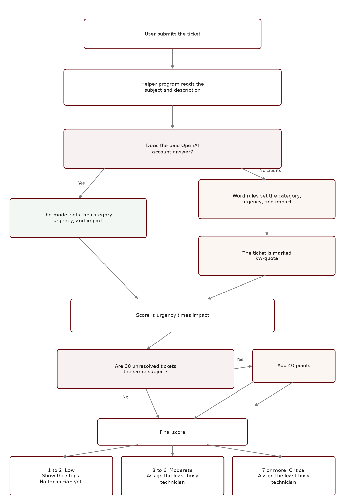

# ZPGC Services — pre-defense notes

**System:** ZPGC Services, a web-based AI-assisted IT helpdesk  
**Build to show:** `C:\xampp\htdocs\CP2_V1.6`  
**Date:** 1 October 2026  
**Repository:** GitHub `main`, tag **V1.6** (`a652265`), plus a follow-up commit that stops publishing the `docs` folder

This note is for the speakers. It is kept on this computer. It is not part of the public code snapshot.

## What to say in one minute

Students and staff submit an IT ticket. On submit, the system reads the subject and description, scores urgency times impact, and labels the ticket Low, Moderate, or Critical. Low tickets get troubleshooting steps first. Moderate and Critical tickets go to the technician who currently has the fewest open tickets. The admin board shows nine slots, three for each severity, and unused slots are lent to a severity that still has waiting tickets.

## How the project was built

| Version | What that stage added |
|---------|------------------------|
| CP2 | Landing page, signup, login, and the three shells: user, technician, admin. |
| v1.1 | A real users database and safer login using prepared statements. |
| v1.1.2 | Admin user list, account approval, and a ticket form that saves a row. |
| v1.2 | Ticket lists, assignment, separate sessions per role, and a mailbox that refreshes every 3 seconds. |
| v1.3 | A manual priority and a fixed 9-slot queue, plus sample dashboard charts. |
| v1.4 | After a technician finishes, the user chooses Solved or Not solved yet. |
| v1.5 | The AI sidecar (Flask plus OpenAI), least-busy assignment, low-priority tips, and live charts. |
| v1.6 | Submit itself scores the ticket using the paper’s tables. Performance counts resolved tickets by category. My Profile matches the paper layout. |

Stages 1 through 6 are closed. V1.6 is the build to demonstrate. Load testing, an accuracy study, and the defense package are still open.

## How priority assignment works

The paper uses three ideas together. The code is in `logic/severity_matrix.php`, `logic/ticket_mngmnt.php`, and `logic/priority_queue.php`.

### Step 1 — two axes (Table 4)

Each ticket gets two numbers from 1 to 3.

**Urgency** asks how badly the work must be done now.

| Urgency | Meaning in the paper | What the system looks for |
|---------|----------------------|---------------------------|
| 1 | A small inconvenience | The default when no stronger words appear |
| 2 | Work is degraded | Words such as slow, crash, error, freeze, not working |
| 3 | Work is stopped | Words such as outage, down, blocker, emergency, cannot work |

**Impact** asks how many people are affected.

| Impact | Meaning in the paper | What the system looks for |
|--------|----------------------|---------------------------|
| 1 | One user | The default |
| 2 | A group | Words such as several, multiple, class, faculty |
| 3 | A department, server, or the whole campus | Words such as everyone, server, department, campus, entire |

When the OpenAI call succeeds, the model may set these 1–3 values. When the API has no credits, the word rules above set them, and the ticket is recorded as `kw-quota`. Tomorrow, say that plainly if Luna is still on the backup path.

### Step 2 — the score

Base score = urgency × impact.

Possible scores from the multiplication are 1, 2, 3, 4, 6, and 9.

| Example | Urgency | Impact | Score |
|---------|---------|--------|-------|
| One person, minor wording | 1 | 1 | 1 |
| One person, “the app crashes” | 2 | 1 | 2 |
| A class, “Wi-Fi is slow” | 2 | 2 | 4 |
| Whole lab, “the server is down” | 3 | 3 | 9 |

### Step 3 — the label (Table 6)

| Final score | Severity |
|-------------|----------|
| 1 to 2 | Low |
| 3 to 6 | Moderate |
| 7 and above | Critical |

So a plain score of 9 is already Critical. Scores 3, 4, and 6 are Moderate. Scores 1 and 2 are Low. A first draft treated 2 as Moderate. That was corrected so 2 stays Low, matching Table 6.

The Table 4 caption in the paper also says only 9 is Critical and mentions “+30 points.” The later tables are the ones in the code: Table 6 for the bands, and Table 5 for **+40**.

### Step 4 — the same problem reported many times (Table 5)

If 30 or more tickets that are not yet resolved share the **same subject**, the system adds 40 to the base score.

A score of 1 becomes 41. Table 6 then labels it Critical. The purpose in the paper is to let a widespread issue jump the queue without waiting for a manager.

The match is the exact subject text, ignoring capital letters and extra spaces. Similar wording that is not the same subject does not count.

### Step 5 — what happens after the label

**Low.** The user sees troubleshooting steps and the ticket stays pending. **These steps worked** resolves it. **Request Technician** then assigns someone. If the tips cannot be generated, a technician is assigned anyway so the ticket is not stuck.

**Moderate or Critical.** On submit, the ticket goes to the active technician with the fewest open tickets. Open means pending, ongoing, processing, or waiting for the user to confirm. Status becomes ongoing.

There is no specialty team. Routing is by workload, not by Hardware versus Network.

### Step 6 — the nine slots (Table 7)

The admin queue does not show every open ticket at once. Each batch has **9 seats**: 3 Critical, 3 Moderate, and 3 Low.

If a severity has empty seats and another severity still has tickets waiting, the empty seats are lent. Lending is offered first to Critical, then Moderate, then Low. Examples the paper describes:

- No Low tickets, and Critical still has a line: Critical borrows those seats.
- Only Critical tickets exist: Critical can use all 9 seats.
- Fewer tickets than 9 exist in total: the batch shows only the tickets that exist.

## What the three roles do in the demo

**User.** Submit a ticket. Watch the green message for the priority and the score. On a Low ticket, try the tips, then either close it or request a technician. On Confirming, choose Solved or Not solved yet. Mailbox is the thread on that ticket.

**Technician.** See assigned tickets. Move status through Pending, Ongoing, Processing, and Confirming. The technician does not mark Resolved. The user does, by choosing Solved.

**Admin.** See all tickets, the 9-slot queue, live charts, user approval, and the performance report. Performance counts resolved tickets by category (Hardware, Software, Network, Account, Other) and shows response time and resolution time on tickets closed after those clocks were added.

## What to say if they ask about AI

You can say this without using the program names.

The website itself does not talk to the AI. When someone presses Submit, the website hands the subject and description to a small helper program that is already running on the same computer. That helper’s only job is to read the words and answer two questions: what kind of problem this is, and how urgent it feels. It then sends that answer back, and the website saves the ticket.

That helper is the “Flask service.” Flask is just the tool that program is built with. You do not need to say Flask in the defense. If they ask where the AI lives, say: a local program on this PC, started before the demo, listens for the ticket text and calls OpenAI.

The model name in the paper is GPT-4o mini, or a newer model of the same kind. Ours is set to **gpt-5.6-luna**, which is that newer setting.

The paid OpenAI account is separate from a normal ChatGPT login. If that account has no credits left, OpenAI refuses the call. The ticket is still filed. Instead of stopping, the helper falls back to simple word rules: words like “wifi” lean toward Network, words like “password” lean toward Account, and words like “down” or “emergency” lean toward a higher urgency. The score can still be computed, and a technician can still be assigned when the rules say the ticket is not Low.

**kw-quota** is the short mark written in the database when that happens. “kw” means the backup word rules ran. “quota” means the reason was an empty paid balance, not a choice to skip the AI. It is there so we do not claim Luna answered when it did not. After credits are added, the helper has to be started again, and later tickets can come from the model.

Two labels are easy to mix up, so say them separately. **Category** is the kind of problem: Hardware, Software, Network, Account, or Other. **Priority** is how soon it should be handled: Low, Moderate, or Critical. The AI, or the word backup, helps with both. The final Low / Moderate / Critical label still comes from urgency times impact, using the paper’s tables.

## How a submitted ticket is scored

## Honest limits

Do not claim these tomorrow as finished:

- There is no separate student account and staff account. Both use User.
- Email and SMS switches on My Profile are saved. The system does not send those messages.
- There is no admin audit log.
- Users cannot rate a closed ticket. The satisfaction chart is a stand-in from resolved versus open counts.
- There is no measured accuracy percentage and no load test in the app.
- Mailbox refreshes about every 3 seconds while that tab is open. It does not push a notice to a closed tab.

## Suggested demo order

1. Log in as a user. Submit a small one-person problem and show a Low score and the tips.
2. Submit a “server is down for the whole department” problem and show Critical plus an automatic technician.
3. Log in as that technician and move the ticket to Confirming.
4. Back as the user, choose Solved.
5. Log in as admin. Show the 9-slot queue, one dashboard chart, and the performance list by category.
