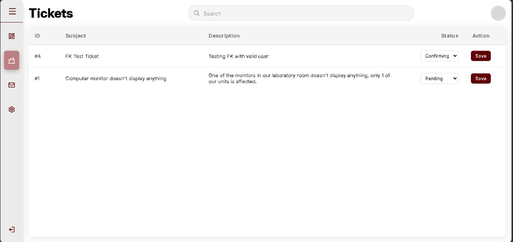

# Stage 6 log

**Later close-out (1 October 2026):** Q-012 is done (A-049–A-051, B-045–B-048). The working system is `C:\xampp\htdocs\CP2_V1.6`. See `docs/VERSION_PROGRESS.md`. The notes below are the session as it was written on 14–15 September 2026.

### A-049 — phpMyAdmin: `awaiting_confirmation` on `tickets.status`

- **When:** 14–15 September 2026
- **Official stage:** 6 – v1.4 (Q-012)
- **Status:** done
- **What we did:** Structure → Change `status` ENUM. Added `awaiting_confirmation`. Table altered successfully.
- **Where:** `users_db.tickets.status`

### A-050 — Confirmation workflow UI + handlers

- **When:** 14–15 September 2026
- **Official stage:** 6 – v1.4 (Q-012)
- **Status:** done (B-045 / B-046 fixed; B-047 still open)
- **What we did:** Technician status Save; User Confirm column; Admin Confirming filter. Planted bugs captured and partially fixed.

### B-045 — Confirm buttons never appear — **fixed**

**Fix:** `$needsConfirm = ticket_awaiting_confirmation($st);`

### B-046 — Technician can still pick Resolved — **fixed**

**Fix:** Remove `'resolved'` from `ticket_techn_allowed_statuses()`.

### B-047 — Not Solved Yet → Pending (not Ongoing) — **open**

Still planted. Capture after B-045 fix: click **Not Solved Yet**, status becomes Pending.

### B-048 — ENUM order (optional) — **open**

---

## Next

Ctrl+F5 → User Tickets → ticket #4 should show **Solved** / **Not Solved Yet**.

1. Capture the buttons working (optional good shot).
2. Click **Not Solved Yet** → status **Pending** → that is **B-047**. Send that shot, then we fix.
3. No Python until Stage 6 closes.
